# AM 2017-01 V2: results report (X-13 seasonal adjustment)

Generated on 2026-06-05.

This pilot uses an **accountability frame**: the electoral cassation is read as a corrective institutional act (removal of a vote-buying government), not as an exogenous instability shock. The single treatment date is the effective removal; the cassation-process months count as ordinary pre-treatment, because under this reading nothing changes until the captured government is actually removed and replaced. Seasonality is removed at source (X-13ARIMA-SEATS for monthly/quarterly, STL for bimonthly fiscal), so the analysis uses calendar time on the x-axis. No moving averages are used.

## Event design

- Treated state: `AM` (Amazonas).
- Treatment (single cut): effective removal `2017-05-04` (TSE final cassation decision for vote-buying).
- The cassation process began `2016-01-25` (first TRE/TSE decision), but this is treated as pre-treatment, not a separate crisis window.

## Window design

- Monthly: `2013-01-01` to `2018-04-01`. Pre-treatment = 52 months (up to removal); post-removal = 12 months.
- Bimonthly fiscal: `2015-01-01` to `2018-10-01`. Pre-treatment = 14 bimesters (2015B1-2017B2, limited at the start by Siconfi 2015); post-removal = 9 bimesters.
- Folding the cassation-process months into pre-treatment lengthens the fiscal pre-window from 6 to 14 bimesters, reducing the overfitting that affected the instability-framed specification.

## Seasonal adjustment

- Monthly outcomes and quarterly covariates are seasonally adjusted with X-13ARIMA-SEATS (`seasonal::seas`, x11 mode, no transformation).
- Bimonthly fiscal series use STL (`stats::stl`, periodic seasonal window, robust), because X-13 supports only quarterly (4) and monthly (12) frequencies, not bimonthly (6). The seasonally adjusted series is the observed series minus the STL seasonal component.
- Adjustment is applied to each state's full available series before subsetting to the pilot window, so seasonal factors use maximum information (e.g. ~11 years of bimonthly fiscal data).
- Series with too few seasonal cycles fall back to the raw series; this is logged at build time.
- Activity indices (PMC retail, PMS services) are seasonally adjusted, then reindexed to 100 at the first valid observation in the pilot window.
- No moving averages are computed in this version.
- Robustness alternatives noted for the article: bimester fixed effects and MA(6) for the bimonthly block.

## Methodological strategy

The main donor pool excludes `AM`, `RJ`, `TO`. The preferred specification uses 24 eligible donors. Augmented Synthetic Control is the headline estimator; SCM weights are estimated on the pre-treatment window (everything before the removal date). Predictors are the full pre-treatment outcome path plus six structural covariates (all seasonally adjusted): unemployment rate, formalization rate, transfer dependency ratio, and health, education, and public security expenditure per capita.

## Preliminary plots

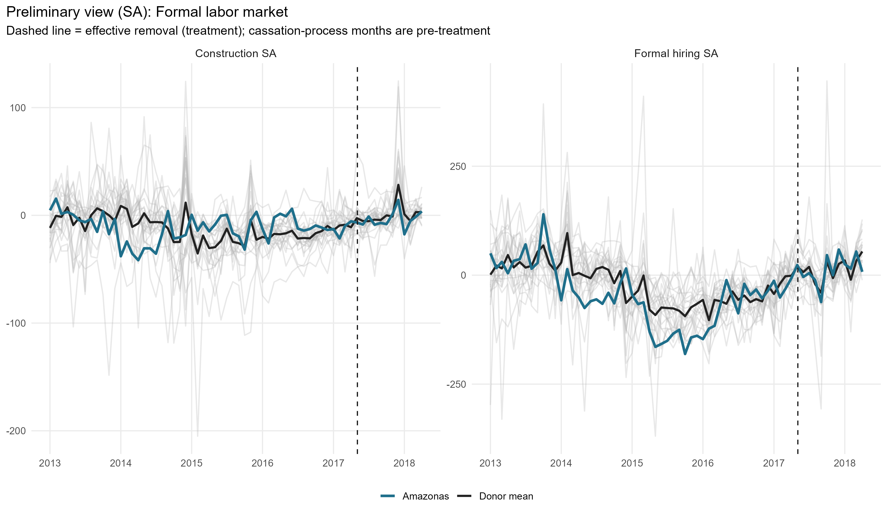

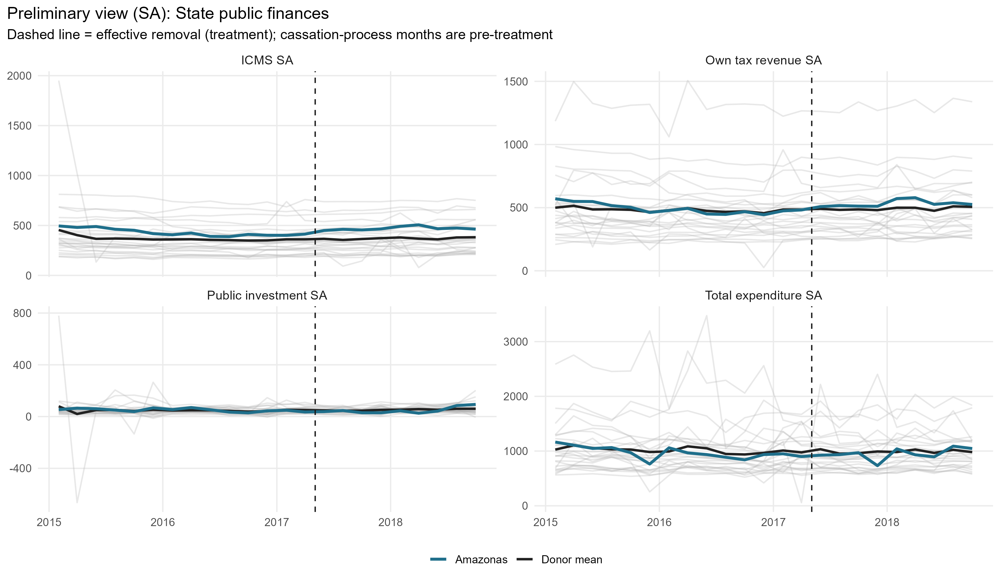

## Covariate and pre-treatment outcome balance

### Pre-treatment outcome fit

| Outcome | Treated | Synthetic | RMSPE pre |
| --- | --- | --- | --- |
| Formal hiring SA | -45.85 | -45.62 | 33.84 |
| Construction SA | -11.58 | -10.43 | 14.11 |
| Retail SA | 97.63 | 97.65 | 1.92 |
| Services SA | 97.41 | 97.51 | 2.08 |
| Own tax revenue SA | 491.63 | 491.63 | 0.08 |
| ICMS SA | 430.97 | 430.90 | 0.55 |
| Public investment SA | 50.22 | 50.22 | 0.01 |
| Total expenditure SA | 970.87 | 970.88 | 0.11 |

### Covariate balance: formal labor market

| Covariate | Treated | Formal hiring SA | Construction SA |
| --- | --- | --- | --- |
| Unemployment rate (SA) |     0.104 |     0.087 |     0.097 |
| Formalization rate (SA) |     0.434 |     0.580 |     0.520 |
| Labor income (SA, R$) | 2,711.134 | 2,946.195 | 2,709.570 |
| Transfer dependency ratio (SA) |    -0.002 |    -0.001 |    -0.001 |
| Health expenditure pc (SA, R$) |   175.427 |   124.369 |   139.814 |
| Education expenditure pc (SA, R$) |   153.268 |   131.666 |   138.702 |
| Public security expenditure pc (SA, R$) |    96.182 |   113.404 |    81.787 |

### Covariate balance: household consumption

| Covariate | Treated | Retail SA | Services SA |
| --- | --- | --- | --- |
| Unemployment rate (SA) |     0.104 |     0.089 |     0.106 |
| Formalization rate (SA) |     0.434 |     0.523 |     0.485 |
| Labor income (SA, R$) | 2,711.134 | 2,675.576 | 2,348.724 |
| Transfer dependency ratio (SA) |    -0.002 |    -0.001 |    -0.002 |
| Health expenditure pc (SA, R$) |   175.427 |   139.250 |   114.653 |
| Education expenditure pc (SA, R$) |   153.268 |   129.053 |   164.644 |
| Public security expenditure pc (SA, R$) |    96.182 |    74.468 |    92.835 |

### Covariate balance: state public finances

| Covariate | Treated | Own tax revenue SA | ICMS SA | Public investment SA | Total expenditure SA |
| --- | --- | --- | --- | --- | --- |
| Unemployment rate (SA) |     0.104 |     0.099 |     0.097 |     0.098 |     0.098 |
| Formalization rate (SA) |     0.434 |     0.482 |     0.521 |     0.476 |     0.463 |
| Labor income (SA, R$) | 2,711.134 | 2,704.581 | 2,866.460 | 2,622.891 | 2,525.141 |
| Transfer dependency ratio (SA) |    -0.002 |    -0.002 |    -0.001 |    -0.002 |    -0.002 |
| Health expenditure pc (SA, R$) |   175.427 |   161.985 |   143.592 |   154.001 |   138.867 |
| Education expenditure pc (SA, R$) |   153.268 |   183.201 |   179.931 |   169.246 |   173.171 |
| Public security expenditure pc (SA, R$) |    96.182 |    87.344 |    90.546 |    90.453 |    94.832 |

## Main results: Augmented SCM (SA)

| Channel | Outcome | Mean gap post | RMSPE pre | RMSPE post | Donors |
| --- | --- | --- | --- | --- | --- |
| Formal labor market | Formal hiring balance per 100k WAP (SA) |  -1.64 | 33.84 | 23.20 | 24 |
| Formal labor market | Construction hiring per 100k WAP (SA) |  -6.07 | 14.11 | 12.25 | 24 |
| Household consumption | Retail volume index (SA) |   4.42 |  1.92 |  5.97 | 24 |
| Household consumption | Services volume index (SA) |   7.38 |  2.08 |  7.84 | 24 |
| State public finances | Own tax revenue, real per capita (SA) |  46.95 |  0.08 | 50.43 | 24 |
| State public finances | ICMS revenue, real per capita (SA) |  47.98 |  0.55 | 52.16 | 24 |
| State public finances | Public investment, real per capita (SA) |  -4.83 |  0.01 | 18.27 | 24 |
| State public finances | Total liquidated expenditure, real pc (SA) | -22.08 |  0.11 | 85.47 | 24 |

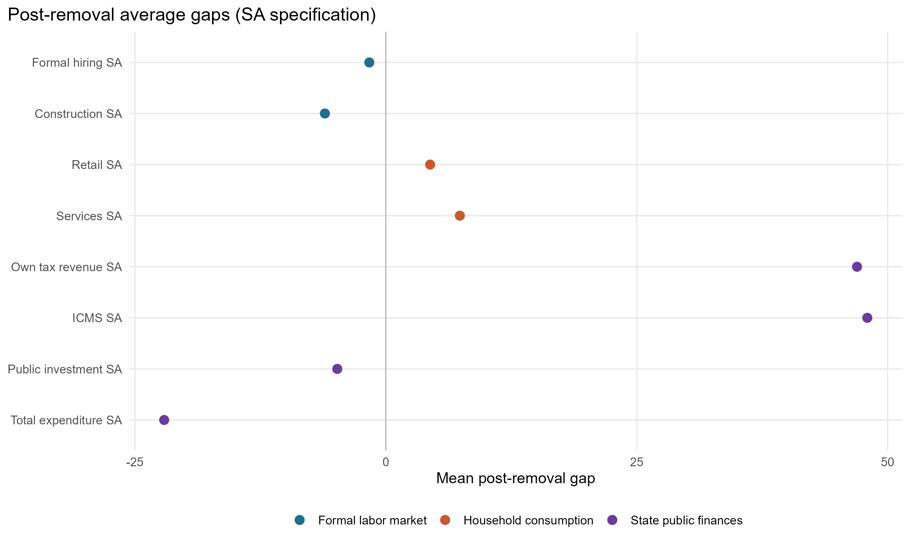

### Formal labor market

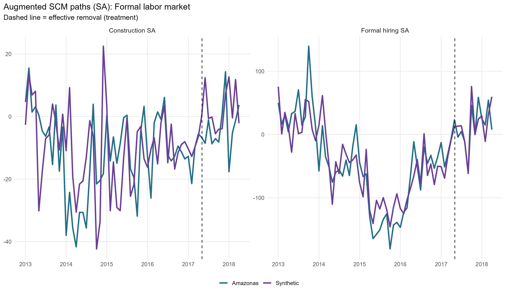

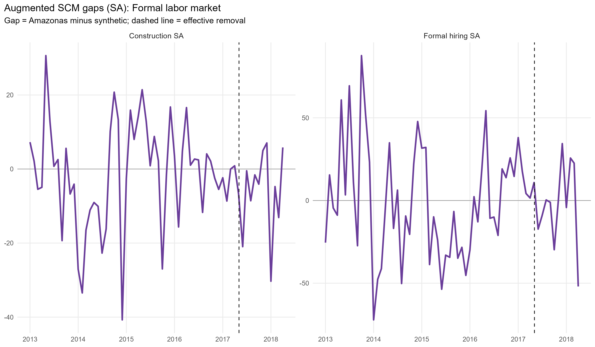

### Household consumption

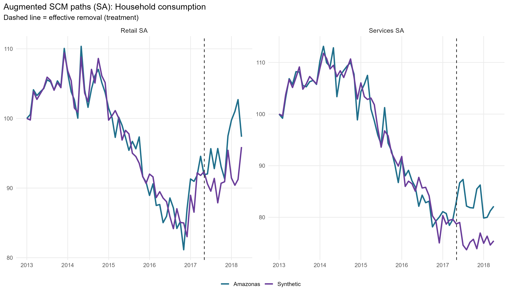

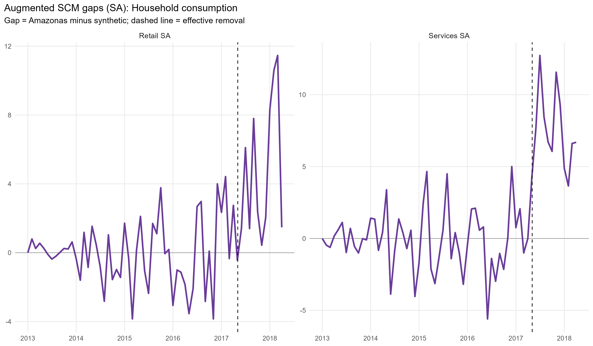

### State public finances

## Donor weights

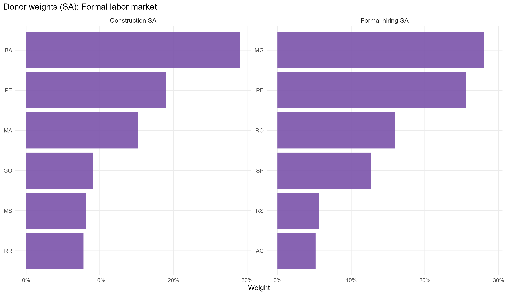

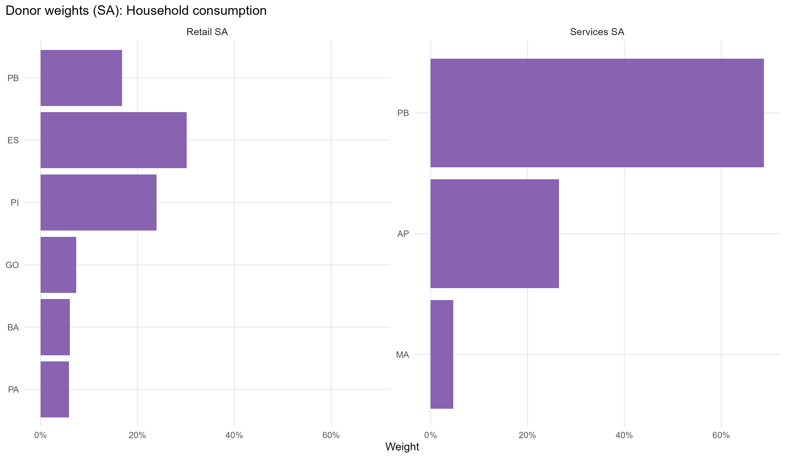

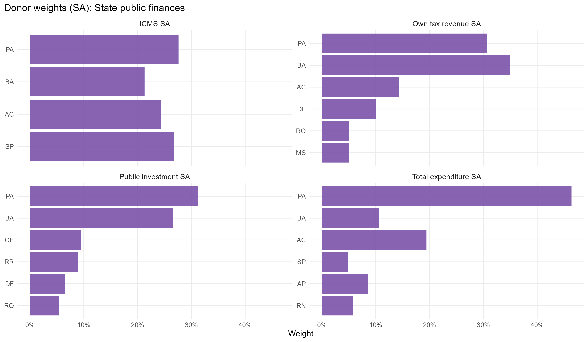

## In-space placebos

Each eligible donor is treated as pseudo-treated at the same dates; gaps are normalized by each unit's pre-treatment RMSPE.

| Outcome | RMSPE ratio (post/pre) | p-value (ratio) | p-value (abs gap) | Placebos |
| --- | --- | --- | --- | --- |
| Formal hiring SA |     0.69 | 0.958 | 1.000 | 24 |
| Construction SA |     0.87 | 0.583 | 0.667 | 24 |
| Retail SA |     3.11 | 0.167 | 0.333 | 24 |
| Services SA |     3.77 | 0.000 | 0.083 | 24 |
| Own tax revenue SA |   603.26 | 0.125 | 0.458 | 24 |
| ICMS SA |    94.27 | 0.000 | 0.333 | 24 |
| Public investment SA | 1,300.69 | 0.250 | 1.000 | 24 |
| Total expenditure SA |   760.80 | 0.042 | 0.958 | 24 |

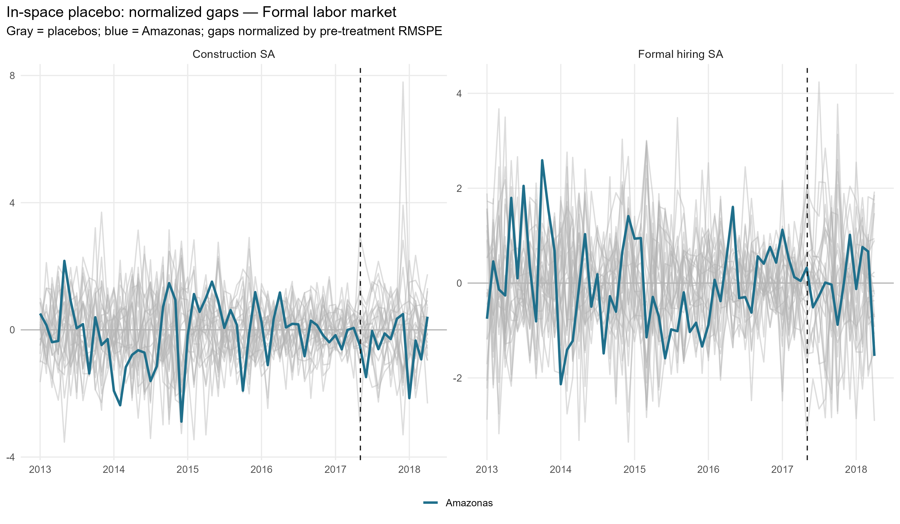

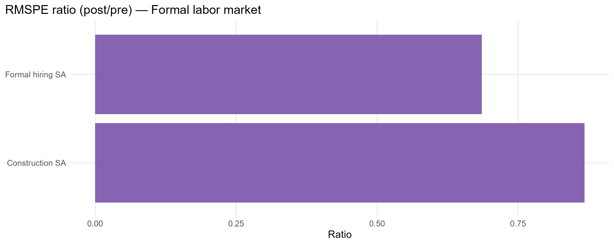

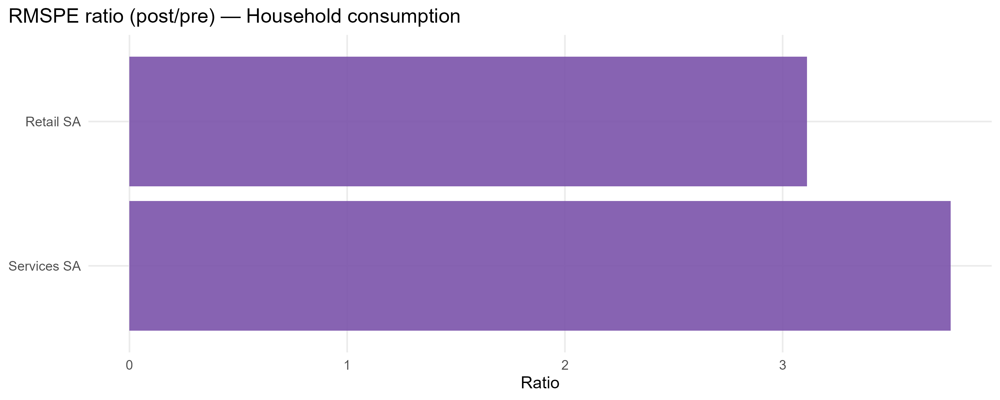

## Leave-one-out donor placebo

| Outcome | Gap post | LOO rank | p-value (2-sided) | Note |
| --- | --- | --- | --- | --- |
| Formal hiring SA | -1.64 | 2 / 25 | 0.08 | Unusually small negative gap |
| Retail SA | 4.42 | 1 / 25 | 0.04 | Unusually small positive gap |
| Services SA | 7.38 | 25 / 25 | 0.04 | Unusually large positive gap |
| ICMS SA | 47.98 | 2 / 25 | 0.08 | Unusually small positive gap |
| Public investment SA | -4.83 | 20 / 25 | 0.24 | Not extreme vs LOO distribution |
| Total expenditure SA | -22.08 | 23 / 25 | 0.12 | Not extreme vs LOO distribution |

## Current limitations

- Bimonthly fiscal pre-treatment is 14 bimesters (2015B1-2017B2), still short of the 24-bimester target because Siconfi starts in 2015, but a substantial improvement over the instability-framed 6-bimester window.
- Bimonthly fiscal seasonal adjustment uses STL, not X-13 (X-13 supports only freq 4 and 12). Bimester fixed effects and MA(6) are reasonable robustness alternatives.
- Seasonal adjustment falls back to the raw series for states/variables with too few seasonal cycles; check build log.
- ICMS from Annex 06 is derived by within-year differencing; RS 2018 B1-B5 imputed with 2017 seasonal shares.
- The post-removal window ends 12 months (monthly) / 9 bimesters (bimonthly) after removal, by design.

## Generated files

- `report/tables/augmented_effects_by_outcome.csv`
- `report/tables/pretx_outcome_balance.csv`
- `report/tables/covariate_balance_*.csv`
- `report/tables/top_donor_weights_by_outcome.csv`
- `report/tables/am_2017_01_v2_loo_placebo_summary.csv`
- `report/tables/placebo_rank_actual_rr.csv`
- `report/figures/` (preliminary, paths, gaps, weights, placebo)
- `output/placebo_inspace/`, `output/placebo_loo/`
