# AM 2017-01 V3: results report (X-13 trend-cycle for monthly outcomes)

Generated on 2026-06-05.

This is V3, identical to V2 (accountability frame) except for how the volatile monthly outcomes are filtered. V2 used the seasonally-adjusted series, which removes seasonality but keeps the high-frequency irregular component; the labor and consumption series remained too volatile to read, and the AM-minus-synthetic gap was dominated by noise. V3 instead uses the **X-13 trend-cycle component** (Henderson filter) for the four monthly outcomes, which removes both seasonality and the irregular noise. Quarterly covariates and bimonthly fiscal series are unchanged from V2 (seasonally adjusted). This cut the monthly gap volatility by roughly 35-78% without changing the substantive direction of the effects.

## Event design

- Treated state: `AM` (Amazonas).
- Treatment (single cut): effective removal `2017-05-04` (TSE final cassation decision for vote-buying).
- The cassation process began `2016-01-25` (first TRE/TSE decision), but this is treated as pre-treatment, not a separate crisis window.

## Window design

- Monthly: `2013-01-01` to `2018-04-01`. Pre-treatment = 52 months (up to removal); post-removal = 12 months.
- Bimonthly fiscal: `2015-01-01` to `2018-10-01`. Pre-treatment = 14 bimesters (2015B1-2017B2, limited at the start by Siconfi 2015); post-removal = 9 bimesters.
- Folding the cassation-process months into pre-treatment lengthens the fiscal pre-window from 6 to 14 bimesters, reducing the overfitting that affected the instability-framed specification.

## Seasonal adjustment and trend-cycle extraction

- **Monthly outcomes** (formal hiring, construction hiring, retail, services) use the **X-13 trend-cycle component** (`seasonal::trend`, x11 mode, no transformation). This removes both seasonality and the irregular high-frequency noise. The ARIMA forecast extension in X-13 stabilizes the Henderson filter at the series endpoints, which matters for the post-removal window.
- **Quarterly covariates** (unemployment, formalization, labor income) use X-13 seasonally-adjusted series.
- **Bimonthly fiscal series** use STL seasonally-adjusted series (`stats::stl`, periodic, robust), because X-13 supports only quarterly (4) and monthly (12) frequencies, not bimonthly (6).
- All adjustment is applied to each state's full available series before subsetting to the pilot window, so factors use maximum information.
- Series with too few cycles fall back to the raw series; this is logged at build time.
- Activity indices (PMC, PMS) are trend-cycle filtered, then reindexed to 100 at the first valid observation in the pilot window.
- No moving averages are computed.
- Why trend-cycle for monthly: under the seasonally-adjusted series (V2), the AM-minus-synthetic gap for labor/consumption was dominated by independent irregular noise in the treated and donor series, which add rather than cancel. Filtering to the trend-cycle removes that noise and isolates the trend difference (the object of interest). It does not touch the substantive sign or magnitude of the average effect.

## Methodological strategy

The main donor pool excludes `AM`, `RJ`, `TO`. The preferred specification uses 24 eligible donors. Augmented Synthetic Control is the headline estimator; SCM weights are estimated on the pre-treatment window (everything before the removal date). Predictors are the full pre-treatment outcome path plus six structural covariates (all seasonally adjusted): unemployment rate, formalization rate, transfer dependency ratio, and health, education, and public security expenditure per capita.

## Preliminary plots

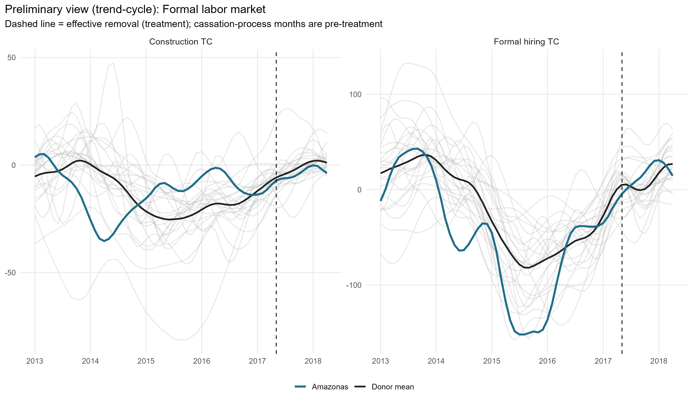

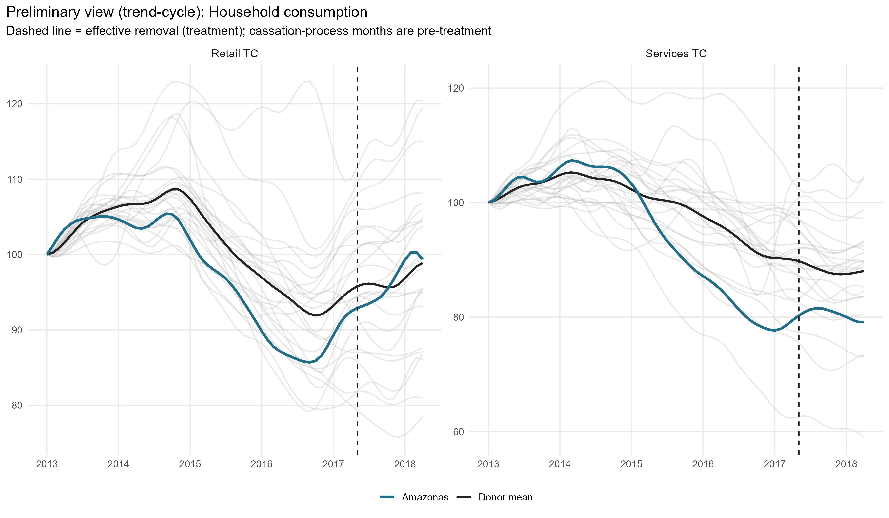

## Covariate and pre-treatment outcome balance

### Pre-treatment outcome fit

| Outcome | Treated | Synthetic | RMSPE pre |
| --- | --- | --- | --- |
| Formal hiring TC | -48.47 | -48.22 | 3.92 |
| Construction TC | -12.24 | -12.15 | 1.10 |
| Retail TC | 97.43 | 97.44 | 0.28 |
| Services TC | 95.20 | 95.19 | 0.45 |
| Own tax revenue SA | 491.63 | 491.63 | 0.08 |
| ICMS SA | 430.97 | 430.90 | 0.55 |
| Public investment SA | 50.22 | 50.22 | 0.01 |
| Total expenditure SA | 970.87 | 970.88 | 0.11 |

### Covariate balance: formal labor market

| Covariate | Treated | Formal hiring TC | Construction TC |
| --- | --- | --- | --- |
| Unemployment rate (SA) |     0.104 |     0.084 |     0.093 |
| Formalization rate (SA) |     0.434 |     0.598 |     0.549 |
| Labor income (SA, R$) | 2,711.134 | 3,140.151 | 2,755.978 |
| Transfer dependency ratio (SA) |    -0.002 |    -0.001 |    -0.001 |
| Health expenditure pc (SA, R$) |   175.427 |   123.395 |   117.570 |
| Education expenditure pc (SA, R$) |   153.268 |   137.237 |   104.060 |
| Public security expenditure pc (SA, R$) |    96.182 |    99.281 |    79.997 |

### Covariate balance: household consumption

| Covariate | Treated | Retail TC | Services TC |
| --- | --- | --- | --- |
| Unemployment rate (SA) |     0.104 |     0.086 |     0.106 |
| Formalization rate (SA) |     0.434 |     0.599 |     0.476 |
| Labor income (SA, R$) | 2,711.134 | 2,956.281 | 2,326.394 |
| Transfer dependency ratio (SA) |    -0.002 |    -0.001 |    -0.002 |
| Health expenditure pc (SA, R$) |   175.427 |   124.677 |   116.217 |
| Education expenditure pc (SA, R$) |   153.268 |   137.412 |   165.876 |
| Public security expenditure pc (SA, R$) |    96.182 |   101.529 |    92.923 |

### Covariate balance: state public finances

| Covariate | Treated | Own tax revenue SA | ICMS SA | Public investment SA | Total expenditure SA |
| --- | --- | --- | --- | --- | --- |
| Unemployment rate (SA) |     0.104 |     0.099 |     0.097 |     0.098 |     0.098 |
| Formalization rate (SA) |     0.434 |     0.482 |     0.521 |     0.476 |     0.463 |
| Labor income (SA, R$) | 2,711.134 | 2,704.581 | 2,866.460 | 2,622.891 | 2,525.141 |
| Transfer dependency ratio (SA) |    -0.002 |    -0.002 |    -0.001 |    -0.002 |    -0.002 |
| Health expenditure pc (SA, R$) |   175.427 |   161.985 |   143.592 |   154.001 |   138.867 |
| Education expenditure pc (SA, R$) |   153.268 |   183.201 |   179.931 |   169.246 |   173.171 |
| Public security expenditure pc (SA, R$) |    96.182 |    87.344 |    90.546 |    90.453 |    94.832 |

## Main results: Augmented SCM (monthly = trend-cycle, fiscal = SA)

| Channel | Outcome | Mean gap post | RMSPE pre | RMSPE post | Donors |
| --- | --- | --- | --- | --- | --- |
| Formal labor market | Formal hiring balance per 100k WAP (trend-cycle) |   8.11 | 3.92 | 16.58 | 24 |
| Formal labor market | Construction hiring per 100k WAP (trend-cycle) |  -3.02 | 1.10 |  5.20 | 24 |
| Household consumption | Retail volume index (trend-cycle) |  -0.40 | 0.28 |  1.44 | 24 |
| Household consumption | Services volume index (trend-cycle) |   5.68 | 0.45 |  5.88 | 24 |
| State public finances | Own tax revenue, real per capita (SA) |  46.95 | 0.08 | 50.43 | 24 |
| State public finances | ICMS revenue, real per capita (SA) |  47.98 | 0.55 | 52.16 | 24 |
| State public finances | Public investment, real per capita (SA) |  -4.83 | 0.01 | 18.27 | 24 |
| State public finances | Total liquidated expenditure, real pc (SA) | -22.08 | 0.11 | 85.47 | 24 |

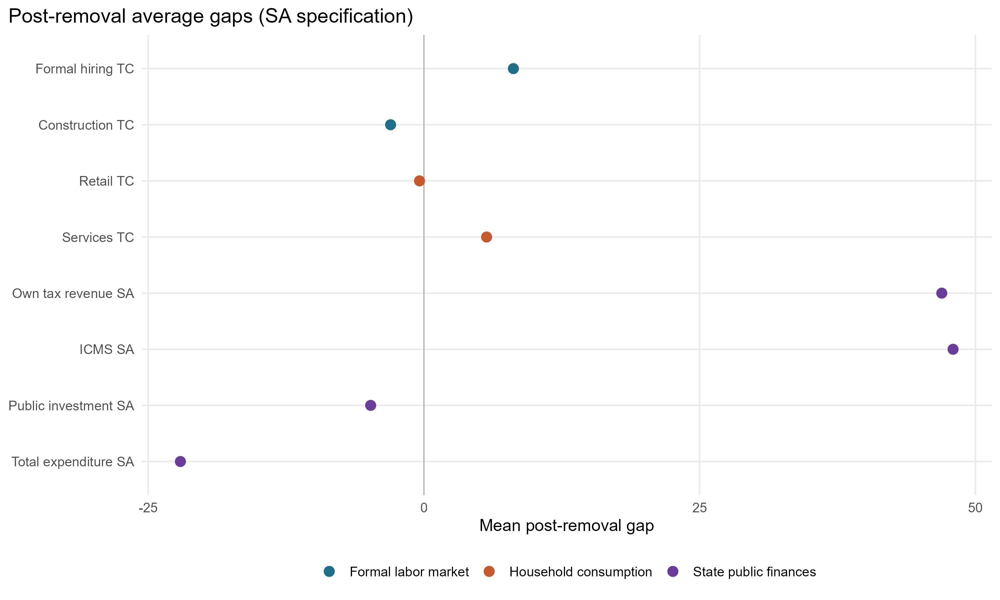

### Formal labor market

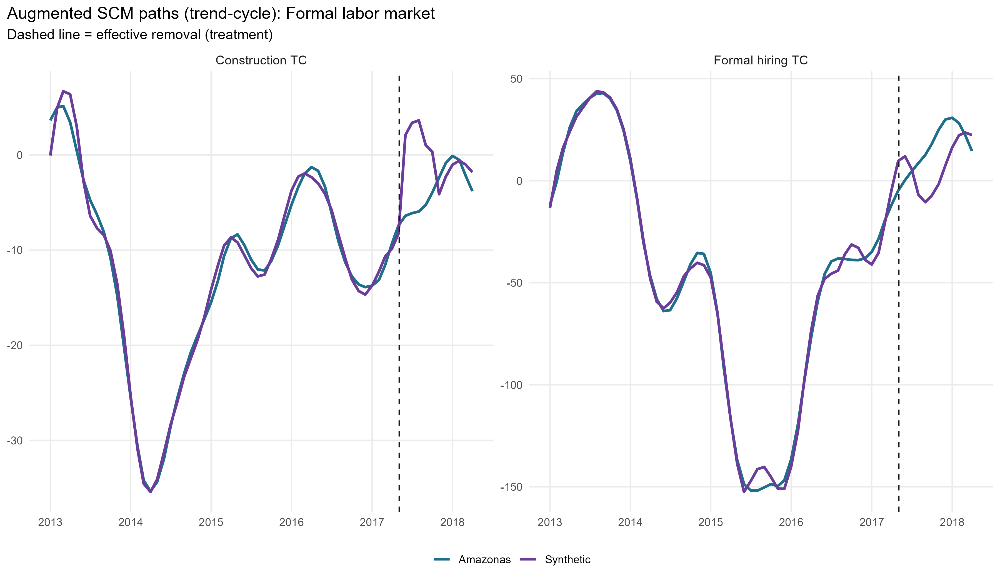

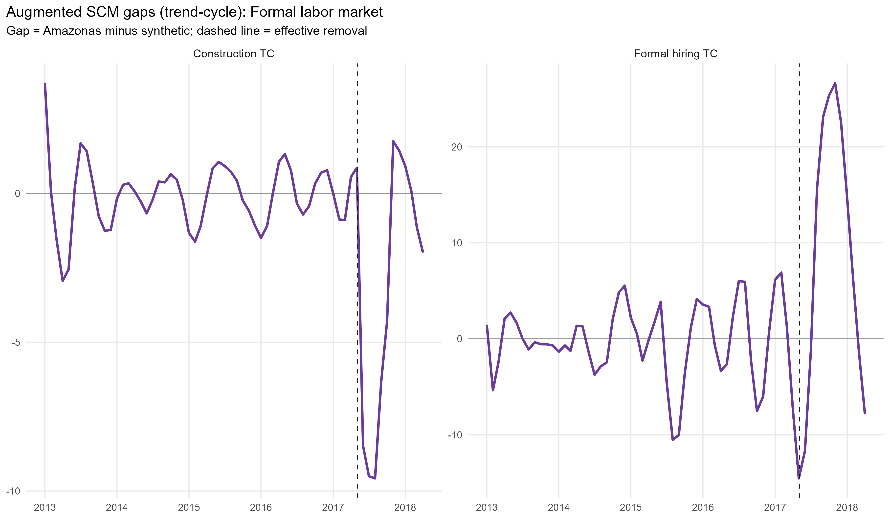

### Household consumption

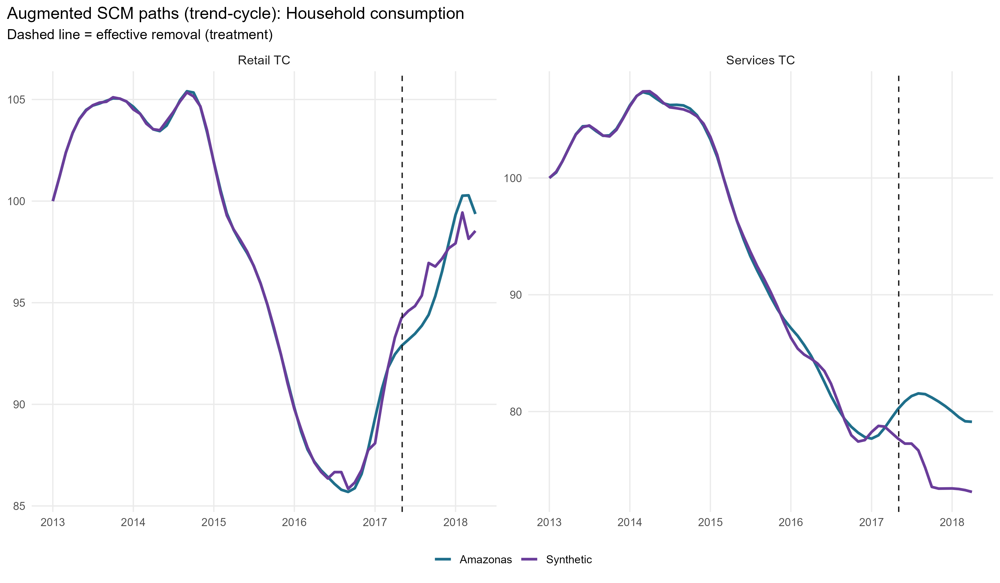

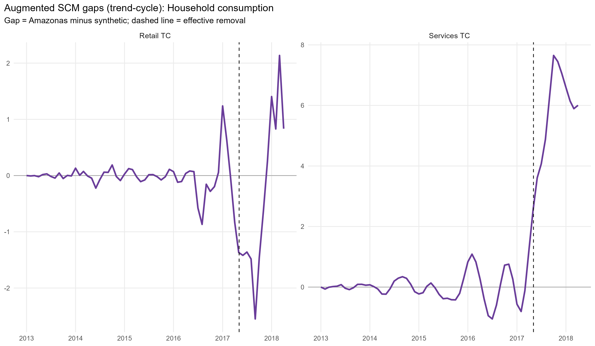

### State public finances

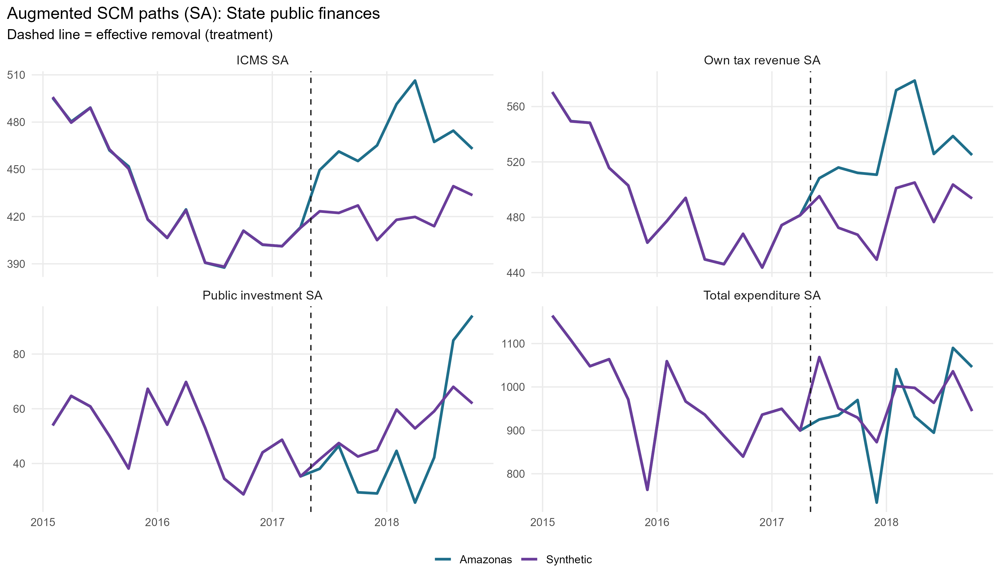

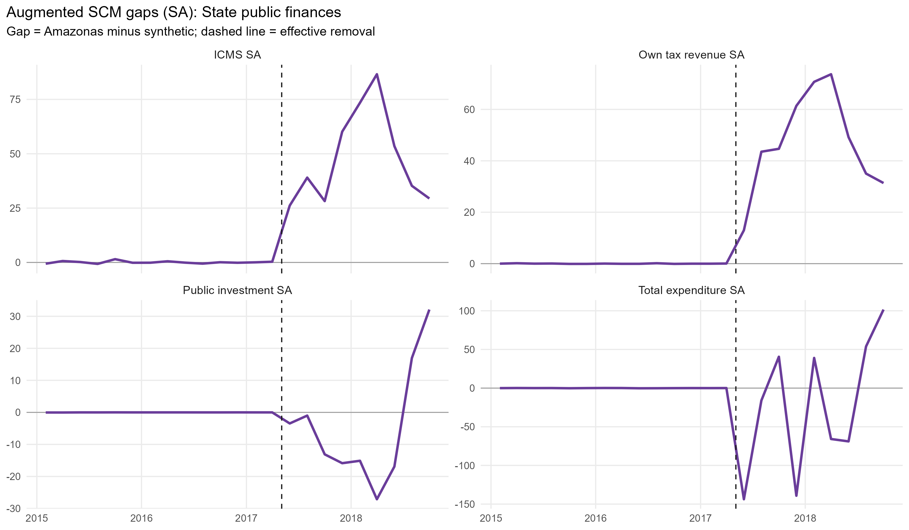

## Donor weights

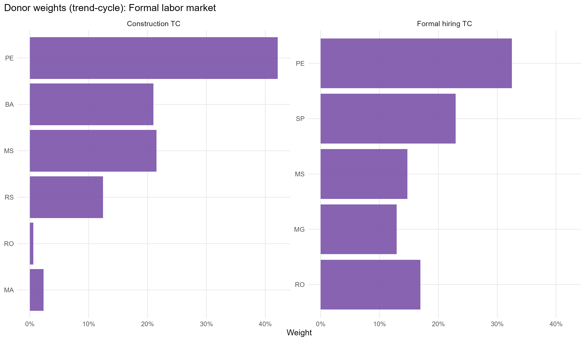

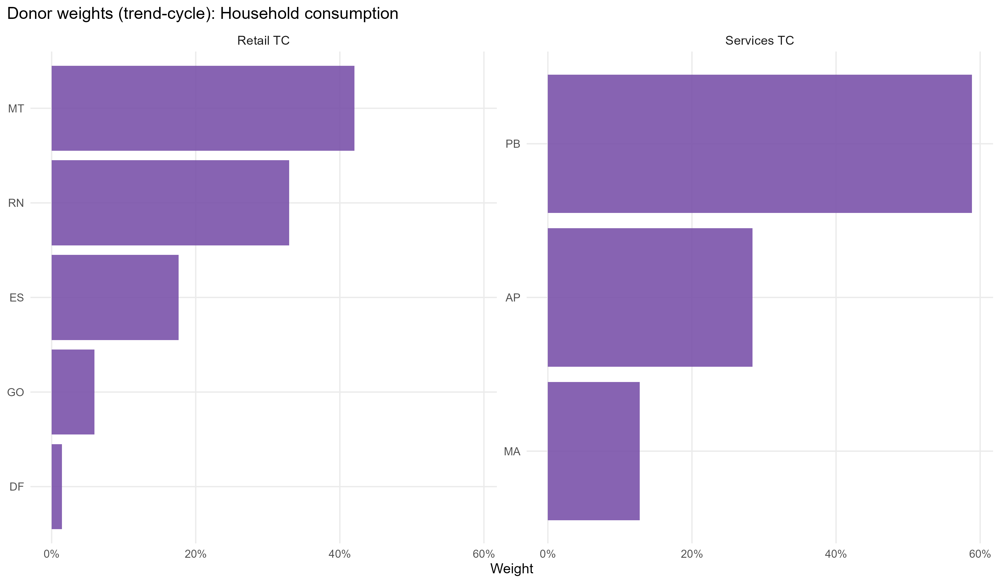

## In-space placebos

Each eligible donor is treated as pseudo-treated at the same dates; gaps are normalized by each unit's pre-treatment RMSPE.

| Outcome | RMSPE ratio (post/pre) | p-value (ratio) | p-value (abs gap) | Placebos |
| --- | --- | --- | --- | --- |
| Formal hiring TC |     4.23 | 0.625 | 0.792 | 24 |
| Construction TC |     4.72 | 0.625 | 0.792 | 24 |
| Retail TC |     5.14 | 0.750 | 0.958 | 24 |
| Services TC |    13.21 | 0.417 | 0.250 | 24 |
| Own tax revenue SA |   603.26 | 0.125 | 0.458 | 24 |
| ICMS SA |    94.27 | 0.000 | 0.333 | 24 |
| Public investment SA | 1,300.69 | 0.250 | 1.000 | 24 |
| Total expenditure SA |   760.80 | 0.042 | 0.958 | 24 |

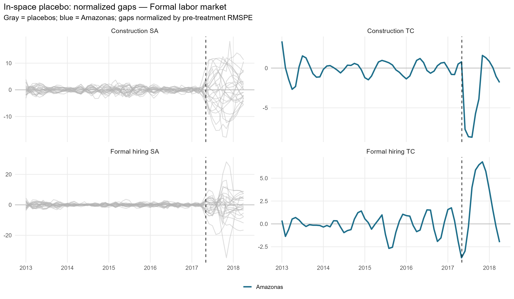

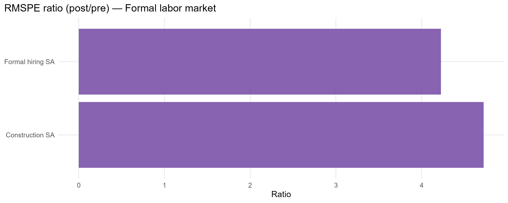

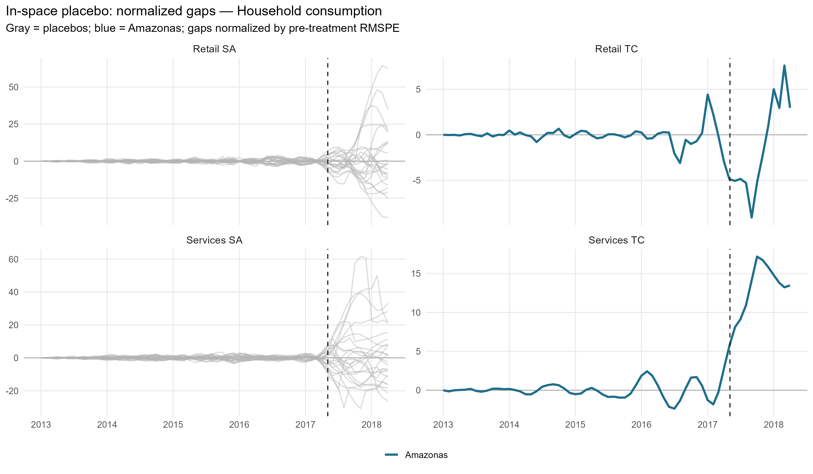

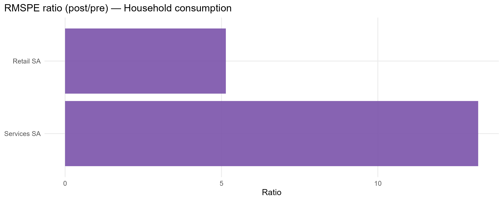

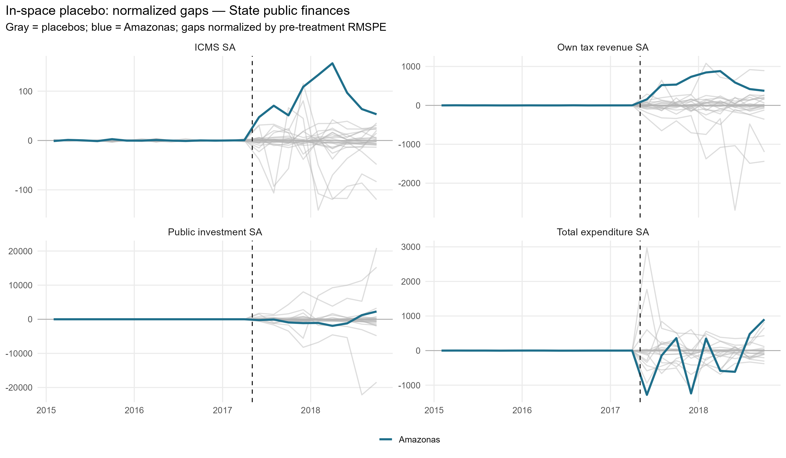

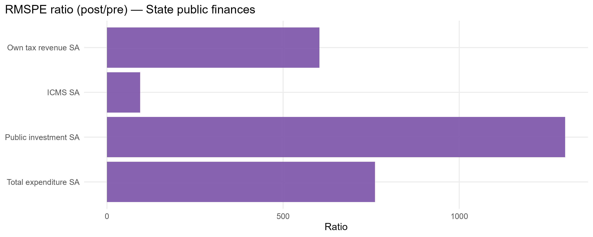

## Leave-one-out donor placebo

| Outcome | Gap post | LOO rank | p-value (2-sided) | Note |
| --- | --- | --- | --- | --- |
| Formal hiring TC | 8.11 | 3 / 25 | 0.12 | Not extreme vs LOO distribution |
| Retail TC | -0.4 | 1 / 25 | 0.04 | Unusually small negative gap |
| Services TC | 5.68 | 25 / 25 | 0.04 | Unusually large positive gap |
| ICMS SA | 47.98 | 2 / 25 | 0.08 | Unusually small positive gap |
| Public investment SA | -4.83 | 20 / 25 | 0.24 | Not extreme vs LOO distribution |
| Total expenditure SA | -22.08 | 23 / 25 | 0.12 | Not extreme vs LOO distribution |

## Current limitations

- Bimonthly fiscal pre-treatment is 14 bimesters (2015B1-2017B2), still short of the 24-bimester target because Siconfi starts in 2015, but a substantial improvement over the instability-framed 6-bimester window.
- Bimonthly fiscal seasonal adjustment uses STL, not X-13 (X-13 supports only freq 4 and 12). Bimester fixed effects and MA(6) are reasonable robustness alternatives.
- Seasonal adjustment falls back to the raw series for states/variables with too few seasonal cycles; check build log.
- ICMS from Annex 06 is derived by within-year differencing; RS 2018 B1-B5 imputed with 2017 seasonal shares.
- The post-removal window ends 12 months (monthly) / 9 bimesters (bimonthly) after removal, by design.

## Generated files

- `report/tables/augmented_effects_by_outcome.csv`
- `report/tables/pretx_outcome_balance.csv`
- `report/tables/covariate_balance_*.csv`
- `report/tables/top_donor_weights_by_outcome.csv`
- `report/tables/am_2017_01_v3_loo_placebo_summary.csv`
- `report/tables/placebo_rank_actual_rr.csv`
- `report/figures/` (preliminary, paths, gaps, weights, placebo)
- `output/placebo_inspace/`, `output/placebo_loo/`
