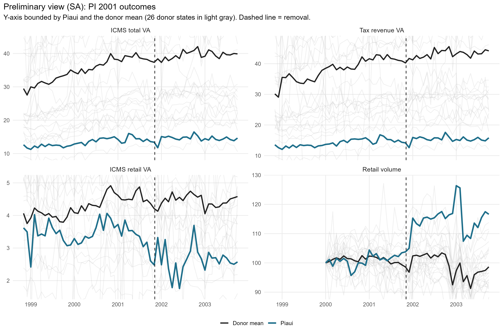
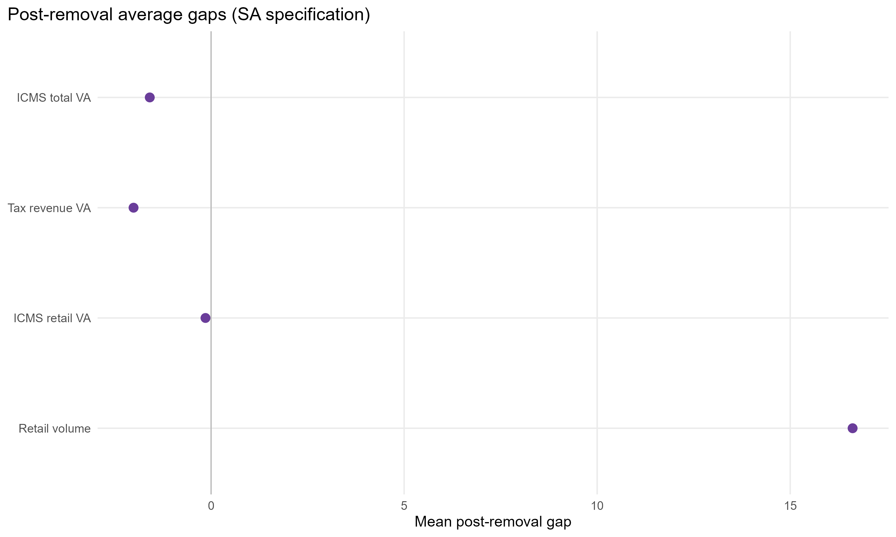
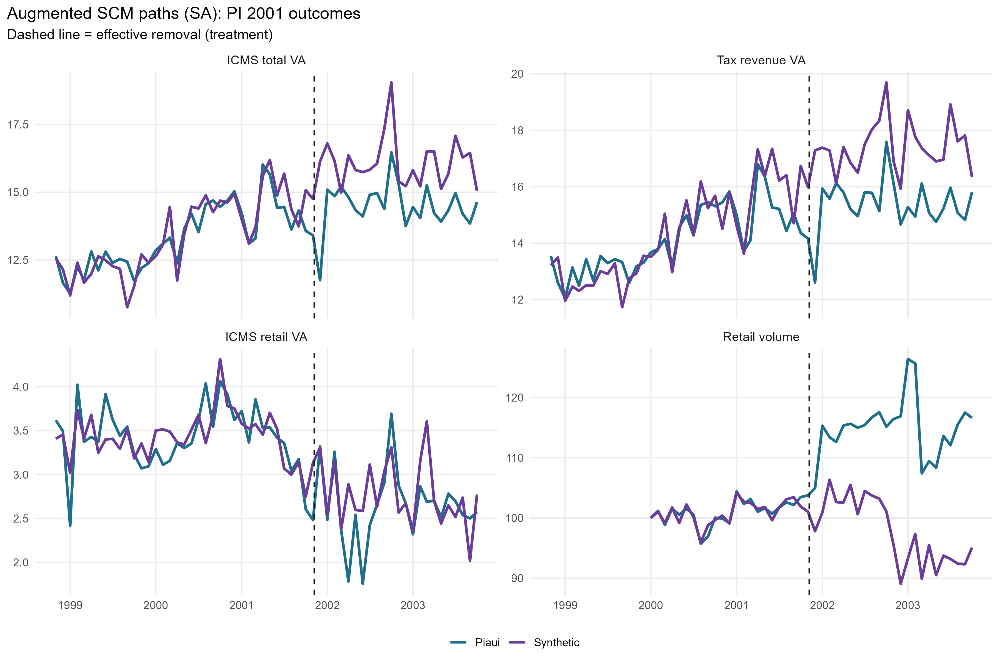
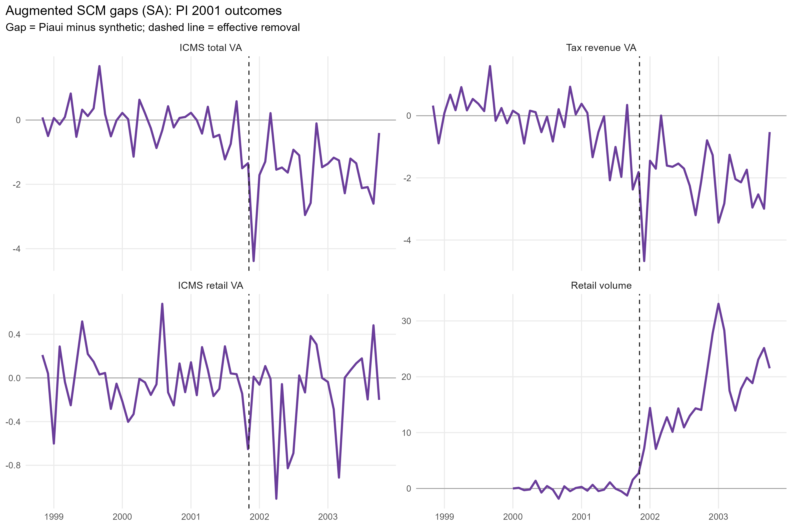
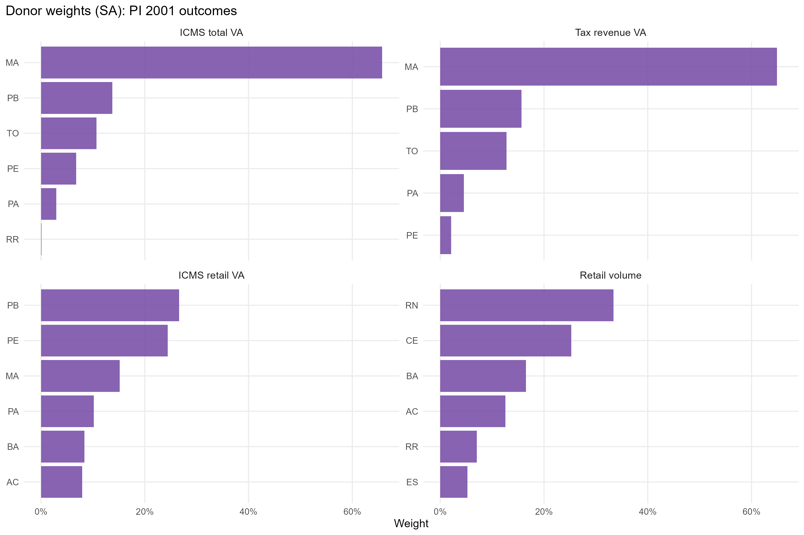
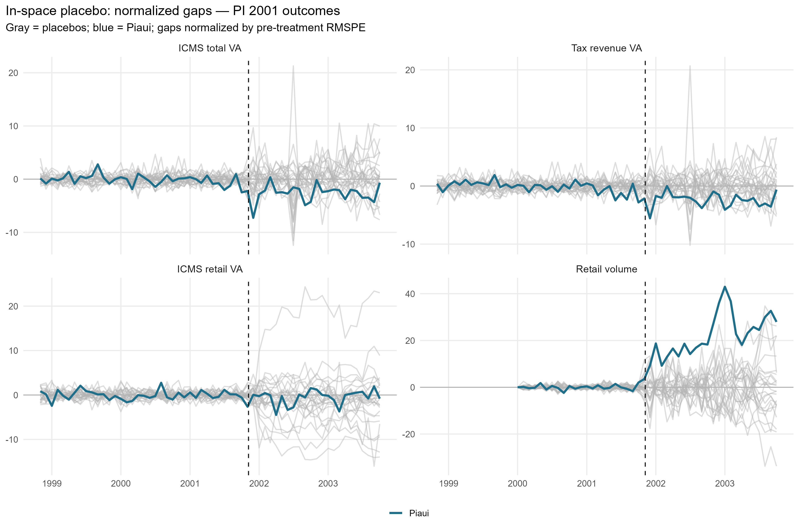
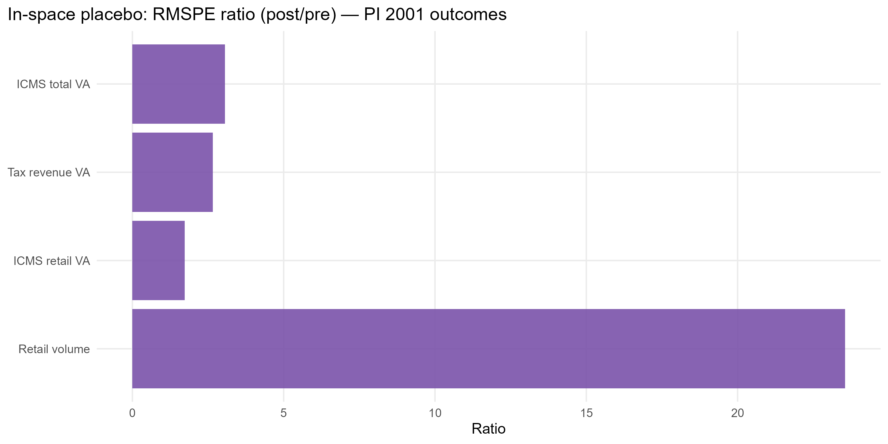

# PI 2001-01 V1: results report (monthly, X-13)

Generated on 2026-06-05.

PI 2001-01 is the first pilot built on the new CONFAZ ICMS value-added and Tesouro Transparente obligatory-transfer data, which reach back to the 1990s and let us study a pre-2007 accountability event. The design follows the V4 accountability template but at MONTHLY frequency with X-13ARIMA-SEATS seasonal adjustment. The TSE electoral cassation of Governor Mao Santa is read as a corrective accountability act; the single treatment date is the effective removal, and there is no separate crisis window. Calendar time on the x-axis; no moving averages.

## Event design

- Treated state: `PI` (Piaui).
- Treatment (single cut): effective removal `2001-11-06` (TSE electoral cassation for the 1998 gubernatorial mandate).
- Accountability frame: the cassation IS the treatment. Instability start and removal coincide (`2001-11-06`), so there is no pre-removal crisis window to model.

## Window design

- All outcomes monthly: `1998-11-01` to `2003-10-01`.
- Pre-treatment target = **36 months** (default). Post-treatment = **24 months** (`2001-11-06` onward).
- When an outcome's data does not reach 36 months, the SCM uses the maximum available down to a documented **floor of 20 months**; outcomes below the floor are skipped.
  - CONFAZ ICMS value added: full coverage, **36 pre-months** used.
  - PMC retail volume index: PI series starts 2000-01, so **22 pre-months** are used (>= 20 floor).

## Seasonal adjustment and real per-capita scaling

- Every series is monthly, so seasonal adjustment is **X-13ARIMA-SEATS** (`seasonal::seas`, `final()`), applied to each state's full series before windowing. States/variables where X-13 fails (e.g. near-constant IOF-state) fall back to the raw series.
- Monetary outcomes and covariates are deflated to real R$ with the national IPCA index (IPCA index (base dez/1993); real R$ of removal month 200111) and divided by resident population (resident population (annual; year clamped to [1999,2025] for SA continuity)).
- The retail volume index is an index level (not deflated/per-capita); it is reindexed to 100 at the first valid observation in the pilot window after SA.
- No moving averages are computed.

## Outcomes and covariates

- **Outcomes (real per capita, X-13 SA):** ICMS total VA, tax-revenue total VA, ICMS retail-trade VA, and the PMC retail volume index.
- **Covariates (real per capita, X-13 SA, pre-treatment means):** the own outcome's full pre-treatment path (lags) plus ICMS secondary VA, ICMS tertiary VA, ICMS energy VA, ICMS fuels VA, FPE transfer, and IOF-state.

## Methodological strategy

The main donor pool excludes `PI` (any state that is itself treated anywhere in the SCM window, pre or post). The preferred specification uses 26 eligible donors. Augmented Synthetic Control is the headline estimator; SCM weights are estimated on the pre-treatment window. Predictors are the full pre-treatment outcome path plus the six structural covariates above.

## Preliminary plots

All four outcomes are shown together in a single 2x2 panel (ICMS total VA, tax-revenue VA, ICMS retail VA, retail volume).

## Covariate and pre-treatment outcome balance

### Pre-treatment outcome fit

| Outcome | Treated | Synthetic | RMSPE pre | Pre periods |
| --- | --- | --- | --- | --- |
| ICMS total VA | 13.34 | 13.42 | 0.60 | 36 |
| Tax revenue VA | 14.14 | 14.29 | 0.84 | 36 |
| ICMS retail VA | 3.43 | 3.44 | 0.25 | 36 |
| Retail volume | 100.87 | 100.90 | 0.77 | 22 |

### Covariate balance: state tax base (ICMS VA)

| Covariate | Treated | ICMS total VA | Tax revenue VA | ICMS retail VA |
| --- | --- | --- | --- | --- |
| ICMS secondary VA pc (SA) |  1.2176 |  1.6970 |  1.6296 |  3.3287 |
| ICMS tertiary VA pc (SA) |  8.1856 |  6.0323 |  6.0655 | 10.8068 |
| ICMS energy VA pc (SA) |  1.1481 |  1.0990 |  1.1070 |  1.4045 |
| ICMS fuels VA pc (SA) |  2.6998 |  2.1342 |  2.0897 |  2.5882 |
| FPE transfer pc (SA) | 16.8763 | 16.9240 | 17.5731 | 18.0269 |
| IOF-state pc (SA) |  0.0000 |  0.0001 |  0.0001 |  0.0004 |

### Covariate balance: household consumption

| Covariate | Treated | Retail volume |
| --- | --- | --- |
| ICMS secondary VA pc (SA) |  1.2176 |  5.2870 |
| ICMS tertiary VA pc (SA) |  8.1856 | 12.1439 |
| ICMS energy VA pc (SA) |  1.1481 |  2.0150 |
| ICMS fuels VA pc (SA) |  2.6998 |  3.5455 |
| FPE transfer pc (SA) | 16.8763 | 24.7683 |
| IOF-state pc (SA) |  0.0000 |  0.0002 |

## Main results: Augmented SCM (SA)

| Channel | Outcome | Mean gap post | RMSPE pre | RMSPE post | Donors |
| --- | --- | --- | --- | --- | --- |
| State tax base (ICMS VA) | ICMS total value added, real per capita | -1.59 | 0.60 |  1.84 | 26 |
| State tax base (ICMS VA) | Tax revenue value added, real per capita | -2.01 | 0.84 |  2.24 | 26 |
| State tax base (ICMS VA) | ICMS retail-trade VA, real per capita | -0.14 | 0.25 |  0.43 | 26 |
| Household consumption | Retail volume index (PMC) | 16.62 | 0.77 | 18.12 | 26 |

### Augmented SCM paths and gaps (all outcomes)

## Donor weights

## In-space placebos

Each eligible donor is treated as pseudo-treated at the same dates; gaps are normalized by each unit's pre-treatment RMSPE. The p-value is the share of donor placebos with a post/pre RMSPE ratio (or absolute post gap) at least as large as the treated unit's.

| Outcome | RMSPE ratio (post/pre) | p-value (ratio) | p-value (abs gap) | Placebos |
| --- | --- | --- | --- | --- |
| ICMS total VA |  3.06 | 0.346 | 0.769 | 26 |
| Tax revenue VA |  2.66 | 0.269 | 0.692 | 26 |
| ICMS retail VA |  1.73 | 0.769 | 1.000 | 26 |
| Retail volume | 23.55 | 0.000 | 0.000 | 26 |

## Leave-one-out donor placebo

| Outcome | Gap post | LOO rank | p-value (2-sided) | Note |
| --- | --- | --- | --- | --- |
| ICMS total VA | -1.59 | 26 / 27 | 0.074 | Unusually large negative gap |
| Tax revenue VA | -2.01 | 26 / 27 | 0.074 | Unusually large negative gap |
| ICMS retail VA | -0.14 | 5 / 27 | 0.185 | Not extreme vs LOO distribution |
| Retail volume | 16.62 | 3 / 27 | 0.111 | Not extreme vs LOO distribution |

## Current limitations

- Retail (PMC) has only 22 pre-months (vs 36 for the ICMS outcomes) because the PI PMC series starts in 2000-01. This is above the 20-month floor but the retail pre-fit is shorter than the fiscal block's.
- IOF-state is near-zero for most states in this era, so it carries little weight as a covariate (dropped by the row standardization when its cross-state variance is degenerate).
- IPCA is chained across the 1990s currency reforms; within-window real ratios are valid, but absolute real-R$ levels are anchored to the removal month, not a recent base.
- The post-removal window ends 24 months after removal, by design.

## Generated files

- `report/tables/augmented_effects_by_outcome.csv`
- `report/tables/pretx_outcome_balance.csv`
- `report/tables/covariate_balance_*.csv`
- `report/tables/top_donor_weights_by_outcome.csv`
- `report/tables/pi_2001_01_v1_loo_placebo_summary.csv`
- `report/tables/placebo_rank_actual_rr.csv`
- `report/figures/` (preliminary, paths, gaps, weights, placebo)
- `output/placebo_inspace/`, `output/placebo_loo/`
