# RR 2018-01: Resultados preliminares do piloto V2

Documento gerado em 2026-06-04.

Este documento consolida a primeira rodada de resultados para o caso de Roraima em 2018. O objetivo é organizar, em formato próximo ao de uma seção empírica de artigo, os resultados do Augmented Synthetic Control Method (Augmented SCM) para três canais do desenho atual do projeto: mercado de trabalho formal, consumo das famílias e finanças públicas estaduais.

## Desenho do evento

- Unidade tratada: `RR`.
- Início da instabilidade política: `2018-11-07`.
- Queda/intervenção efetiva: `2018-12-10`.

As observações anteriores ao início da instabilidade são tratadas como pré-tratamento limpo. A janela entre o início da instabilidade e a queda efetiva é mantida como período de crise política. As observações posteriores à queda/intervenção são tratadas como pós-tratamento.

## Estratégia metodológica

O pool principal de doadores exclui `RR`, `AM` e `TO`. Roraima é excluída por ser a unidade tratada. Amazonas é excluído por ter o evento `AM_2017_01` dentro da janela principal de estimação do piloto. Tocantins é excluído pelo mesmo critério, em especial por `TO_2018_01`. Assim, a especificação principal utiliza 24 UFs elegíveis como doadores.

A unidade tratada é Roraima. Para cada desfecho, o método construiu uma combinação convexa de estados doadores capaz de aproximar a trajetória pré-tratamento e as covariáveis pré-evento de Roraima. Seja \(Y_{1t}\) o resultado observado em Roraima no período \(t\), e seja \(Y_{jt}\) o resultado observado no estado doador \(j = 2, \ldots, J+1\). O sintético clássico é definido por:

\[
\widehat{Y}^{SCM}_{1t} = \sum_{j=2}^{J+1} w_j Y_{jt}, \qquad w_j \geq 0, \qquad \sum_{j=2}^{J+1} w_j = 1.
\]

Os pesos \(w_j\) minimizam a distância entre os preditores da unidade tratada, \(X_1\), e os preditores ponderados dos doadores, \(X_0 W\):

\[
\widehat{W} = \arg\min_W (X_1 - X_0 W)' V (X_1 - X_0 W),
\]

sujeito às restrições de não negatividade e soma unitária. Na implementação atual, os preditores incluem a trajetória pré-tratamento completa disponível da própria variável dependente e covariáveis estaduais pré-evento: taxa de desemprego, taxa de formalização, dependência de transferências, despesa em saúde per capita, despesa em educação per capita e despesa em segurança pública per capita.

O estimador principal neste relatório é o Augmented SCM. Ele preserva a estrutura de pesos do SCM e adiciona uma correção de viés estimada por regressão ridge nos doadores. De forma compacta:

\[
\widehat{Y}^{ASCM}_{1t} = \widehat{Y}^{SCM}_{1t} + \widehat{m}_t(X_1) - \sum_{j=2}^{J+1} \widehat{w}_j \widehat{m}_t(X_j),
\]

em que \(\widehat{m}_t(\cdot)\) é uma função ridge ajustada entre os estados doadores para cada período. O efeito estimado em Roraima é:

\[
\widehat{\tau}_{1t} = Y_{1t} - \widehat{Y}^{ASCM}_{1t}.
\]

Valores positivos indicam que Roraima ficou acima do contrafactual sintético; valores negativos indicam desempenho abaixo do contrafactual. Para as variáveis mensais, o relatório mostra resultados brutos e médias móveis limpas de 6 meses. Para as variáveis bimestrais, mostra resultados brutos e médias móveis limpas de 4 bimestres. As médias móveis limpas são calculadas separadamente dentro dos segmentos pré, crise e pós, evitando que observações pré-tratamento contaminem a janela posterior.

## Variáveis e canais

- Mercado de trabalho formal: saldo de emprego formal por 100 mil pessoas em idade ativa e saldo de emprego formal da construção civil por 100 mil pessoas em idade ativa.
- Consumo das famílias: índice de volume do comércio varejista e índice de volume de serviços.
- Finanças públicas estaduais, receitas: arrecadação própria real per capita e receita de ICMS real per capita.
- Finanças públicas estaduais, despesas: investimento público liquidado per capita e despesa total liquidada per capita.

A normalização por população ou por escala de mercado é importante porque os estados brasileiros diferem muito em tamanho. Por isso, as variáveis fiscais são per capita, os saldos formais são expressos por 100 mil pessoas em idade ativa e as séries de comércio/serviços entram como índices de volume reancorados em 100 na primeira observação válida da janela do piloto para cada estado.

## Visualização preliminar dos dados

As figuras abaixo comparam Roraima com a média simples dos doadores elegíveis antes de aplicar o controle sintético. Elas não devem ser interpretadas como efeito causal; servem para expor escala, volatilidade, quebras e diferenças iniciais entre Roraima e o conjunto de comparação.

Para facilitar a inspeção, as linhas cinza mostram os estados doadores elegíveis em traço fino e transparente; Roraima e a média simples dos doadores aparecem em tons mais escuros. Nas figuras suavizadas, a visualização usa médias móveis com janela parcial no começo de cada segmento: o primeiro período pós-instabilidade ou pós-queda aparece com a primeira observação disponível, e os períodos seguintes incorporam progressivamente as observações novas até completar a janela definida. A estimativa principal do SCM continua usando as séries limpas, sem misturar períodos de tratamento.

A receita de ICMS foi extraída do arquivo bruto local do Siconfi/RREO, Anexo 06, conta `RREO6ICMS`. Como a fonte reporta a receita realizada acumulada até o bimestre, o fluxo bimestral usado no painel é derivado por diferença dentro de cada ano. A tabela de auditoria para Roraima em 2018 está em `report/tables/rr_2018_icms_revenue_audit.csv`.

A despesa total liquidada agora segue o mesmo tratamento aplicado ao investimento público: quando o Anexo 02 traz apenas o acumulado até o bimestre, o fluxo bimestral é reconstruído por diferença dentro do ano; quando a fonte permanece vazia, o reparo usa interpolação linear entre bimestres adjacentes observados. A tabela de auditoria específica para Roraima está em `report/tables/rr_liquidated_expenditure_total_audit.csv`, com valores nominais, reais, per capita e flags de reparo ao longo da janela do piloto.

### Mercado de trabalho formal

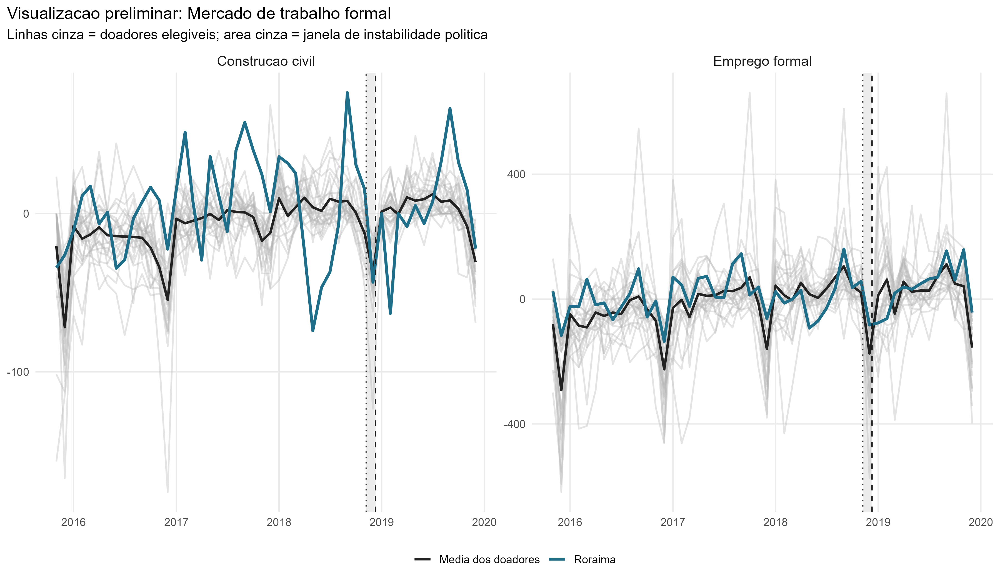

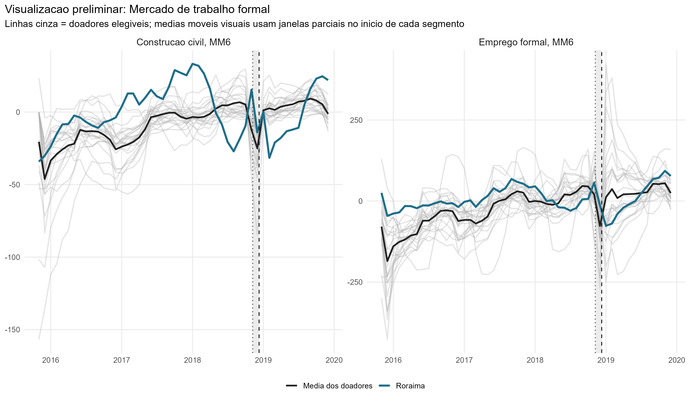

### Consumo das famílias

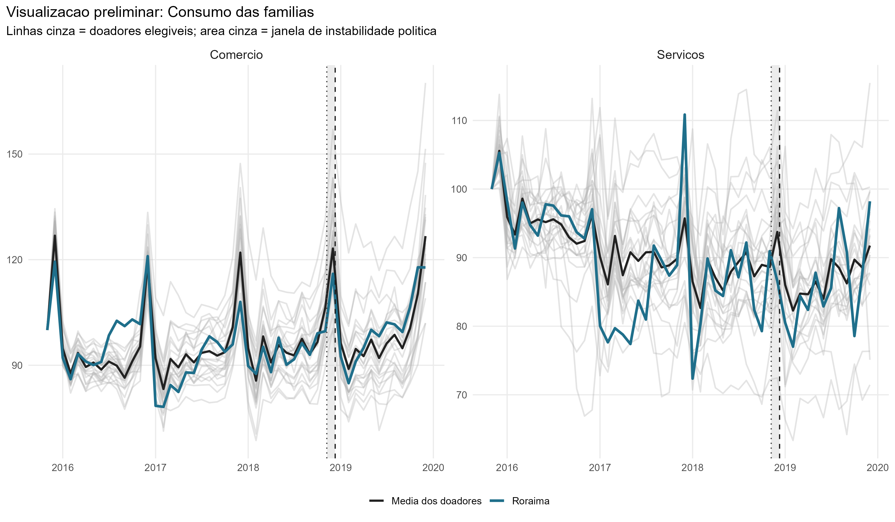

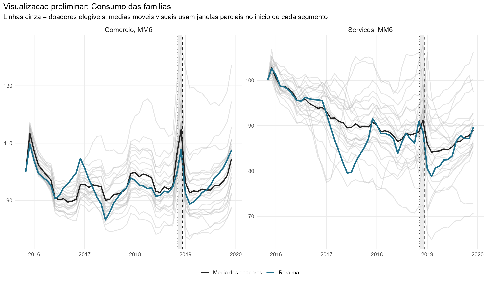

### Finanças públicas estaduais

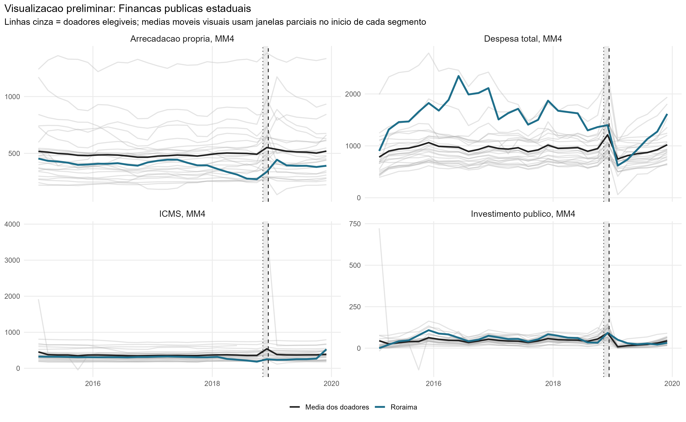

## Resultados principais: Augmented SCM

A tabela resume os resultados para as especificações suavizadas, que são as mais informativas para leitura substantiva porque reduzem volatilidade mensal/bimestral sem misturar os segmentos de tratamento.

Nas especificações suavizadas, a coluna de crise política pode ficar vazia porque a janela entre instabilidade e queda efetiva é curta demais para formar uma média móvel limpa completa dentro do próprio segmento. Nesses casos, a inferência visual da transição imediata deve usar os gráficos brutos e as figuras de média móvel visual com janela parcial; a estimativa principal suavizada permanece concentrada no período pós-queda.

| Canal | Variável | Gap médio crise | Gap médio pos | RMSPE pre | RMSPE pos | Doadores |
| --- | --- | --- | --- | --- | --- | --- |
| Mercado de trabalho formal | Emprego formal, MM6 |  |   25.13 |  4.52 |  40.54 | 24 |
| Mercado de trabalho formal | Construção civil, MM6 |  |    3.61 |  3.40 |  14.13 | 24 |
| Consumo das famílias | Comércio, MM6 |  |    8.14 |  0.54 |   8.39 | 24 |
| Consumo das famílias | Serviços, MM6 |  |    3.12 |  0.40 |   3.32 | 24 |
| Finanças públicas estaduais | ICMS, MM4 |  |   16.46 |  5.32 | 118.65 | 24 |
| Finanças públicas estaduais | Arrecadação própria, MM4 |  |  -50.50 |  3.25 |  52.74 | 24 |
| Finanças públicas estaduais | Investimento público, MM4 |  |  -10.04 |  1.96 |  15.65 | 24 |
| Finanças públicas estaduais | Despesa total, MM4 |  | -101.90 | 87.27 | 156.81 | 24 |

Como leitura preliminar, a interpretação deve privilegiar três elementos: a qualidade do ajuste pré-tratamento, medida pelo RMSPE pre; o sinal e tamanho do gap durante a crise política; e a persistência do gap no período posterior à queda/intervenção.

### Mercado de trabalho formal

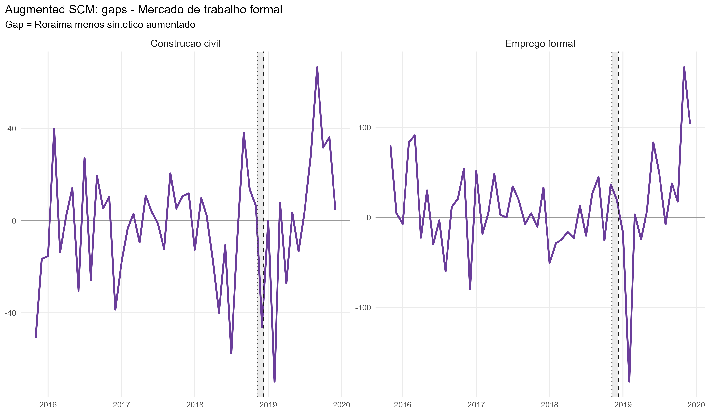

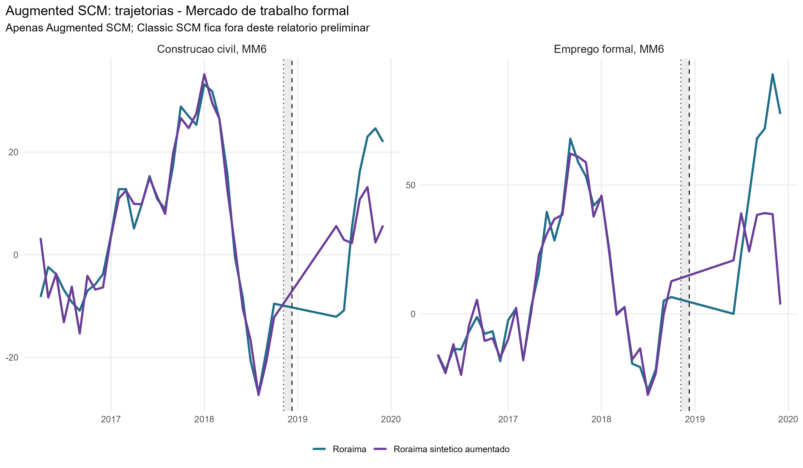

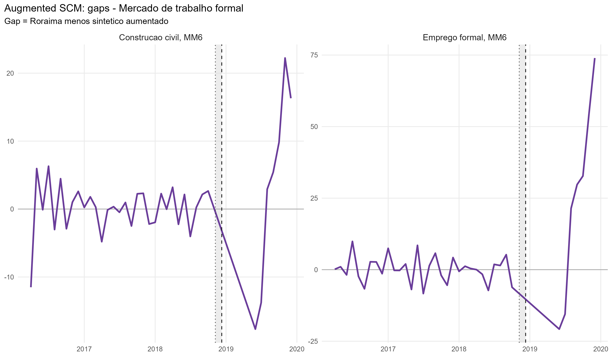

No canal de mercado de trabalho formal, o saldo agregado e o saldo da construção civil capturam duas margens complementares do emprego com carteira. O primeiro resume a dinâmica formal do mercado de trabalho estadual. O segundo observa uma margem setorial mais cíclica e sensível a mudanças de atividade e expectativas. A especificação suavizada e especialmente relevante porque ambas as séries podem ter alta volatilidade de curto prazo.

### Consumo das famílias

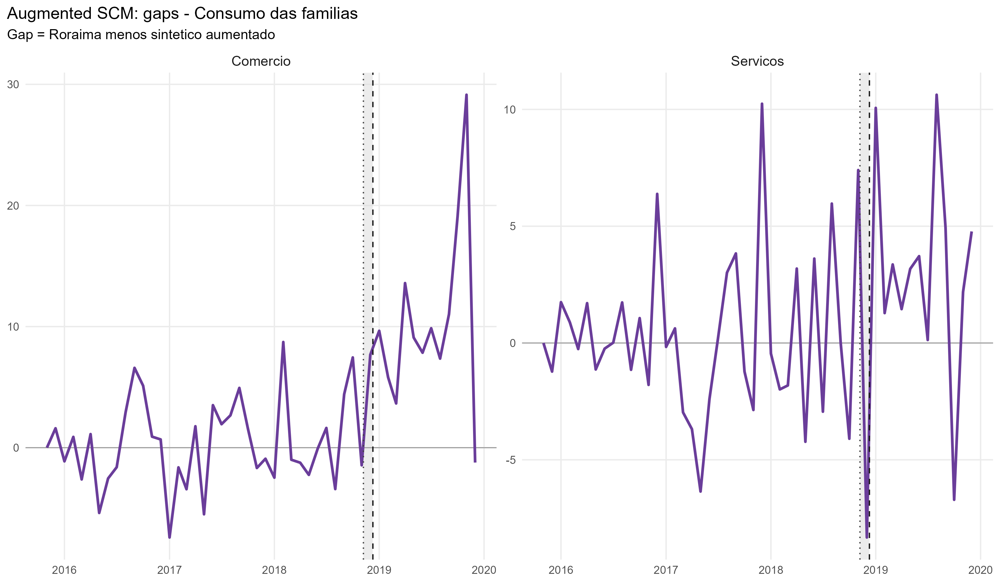

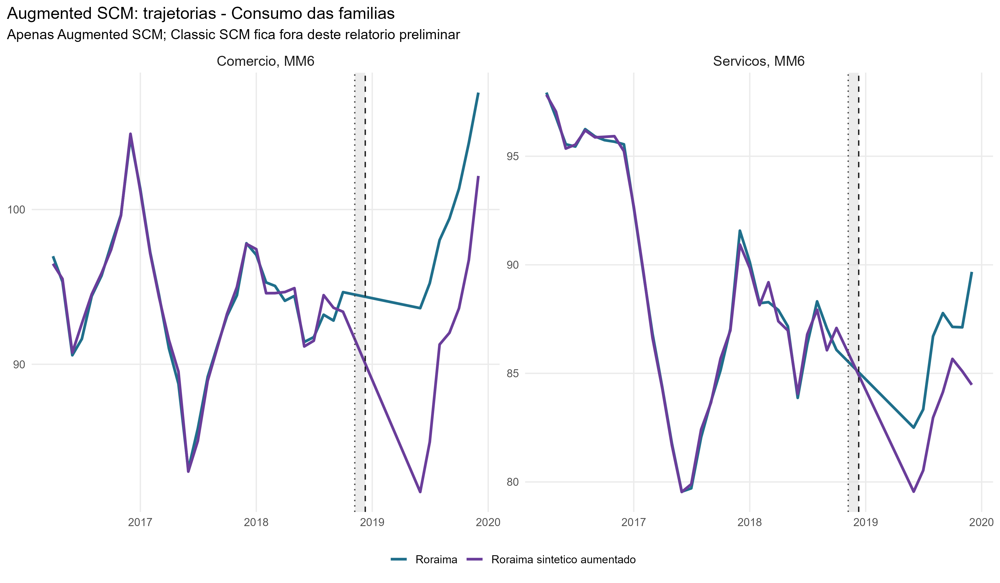

O canal de consumo é observado por comércio varejista e serviços, ambos reancorados em 100 no início da janela do piloto. A leitura conjunta é importante porque famílias podem ajustar consumo de bens e serviços de forma diferente em resposta a incerteza política, perda de renda esperada ou mudanças no funcionamento do setor público local.

### Finanças públicas estaduais

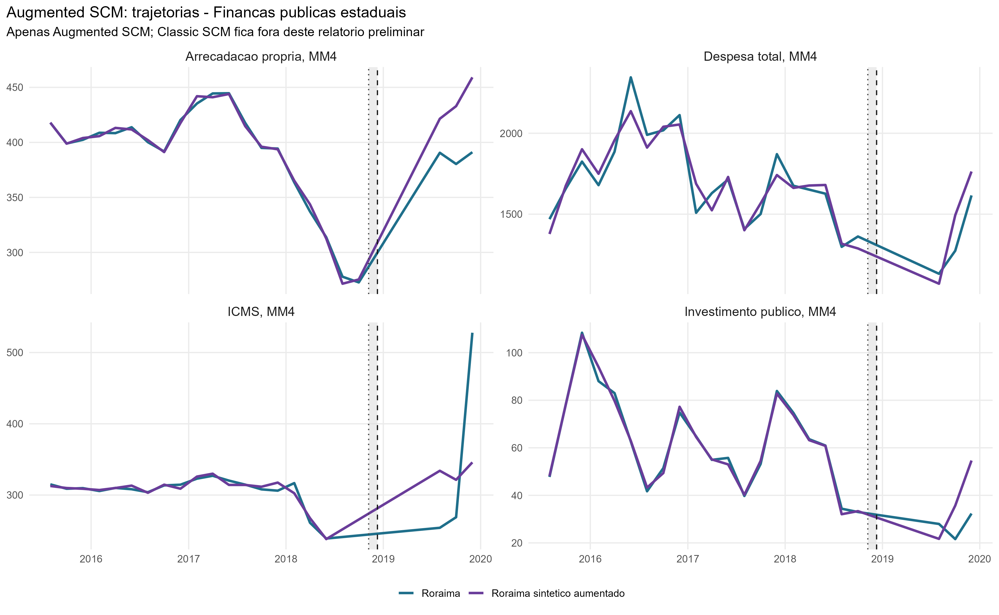

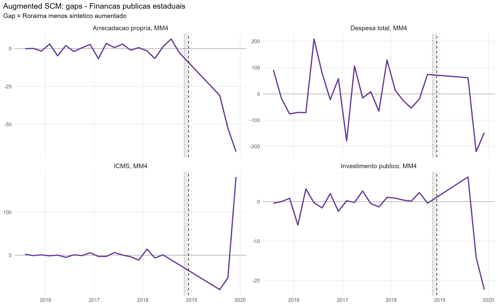

No canal de finanças públicas estaduais, o subbloco de receitas combina arrecadação própria e ICMS para observar a margem tributária do estado. O subbloco de despesas combina investimento público liquidado e despesa total liquidada para observar escala de gasto e compressão de investimento. As duas séries exigem cautela adicional porque passaram por reparo de lacunas no Siconfi/RREO; por isso devem ser lidas junto das auditorias de dados e dos resultados de robustez.

### Resumo gráfico dos efeitos

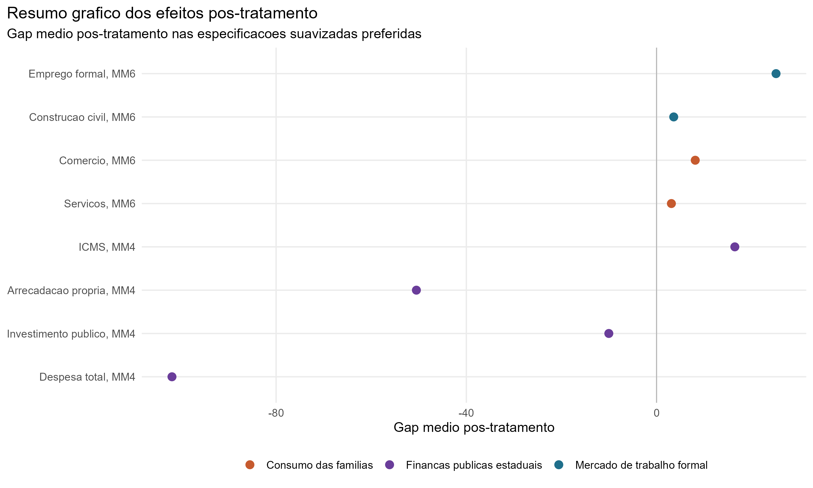

## Pesos dos doadores

As figuras de pesos ajudam a avaliar a plausibilidade do contrafactual. Pesos muito concentrados podem indicar que poucos estados são responsáveis pela aproximação de Roraima; pesos mais dispersos sugerem uma composição mais diversificada, embora a qualidade substantiva dependa também do ajuste pré-tratamento.

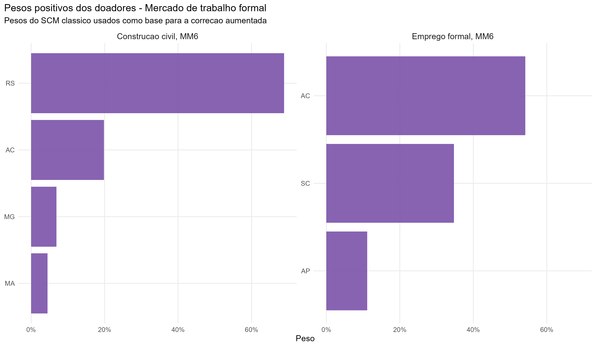

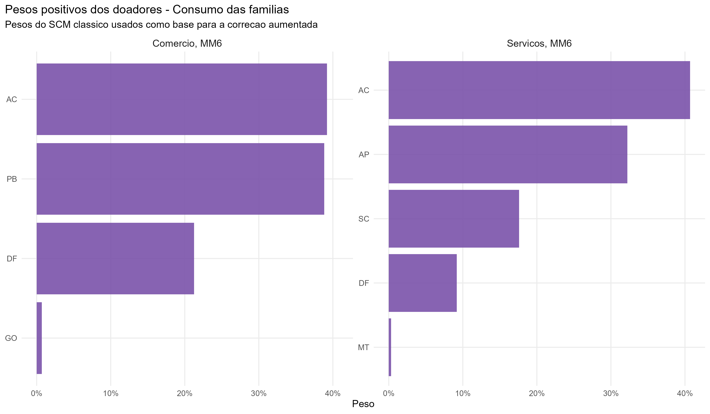

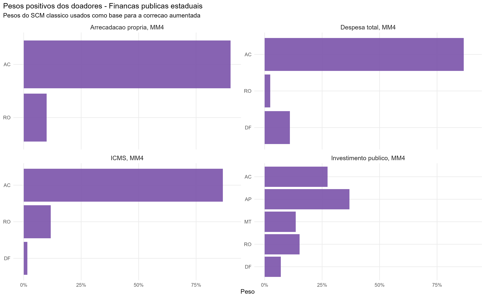

## Robustez

A primeira checagem de robustez compara especificações brutas e suavizadas. As séries brutas preservam choques de curtíssimo prazo, mas podem exagerar ruído operacional, sazonalidade residual e irregularidades administrativas. As séries suavizadas reduzem esse ruído e são, por ora, a especificação preferida para leitura substantiva.

Resultados brutos:

| Canal | Variável | Gap médio crise | Gap médio pos | RMSPE pre | RMSPE pos | Doadores |
| --- | --- | --- | --- | --- | --- | --- |
| Mercado de trabalho formal | Emprego formal |   28.16 |   19.83 |  38.92 |  83.60 | 24 |
| Mercado de trabalho formal | Construção civil |  -19.89 |    6.09 |  22.44 |  33.48 | 24 |
| Consumo das famílias | Comércio |    3.11 |   10.41 |   3.60 |  12.78 | 24 |
| Consumo das famílias | Serviços |   -0.46 |    3.25 |   3.23 |   5.40 | 24 |
| Finanças públicas estaduais | ICMS | -504.90 |   73.15 |   3.31 | 378.88 | 24 |
| Finanças públicas estaduais | Arrecadação própria | -283.87 |  -24.01 |  16.74 |  66.40 | 24 |
| Finanças públicas estaduais | Investimento público |  -36.28 |   -5.43 |  16.48 |  30.16 | 24 |
| Finanças públicas estaduais | Despesa total | -998.10 | -227.58 | 457.06 | 267.72 | 24 |

Resultados suavizados:

| Canal | Variável | Gap médio crise | Gap médio pos | RMSPE pre | RMSPE pos | Doadores |
| --- | --- | --- | --- | --- | --- | --- |
| Mercado de trabalho formal | Emprego formal, MM6 |  |   25.13 |  4.52 |  40.54 | 24 |
| Mercado de trabalho formal | Construção civil, MM6 |  |    3.61 |  3.40 |  14.13 | 24 |
| Consumo das famílias | Comércio, MM6 |  |    8.14 |  0.54 |   8.39 | 24 |
| Consumo das famílias | Serviços, MM6 |  |    3.12 |  0.40 |   3.32 | 24 |
| Finanças públicas estaduais | ICMS, MM4 |  |   16.46 |  5.32 | 118.65 | 24 |
| Finanças públicas estaduais | Arrecadação própria, MM4 |  |  -50.50 |  3.25 |  52.74 | 24 |
| Finanças públicas estaduais | Investimento público, MM4 |  |  -10.04 |  1.96 |  15.65 | 24 |
| Finanças públicas estaduais | Despesa total, MM4 |  | -101.90 | 87.27 | 156.81 | 24 |

A segunda checagem é a separação explícita entre janela de crise política e período pós-queda. Isso evita tratar o evento como um único ponto instantâneo e permite avaliar se efeitos aparecem durante a instabilidade, depois da remoção efetiva, ou em ambos os momentos. Essa distinção é substantivamente importante porque processos legislativos ou judiciais podem afetar expectativas antes da troca formal de comando.

A terceira checagem é a leitura do ajuste pré-tratamento. Resultados com RMSPE pre muito alto devem receber menor peso interpretativo, pois o contrafactual é menos crível. Nos próximos ciclos, também faz sentido acrescentar janelas alternativas de pré-tratamento e excluir doadores de alta influência para checar sensibilidade dos pesos.

## Placebos in-space

Os placebos in-space reestimam o Augmented SCM tratando cada estado elegível do pool principal como se tivesse recebido o tratamento, mantendo Roraima como a unidade efetivamente tratada. `AM` e `TO` não entram como placebos porque também foram excluídos do pool principal. Para os estados placebo, Roraima permanece fora do conjunto de doadores. Os gaps são normalizados pelo RMSPE pré-tratamento da própria unidade placebo:

\[
g^{norm}_{it} = \frac{Y_{it} - \widehat{Y}^{ASCM}_{it}}{RMSPE^{pre}_i}.
\]

Essa normalização torna comparáveis unidades com escalas diferentes. O teste não é uma inferência randomizada formal, mas fornece uma avaliação visual e ordinal: se Roraima estiver entre os maiores desvios pós-tratamento em relação aos placebos, o resultado é mais consistente com um efeito excepcional do evento.

| Canal | Variável | Razão RMSPE pos/pre | p RMSPE | p gap absoluto | Placebos |
| --- | --- | --- | --- | --- | --- |
| Mercado de trabalho formal | Construção civil, MM6 |  4.07 | 0.360 | 0.600 | 24 |
| Mercado de trabalho formal | Emprego formal, MM6 |  8.95 | 0.120 | 0.240 | 24 |
| Finanças públicas estaduais | ICMS, MM4 | 21.49 | 0.320 | 0.760 | 24 |
| Finanças públicas estaduais | Despesa total, MM4 |  7.30 | 0.760 | 0.080 | 24 |
| Finanças públicas estaduais | Investimento público, MM4 |  7.92 | 0.440 | 0.560 | 24 |
| Consumo das famílias | Comércio, MM6 | 15.53 | 0.520 | 0.240 | 24 |
| Consumo das famílias | Serviços, MM6 |  8.29 | 0.520 | 0.520 | 24 |
| Finanças públicas estaduais | Arrecadação própria, MM4 | 16.44 | 0.360 | 0.320 | 24 |

### Placebos por canal

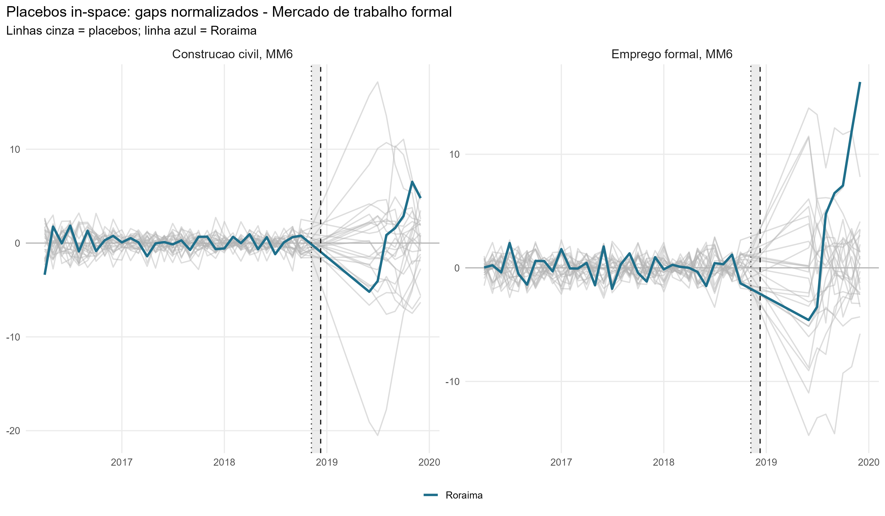

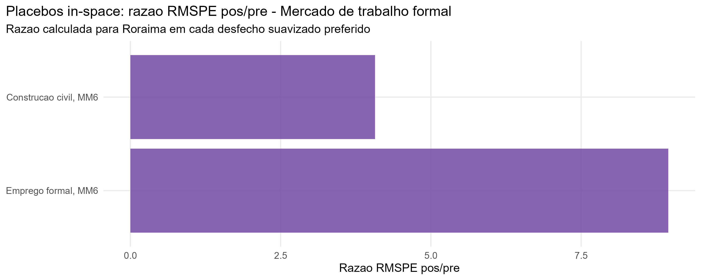

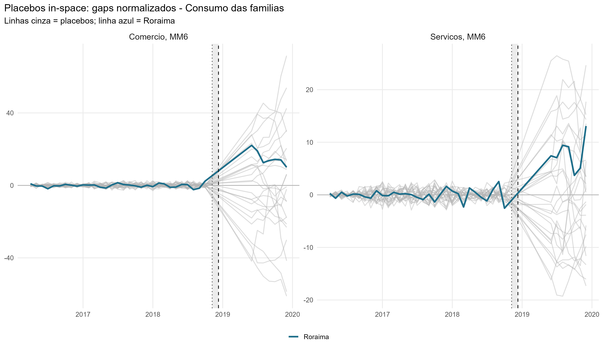

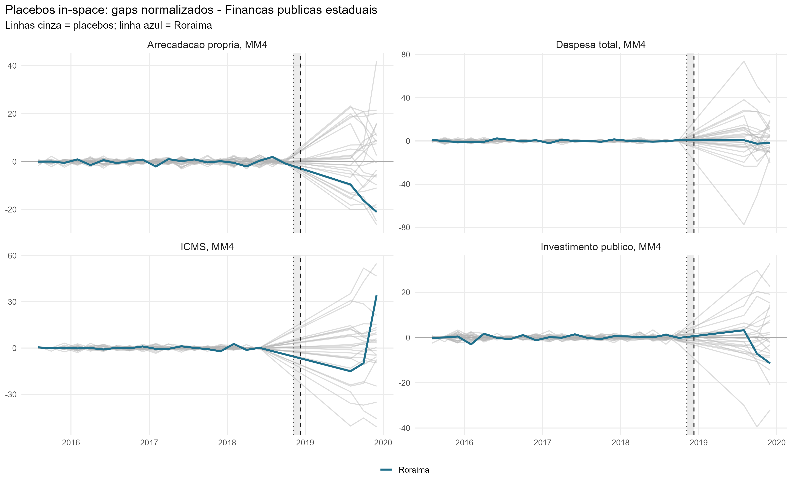

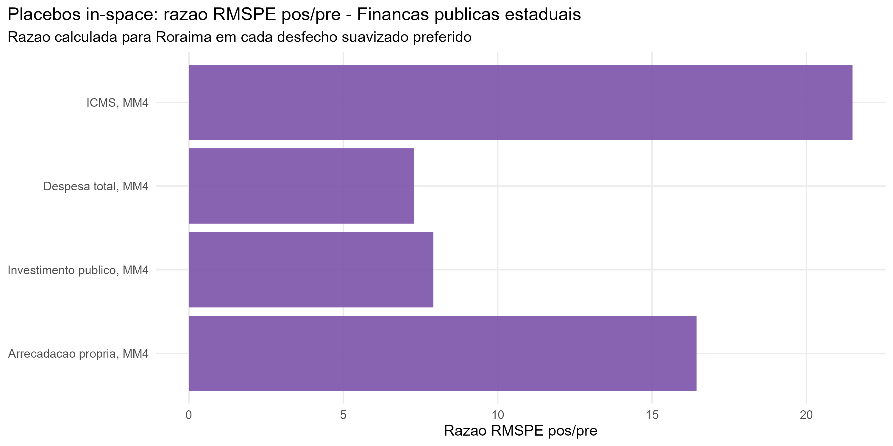

## Limitações atuais

- O ICMS do Anexo 06 é reportado como receita realizada acumulada; o fluxo bimestral usado no piloto é derivado por diferença dentro de cada ano.
- O investimento público liquidado e a despesa total liquidada passaram por reparo de lacunas e devem ser acompanhados por suas tabelas de auditoria no apêndice.
- Os placebos foram gerados e salvos em tabelas separadas; este script reaproveita esses resultados para evitar recálculo desnecessário.
- Este documento é uma consolidação preliminar do piloto de Roraima, não a versão final da seção de resultados do artigo.

## Arquivos gerados

- `report/tables/augmented_effects_by_outcome.csv`
- `report/tables/top_donor_weights_by_outcome.csv`
- `report/tables/placebo_rank_actual_rr.csv`
- `report/tables/rr_2018_icms_revenue_audit.csv`
- `report/tables/rr_liquidated_expenditure_total_audit.csv`
- `report/figures/`
