# RR 2018-01: Resultados preliminares do piloto V3

Documento gerado em 2026-06-04.

Este documento consolida a primeira rodada de resultados para o caso de Roraima em 2018. O objetivo e organizar, em formato proximo ao de uma secao empirica de artigo, os resultados do Augmented Synthetic Control Method (Augmented SCM) para tres canais do desenho atual do projeto: mercado de trabalho formal, consumo das familias e financas publicas estaduais.

## Desenho do evento

- Unidade tratada: `RR`.
- Inicio da instabilidade politica: `2018-11-07`.
- Queda/intervencao efetiva: `2018-12-10`.

As observacoes anteriores ao inicio da instabilidade sao tratadas como pre-tratamento limpo. A janela entre o inicio da instabilidade e a queda efetiva e mantida como periodo de crise politica. As observacoes posteriores a queda/intervencao sao tratadas como pos-tratamento.

## Estrategia metodologica

O pool principal de doadores exclui `RR`, `AM` e `TO`. Roraima e excluida por ser a unidade tratada. Amazonas e excluido por ter o evento `AM_2017_01` dentro da janela principal de estimacao do piloto. Tocantins e excluido pelo mesmo criterio, em especial por `TO_2018_01`. Assim, a especificacao principal utiliza 24 UFs elegiveis como doadores.

A unidade tratada e Roraima. Para cada desfecho, o metodo construiu uma combinacao convexa de estados doadores capaz de aproximar a trajetoria pre-tratamento e as covariaveis pre-evento de Roraima. Seja \(Y_{1t}\) o resultado observado em Roraima no periodo \(t\), e seja \(Y_{jt}\) o resultado observado no estado doador \(j = 2, \ldots, J+1\). O sintetico classico e definido por:

\[
\widehat{Y}^{SCM}_{1t} = \sum_{j=2}^{J+1} w_j Y_{jt}, \qquad w_j \geq 0, \qquad \sum_{j=2}^{J+1} w_j = 1.
\]

Os pesos \(w_j\) minimizam a distancia entre os preditores da unidade tratada, \(X_1\), e os preditores ponderados dos doadores, \(X_0 W\):

\[
\widehat{W} = \arg\min_W (X_1 - X_0 W)' V (X_1 - X_0 W),
\]

sujeito as restricoes de nao negatividade e soma unitaria. Na implementacao atual, os preditores incluem a trajetoria pre-tratamento completa disponivel da propria variavel dependente e covariaveis estaduais pre-evento: taxa de desemprego, taxa de formalizacao, dependencia de transferencias, despesa em saude per capita, despesa em educacao per capita e despesa em seguranca publica per capita.

O estimador principal neste relatorio e o Augmented SCM. Ele preserva a estrutura de pesos do SCM e adiciona uma correcao de vies estimada por regressao ridge nos doadores. De forma compacta:

\[
\widehat{Y}^{ASCM}_{1t} = \widehat{Y}^{SCM}_{1t} + \widehat{m}_t(X_1) - \sum_{j=2}^{J+1} \widehat{w}_j \widehat{m}_t(X_j),
\]

em que \(\widehat{m}_t(\cdot)\) e uma funcao ridge ajustada entre os estados doadores para cada periodo. O efeito estimado em Roraima e:

\[
\widehat{\tau}_{1t} = Y_{1t} - \widehat{Y}^{ASCM}_{1t}.
\]

Valores positivos indicam que Roraima ficou acima do contrafactual sintetico; valores negativos indicam desempenho abaixo do contrafactual. Para as variaveis mensais, o relatorio mostra resultados brutos e medias moveis de 6 meses. Para as variaveis bimestrais, mostra resultados brutos e medias moveis de 4 bimestres. No periodo pre-tratamento, a media movel exige janela completa ate o ultimo periodo pre. No periodo pos-tratamento, a media movel recomeca no primeiro periodo pos e cresce de forma expansiva ate atingir a janela cheia.

## Variaveis e canais

- Mercado de trabalho formal: saldo de emprego formal por 100 mil pessoas em idade ativa e saldo de emprego formal da construcao civil por 100 mil pessoas em idade ativa.
- Consumo das familias: indice de volume do comercio varejista e indice de volume de servicos.
- Financas publicas estaduais, receitas: arrecadacao propria real per capita e receita de ICMS real per capita.
- Financas publicas estaduais, despesas: investimento publico liquidado per capita e despesa total liquidada per capita.

A normalizacao por populacao ou por escala de mercado e importante porque os estados brasileiros diferem muito em tamanho. Por isso, as variaveis fiscais sao per capita, os saldos formais sao expressos por 100 mil pessoas em idade ativa e as series de comercio/servicos entram como indices de volume reancorados em 100 na primeira observacao valida da janela do piloto para cada estado.

## Visualizacao preliminar dos dados

As figuras abaixo comparam Roraima com a media simples dos doadores elegiveis antes de aplicar o controle sintetico. Elas nao devem ser interpretadas como efeito causal; servem para expor escala, volatilidade, quebras e diferencas iniciais entre Roraima e o conjunto de comparacao.

Para facilitar a inspecao, as linhas cinza mostram os estados doadores elegiveis em traco fino e transparente; Roraima e a media simples dos doadores aparecem em tons mais escuros. Nas figuras suavizadas do V3, o pre-tratamento so aparece quando a janela movel completa esta disponivel, enquanto o pos-tratamento recomeca no primeiro periodo pos e vai acumulando 1, 2, 3 observacoes ate atingir a janela definida.

A receita de ICMS foi extraida do arquivo bruto local do Siconfi/RREO, Anexo 06, conta `RREO6ICMS`. Como a fonte reporta a receita realizada acumulada ate o bimestre, o fluxo bimestral usado no painel e derivado por diferenca dentro de cada ano. A tabela de auditoria para Roraima em 2018 esta em `report/tables/rr_2018_icms_revenue_audit.csv`.

A despesa total liquidada agora segue o mesmo tratamento aplicado ao investimento publico: quando o Anexo 02 traz apenas o acumulado ate o bimestre, o fluxo bimestral e reconstruido por diferenca dentro do ano; quando a fonte permanece vazia, o reparo usa interpolacao linear entre bimestres adjacentes observados. A tabela de auditoria especifica para Roraima esta em `report/tables/rr_liquidated_expenditure_total_audit.csv`, com valores nominais, reais, per capita e flags de reparo ao longo da janela do piloto.

### Mercado de trabalho formal

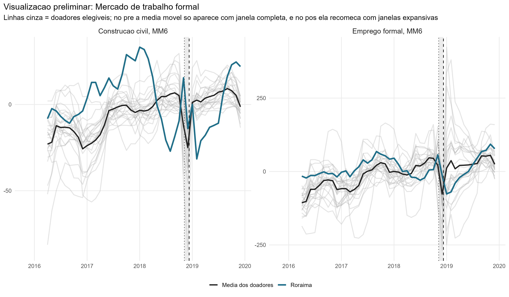

### Consumo das familias

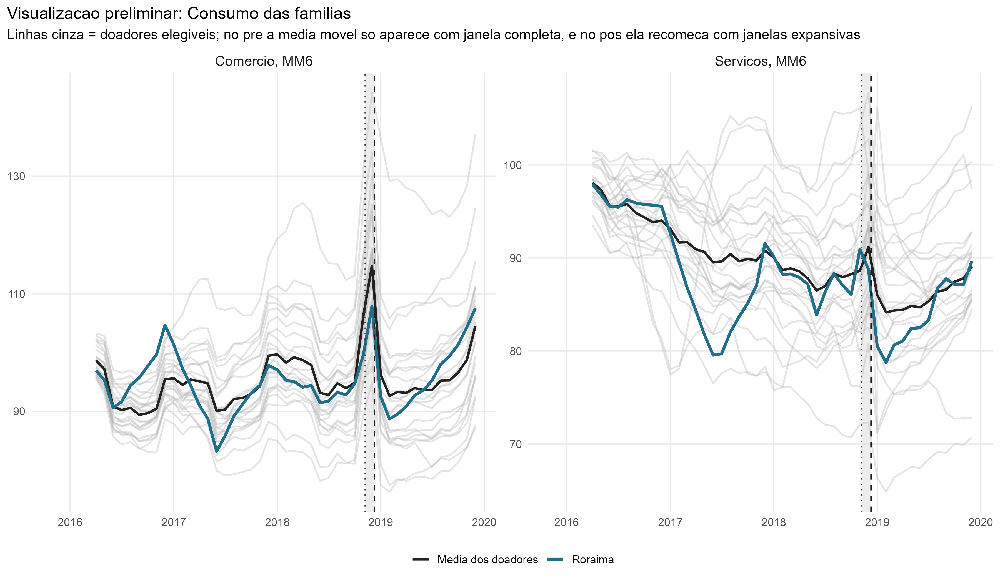

### Financas publicas estaduais

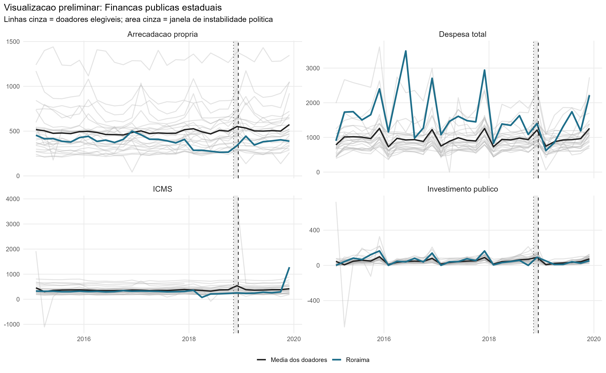

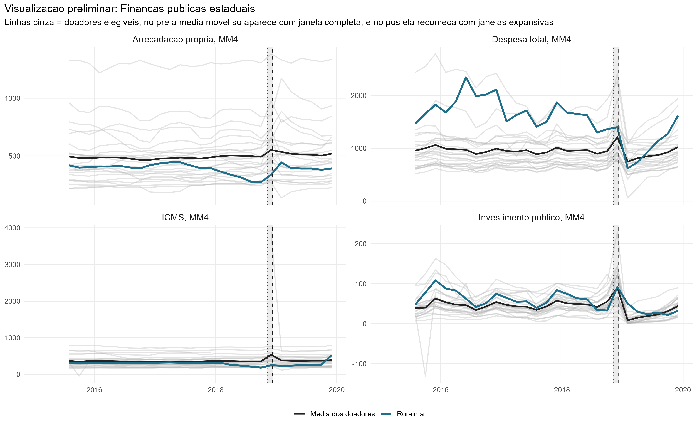

## Resultados principais: Augmented SCM

A tabela resume os resultados para as especificacoes suavizadas, que reduzem volatilidade mensal/bimestral e seguem a regra do V3: janela completa no pre e janela expansiva no pos.

Nas especificacoes suavizadas, a coluna de crise politica pode ficar vazia porque a janela entre instabilidade e queda efetiva e curta demais para sustentar uma serie suavizada informativa. Nesses casos, a leitura da transicao imediata deve privilegiar os graficos brutos.

| Canal | Variavel | Gap medio crise | Gap medio pos | RMSPE pre | RMSPE pos | Doadores |
| --- | --- | --- | --- | --- | --- | --- |
| Mercado de trabalho formal | Emprego formal, MM6 |     74.77 |  -14.23 |  4.52 |  57.84 | 24 |
| Mercado de trabalho formal | Construcao civil, MM6 |    -39.19 |   -6.71 |  3.40 |  19.41 | 24 |
| Consumo das familias | Comercio, MM6 |      7.48 |   11.34 |  0.54 |  12.17 | 24 |
| Consumo das familias | Servicos, MM6 |      3.40 |    3.60 |  0.40 |   4.02 | 24 |
| Financas publicas estaduais | ICMS, MM4 |   -557.05 |  -65.20 |  0.52 | 123.82 | 24 |
| Financas publicas estaduais | Arrecadacao propria, MM4 |   -307.70 |  -19.56 |  3.25 |  40.95 | 24 |
| Financas publicas estaduais | Investimento publico, MM4 |    -34.07 |    8.39 |  1.96 |  24.98 | 24 |
| Financas publicas estaduais | Despesa total, MM4 | -1,058.81 | -223.10 | 87.27 | 313.27 | 24 |

Como leitura preliminar, a interpretacao deve privilegiar tres elementos: a qualidade do ajuste pre-tratamento, medida pelo RMSPE pre; o sinal e tamanho do gap durante a crise politica; e a persistencia do gap no periodo posterior a queda/intervencao.

### Mercado de trabalho formal

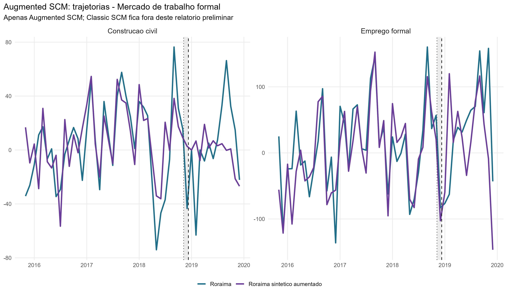

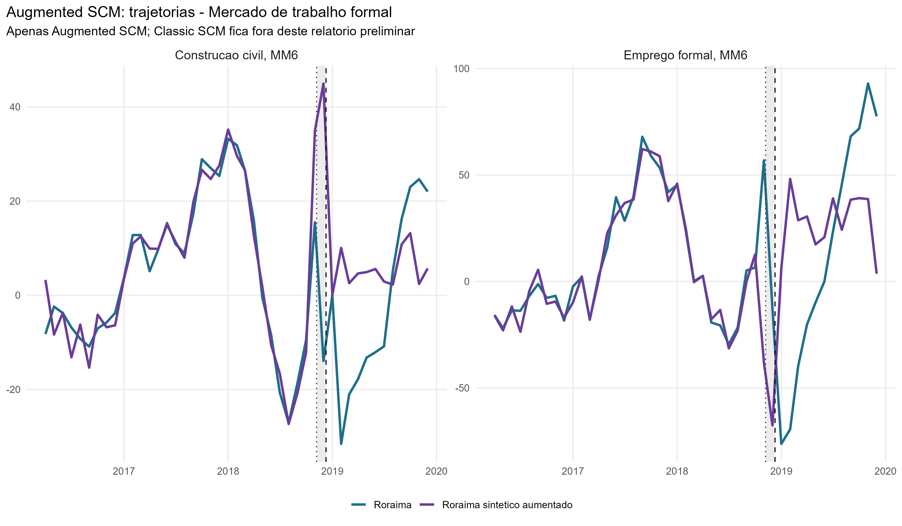

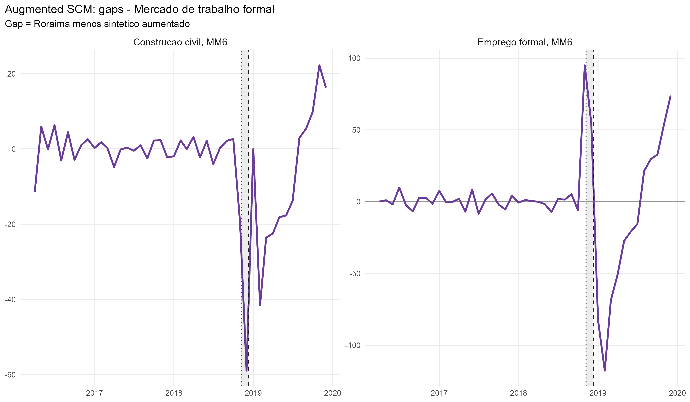

No canal de mercado de trabalho formal, o saldo agregado e o saldo da construcao civil capturam duas margens complementares do emprego com carteira. O primeiro resume a dinamica formal do mercado de trabalho estadual. O segundo observa uma margem setorial mais ciclica e sensivel a mudancas de atividade e expectativas. A especificacao suavizada e especialmente relevante porque ambas as series podem ter alta volatilidade de curto prazo.

### Consumo das familias

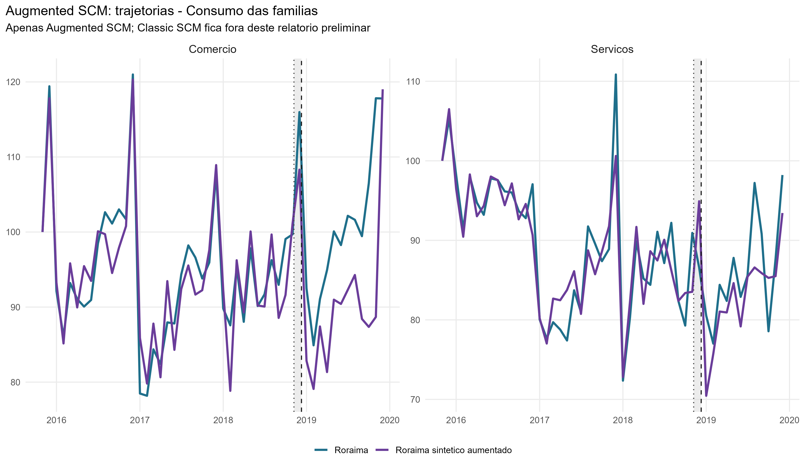

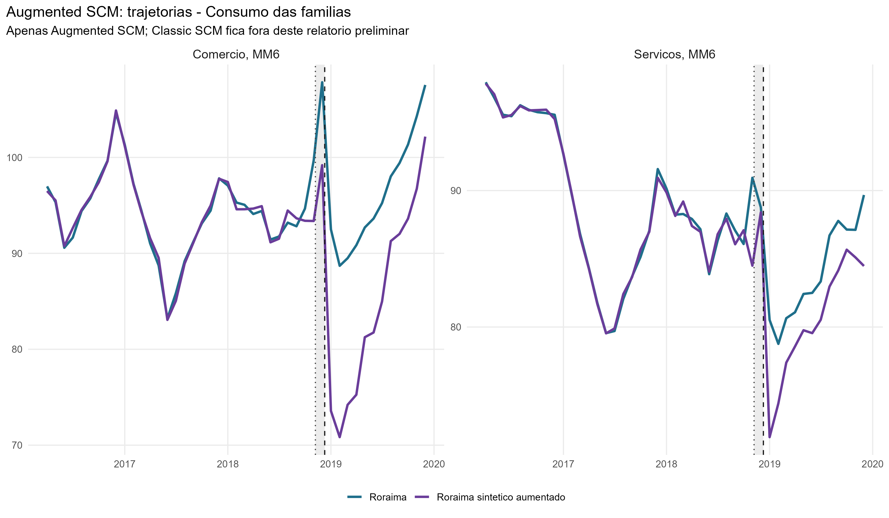

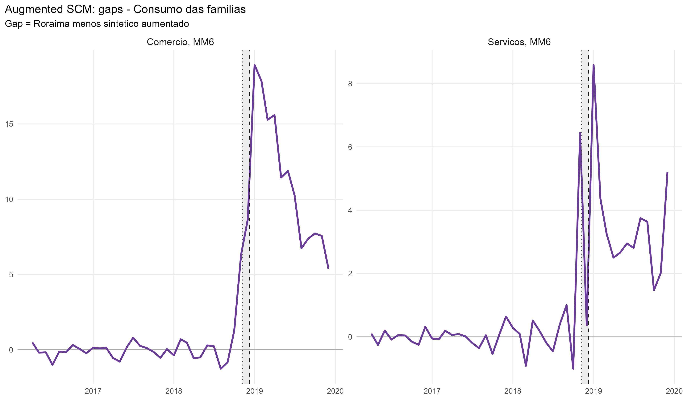

O canal de consumo e observado por comercio varejista e servicos, ambos reancorados em 100 no inicio da janela do piloto. A leitura conjunta e importante porque familias podem ajustar consumo de bens e servicos de forma diferente em resposta a incerteza politica, perda de renda esperada ou mudancas no funcionamento do setor publico local.

### Financas publicas estaduais

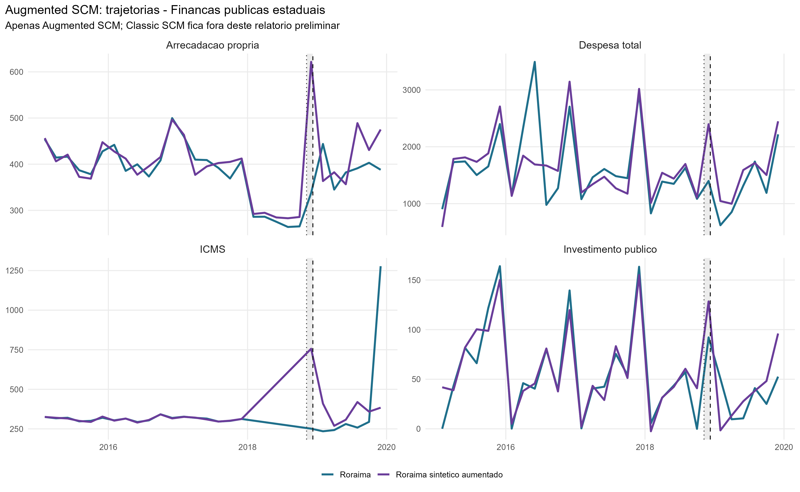

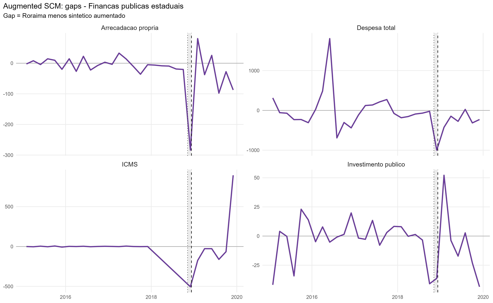

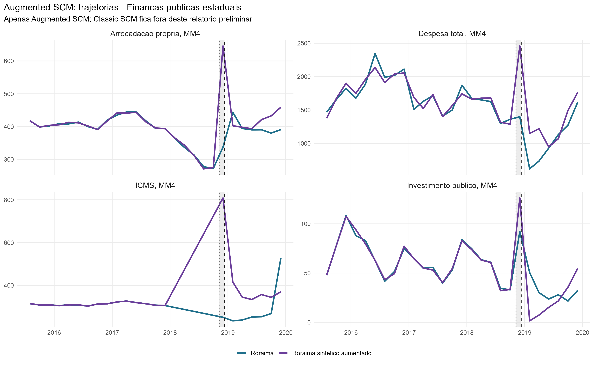

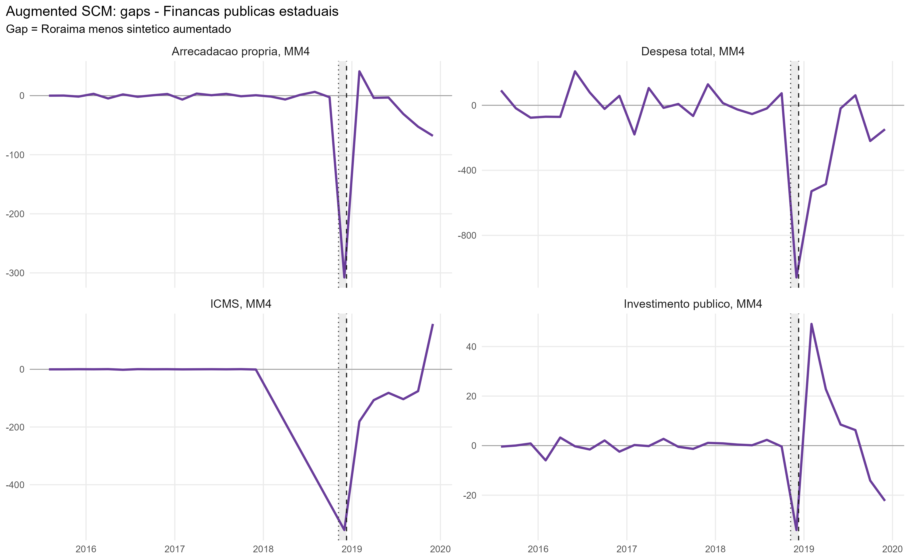

No canal de financas publicas estaduais, o subbloco de receitas combina arrecadacao propria e ICMS para observar a margem tributaria do estado. O subbloco de despesas combina investimento publico liquidado e despesa total liquidada para observar escala de gasto e compressao de investimento. As duas series exigem cautela adicional porque passaram por reparo de lacunas no Siconfi/RREO; por isso devem ser lidas junto das auditorias de dados e dos resultados de robustez.

### Resumo grafico dos efeitos

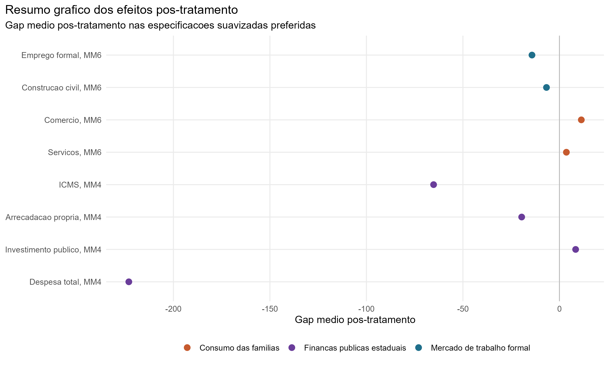

## Pesos dos doadores

As figuras de pesos ajudam a avaliar a plausibilidade do contrafactual. Pesos muito concentrados podem indicar que poucos estados sao responsaveis pela aproximacao de Roraima; pesos mais dispersos sugerem uma composicao mais diversificada, embora a qualidade substantiva dependa tambem do ajuste pre-tratamento.

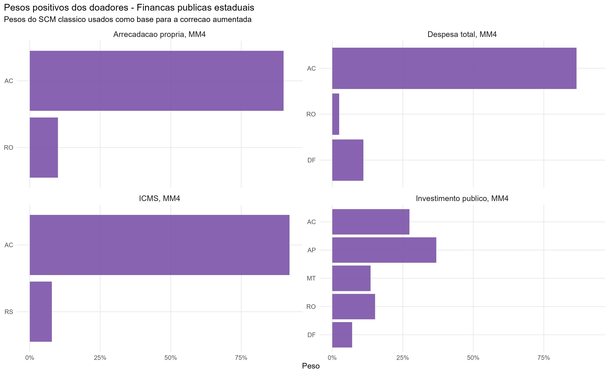

## Robustez

A primeira checagem de robustez compara especificacoes brutas e suavizadas. As series brutas preservam choques de curtissimo prazo, mas podem exagerar ruido operacional, sazonalidade residual e irregularidades administrativas. As series suavizadas reduzem esse ruido e sao, por ora, a especificacao preferida para leitura substantiva.

Resultados brutos:

| Canal | Variavel | Gap medio crise | Gap medio pos | RMSPE pre | RMSPE pos | Doadores |
| --- | --- | --- | --- | --- | --- | --- |
| Mercado de trabalho formal | Emprego formal |   28.16 |   19.83 |  38.92 |  83.60 | 24 |
| Mercado de trabalho formal | Construcao civil |  -19.89 |    6.09 |  22.44 |  33.48 | 24 |
| Consumo das familias | Comercio |    3.11 |   10.41 |   3.60 |  12.78 | 24 |
| Consumo das familias | Servicos |   -0.46 |    3.25 |   3.23 |   5.40 | 24 |
| Financas publicas estaduais | ICMS | -504.90 |   73.15 |   3.31 | 378.88 | 24 |
| Financas publicas estaduais | Arrecadacao propria | -283.87 |  -24.01 |  16.74 |  66.40 | 24 |
| Financas publicas estaduais | Investimento publico |  -36.28 |   -5.43 |  16.48 |  30.16 | 24 |
| Financas publicas estaduais | Despesa total | -998.10 | -227.58 | 457.06 | 267.72 | 24 |

Resultados suavizados:

| Canal | Variavel | Gap medio crise | Gap medio pos | RMSPE pre | RMSPE pos | Doadores |
| --- | --- | --- | --- | --- | --- | --- |
| Mercado de trabalho formal | Emprego formal, MM6 |     74.77 |  -14.23 |  4.52 |  57.84 | 24 |
| Mercado de trabalho formal | Construcao civil, MM6 |    -39.19 |   -6.71 |  3.40 |  19.41 | 24 |
| Consumo das familias | Comercio, MM6 |      7.48 |   11.34 |  0.54 |  12.17 | 24 |
| Consumo das familias | Servicos, MM6 |      3.40 |    3.60 |  0.40 |   4.02 | 24 |
| Financas publicas estaduais | ICMS, MM4 |   -557.05 |  -65.20 |  0.52 | 123.82 | 24 |
| Financas publicas estaduais | Arrecadacao propria, MM4 |   -307.70 |  -19.56 |  3.25 |  40.95 | 24 |
| Financas publicas estaduais | Investimento publico, MM4 |    -34.07 |    8.39 |  1.96 |  24.98 | 24 |
| Financas publicas estaduais | Despesa total, MM4 | -1,058.81 | -223.10 | 87.27 | 313.27 | 24 |

A segunda checagem e a separacao explicita entre janela de crise politica e periodo pos-queda. Isso evita tratar o evento como um unico ponto instantaneo e permite avaliar se efeitos aparecem durante a instabilidade, depois da remocao efetiva, ou em ambos os momentos. Essa distincao e substantivamente importante porque processos legislativos ou judiciais podem afetar expectativas antes da troca formal de comando.

A terceira checagem e a leitura do ajuste pre-tratamento. Resultados com RMSPE pre muito alto devem receber menor peso interpretativo, pois o contrafactual e menos crivel. Nos proximos ciclos, tambem faz sentido acrescentar janelas alternativas de pre-tratamento e excluir doadores de alta influencia para checar sensibilidade dos pesos.

## Placebos in-space

Os placebos in-space reestimam o Augmented SCM tratando cada estado elegivel do pool principal como se tivesse recebido o tratamento, mantendo Roraima como a unidade efetivamente tratada. `AM` e `TO` nao entram como placebos porque tambem foram excluidos do pool principal. Para os estados placebo, Roraima permanece fora do conjunto de doadores. Os gaps sao normalizados pelo RMSPE pre-tratamento da propria unidade placebo:

\[
g^{norm}_{it} = \frac{Y_{it} - \widehat{Y}^{ASCM}_{it}}{RMSPE^{pre}_i}.
\]

Essa normalizacao torna comparaveis unidades com escalas diferentes. O teste nao e uma inferencia randomizada formal, mas fornece uma avaliacao visual e ordinal: se Roraima estiver entre os maiores desvios pos-tratamento em relacao aos placebos, o resultado e mais consistente com um efeito excepcional do evento.

| Canal | Variavel | Razao RMSPE pos/pre | p RMSPE | p gap absoluto | Placebos |
| --- | --- | --- | --- | --- | --- |
| Mercado de trabalho formal | Construcao civil, MM6 |  4.07 | 0.360 | 0.600 | 24 |
| Mercado de trabalho formal | Emprego formal, MM6 |  8.95 | 0.120 | 0.240 | 24 |
| Financas publicas estaduais | ICMS, MM4 | 21.49 | 0.320 | 0.760 | 24 |
| Financas publicas estaduais | Despesa total, MM4 |  7.30 | 0.760 | 0.080 | 24 |
| Financas publicas estaduais | Investimento publico, MM4 |  7.92 | 0.440 | 0.560 | 24 |
| Consumo das familias | Comercio, MM6 | 15.53 | 0.520 | 0.240 | 24 |
| Consumo das familias | Servicos, MM6 |  8.29 | 0.520 | 0.520 | 24 |
| Financas publicas estaduais | Arrecadacao propria, MM4 | 16.44 | 0.360 | 0.320 | 24 |

### Placebos por canal

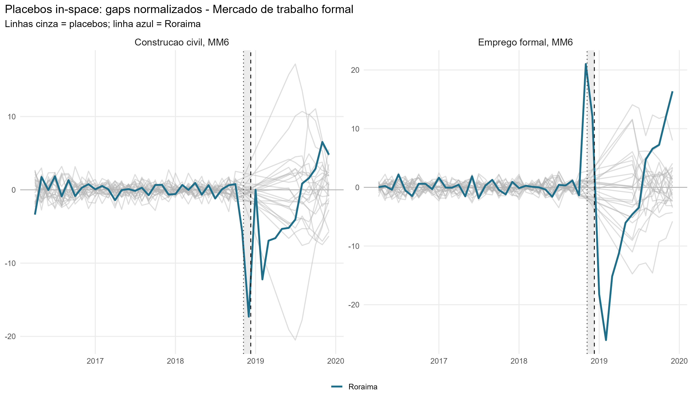

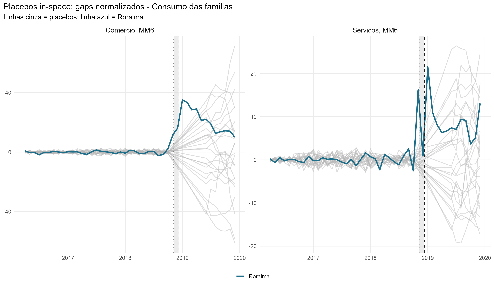

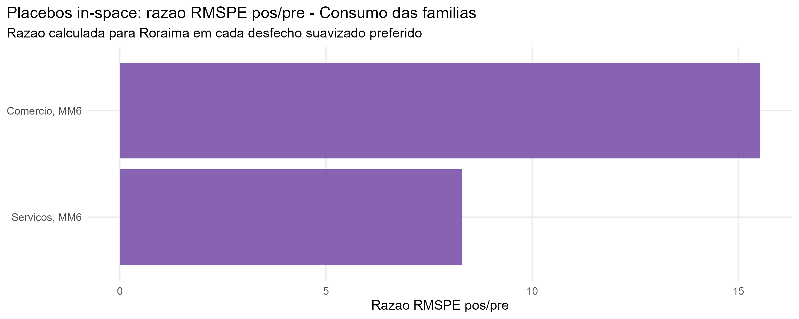

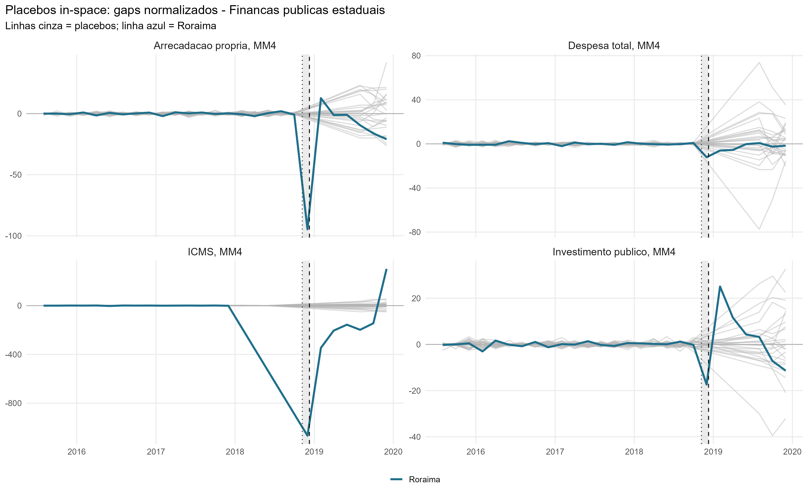

## Limitacoes atuais

- O ICMS do Anexo 06 e reportado como receita realizada acumulada; o fluxo bimestral usado no piloto e derivado por diferenca dentro de cada ano.
- O investimento publico liquidado e a despesa total liquidada passaram por reparo de lacunas e devem ser acompanhados por suas tabelas de auditoria no apendice.
- Os placebos foram gerados e salvos em tabelas separadas; este script reaproveita esses resultados para evitar recalculo desnecessario.
- Este documento e uma consolidacao preliminar do piloto de Roraima, nao a versao final da secao de resultados do artigo.

## Arquivos gerados

- `report/tables/augmented_effects_by_outcome.csv`
- `report/tables/top_donor_weights_by_outcome.csv`
- `report/tables/placebo_rank_actual_rr.csv`
- `report/tables/rr_2018_icms_revenue_audit.csv`
- `report/tables/rr_liquidated_expenditure_total_audit.csv`
- `report/figures/`
