# RR 2018-01 V5: clean pilot rebuild

Generated on 2026-06-04.

This pilot was rebuilt from scratch for the Roraima 2018 case. The objective is to keep the empirical design transparent and publication-oriented: no inherited outputs, no copied folder tree, and one explicit smoothing rule for every smoothed outcome.

## Event design

- Treated state: `RR`.
- Instability start: `2018-11-07`.
- Effective removal/intervention: `2018-12-10`.
- Monthly coding: pre through 2018-10, crisis in 2018-11 and 2018-12, post from 2019-01 onward.
- Bimonthly coding: pre through 2018B5, crisis in 2018B6, post from 2019B1 onward.

## V5 smoothing rule

- Pre-treatment: moving averages use complete trailing windows through the final pre-treatment period.
- Crisis and post-treatment: the moving average restarts at the break and expands from 1, 2, 3 observations until the full window is reached.
- Monthly outcomes use a 6-month window.
- Bimonthly fiscal outcomes use a 4-bimester window.

## Outcome blocks

- Formal labor market: formal hiring balance per 100k working-age population; construction hiring balance per 100k working-age population.
- Household consumption: retail volume index; services volume index.
- State public finances, revenues: own tax revenue per capita; ICMS revenue per capita.
- State public finances, expenditures: public investment per capita; total liquidated expenditure per capita.

## Donor pool rule

- Exclude the treated state.
- Exclude any state with a coded rupture in the main pilot estimation window.
- For RR 2018-01, this excludes `RR`, `AM`, and `TO` in the main donor pool.

## Preliminary plots

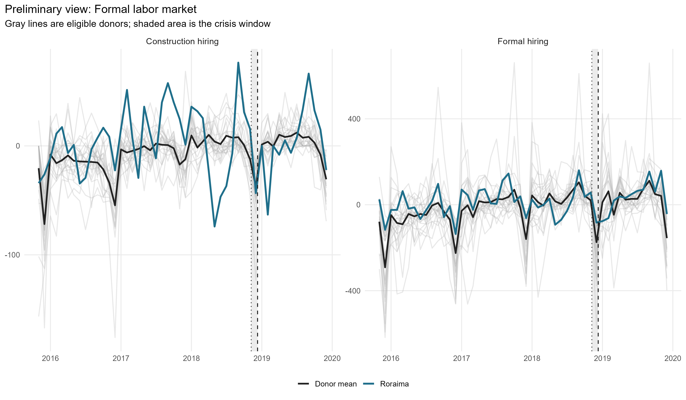

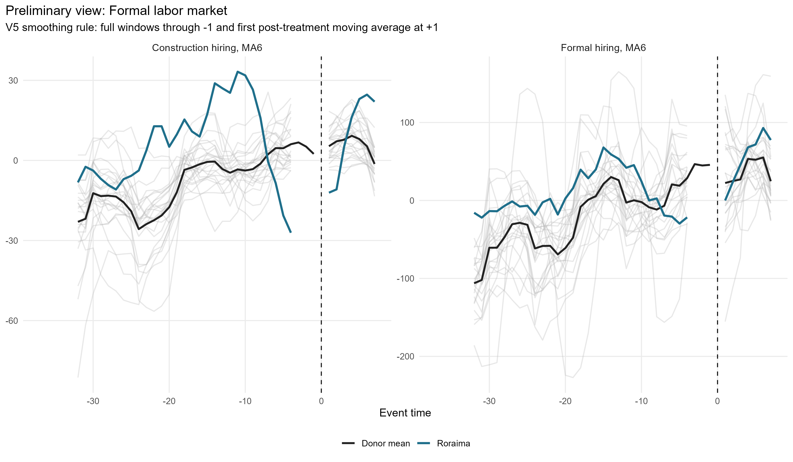

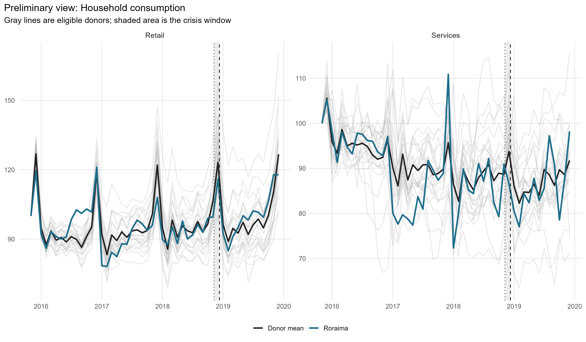

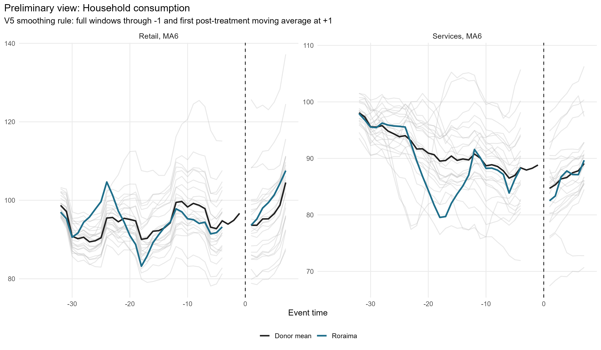

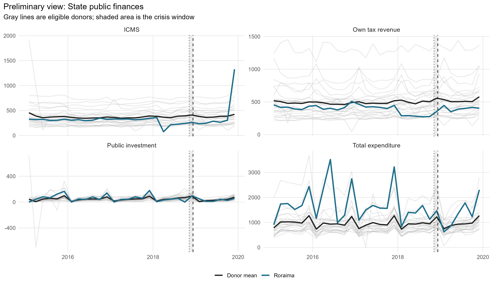

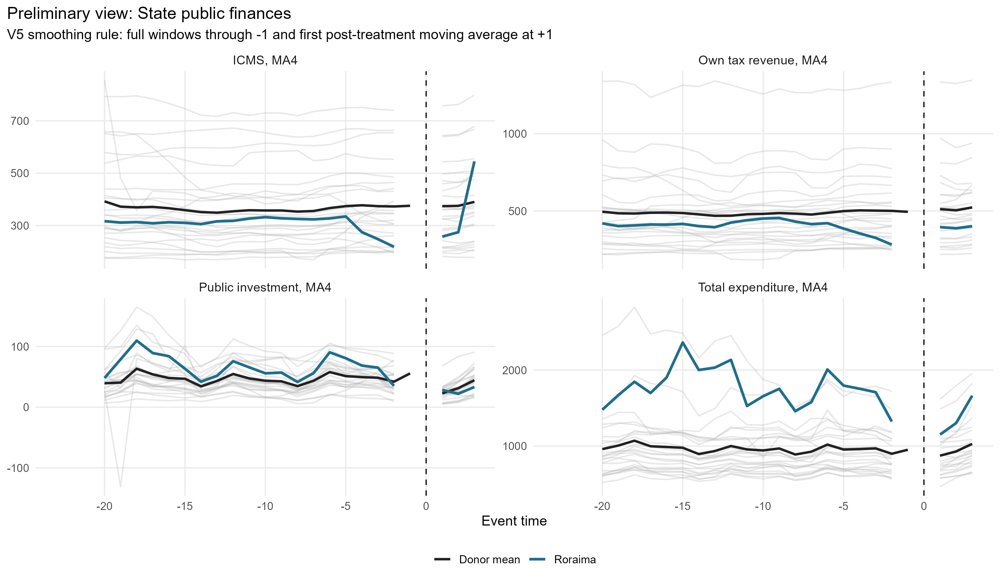

## Preferred smoothed results

| Channel | Outcome | Mean gap crisis | Mean gap post | RMSPE pre | RMSPE post | Donors |
| --- | --- | --- | --- | --- | --- | --- |
| Formal labor market | Formal hiring balance per 100k working-age population, MA6 V5 |      7.18 |   19.43 |  3.57 |  30.83 | 24 |
| Formal labor market | Construction hiring balance per 100k working-age population, MA6 V5 |    -38.49 |   -8.68 |  3.43 |  19.37 | 24 |
| Household consumption | Retail volume index, MA6 V5 |      6.24 |    8.80 |  0.54 |   9.29 | 24 |
| Household consumption | Services volume index, MA6 V5 |      3.51 |    3.82 |  0.37 |   4.22 | 24 |
| State public finances | Own tax revenue, real per capita, MA4 V5 |   -314.34 |  -26.17 |  3.68 |  43.00 | 24 |
| State public finances | ICMS revenue, real per capita, MA4 V5 |   -340.11 |  -59.80 |  0.61 | 125.30 | 24 |
| State public finances | Public investment, liquidated, real per capita, MA4 V5 |    -36.15 |    8.46 |  3.37 |  24.89 | 24 |
| State public finances | Total liquidated expenditure, real per capita, MA4 V5 | -1,071.25 | -296.76 | 96.48 | 338.98 | 24 |

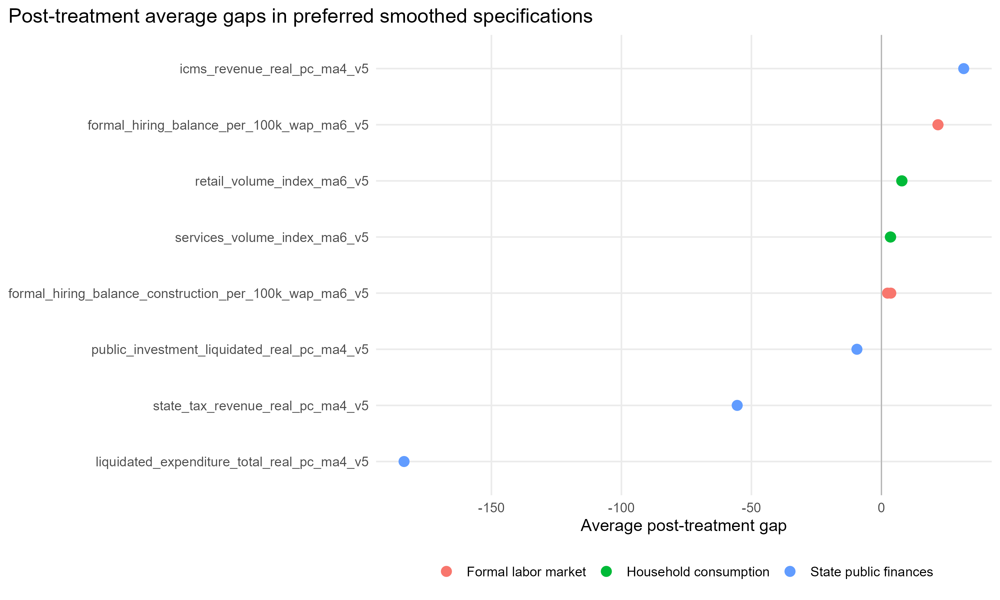

## Augmented SCM paths

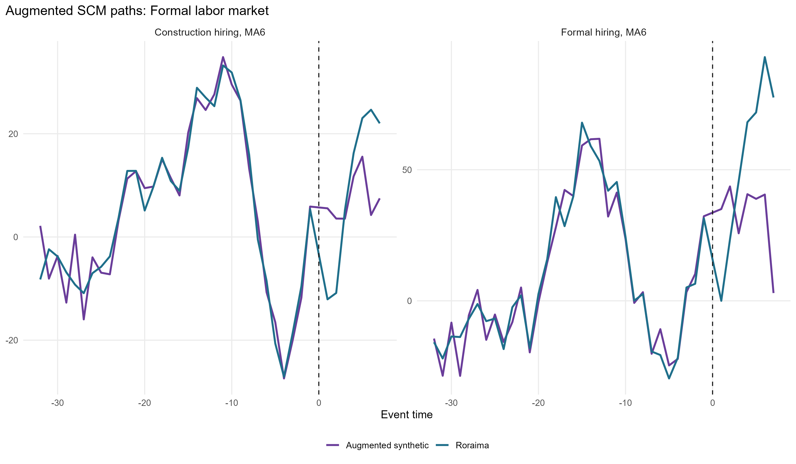

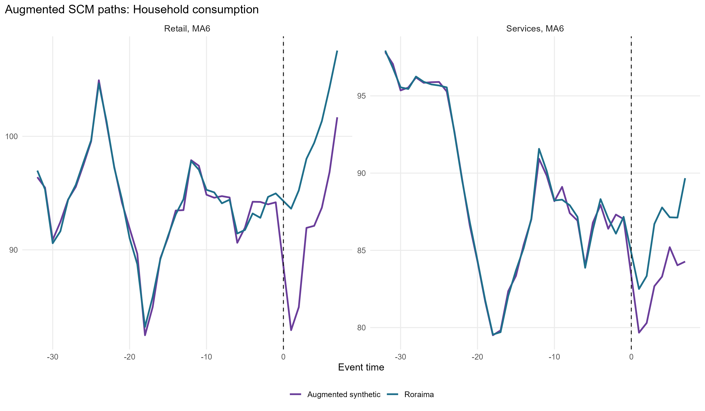

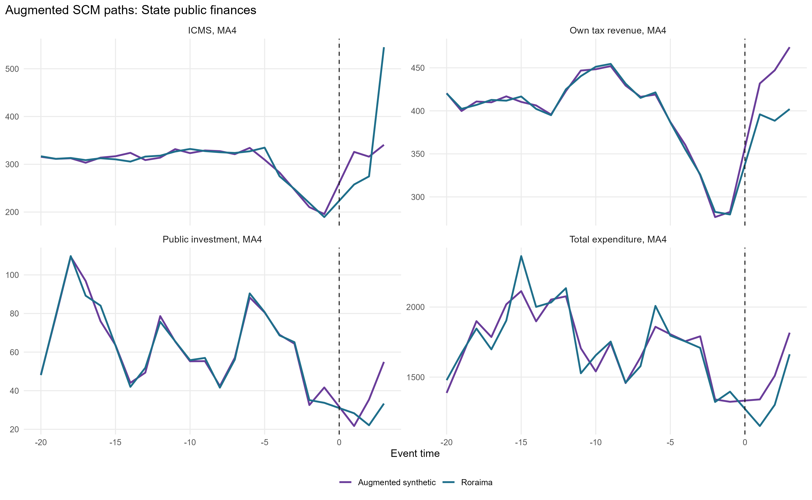

## Augmented SCM gaps

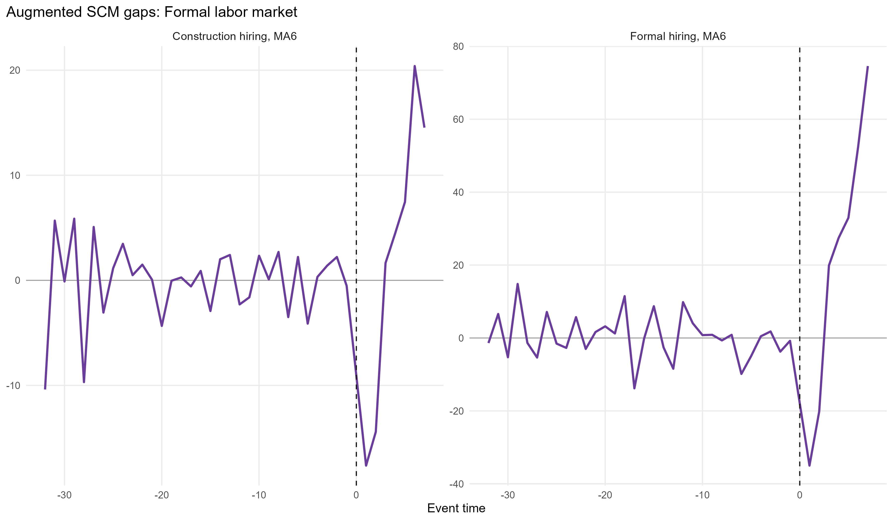

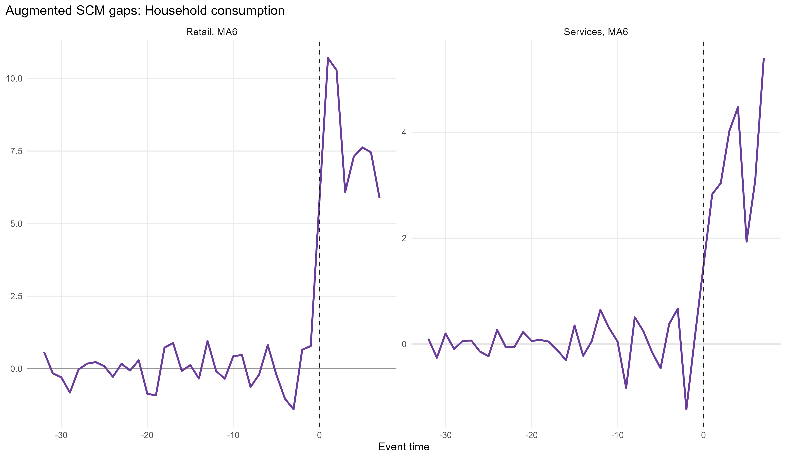

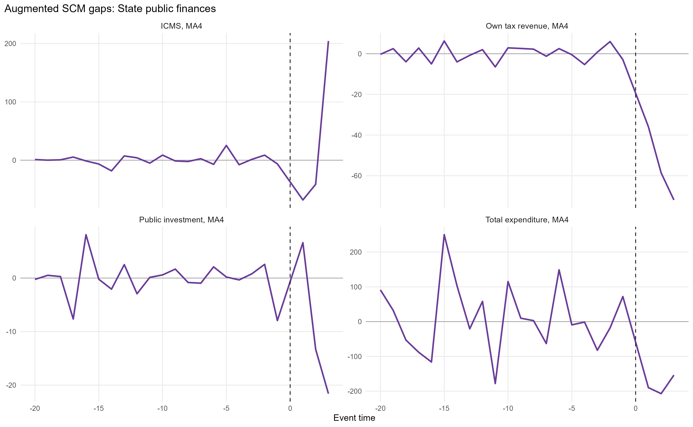

## Donor weights

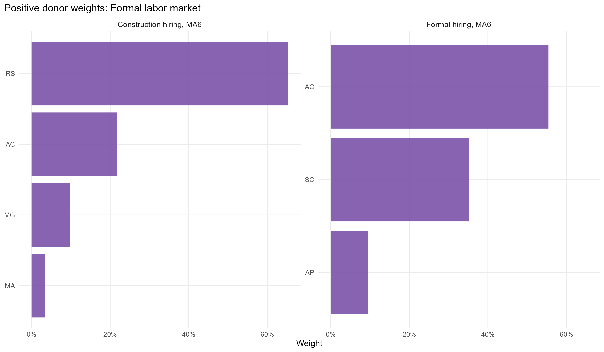

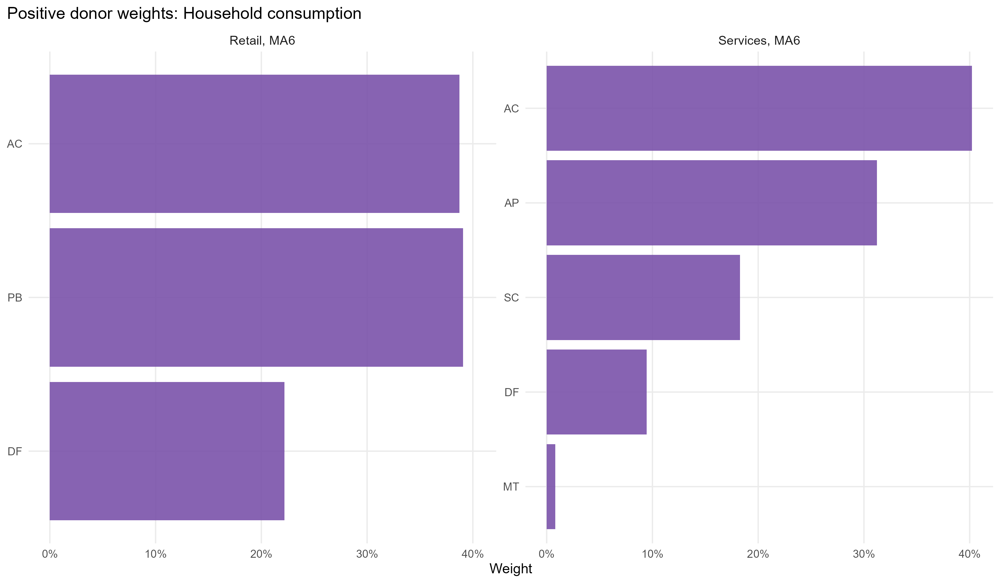

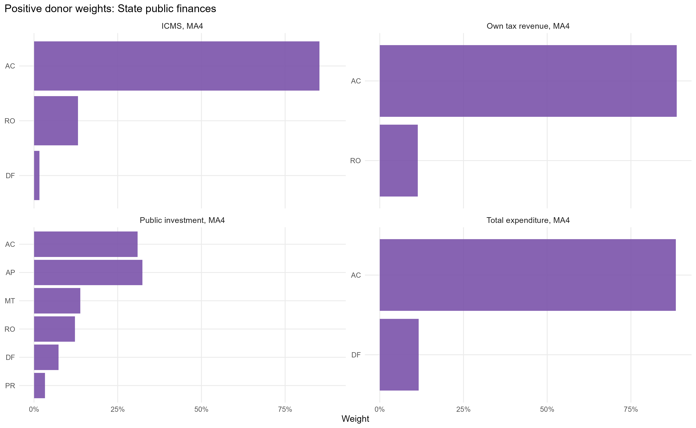

## Audit tables

- ICMS audit: `report/tables/rr_2018_01_v5_icms_audit.csv`.
- Total expenditure audit: `report/tables/rr_2018_01_v5_total_expenditure_audit.csv`.

## Scope note

This V5 pilot prioritizes clean reconstruction and internal consistency. It does not yet bundle placebo inference into the reporting layer. That step should come after the current specification is fully stabilized.

