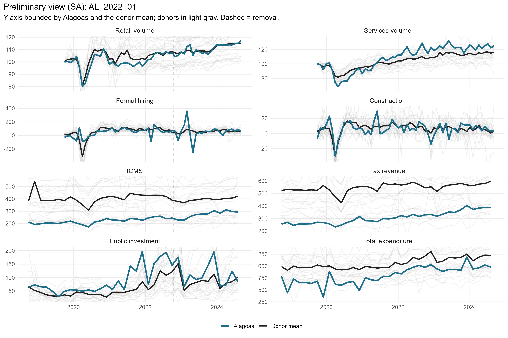
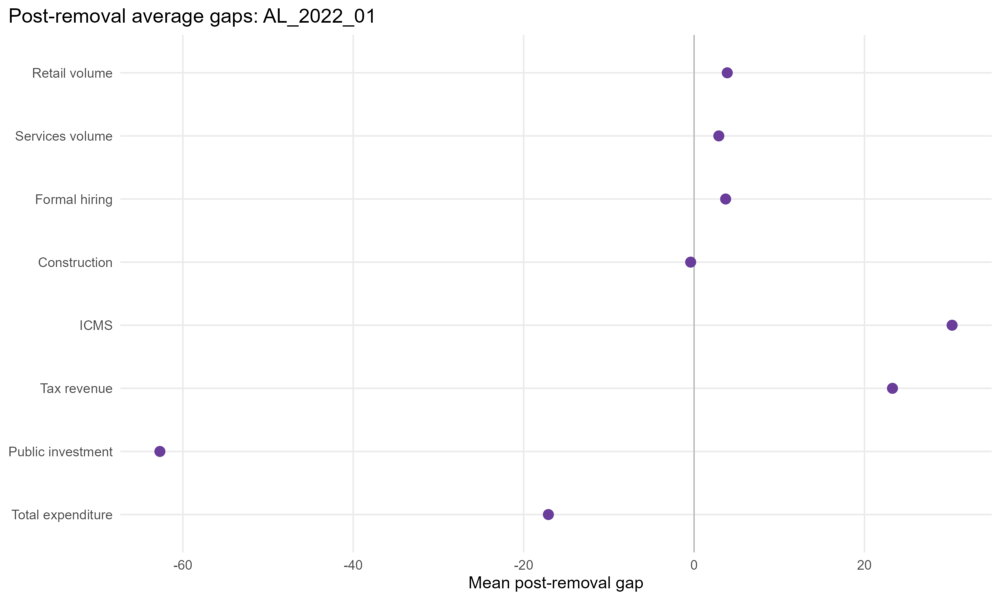
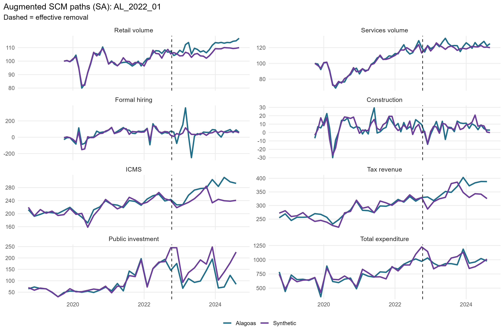
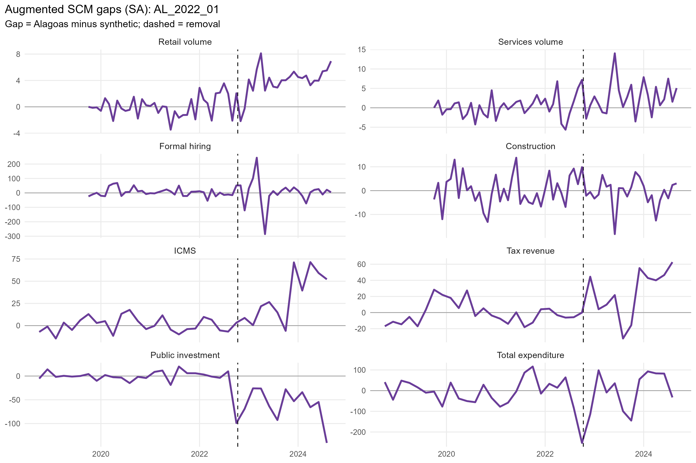
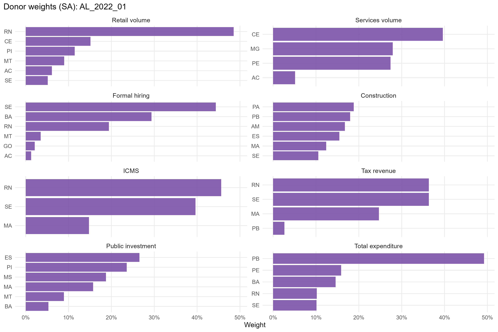
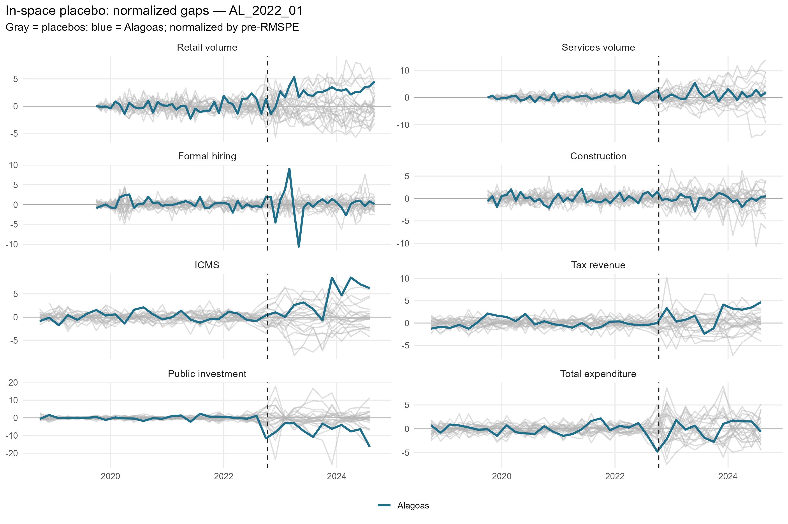
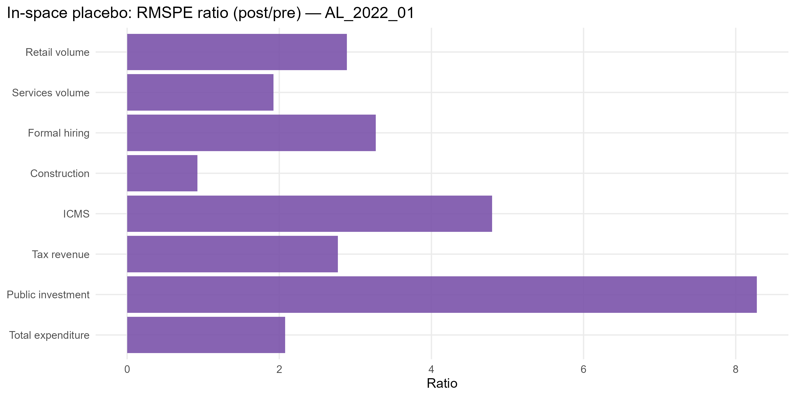

# AL_2022_01 results report (siconfi regime)

Generated on 2026-06-06.

Treated state: `AL` (Alagoas). Treatment (single accountability cut): effective removal `2022-10-11`.
Data regime: **siconfi**. Fiscal outcomes (ICMS, tax revenue, public investment, total expenditure) are bimonthly from SICONFI/RREO (STL). Non-fiscal outcomes (retail, services, formal hiring, construction) are monthly (X-13).

## Window design

- Monthly outcomes: target 36-month pre (floor 20), 24-month post.
- Bimonthly (SICONFI) outcomes: target 24-bimester pre (floor 21), 12-bimester post.
- An outcome enters only if the treated unit meets its pre-window floor and a complete post-window.

Qualifying outcomes: Retail volume, Services volume, Formal hiring, Construction, ICMS, Tax revenue, Public investment, Total expenditure.

## Methodological strategy

Main donor pool excludes `AL`, `RJ`, `RR`, `SC`, `TO` (any state treated anywhere in the SCM window). Preferred specification uses 22 eligible donors. Augmented SCM is the headline estimator; weights are estimated on the pre-treatment window. Predictors: the full pre-treatment outcome path plus the regime covariates: PNADc labor covariates (unemployment, formalization, labor income) plus SICONFI transfer dependency and health/education/public-security expenditure per capita.

## Preliminary plots

## Covariate and pre-treatment balance

### Pre-treatment outcome fit

| Outcome | Treated | Synthetic | RMSPE pre | Pre periods |
| --- | --- | --- | --- | --- |
| Retail volume | 100.23 | 100.21 | 1.53 | 36 |
| Services volume | 99.31 | 99.17 | 2.57 | 36 |
| Formal hiring | 43.79 | 39.55 | 26.96 | 36 |
| Construction | 6.66 | 6.66 | 6.40 | 36 |
| ICMS | 218.76 | 218.03 | 8.40 | 24 |
| Tax revenue | 279.45 | 280.32 | 13.35 | 24 |
| Public investment | 85.52 | 84.79 | 8.57 | 24 |
| Total expenditure | 716.86 | 718.04 | 52.98 | 24 |

### Covariate balance (treated vs synthetic by outcome)

| Covariate | Treated | Retail volume | Services volume | Formal hiring | Construction | ICMS | Tax revenue | Public investment | Total expenditure |
| --- | --- | --- | --- | --- | --- | --- | --- | --- | --- |
| Unemployment rate |     0.142 |     0.118 |     0.113 |     0.137 |     0.115 |     0.132 |     0.130 |     0.099 |     0.128 |
| Formalization rate |     0.535 |     0.512 |     0.518 |     0.490 |     0.464 |     0.492 |     0.478 |     0.525 |     0.488 |
| Labor income (real) | 2,135.720 | 2,435.321 | 2,507.189 | 2,391.969 | 2,440.704 | 2,327.156 | 2,261.308 | 2,654.065 | 2,338.791 |
| Transfer dependency ratio |     0.257 |     0.228 |     0.154 |     0.227 |     0.217 |     0.260 |     0.264 |     0.197 |     0.223 |
| Health expenditure pc |   102.459 |   117.395 |   116.133 |   126.686 |   129.762 |   112.988 |   109.322 |   128.678 |   106.887 |
| Education expenditure pc |    75.090 |   122.973 |   106.937 |   108.634 |   127.252 |   102.384 |   101.461 |   117.525 |   110.008 |
| Public security expenditure pc |    87.756 |    82.067 |   101.896 |    89.705 |    88.079 |    81.268 |    78.981 |    83.361 |    76.484 |

## Main results: Augmented SCM (SA)

| Channel | Outcome | Mean gap post | RMSPE pre | RMSPE post | Donors | Freq |
| --- | --- | --- | --- | --- | --- | --- |
| Household consumption | Retail volume index (PMC) |   3.89 |  1.53 |   4.41 | 22 | monthly |
| Household consumption | Services volume index (PMS) |   2.90 |  2.57 |   4.95 | 22 | monthly |
| Formal labor market | Formal hiring balance per 100k pop |   3.70 | 26.96 |  88.16 | 22 | monthly |
| Formal labor market | Construction hiring balance per 100k pop |  -0.40 |  6.40 |   5.91 | 22 | monthly |
| State public finances | ICMS revenue, real per capita (SICONFI) |  30.28 |  8.40 |  40.30 | 21 | bimonthly |
| State public finances | Own tax revenue, real per capita (SICONFI) |  23.28 | 13.35 |  36.98 | 22 | bimonthly |
| State public finances | Public investment, real per capita (SICONFI) | -62.69 |  8.57 |  70.94 | 22 | bimonthly |
| State public finances | Total liquidated expenditure, real per capita (SICONFI) | -17.10 | 52.98 | 109.97 | 22 | bimonthly |

## Donor weights

## In-space placebos

Each eligible donor is treated as pseudo-treated; p = share of placebos with a post/pre RMSPE ratio (or absolute post gap) at least as large as the treated unit's.

| Outcome | RMSPE ratio (post/pre) | p (ratio) | p (abs gap) | Placebos |
| --- | --- | --- | --- | --- |
| Retail volume | 2.89 | 0.273 | 0.500 | 22 |
| Services volume | 1.92 | 0.682 | 0.818 | 22 |
| Formal hiring | 3.27 | 0.000 | 1.000 | 22 |
| Construction | 0.92 | 0.955 | 1.000 | 22 |
| ICMS | 4.80 | 0.000 | 0.545 | 22 |
| Tax revenue | 2.77 | 0.273 | 1.000 | 22 |
| Public investment | 8.28 | 0.045 | 0.000 | 22 |
| Total expenditure | 2.08 | 0.682 | 1.000 | 22 |

## Leave-one-out donor placebo

| Outcome | Gap post | LOO rank | p (2-sided) |
| --- | --- | --- | --- |
| Retail volume | 3.89 | 2 / 23 | 0.087 |
| Services volume | 2.9 | 1 / 23 | 0.043 |
| Formal hiring | 3.7 | 22 / 23 | 0.087 |
| Construction | -0.4 | 23 / 23 | 0.043 |
| ICMS | 30.28 | 21 / 22 | 0.091 |
| Tax revenue | 23.28 | 23 / 23 | 0.043 |
| Public investment | -62.69 | 1 / 23 | 0.043 |
| Total expenditure | -17.1 | 1 / 23 | 0.043 |

## Evidence classification (5-criterion AugSCM ruler)

We do not rely on placebo p-value thresholds alone. Each outcome is graded on five criteria — (C1) pre-treatment fit (treated pre-RMSPE vs the donor median, no pre-trend), (C2) substantive magnitude (post gap >= 1 pre-period SD), (C3) persistence (share of post periods keeping the gap's sign), (C4) placebo position (discrete rank/N p <= 0.15), (C5) robustness (>= 80% of leave-one-out variants keep the sign) — into a 0-5 score. Pre-fit is a hard gate: a poor pre-fit makes the effect *non-interpretable* regardless of the rest. Tiers: **strong** (5/5), **moderate** (>=4 with placebo), **suggestive** (>=3 with magnitude or placebo), **weak**, **non-interpretable**. A *considerable* effect is strong/moderate/suggestive.

Considerable effects for this event: **2** of 8 outcomes.

| Outcome | Tier | Score | % effect | Mag (pre-SD) | Persist | Pre-fit | Placebo rank | p (rank/N) | LOO sign |
| --- | --- | --- | --- | --- | --- | --- | --- | --- | --- |
| Retail volume | weak | 3/5 |   3.7 | 0.61 | 0.92 | A | 7/23 | 0.304 | 1.00 |
| Services volume | non-interpretable | 2/5 |   2.4 | 0.19 | 0.79 | C | 16/23 | 0.696 | 1.00 |
| Formal hiring | non-interpretable | 3/5 |   7.1 | 0.06 | 0.67 | C | 1/23 | 0.043 | 0.91 |
| Construction | non-interpretable | 1/5 |  -7.2 | 0.04 | 0.46 | C | 22/23 | 0.957 | 1.00 |
| ICMS | strong | 5/5 |  12.5 | 1.39 | 0.92 | A | 1/23 | 0.043 | 1.00 |
| Tax revenue | weak | 2/5 |   6.9 | 0.85 | 0.75 | A | 7/23 | 0.304 | 0.77 |
| Public investment | strong | 5/5 | -35.3 | 1.25 | 1.00 | B | 2/23 | 0.087 | 1.00 |
| Total expenditure | weak | 1/5 |  -1.7 | 0.11 | 0.50 | B | 16/23 | 0.696 | 0.00 |

Note: placebo-based inference in synthetic control is discrete and low-resolution with few donors (here the finest p is ~1/N). Results with p slightly above conventional thresholds but a high placebo rank, good pre-fit, substantive magnitude and persistence are read as *suggestive* evidence, not as conventional statistical significance.

