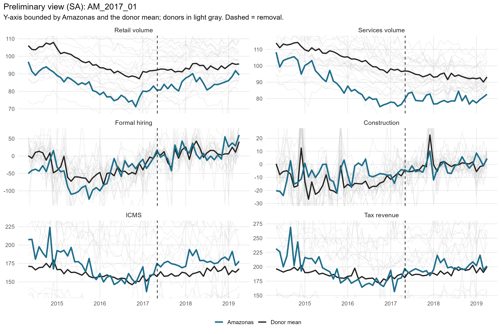
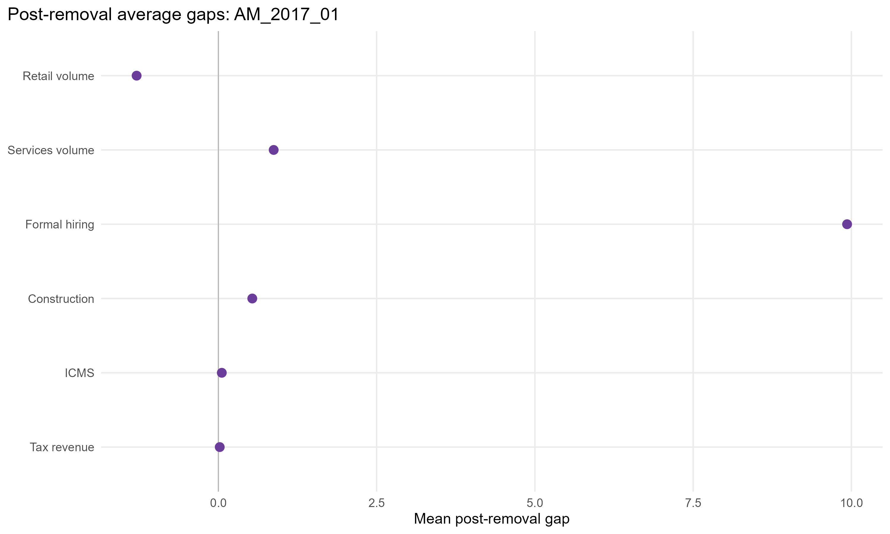
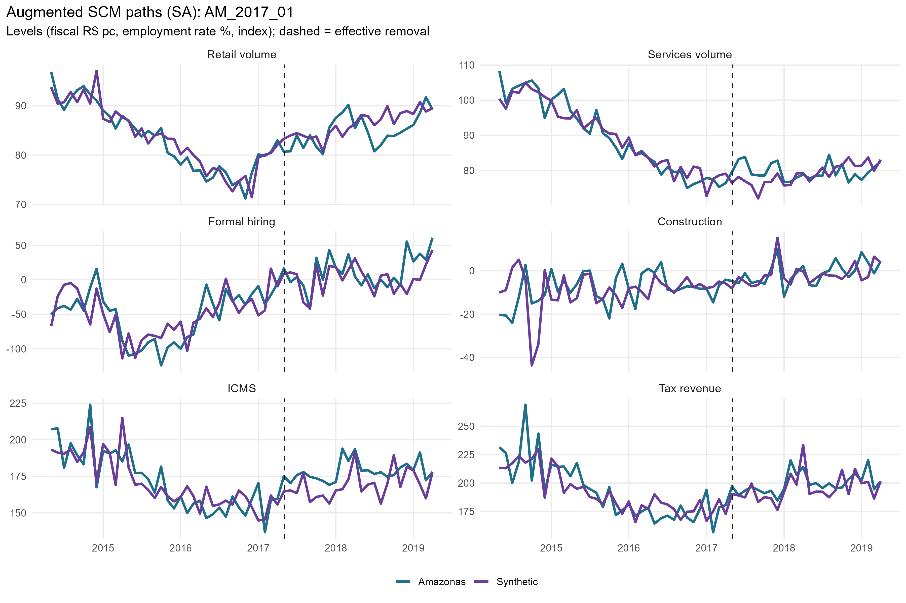
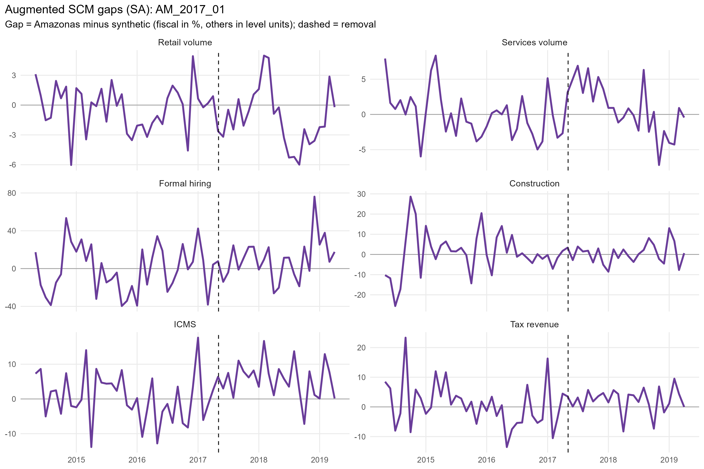
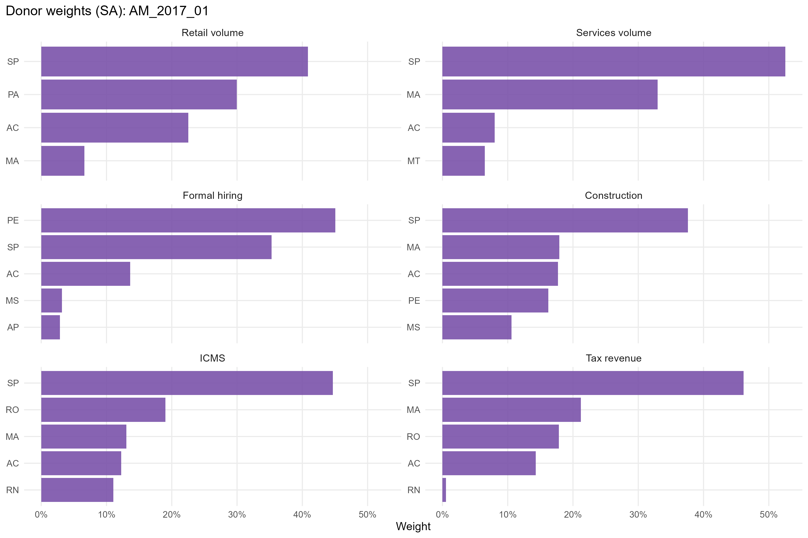
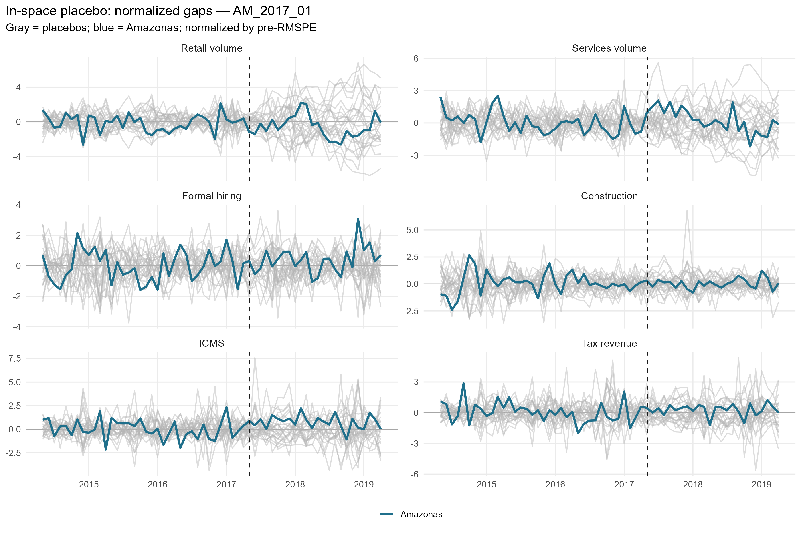
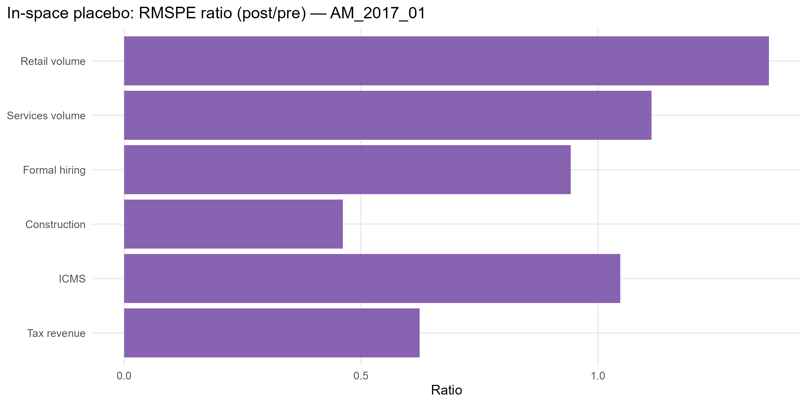

# AM_2017_01 results report (confaz regime)

Generated on 2026-06-07.

Treated state: `AM` (Amazonas). Treatment (single accountability cut): effective removal `2017-05-04`.
Data regime: **confaz**. All outcomes are monthly (X-13); fiscal outcomes (ICMS, tax revenue) are from CONFAZ.

## Window design

- Monthly outcomes: target 36-month pre (floor 20), 24-month post.
- An outcome enters only if the treated unit meets its pre-window floor and a complete post-window.

Qualifying outcomes: Retail volume, Services volume, Formal hiring, Construction, ICMS, Tax revenue.

## Methodological strategy

Main donor pool excludes `AM`, `RR`, `TO` (any state treated anywhere in the SCM window). Preferred specification uses 24 eligible donors. Augmented SCM is the headline estimator; weights are estimated on the pre-treatment window. Predictors: the full pre-treatment outcome path plus the regime covariates: CONFAZ ICMS sectors (secondary, tertiary, energy, fuels) plus FPE and IOF-state, real per capita.

## Preliminary plots

## Covariate and pre-treatment balance

### Pre-treatment outcome fit

| Outcome | Treated | Synthetic | RMSPE pre | Pre periods |
| --- | --- | --- | --- | --- |
| Retail volume | 83.22 | 83.48 | 2.29 | 36 |
| Services volume | 89.68 | 89.73 | 3.32 | 36 |
| Formal hiring | -51.64 | -50.60 | 24.87 | 36 |
| Construction | -8.26 | -9.15 | 10.71 | 36 |
| ICMS | 5.14 | 5.14 | 0.07 | 36 |
| Tax revenue | 5.25 | 5.25 | 0.07 | 36 |

### Covariate balance (treated vs synthetic by outcome)

| Covariate | Treated | Retail volume | Services volume | Formal hiring | Construction | ICMS | Tax revenue |
| --- | --- | --- | --- | --- | --- | --- | --- |
| ICMS secondary VA pc | 51.463 | 42.963 | 50.964 | 39.605 | 39.409 | 45.383 | 45.079 |
| ICMS tertiary VA pc | 83.627 | 76.315 | 68.413 | 76.662 | 77.666 | 79.709 | 78.965 |
| ICMS energy VA pc |  4.517 | 10.652 | 12.257 | 11.617 | 10.988 | 11.122 | 10.878 |
| ICMS fuels VA pc | 20.509 | 19.374 | 22.972 | 21.341 | 23.667 | 21.272 | 21.984 |
| FPE transfer pc | 37.524 | 65.757 | 37.788 | 54.979 | 57.842 | 56.824 | 58.336 |
| IOF-state pc |  0.001 |  0.004 |  0.002 |  0.001 |  0.000 |  0.003 |  0.003 |

## Main results: Augmented SCM (SA)

| Channel | Outcome | Mean gap post | RMSPE pre | RMSPE post | Donors | Freq |
| --- | --- | --- | --- | --- | --- | --- |
| Household consumption | Retail volume index (PMC, SA level) | -1.29 |  2.29 |  3.12 | 24 | monthly |
| Household consumption | Services volume index (PMS, SA level) |  0.87 |  3.32 |  3.70 | 24 | monthly |
| Formal labor market | Formal hiring balance per 100k pop |  9.93 | 24.87 | 23.45 | 24 | monthly |
| Formal labor market | Construction hiring balance per 100k pop |  0.54 | 10.71 |  4.94 | 24 | monthly |
| State public finances | ICMS value added, log real per capita (CONFAZ) |  0.05 |  0.07 |  0.07 | 24 | monthly |
| State public finances | Tax revenue value added, log real per capita (CONFAZ) |  0.02 |  0.07 |  0.05 | 24 | monthly |

## Donor weights

## In-space placebos

Each eligible donor is treated as pseudo-treated; p = share of placebos with a post/pre RMSPE ratio (or absolute post gap) at least as large as the treated unit's.

| Outcome | RMSPE ratio (post/pre) | p (ratio) | p (abs gap) | Placebos |
| --- | --- | --- | --- | --- |
| Retail volume | 1.36 | 0.792 | 0.917 | 24 |
| Services volume | 1.11 | 0.667 | 1.000 | 24 |
| Formal hiring | 0.94 | 0.500 | 1.000 | 24 |
| Construction | 0.46 | 0.958 | 1.000 | 24 |
| ICMS | 1.05 | 0.625 | 0.625 | 24 |
| Tax revenue | 0.62 | 0.917 | 1.000 | 24 |

## Leave-one-out donor placebo

| Outcome | Gap post | LOO rank | p (2-sided) |
| --- | --- | --- | --- |
| Retail volume | -1.29 | 23 / 25 | 0.12 |
| Services volume | 0.87 | 25 / 25 | 0.04 |
| Formal hiring | 9.93 | 25 / 25 | 0.04 |
| Construction | 0.54 | 20 / 25 | 0.24 |
| ICMS | 0.05 | 2 / 25 | 0.08 |
| Tax revenue | 0.02 | 2 / 25 | 0.08 |

## Evidence classification (5-criterion AugSCM ruler)

We do not rely on placebo p-value thresholds alone. Each outcome is graded on five criteria — (C1) pre-treatment fit (treated pre-RMSPE vs the donor median, no pre-trend), (C2) substantive magnitude (post gap >= 1 pre-period SD), (C3) persistence (share of post periods keeping the gap's sign), (C4) placebo position (discrete rank/N p <= 0.15), (C5) robustness (>= 80% of leave-one-out variants keep the sign) — into a 0-5 score. Pre-fit is a hard gate: a poor pre-fit makes the effect *non-interpretable* regardless of the rest. Tiers: **strong** (5/5), **moderate** (>=4 with placebo), **suggestive** (>=3 with magnitude or placebo), **weak**, **non-interpretable**. A *considerable* effect is strong/moderate/suggestive.

Considerable effects for this event: **0** of 6 outcomes.

| Outcome | Tier | Score | Effect | Mag (pre-SD) | Persist | Pre-fit | Placebo rank | p (rank/N) | LOO sign |
| --- | --- | --- | --- | --- | --- | --- | --- | --- | --- |
| Retail volume | weak | 3/5 | -1.5% | 0.19 | 0.75 | C | 20/25 | 0.800 | 0.96 |
| Services volume | non-interpretable | 0/5 | +1.1% | 0.08 | 0.58 | C | 17/25 | 0.680 | 0.00 |
| Formal hiring | weak | 3/5 | +9.9 | 0.28 | 0.62 | B | 13/25 | 0.520 | 1.00 |
| Construction | weak | 2/5 | +0.5 | 0.07 | 0.58 | B | 24/25 | 0.960 | 0.92 |
| ICMS | weak | 3/5 | +5.6% | 0.46 | 0.96 | B | 16/25 | 0.640 | 1.00 |
| Tax revenue | non-interpretable | 2/5 | +2.2% | 0.17 | 0.79 | C | 23/25 | 0.920 | 0.96 |

Note: placebo-based inference in synthetic control is discrete and low-resolution with few donors (here the finest p is ~1/N). Results with p slightly above conventional thresholds but a high placebo rank, good pre-fit, substantive magnitude and persistence are read as *suggestive* evidence, not as conventional statistical significance.

