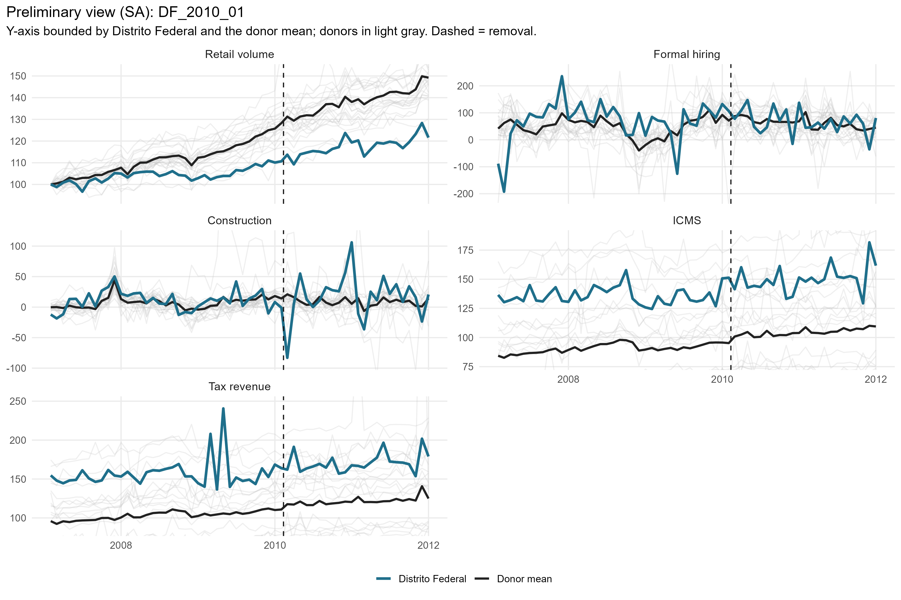
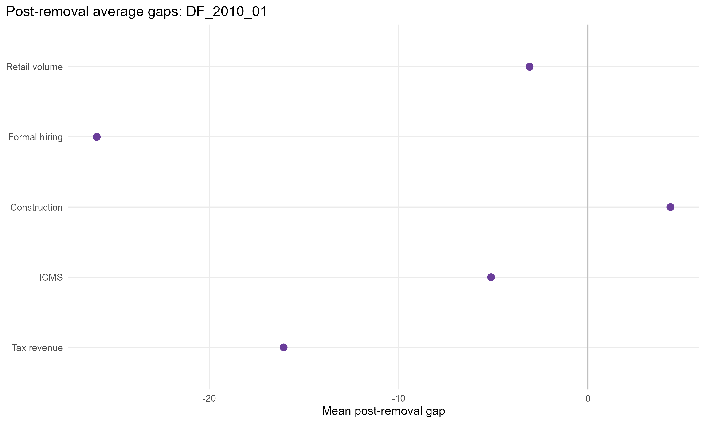
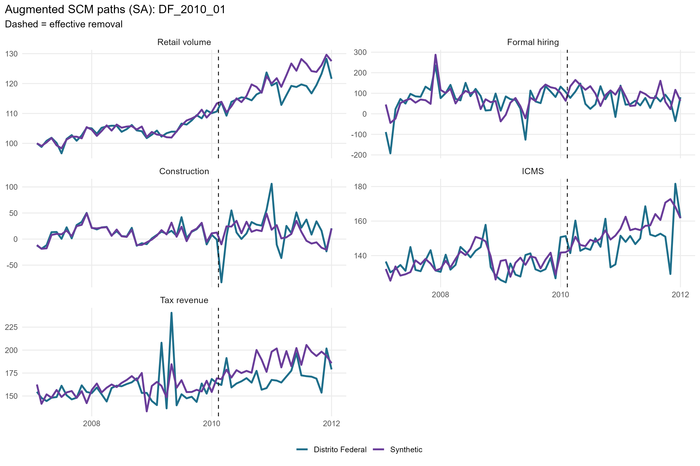
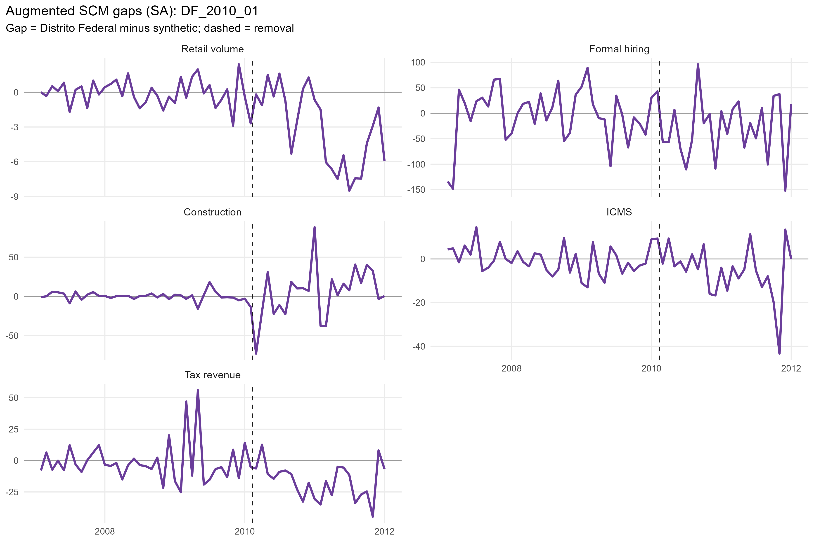
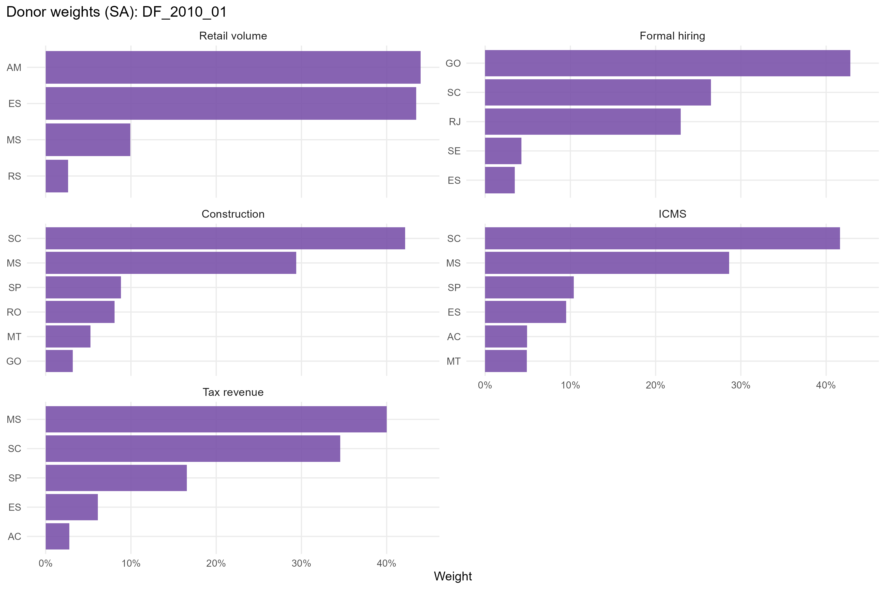
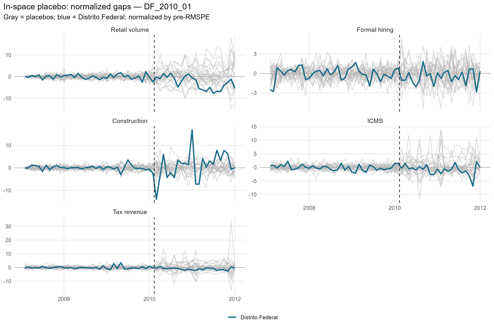
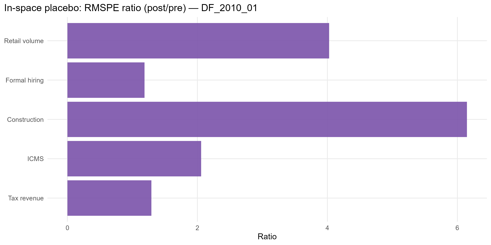

# DF_2010_01 results report (confaz regime)

Generated on 2026-06-06.

Treated state: `DF` (Distrito Federal). Treatment (single accountability cut): effective removal `2010-02-11`.
Data regime: **confaz**. All outcomes are monthly (X-13); fiscal outcomes (ICMS, tax revenue) are from CONFAZ.

## Window design

- Monthly outcomes: target 36-month pre (floor 20), 24-month post.
- An outcome enters only if the treated unit meets its pre-window floor and a complete post-window.

Qualifying outcomes: Retail volume, Formal hiring, Construction, ICMS, Tax revenue.

## Methodological strategy

Main donor pool excludes `DF`, `MA`, `PB`, `TO` (any state treated anywhere in the SCM window). Preferred specification uses 23 eligible donors. Augmented SCM is the headline estimator; weights are estimated on the pre-treatment window. Predictors: the full pre-treatment outcome path plus the regime covariates: CONFAZ ICMS sectors (secondary, tertiary, energy, fuels) plus FPE and IOF-state, real per capita.

## Preliminary plots

## Covariate and pre-treatment balance

### Pre-treatment outcome fit

| Outcome | Treated | Synthetic | RMSPE pre | Pre periods |
| --- | --- | --- | --- | --- |
| Retail volume | 104.09 | 104.10 | 1.09 | 36 |
| Formal hiring | 68.50 | 71.29 | 53.08 | 36 |
| Construction | 10.82 | 10.31 | 5.21 | 36 |
| ICMS | 135.84 | 136.40 | 6.29 | 36 |
| Tax revenue | 156.85 | 157.97 | 16.33 | 36 |

### Covariate balance (treated vs synthetic by outcome)

| Covariate | Treated | Retail volume | Formal hiring | Construction | ICMS | Tax revenue |
| --- | --- | --- | --- | --- | --- | --- |
| ICMS secondary VA pc | 21.587 | 31.182 | 20.951 | 18.562 | 21.017 | 21.029 |
| ICMS tertiary VA pc | 58.378 | 48.867 | 33.873 | 42.939 | 47.119 | 46.609 |
| ICMS energy VA pc |  9.521 |  6.861 |  9.873 |  8.856 |  9.176 |  8.885 |
| ICMS fuels VA pc | 25.926 | 16.096 | 16.370 | 22.607 | 21.753 | 23.147 |
| FPE transfer pc |  7.273 | 15.934 |  9.961 | 12.034 | 14.979 | 12.080 |
| IOF-state pc |  0.000 |  0.000 |  0.000 |  0.001 |  0.000 |  0.000 |

## Main results: Augmented SCM (SA)

| Channel | Outcome | Mean gap post | RMSPE pre | RMSPE post | Donors | Freq |
| --- | --- | --- | --- | --- | --- | --- |
| Household consumption | Retail volume index (PMC) |  -3.08 |  1.09 |  4.41 | 23 | monthly |
| Formal labor market | Formal hiring balance per 100k pop | -25.94 | 53.08 | 62.97 | 23 | monthly |
| Formal labor market | Construction hiring balance per 100k pop |   4.36 |  5.21 | 32.04 | 23 | monthly |
| State public finances | ICMS value added, real per capita (CONFAZ) |  -5.12 |  6.29 | 12.94 | 23 | monthly |
| State public finances | Tax revenue value added, real per capita (CONFAZ) | -16.07 | 16.33 | 21.11 | 23 | monthly |

## Donor weights

## In-space placebos

Each eligible donor is treated as pseudo-treated; p = share of placebos with a post/pre RMSPE ratio (or absolute post gap) at least as large as the treated unit's.

| Outcome | RMSPE ratio (post/pre) | p (ratio) | p (abs gap) | Placebos |
| --- | --- | --- | --- | --- |
| Retail volume | 4.03 | 0.304 | 0.652 | 23 |
| Formal hiring | 1.19 | 0.870 | 0.696 | 23 |
| Construction | 6.15 | 0.000 | 1.000 | 23 |
| ICMS | 2.06 | 0.609 | 0.739 | 23 |
| Tax revenue | 1.29 | 1.000 | 0.261 | 23 |

## Leave-one-out donor placebo

| Outcome | Gap post | LOO rank | p (2-sided) |
| --- | --- | --- | --- |
| Retail volume | -3.08 | 24 / 24 | 0.042 |
| Formal hiring | -25.94 | 1 / 24 | 0.042 |
| Construction | 4.36 | 1 / 24 | 0.042 |
| ICMS | -5.12 | 2 / 24 | 0.083 |
| Tax revenue | -16.07 | 1 / 24 | 0.042 |

## Evidence classification (5-criterion AugSCM ruler)

We do not rely on placebo p-value thresholds alone. Each outcome is graded on five criteria — (C1) pre-treatment fit (treated pre-RMSPE vs the donor median, no pre-trend), (C2) substantive magnitude (post gap >= 1 pre-period SD), (C3) persistence (share of post periods keeping the gap's sign), (C4) placebo position (discrete rank/N p <= 0.15), (C5) robustness (>= 80% of leave-one-out variants keep the sign) — into a 0-5 score. Pre-fit is a hard gate: a poor pre-fit makes the effect *non-interpretable* regardless of the rest. Tiers: **strong** (5/5), **moderate** (>=4 with placebo), **suggestive** (>=3 with magnitude or placebo), **weak**, **non-interpretable**. A *considerable* effect is strong/moderate/suggestive.

Considerable effects for this event: **1** of 5 outcomes.

| Outcome | Tier | Score | % effect | Mag (pre-SD) | Persist | Pre-fit | Placebo rank | p (rank/N) | LOO sign |
| --- | --- | --- | --- | --- | --- | --- | --- | --- | --- |
| Retail volume | weak | 3/5 |  -2.6 | 1.00 | 0.83 | B | 8/24 | 0.333 | 1.00 |
| Formal hiring | non-interpretable | 1/5 | -27.5 | 0.34 | 0.58 | D | 21/24 | 0.875 | 1.00 |
| Construction | moderate | 4/5 |  35.0 | 0.28 | 0.62 | A | 1/24 | 0.042 | 1.00 |
| ICMS | non-interpretable | 2/5 |  -3.3 | 0.69 | 0.75 | C | 15/24 | 0.625 | 0.96 |
| Tax revenue | non-interpretable | 2/5 |  -8.6 | 0.85 | 0.92 | D | 24/24 | 1.000 | 1.00 |

Note: placebo-based inference in synthetic control is discrete and low-resolution with few donors (here the finest p is ~1/N). Results with p slightly above conventional thresholds but a high placebo rank, good pre-fit, substantive magnitude and persistence are read as *suggestive* evidence, not as conventional statistical significance.

