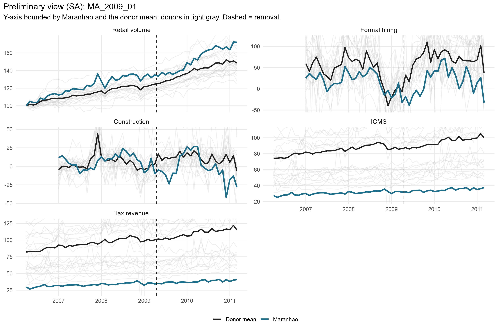
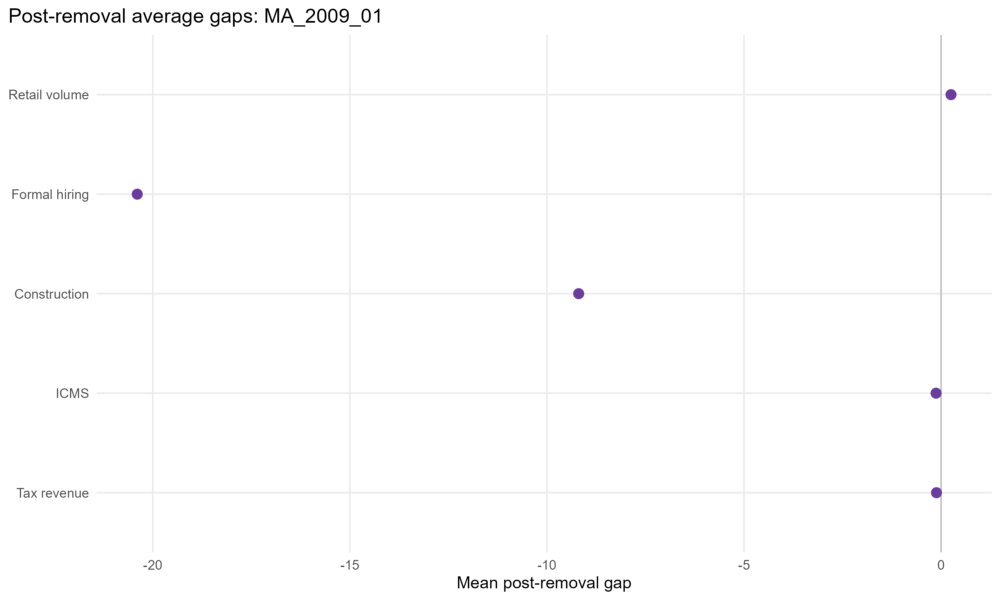
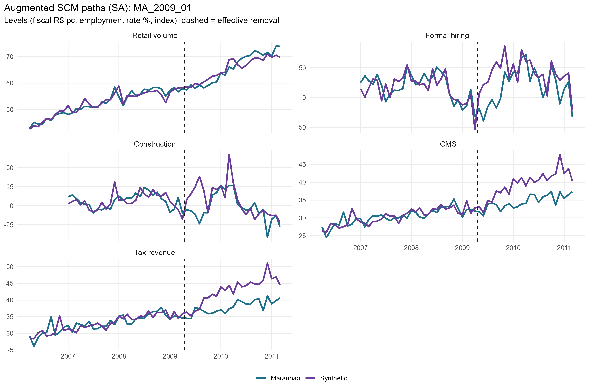
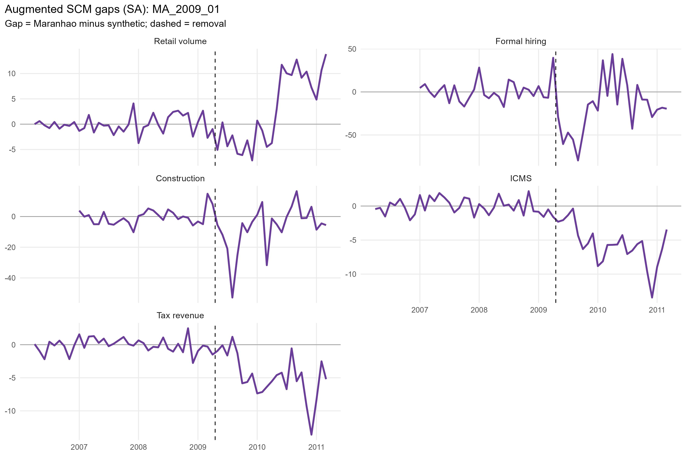
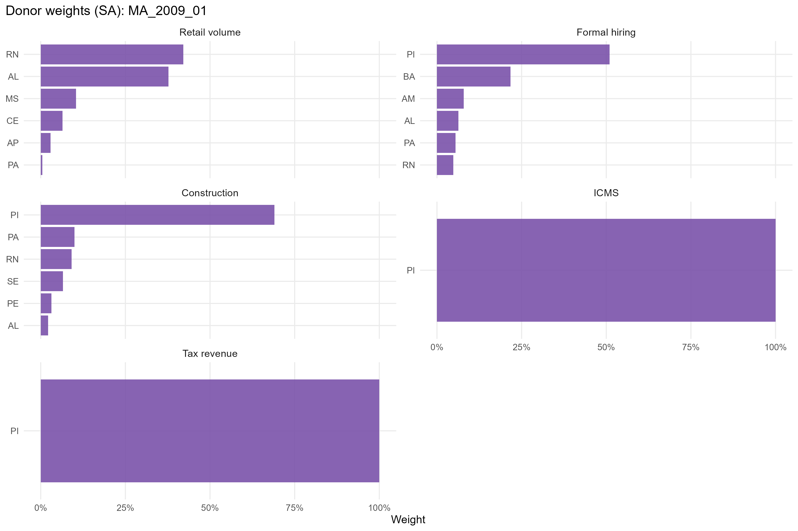
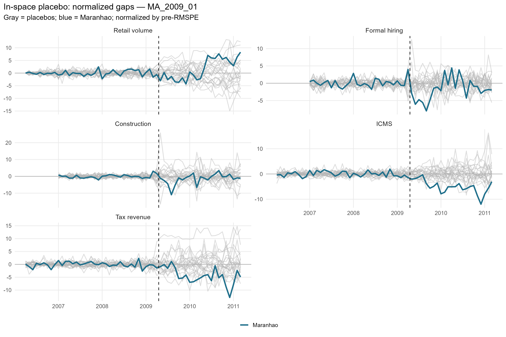
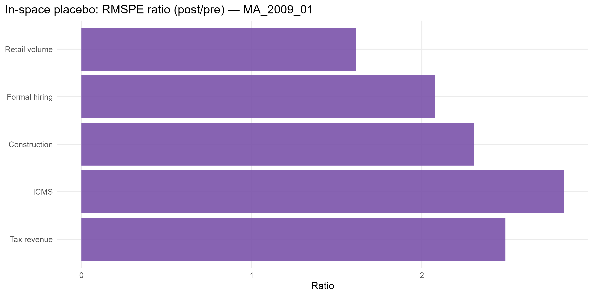

# MA_2009_01 results report (confaz regime)

Generated on 2026-06-07.

Treated state: `MA` (Maranhao). Treatment (single accountability cut): effective removal `2009-04-17`.
Data regime: **confaz**. All outcomes are monthly (X-13); fiscal outcomes (ICMS, tax revenue) are from CONFAZ.

## Window design

- Monthly outcomes: target 36-month pre (floor 20), 24-month post.
- An outcome enters only if the treated unit meets its pre-window floor and a complete post-window.

Qualifying outcomes: Retail volume, Formal hiring, Construction, ICMS, Tax revenue.

## Methodological strategy

Main donor pool excludes `DF`, `MA`, `PB`, `TO` (any state treated anywhere in the SCM window). Preferred specification uses 23 eligible donors. Augmented SCM is the headline estimator; weights are estimated on the pre-treatment window. Predictors: the full pre-treatment outcome path plus the regime covariates: CONFAZ ICMS sectors (secondary, tertiary, energy, fuels) plus FPE and IOF-state, real per capita.

## Preliminary plots

## Covariate and pre-treatment balance

### Pre-treatment outcome fit

| Outcome | Treated | Synthetic | RMSPE pre | Pre periods |
| --- | --- | --- | --- | --- |
| Retail volume | 52.22 | 52.20 | 1.45 | 36 |
| Formal hiring | 20.35 | 18.43 | 15.75 | 27 |
| Construction | 6.74 | 6.70 | 8.97 | 27 |
| ICMS | 3.41 | 3.41 | 0.05 | 36 |
| Tax revenue | 3.49 | 3.49 | 0.05 | 36 |

### Covariate balance (treated vs synthetic by outcome)

| Covariate | Treated | Retail volume | Formal hiring | Construction | ICMS | Tax revenue |
| --- | --- | --- | --- | --- | --- | --- |
| ICMS secondary VA pc |  3.244 |  6.056 |  5.288 |  3.982 |  3.463 |  3.463 |
| ICMS tertiary VA pc |  7.933 | 17.549 | 15.778 | 14.153 | 13.813 | 13.813 |
| ICMS energy VA pc |  1.724 |  3.247 |  2.996 |  2.780 |  2.738 |  2.738 |
| ICMS fuels VA pc |  5.212 |  6.643 |  5.931 |  5.626 |  6.184 |  6.184 |
| FPE transfer pc | 27.446 | 49.011 | 29.874 | 32.830 | 33.015 | 33.015 |
| IOF-state pc |  0.000 |  0.003 |  0.001 |  0.000 |  0.000 |  0.000 |

## Main results: Augmented SCM (SA)

| Channel | Outcome | Mean gap post | RMSPE pre | RMSPE post | Donors | Freq |
| --- | --- | --- | --- | --- | --- | --- |
| Household consumption | Retail volume index (PMC, SA level) |   0.25 |  1.45 |  2.34 | 23 | monthly |
| Formal labor market | Formal hiring balance per 100k pop | -20.39 | 15.75 | 32.73 | 23 | monthly |
| Formal labor market | Construction hiring balance per 100k pop |  -9.19 |  8.97 | 20.66 | 23 | monthly |
| State public finances | ICMS value added, log real per capita (CONFAZ) |  -0.13 |  0.05 |  0.14 | 22 | monthly |
| State public finances | Tax revenue value added, log real per capita (CONFAZ) |  -0.12 |  0.05 |  0.13 | 23 | monthly |

## Donor weights

## In-space placebos

Each eligible donor is treated as pseudo-treated; p = share of placebos with a post/pre RMSPE ratio (or absolute post gap) at least as large as the treated unit's.

| Outcome | RMSPE ratio (post/pre) | p (ratio) | p (abs gap) | Placebos |
| --- | --- | --- | --- | --- |
| Retail volume | 1.62 | 0.913 | 1.000 | 23 |
| Formal hiring | 2.08 | 0.087 | 0.913 | 23 |
| Construction | 2.30 | 0.174 | 0.696 | 23 |
| ICMS | 2.83 | 0.000 | 0.174 | 23 |
| Tax revenue | 2.49 | 0.217 | 0.435 | 23 |

## Leave-one-out donor placebo

| Outcome | Gap post | LOO rank | p (2-sided) |
| --- | --- | --- | --- |
| Retail volume | 0.25 | 24 / 24 | 0.042 |
| Formal hiring | -20.39 | 24 / 24 | 0.042 |
| Construction | -9.19 | 5 / 24 | 0.208 |
| ICMS | -0.13 | 23 / 23 | 0.043 |
| Tax revenue | -0.12 | 24 / 24 | 0.042 |

## Evidence classification

Inference follows the standard placebo approach (Abadie, Diamond & Hainmueller 2010): the tier is the treated unit's position in the placebo distribution of the post/pre RMSPE ratio (discrete p = rank/N), which already self-normalises for pre-treatment fit. To rise above *weak* an effect must also be substantively large (|post gap| >= 1 pre-period SD) and free of a pre-trend. Tiers: **strong** (placebo p <= 0.05), **moderate** (<= 0.10), **suggestive** (<= 0.15), **weak** otherwise; a *considerable* effect is strong/moderate/suggestive. Persistence and leave-one-out sign-stability are reported as supporting robustness.

**Pre-treatment fit quality is reported, not used to discard results.** The SCM literature has no fixed fit threshold (fit is judged visually and relative to the effect), so we show the treated pre-RMSPE percentile class (A-D), the treated-vs-synthetic pre correlation and R^2, and flag poor-fit cases (⚠) for the reader rather than labelling them non-interpretable.

Considerable effects for this event: **2** of 5 outcomes.

| Outcome | Tier | Effect | Placebo p | Rank | Mag (pre-SD) | Persist | LOO sign | Pre-trend p | Pre-fit | Pre corr | Pre R2 | ⚠fit |
| --- | --- | --- | --- | --- | --- | --- | --- | --- | --- | --- | --- | --- |
| Retail volume | weak | +0.4% | 0.917 | 22/24 | 0.05 | 0.54 | 0.00 | 0.10 | B | 0.95 | 0.90 |  |
| Formal hiring | suggestive | -20.4 | 0.125 | 3/24 | 1.02 | 0.79 | 1.00 | 0.48 | A | 0.66 | 0.38 |  |
| Construction | weak | -9.2 | 0.208 | 5/24 | 1.01 | 0.75 | 1.00 | 0.53 | B | 0.52 | 0.02 |  |
| ICMS | strong | -11.9% | 0.042 | 1/24 | 1.76 | 1.00 | 1.00 | 0.80 | A | 0.75 | 0.50 |  |
| Tax revenue | weak | -11.0% | 0.250 | 6/24 | 1.47 | 0.92 | 1.00 | 0.86 | A | 0.76 | 0.55 |  |

Note: placebo inference in synthetic control is discrete and low-resolution with few donors (finest p ~ 1/N). A p slightly above the conventional threshold with a high placebo rank, good fit and a substantive, persistent gap is read as *suggestive*, not as conventional significance.

