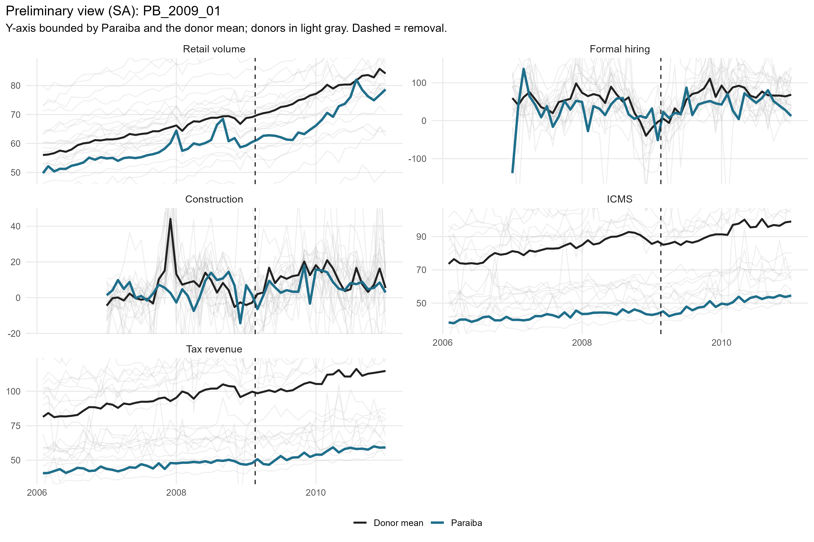
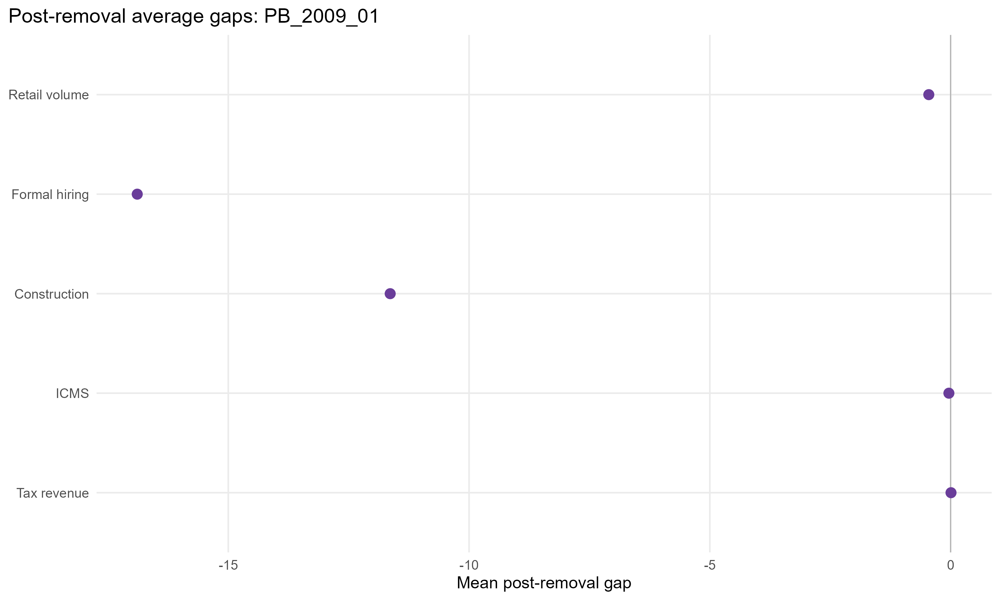
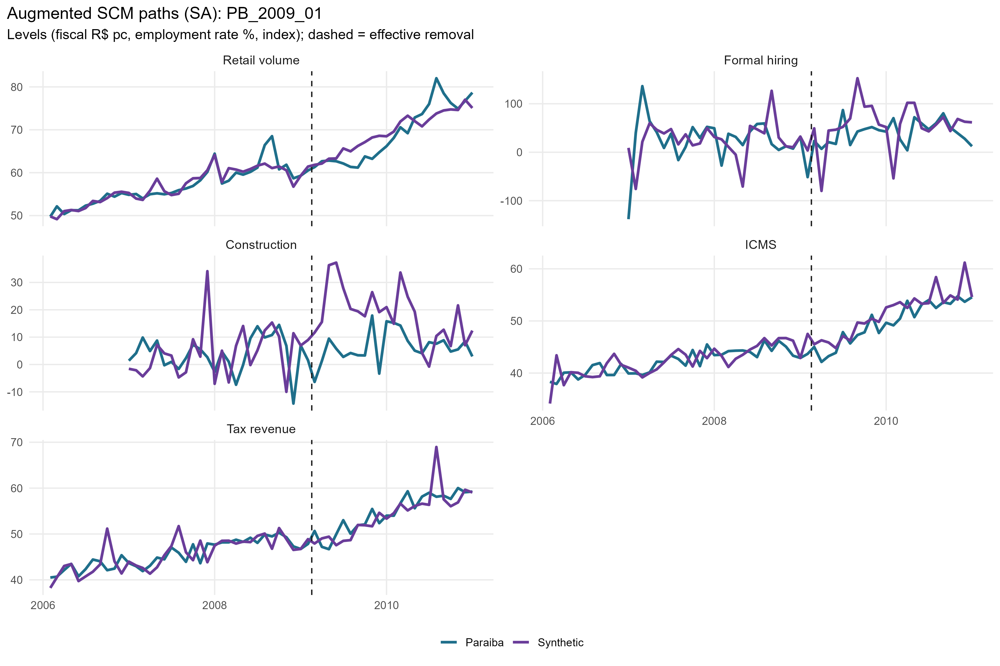
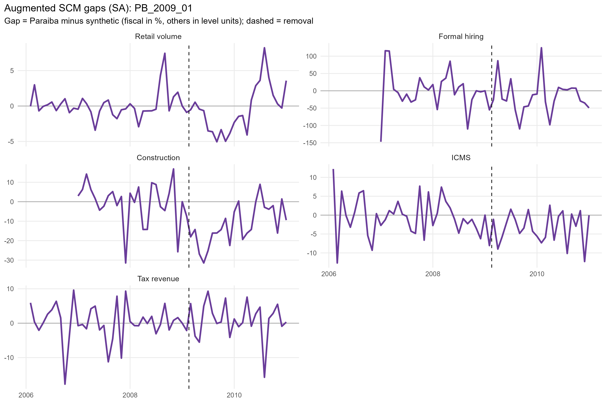
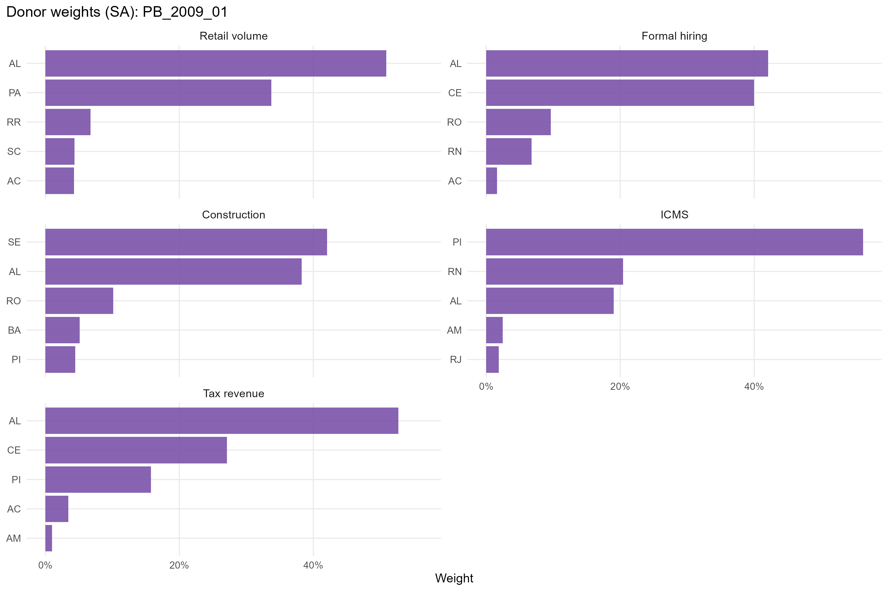
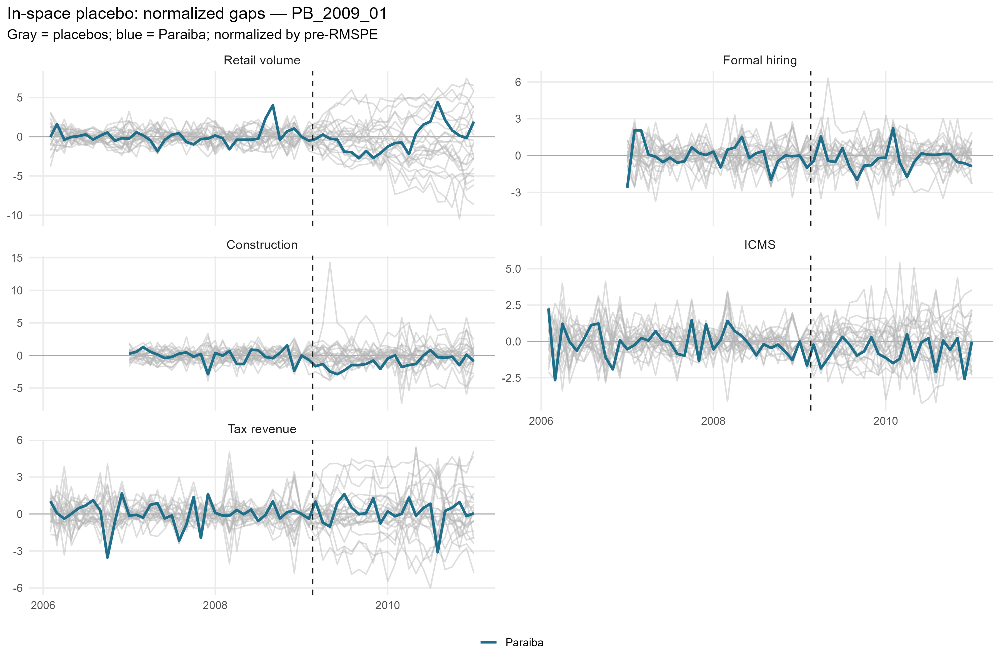
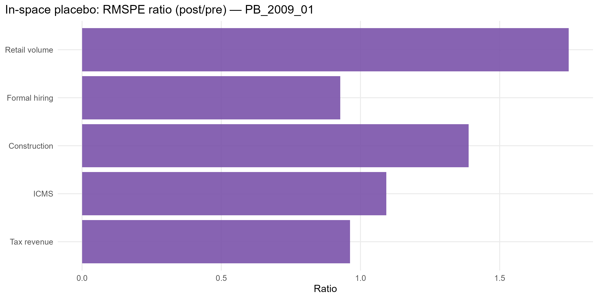

# PB_2009_01 results report (confaz regime)

Generated on 2026-06-07.

Treated state: `PB` (Paraiba). Treatment (single accountability cut): effective removal `2009-02-17`.
Data regime: **confaz**. All outcomes are monthly (X-13); fiscal outcomes (ICMS, tax revenue) are from CONFAZ.

## Window design

- Monthly outcomes: target 36-month pre (floor 20), 24-month post.
- An outcome enters only if the treated unit meets its pre-window floor and a complete post-window.

Qualifying outcomes: Retail volume, Formal hiring, Construction, ICMS, Tax revenue.

## Methodological strategy

Main donor pool excludes `DF`, `MA`, `PB`, `TO` (any state treated anywhere in the SCM window). Preferred specification uses 23 eligible donors. Augmented SCM is the headline estimator; weights are estimated on the pre-treatment window. Predictors: the full pre-treatment outcome path plus the regime covariates: CONFAZ ICMS sectors (secondary, tertiary, energy, fuels) plus FPE and IOF-state, real per capita.

## Preliminary plots

## Covariate and pre-treatment balance

### Pre-treatment outcome fit

| Outcome | Treated | Synthetic | RMSPE pre | Pre periods |
| --- | --- | --- | --- | --- |
| Retail volume | 56.84 | 56.71 | 1.85 | 36 |
| Formal hiring | 26.36 | 25.15 | 56.08 | 25 |
| Construction | 3.98 | 4.30 | 10.95 | 25 |
| ICMS | 3.74 | 3.74 | 0.05 | 36 |
| Tax revenue | 3.81 | 3.81 | 0.06 | 36 |

### Covariate balance (treated vs synthetic by outcome)

| Covariate | Treated | Retail volume | Formal hiring | Construction | ICMS | Tax revenue |
| --- | --- | --- | --- | --- | --- | --- |
| ICMS secondary VA pc |  7.105 |  6.801 |  7.840 |  7.343 |  6.603 |  6.992 |
| ICMS tertiary VA pc | 19.505 | 21.174 | 20.626 | 20.526 | 17.713 | 19.016 |
| ICMS energy VA pc |  3.180 |  3.382 |  3.438 |  3.491 |  3.128 |  3.222 |
| ICMS fuels VA pc |  4.372 |  5.464 |  5.528 |  5.408 |  4.600 |  4.427 |
| FPE transfer pc | 30.006 | 39.094 | 29.944 | 39.360 | 31.481 | 31.910 |
| IOF-state pc |  0.000 |  0.002 |  0.001 |  0.001 |  0.000 |  0.000 |

## Main results: Augmented SCM (SA)

| Channel | Outcome | Mean gap post | RMSPE pre | RMSPE post | Donors | Freq |
| --- | --- | --- | --- | --- | --- | --- |
| Household consumption | Retail volume index (PMC, SA level) |  -0.45 |  1.85 |  3.23 | 23 | monthly |
| Formal labor market | Formal hiring balance per 100k pop | -16.89 | 56.08 | 52.02 | 23 | monthly |
| Formal labor market | Construction hiring balance per 100k pop | -11.64 | 10.95 | 15.21 | 23 | monthly |
| State public finances | ICMS value added, log real per capita (CONFAZ) |  -0.04 |  0.05 |  0.06 | 22 | monthly |
| State public finances | Tax revenue value added, log real per capita (CONFAZ) |   0.01 |  0.06 |  0.05 | 23 | monthly |

## Donor weights

## In-space placebos

Each eligible donor is treated as pseudo-treated; p = share of placebos with a post/pre RMSPE ratio (or absolute post gap) at least as large as the treated unit's.

| Outcome | RMSPE ratio (post/pre) | p (ratio) | p (abs gap) | Placebos |
| --- | --- | --- | --- | --- |
| Retail volume | 1.75 | 0.783 | 1.000 | 23 |
| Formal hiring | 0.93 | 0.696 | 1.000 | 23 |
| Construction | 1.39 | 0.391 | 0.435 | 23 |
| ICMS | 1.09 | 0.609 | 0.957 | 23 |
| Tax revenue | 0.96 | 0.739 | 1.000 | 23 |

## Leave-one-out donor placebo

| Outcome | Gap post | LOO rank | p (2-sided) |
| --- | --- | --- | --- |
| Retail volume | -0.45 | 23 / 24 | 0.083 |
| Formal hiring | -16.89 | 1 / 24 | 0.042 |
| Construction | -11.64 | 1 / 24 | 0.042 |
| ICMS | -0.04 | 21 / 23 | 0.13 |
| Tax revenue | 0.01 | 23 / 24 | 0.083 |

## Evidence classification (5-criterion AugSCM ruler)

We do not rely on placebo p-value thresholds alone. Each outcome is graded on five criteria — (C1) pre-treatment fit (treated pre-RMSPE vs the donor median, no pre-trend), (C2) substantive magnitude (post gap >= 1 pre-period SD), (C3) persistence (share of post periods keeping the gap's sign), (C4) placebo position (discrete rank/N p <= 0.15), (C5) robustness (>= 80% of leave-one-out variants keep the sign) — into a 0-5 score. Pre-fit is a hard gate: a poor pre-fit makes the effect *non-interpretable* regardless of the rest. Tiers: **strong** (5/5), **moderate** (>=4 with placebo), **suggestive** (>=3 with magnitude or placebo), **weak**, **non-interpretable**. A *considerable* effect is strong/moderate/suggestive.

Considerable effects for this event: **1** of 5 outcomes.

| Outcome | Tier | Score | Effect | Mag (pre-SD) | Persist | Pre-fit | Placebo rank | p (rank/N) | LOO sign |
| --- | --- | --- | --- | --- | --- | --- | --- | --- | --- |
| Retail volume | weak | 3/5 | -0.7% | 0.10 | 0.62 | C | 19/24 | 0.792 | 1.00 |
| Formal hiring | weak | 3/5 | -16.9 | 0.36 | 0.67 | C | 17/24 | 0.708 | 1.00 |
| Construction | suggestive | 4/5 | -11.6 | 1.79 | 0.88 | C | 10/24 | 0.417 | 1.00 |
| ICMS | weak | 3/5 | -3.5% | 0.66 | 0.75 | A | 15/24 | 0.625 | 1.00 |
| Tax revenue | weak | 3/5 | +0.8% | 0.12 | 0.62 | A | 18/24 | 0.750 | 0.83 |

Note: placebo-based inference in synthetic control is discrete and low-resolution with few donors (here the finest p is ~1/N). Results with p slightly above conventional thresholds but a high placebo rank, good pre-fit, substantive magnitude and persistence are read as *suggestive* evidence, not as conventional statistical significance.

