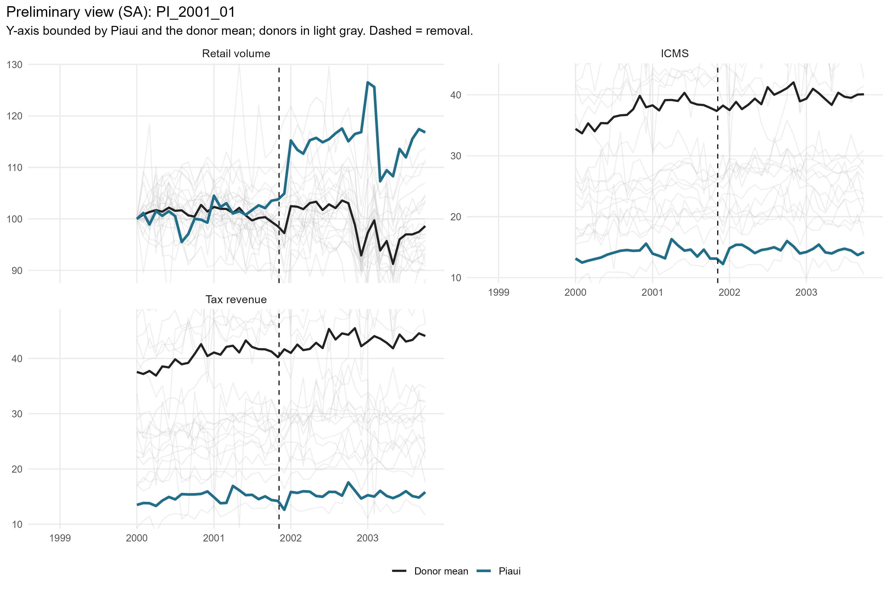
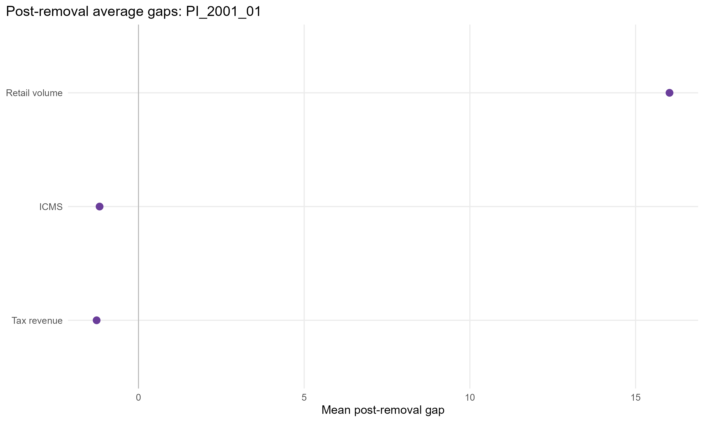
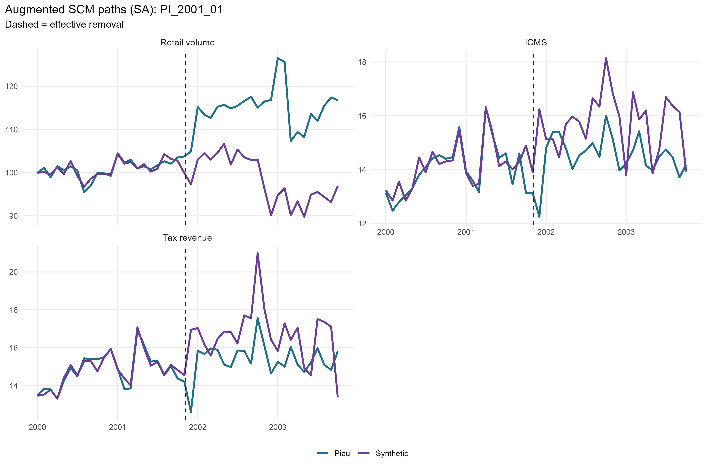
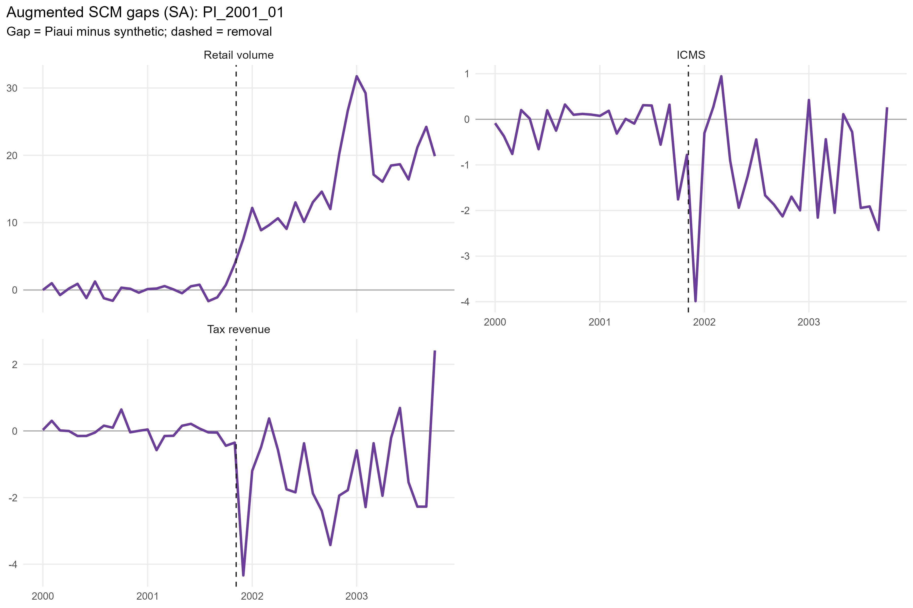
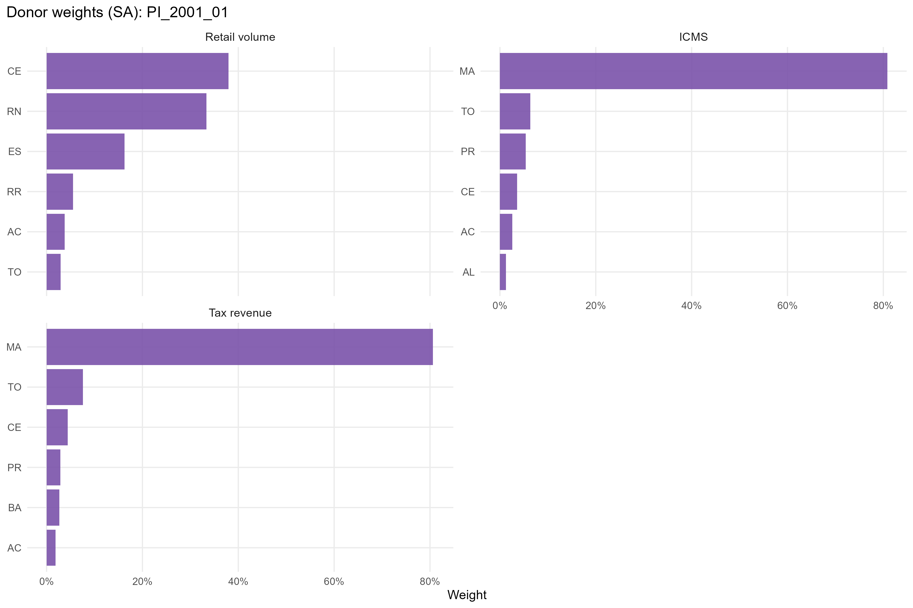
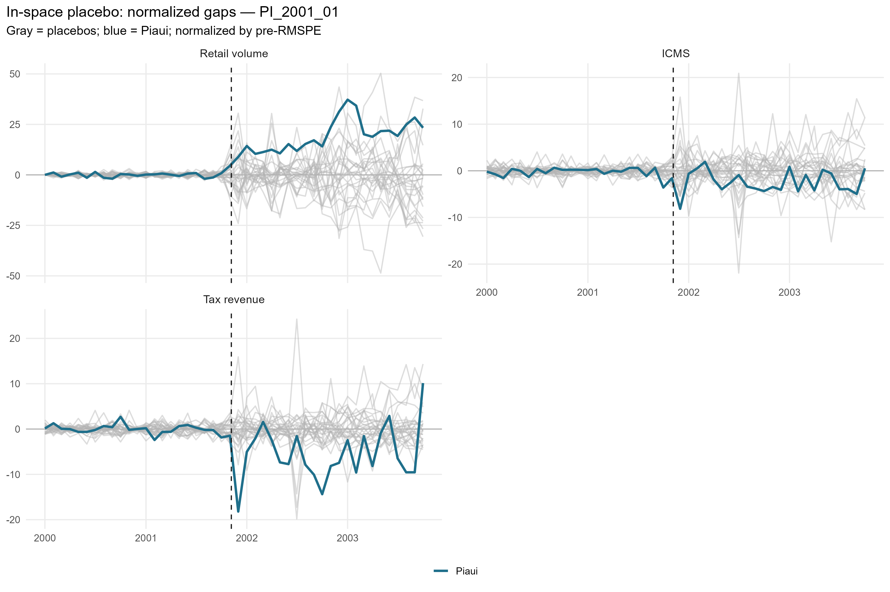
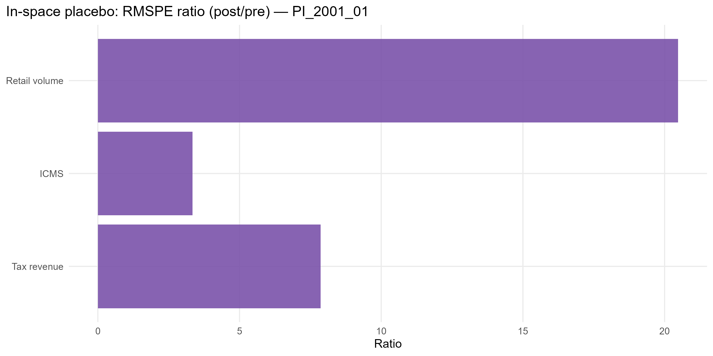

# PI_2001_01 results report (confaz regime)

Generated on 2026-06-06.

Treated state: `PI` (Piaui). Treatment (single accountability cut): effective removal `2001-11-06`.
Data regime: **confaz**. All outcomes are monthly (X-13); fiscal outcomes (ICMS, tax revenue) are from CONFAZ.

## Window design

- Monthly outcomes: target 36-month pre (floor 20), 24-month post.
- An outcome enters only if the treated unit meets its pre-window floor and a complete post-window.

Qualifying outcomes: Retail volume, ICMS, Tax revenue.

## Methodological strategy

Main donor pool excludes `PI` (any state treated anywhere in the SCM window). Preferred specification uses 26 eligible donors. Augmented SCM is the headline estimator; weights are estimated on the pre-treatment window. Predictors: the full pre-treatment outcome path plus the regime covariates: CONFAZ ICMS sectors (secondary, tertiary, energy, fuels) plus FPE and IOF-state, real per capita.

## Preliminary plots

## Covariate and pre-treatment balance

### Pre-treatment outcome fit

| Outcome | Treated | Synthetic | RMSPE pre | Pre periods |
| --- | --- | --- | --- | --- |
| Retail volume | 100.86 | 100.93 | 0.85 | 22 |
| ICMS | 14.03 | 14.15 | 0.49 | 22 |
| Tax revenue | 14.82 | 14.82 | 0.24 | 22 |

### Covariate balance (treated vs synthetic by outcome)

| Covariate | Treated | Retail volume | ICMS | Tax revenue |
| --- | --- | --- | --- | --- |
| ICMS secondary VA pc |  1.366 |  6.416 |  1.460 |  1.489 |
| ICMS tertiary VA pc |  7.982 | 19.698 |  8.060 |  6.830 |
| ICMS energy VA pc |  1.164 |  2.207 |  0.927 |  0.880 |
| ICMS fuels VA pc |  2.172 |  2.911 |  1.938 |  1.954 |
| FPE transfer pc | 16.533 | 19.176 | 16.293 | 16.287 |
| IOF-state pc |  0.000 |  0.000 |  0.000 |  0.000 |

## Main results: Augmented SCM (SA)

| Channel | Outcome | Mean gap post | RMSPE pre | RMSPE post | Donors | Freq |
| --- | --- | --- | --- | --- | --- | --- |
| Household consumption | Retail volume index (PMC) | 16.02 | 0.85 | 17.45 | 26 | monthly |
| State public finances | ICMS value added, real per capita (CONFAZ) | -1.17 | 0.49 |  1.64 | 26 | monthly |
| State public finances | Tax revenue value added, real per capita (CONFAZ) | -1.26 | 0.24 |  1.87 | 26 | monthly |

## Donor weights

## In-space placebos

Each eligible donor is treated as pseudo-treated; p = share of placebos with a post/pre RMSPE ratio (or absolute post gap) at least as large as the treated unit's.

| Outcome | RMSPE ratio (post/pre) | p (ratio) | p (abs gap) | Placebos |
| --- | --- | --- | --- | --- |
| Retail volume | 20.48 | 0.077 | 0.000 | 26 |
| ICMS |  3.34 | 0.385 | 0.923 | 26 |
| Tax revenue |  7.86 | 0.000 | 0.962 | 26 |

## Leave-one-out donor placebo

| Outcome | Gap post | LOO rank | p (2-sided) |
| --- | --- | --- | --- |
| Retail volume | 16.02 | 25 / 27 | 0.111 |
| ICMS | -1.17 | 27 / 27 | 0.037 |
| Tax revenue | -1.26 | 27 / 27 | 0.037 |

## Evidence classification (5-criterion AugSCM ruler)

We do not rely on placebo p-value thresholds alone. Each outcome is graded on five criteria — (C1) pre-treatment fit (treated pre-RMSPE vs the donor median, no pre-trend), (C2) substantive magnitude (post gap >= 1 pre-period SD), (C3) persistence (share of post periods keeping the gap's sign), (C4) placebo position (discrete rank/N p <= 0.15), (C5) robustness (>= 80% of leave-one-out variants keep the sign) — into a 0-5 score. Pre-fit is a hard gate: a poor pre-fit makes the effect *non-interpretable* regardless of the rest. Tiers: **strong** (5/5), **moderate** (>=4 with placebo), **suggestive** (>=3 with magnitude or placebo), **weak**, **non-interpretable**. A *considerable* effect is strong/moderate/suggestive.

Considerable effects for this event: **2** of 3 outcomes.

| Outcome | Tier | Score | % effect | Mag (pre-SD) | Persist | Pre-fit | Placebo rank | p (rank/N) | LOO sign |
| --- | --- | --- | --- | --- | --- | --- | --- | --- | --- |
| Retail volume | non-interpretable | 4/5 | 16.3 | 7.92 | 1.00 | C | 3/27 | 0.111 | 1.00 |
| ICMS | suggestive | 4/5 | -7.5 | 1.23 | 0.79 | A | 11/27 | 0.407 | 1.00 |
| Tax revenue | strong | 5/5 | -7.6 | 1.36 | 0.88 | A | 1/27 | 0.037 | 1.00 |

Note: placebo-based inference in synthetic control is discrete and low-resolution with few donors (here the finest p is ~1/N). Results with p slightly above conventional thresholds but a high placebo rank, good pre-fit, substantive magnitude and persistence are read as *suggestive* evidence, not as conventional statistical significance.

