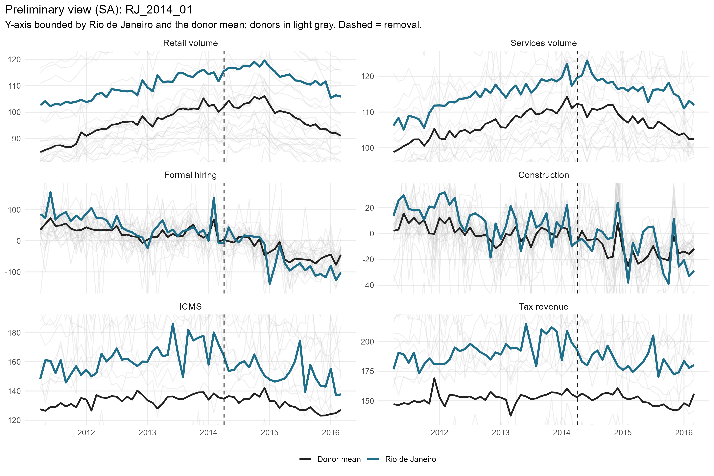
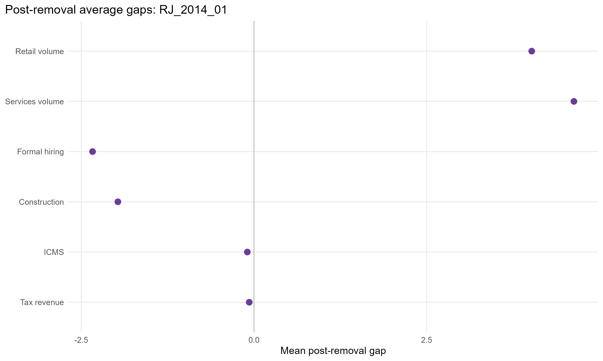
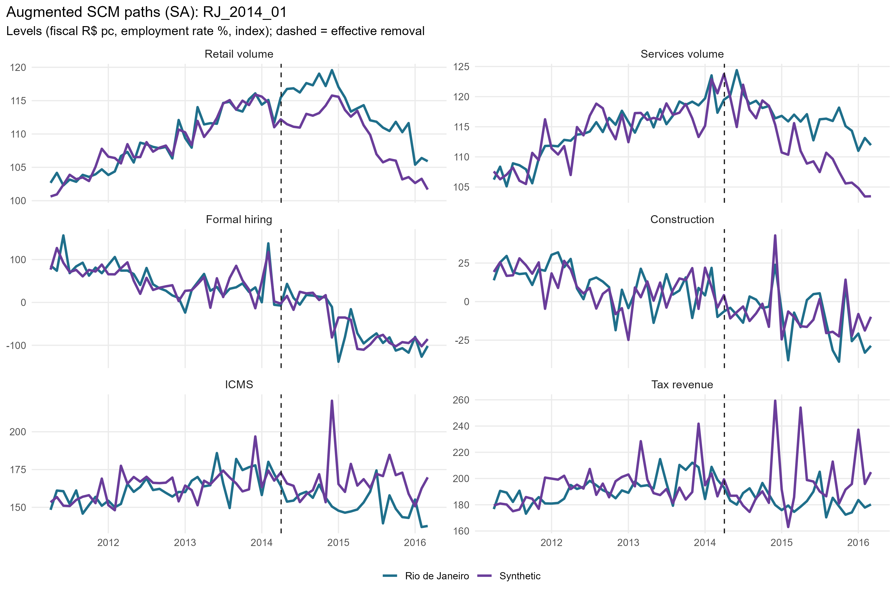
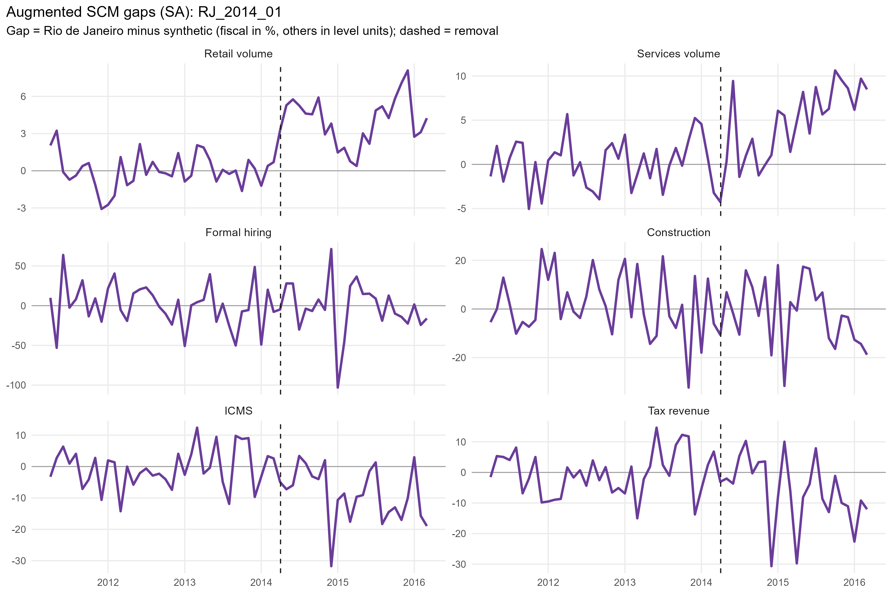
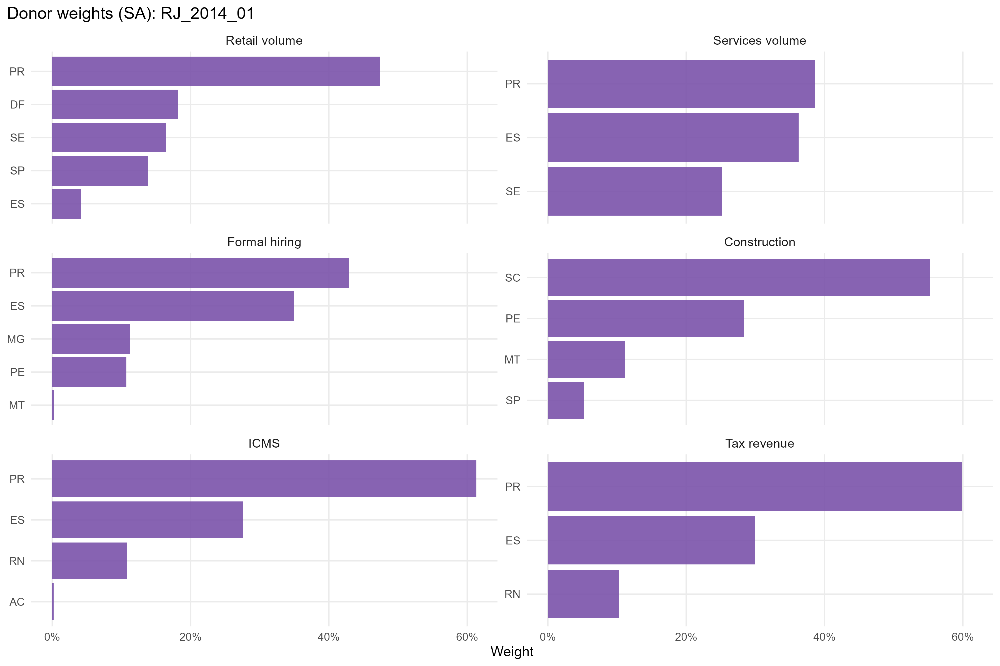
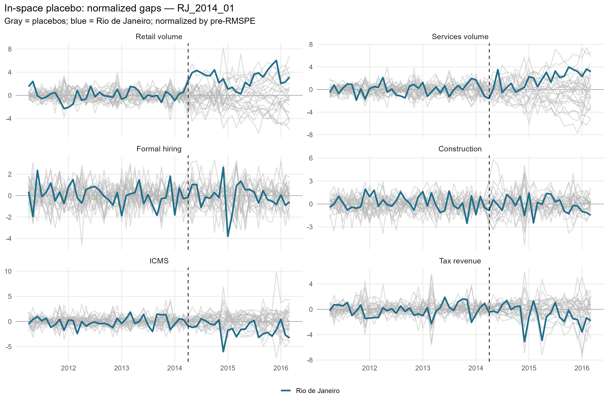
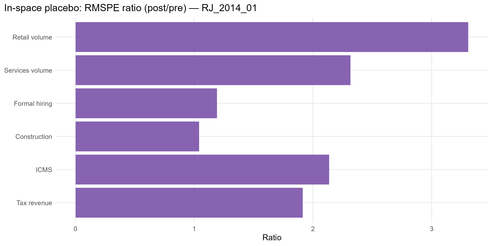

# RJ_2014_01 results report (confaz regime)

Generated on 2026-06-07.

Treated state: `RJ` (Rio de Janeiro). Treatment (single accountability cut): effective removal `2014-04-03`.
Data regime: **confaz**. All outcomes are monthly (X-13); fiscal outcomes (ICMS, tax revenue) are from CONFAZ.

## Window design

- Monthly outcomes: target 36-month pre (floor 20), 24-month post.
- An outcome enters only if the treated unit meets its pre-window floor and a complete post-window.

Qualifying outcomes: Retail volume, Services volume, Formal hiring, Construction, ICMS, Tax revenue.

## Methodological strategy

Main donor pool excludes `RJ` (any state treated anywhere in the SCM window). Preferred specification uses 26 eligible donors. Augmented SCM is the headline estimator; weights are estimated on the pre-treatment window. Predictors: the full pre-treatment outcome path plus the regime covariates: CONFAZ ICMS sectors (secondary, tertiary, energy, fuels) plus FPE and IOF-state, real per capita.

## Preliminary plots

## Covariate and pre-treatment balance

### Pre-treatment outcome fit

| Outcome | Treated | Synthetic | RMSPE pre | Pre periods |
| --- | --- | --- | --- | --- |
| Retail volume | 108.72 | 108.71 | 1.34 | 36 |
| Services volume | 114.08 | 113.91 | 2.68 | 36 |
| Formal hiring | 53.68 | 53.03 | 27.13 | 36 |
| Construction | 11.67 | 9.82 | 12.83 | 36 |
| ICMS | 5.09 | 5.10 | 0.06 | 36 |
| Tax revenue | 5.26 | 5.26 | 0.07 | 36 |

### Covariate balance (treated vs synthetic by outcome)

| Covariate | Treated | Retail volume | Services volume | Formal hiring | Construction | ICMS | Tax revenue |
| --- | --- | --- | --- | --- | --- | --- | --- |
| ICMS secondary VA pc | 30.496 | 30.420 | 32.626 | 34.638 | 28.327 | 31.079 | 31.959 |
| ICMS tertiary VA pc | 56.860 | 53.586 | 51.413 | 52.343 | 54.162 | 51.171 | 51.691 |
| ICMS energy VA pc | 17.193 | 13.178 | 12.982 | 14.059 | 12.593 | 14.197 | 14.271 |
| ICMS fuels VA pc | 16.401 | 24.471 | 21.095 | 23.456 | 23.514 | 22.633 | 22.803 |
| FPE transfer pc |  3.405 | 19.091 | 27.530 | 13.417 | 15.206 | 15.650 | 15.200 |
| IOF-state pc |  0.000 |  0.000 |  0.000 |  0.000 |  0.002 |  0.000 |  0.000 |

## Main results: Augmented SCM (SA)

| Channel | Outcome | Mean gap post | RMSPE pre | RMSPE post | Donors | Freq |
| --- | --- | --- | --- | --- | --- | --- |
| Household consumption | Retail volume index (PMC, SA level) |  4.02 |  1.34 |  4.44 | 26 | monthly |
| Household consumption | Services volume index (PMS, SA level) |  4.63 |  2.68 |  6.20 | 26 | monthly |
| Formal labor market | Formal hiring balance per 100k pop | -2.34 | 27.13 | 32.34 | 26 | monthly |
| Formal labor market | Construction hiring balance per 100k pop | -1.97 | 12.83 | 13.35 | 26 | monthly |
| State public finances | ICMS value added, log real per capita (CONFAZ) | -0.10 |  0.06 |  0.14 | 26 | monthly |
| State public finances | Tax revenue value added, log real per capita (CONFAZ) | -0.07 |  0.07 |  0.14 | 26 | monthly |

## Donor weights

## In-space placebos

Each eligible donor is treated as pseudo-treated; p = share of placebos with a post/pre RMSPE ratio (or absolute post gap) at least as large as the treated unit's.

| Outcome | RMSPE ratio (post/pre) | p (ratio) | p (abs gap) | Placebos |
| --- | --- | --- | --- | --- |
| Retail volume | 3.31 | 0.115 | 0.269 | 26 |
| Services volume | 2.32 | 0.308 | 0.500 | 26 |
| Formal hiring | 1.19 | 0.346 | 1.000 | 26 |
| Construction | 1.04 | 0.577 | 1.000 | 26 |
| ICMS | 2.14 | 0.115 | 0.269 | 26 |
| Tax revenue | 1.91 | 0.154 | 0.615 | 26 |

## Leave-one-out donor placebo

| Outcome | Gap post | LOO rank | p (2-sided) |
| --- | --- | --- | --- |
| Retail volume | 4.02 | 1 / 27 | 0.037 |
| Services volume | 4.63 | 1 / 27 | 0.037 |
| Formal hiring | -2.34 | 26 / 27 | 0.074 |
| Construction | -1.97 | 2 / 27 | 0.074 |
| ICMS | -0.1 | 2 / 27 | 0.074 |
| Tax revenue | -0.07 | 2 / 27 | 0.074 |

## Evidence classification (5-criterion AugSCM ruler)

We do not rely on placebo p-value thresholds alone. Each outcome is graded on five criteria — (C1) pre-treatment fit (treated pre-RMSPE vs the donor median, no pre-trend), (C2) substantive magnitude (post gap >= 1 pre-period SD), (C3) persistence (share of post periods keeping the gap's sign), (C4) placebo position (discrete rank/N p <= 0.15), (C5) robustness (>= 80% of leave-one-out variants keep the sign) — into a 0-5 score. Pre-fit is a hard gate: a poor pre-fit makes the effect *non-interpretable* regardless of the rest. Tiers: **strong** (5/5), **moderate** (>=4 with placebo), **suggestive** (>=3 with magnitude or placebo), **weak**, **non-interpretable**. A *considerable* effect is strong/moderate/suggestive.

Considerable effects for this event: **4** of 6 outcomes.

| Outcome | Tier | Score | Effect | Mag (pre-SD) | Persist | Pre-fit | Placebo rank | p (rank/N) | LOO sign |
| --- | --- | --- | --- | --- | --- | --- | --- | --- | --- |
| Retail volume | moderate | 4/5 | +3.7% | 0.91 | 1.00 | A | 4/27 | 0.148 | 1.00 |
| Services volume | suggestive | 4/5 | +4.1% | 1.06 | 0.83 | B | 9/27 | 0.333 | 1.00 |
| Formal hiring | weak | 2/5 | -2.3 | 0.06 | 0.54 | A | 10/27 | 0.370 | 1.00 |
| Construction | weak | 2/5 | -2.0 | 0.16 | 0.58 | B | 16/27 | 0.593 | 0.92 |
| ICMS | strong | 5/5 | -9.2% | 1.58 | 0.79 | B | 4/27 | 0.148 | 1.00 |
| Tax revenue | suggestive | 4/5 | -6.6% | 1.27 | 0.75 | B | 5/27 | 0.185 | 1.00 |

Note: placebo-based inference in synthetic control is discrete and low-resolution with few donors (here the finest p is ~1/N). Results with p slightly above conventional thresholds but a high placebo rank, good pre-fit, substantive magnitude and persistence are read as *suggestive* evidence, not as conventional statistical significance.

