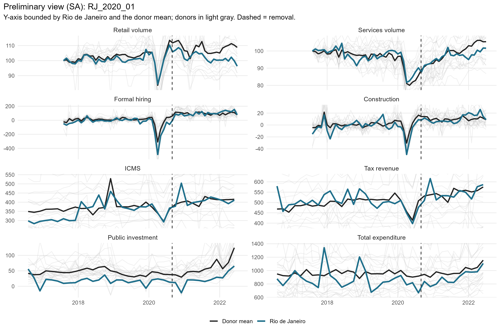
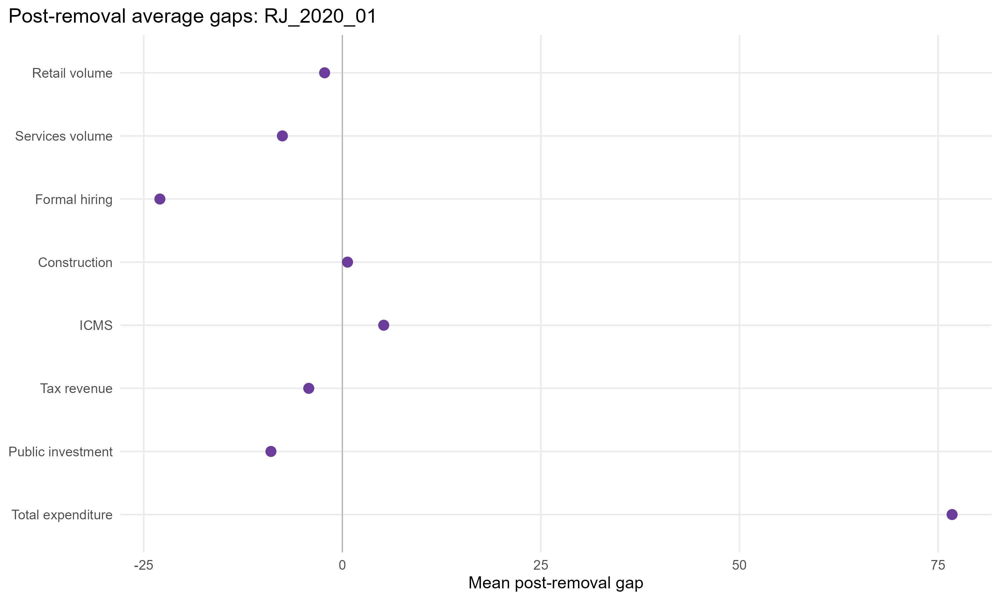
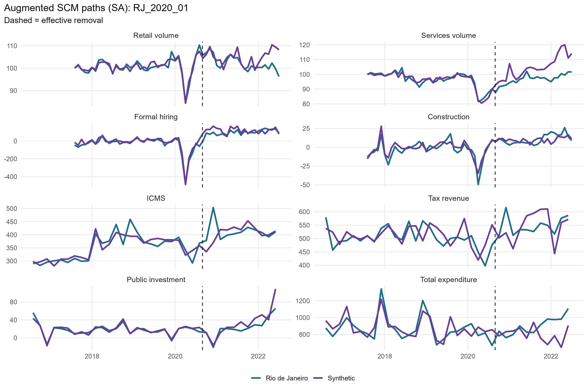
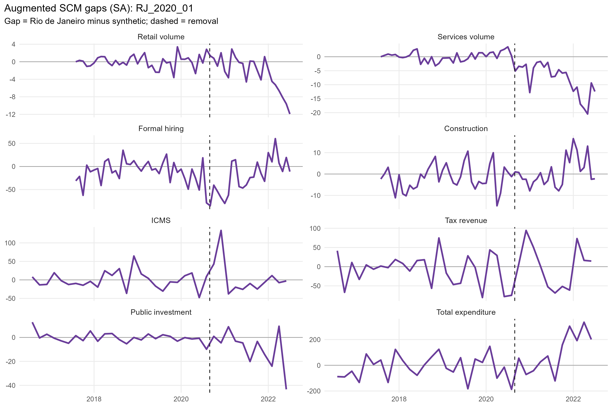
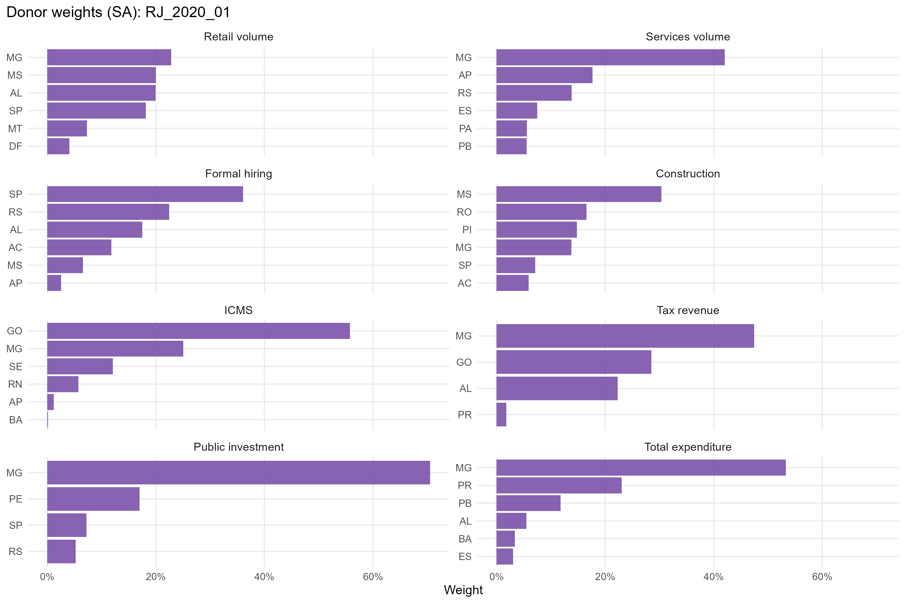
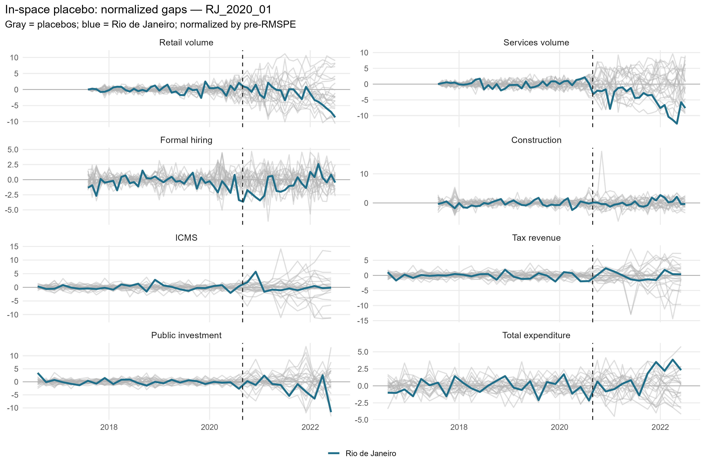
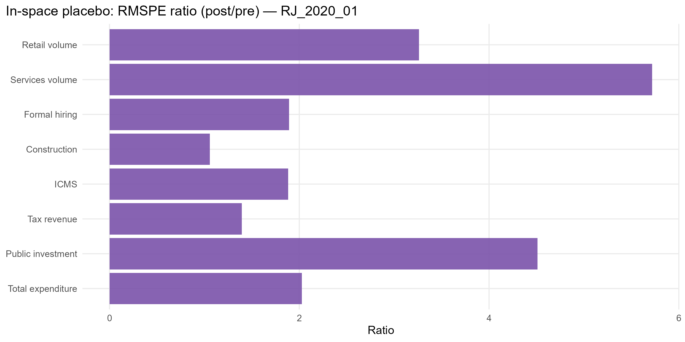

# RJ_2020_01 results report (siconfi regime)

Generated on 2026-06-06.

Treated state: `RJ` (Rio de Janeiro). Treatment (single accountability cut): effective removal `2020-08-28`.
Data regime: **siconfi**. Fiscal outcomes (ICMS, tax revenue, public investment, total expenditure) are bimonthly from SICONFI/RREO (STL). Non-fiscal outcomes (retail, services, formal hiring, construction) are monthly (X-13).

## Window design

- Monthly outcomes: target 36-month pre (floor 20), 24-month post.
- Bimonthly (SICONFI) outcomes: target 24-bimester pre (floor 21), 12-bimester post.
- An outcome enters only if the treated unit meets its pre-window floor and a complete post-window.

Qualifying outcomes: Retail volume, Services volume, Formal hiring, Construction, ICMS, Tax revenue, Public investment, Total expenditure.

## Methodological strategy

Main donor pool excludes `AM`, `RJ`, `RR`, `SC`, `TO` (any state treated anywhere in the SCM window). Preferred specification uses 22 eligible donors. Augmented SCM is the headline estimator; weights are estimated on the pre-treatment window. Predictors: the full pre-treatment outcome path plus the regime covariates: PNADc labor covariates (unemployment, formalization, labor income) plus SICONFI transfer dependency and health/education/public-security expenditure per capita.

## Preliminary plots

## Covariate and pre-treatment balance

### Pre-treatment outcome fit

| Outcome | Treated | Synthetic | RMSPE pre | Pre periods |
| --- | --- | --- | --- | --- |
| Retail volume | 100.35 | 100.40 | 1.37 | 36 |
| Services volume | 96.61 | 96.48 | 1.63 | 36 |
| Formal hiring | -34.33 | -25.57 | 23.31 | 36 |
| Construction | -3.58 | -2.00 | 6.13 | 36 |
| ICMS | 348.77 | 349.70 | 23.37 | 24 |
| Tax revenue | 504.21 | 510.39 | 39.70 | 24 |
| Public investment | 18.11 | 17.93 | 3.72 | 24 |
| Total expenditure | 877.15 | 885.87 | 86.90 | 24 |

### Covariate balance (treated vs synthetic by outcome)

| Covariate | Treated | Retail volume | Services volume | Formal hiring | Construction | ICMS | Tax revenue | Public investment | Total expenditure |
| --- | --- | --- | --- | --- | --- | --- | --- | --- | --- |
| Unemployment rate |     0.112 |     0.102 |     0.101 |     0.104 |     0.087 |     0.097 |     0.101 |     0.100 |     0.095 |
| Formalization rate |     0.646 |     0.614 |     0.584 |     0.626 |     0.560 |     0.585 |     0.594 |     0.607 |     0.600 |
| Labor income (real) | 3,655.680 | 3,213.943 | 3,041.461 | 3,421.917 | 2,917.257 | 2,933.579 | 2,803.549 | 2,996.603 | 2,926.120 |
| Transfer dependency ratio |     0.029 |     0.086 |     0.100 |     0.102 |     0.107 |     0.080 |     0.080 |     0.053 |     0.074 |
| Health expenditure pc |    84.448 |   113.948 |   123.407 |   138.158 |   120.453 |   116.827 |    97.183 |    96.379 |    89.236 |
| Education expenditure pc |    96.298 |   147.650 |   150.405 |   162.087 |   149.727 |   139.194 |   117.459 |   109.601 |   132.487 |
| Public security expenditure pc |   140.290 |   111.647 |   134.945 |    91.067 |   107.911 |   121.561 |   133.910 |   143.485 |   129.763 |

## Main results: Augmented SCM (SA)

| Channel | Outcome | Mean gap post | RMSPE pre | RMSPE post | Donors | Freq |
| --- | --- | --- | --- | --- | --- | --- |
| Household consumption | Retail volume index (PMC) |  -2.23 |  1.37 |   4.48 | 22 | monthly |
| Household consumption | Services volume index (PMS) |  -7.55 |  1.63 |   9.35 | 22 | monthly |
| Formal labor market | Formal hiring balance per 100k pop | -22.97 | 23.31 |  44.08 | 22 | monthly |
| Formal labor market | Construction hiring balance per 100k pop |   0.65 |  6.13 |   6.49 | 22 | monthly |
| State public finances | ICMS revenue, real per capita (SICONFI) |   5.21 | 23.37 |  43.98 | 21 | bimonthly |
| State public finances | Own tax revenue, real per capita (SICONFI) |  -4.23 | 39.70 |  55.35 | 22 | bimonthly |
| State public finances | Public investment, real per capita (SICONFI) |  -8.99 |  3.72 |  16.80 | 22 | bimonthly |
| State public finances | Total liquidated expenditure, real per capita (SICONFI) |  76.77 | 86.90 | 176.07 | 22 | bimonthly |

## Donor weights

## In-space placebos

Each eligible donor is treated as pseudo-treated; p = share of placebos with a post/pre RMSPE ratio (or absolute post gap) at least as large as the treated unit's.

| Outcome | RMSPE ratio (post/pre) | p (ratio) | p (abs gap) | Placebos |
| --- | --- | --- | --- | --- |
| Retail volume | 3.26 | 0.545 | 1.000 | 22 |
| Services volume | 5.72 | 0.091 | 0.273 | 22 |
| Formal hiring | 1.89 | 0.318 | 0.773 | 22 |
| Construction | 1.06 | 0.909 | 1.000 | 22 |
| ICMS | 1.88 | 0.571 | 1.000 | 21 |
| Tax revenue | 1.39 | 0.818 | 1.000 | 22 |
| Public investment | 4.51 | 0.136 | 0.955 | 22 |
| Total expenditure | 2.03 | 0.227 | 0.636 | 22 |

## Leave-one-out donor placebo

| Outcome | Gap post | LOO rank | p (2-sided) |
| --- | --- | --- | --- |
| Retail volume | -2.23 | 23 / 23 | 0.043 |
| Services volume | -7.55 | 1 / 23 | 0.043 |
| Formal hiring | -22.97 | 1 / 23 | 0.043 |
| Construction | 0.65 | 12 / 23 | 0.522 |
| ICMS | 5.21 | 22 / 22 | 0.045 |
| Tax revenue | -4.23 | 23 / 23 | 0.043 |
| Public investment | -8.99 | 22 / 23 | 0.087 |
| Total expenditure | 76.77 | 23 / 23 | 0.043 |

## Evidence classification (5-criterion AugSCM ruler)

We do not rely on placebo p-value thresholds alone. Each outcome is graded on five criteria — (C1) pre-treatment fit (treated pre-RMSPE vs the donor median, no pre-trend), (C2) substantive magnitude (post gap >= 1 pre-period SD), (C3) persistence (share of post periods keeping the gap's sign), (C4) placebo position (discrete rank/N p <= 0.15), (C5) robustness (>= 80% of leave-one-out variants keep the sign) — into a 0-5 score. Pre-fit is a hard gate: a poor pre-fit makes the effect *non-interpretable* regardless of the rest. Tiers: **strong** (5/5), **moderate** (>=4 with placebo), **suggestive** (>=3 with magnitude or placebo), **weak**, **non-interpretable**. A *considerable* effect is strong/moderate/suggestive.

Considerable effects for this event: **0** of 8 outcomes.

| Outcome | Tier | Score | % effect | Mag (pre-SD) | Persist | Pre-fit | Placebo rank | p (rank/N) | LOO sign |
| --- | --- | --- | --- | --- | --- | --- | --- | --- | --- |
| Retail volume | weak | 3/5 |  -2.1 | 0.58 | 0.62 | B | 13/23 | 0.565 | 1.00 |
| Services volume | non-interpretable | 4/5 |  -7.3 | 1.44 | 0.96 | C | 3/23 | 0.130 | 1.00 |
| Formal hiring | weak | 3/5 | -20.5 | 0.24 | 0.67 | B | 8/23 | 0.348 | 1.00 |
| Construction | weak | 2/5 |   6.6 | 0.05 | 0.46 | B | 21/23 | 0.913 | 0.95 |
| ICMS | non-interpretable | 0/5 |   1.3 | 0.10 | 0.33 | C | 13/22 | 0.591 | 0.00 |
| Tax revenue | non-interpretable | 1/5 |  -0.8 | 0.10 | 0.42 | D | 19/23 | 0.826 | 1.00 |
| Public investment | weak | 3/5 | -28.4 | 0.68 | 0.75 | A | 4/23 | 0.174 | 1.00 |
| Total expenditure | non-interpretable | 1/5 |   9.5 | 0.53 | 0.67 | C | 6/23 | 0.261 | 0.05 |

Note: placebo-based inference in synthetic control is discrete and low-resolution with few donors (here the finest p is ~1/N). Results with p slightly above conventional thresholds but a high placebo rank, good pre-fit, substantive magnitude and persistence are read as *suggestive* evidence, not as conventional statistical significance.

