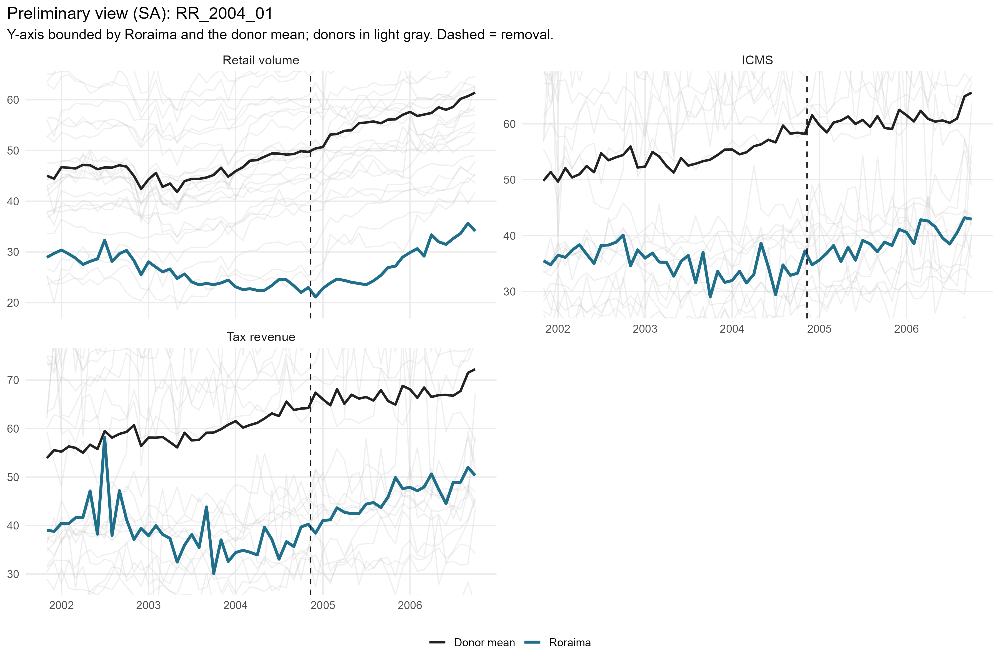
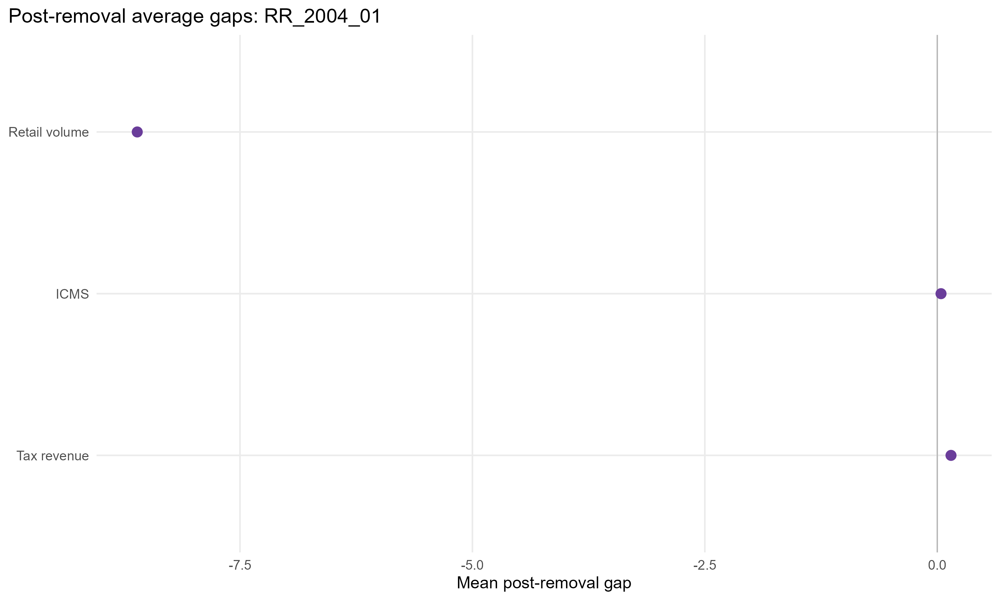
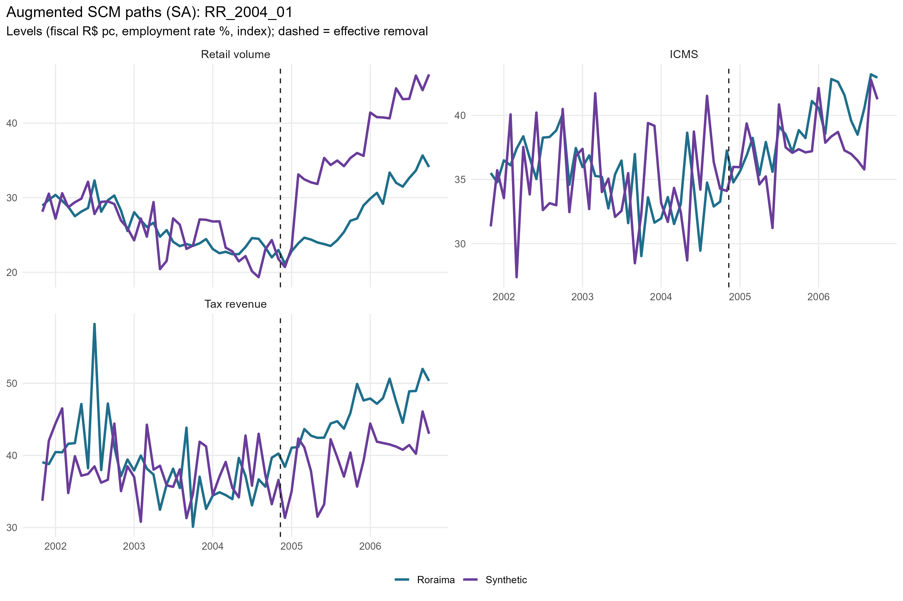
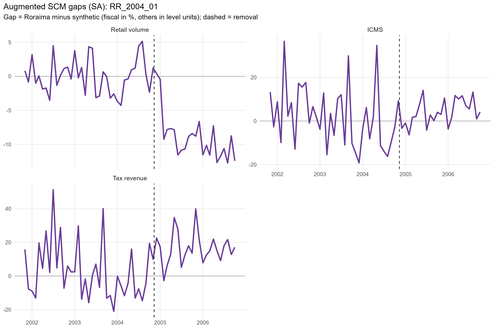
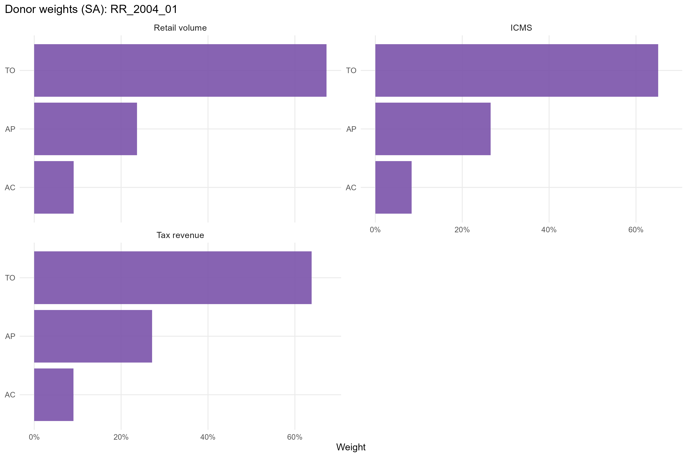
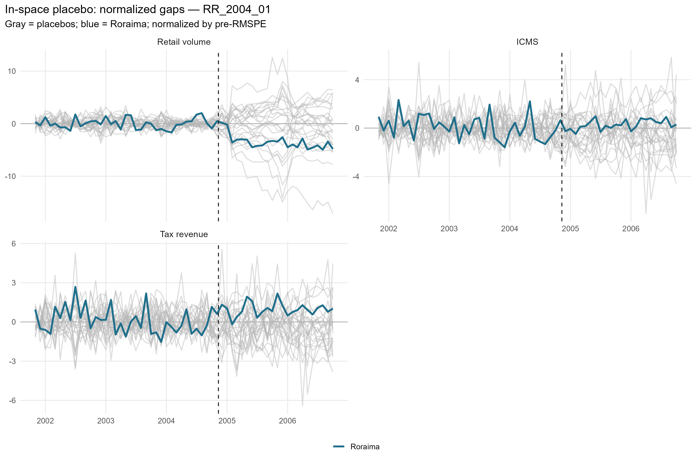
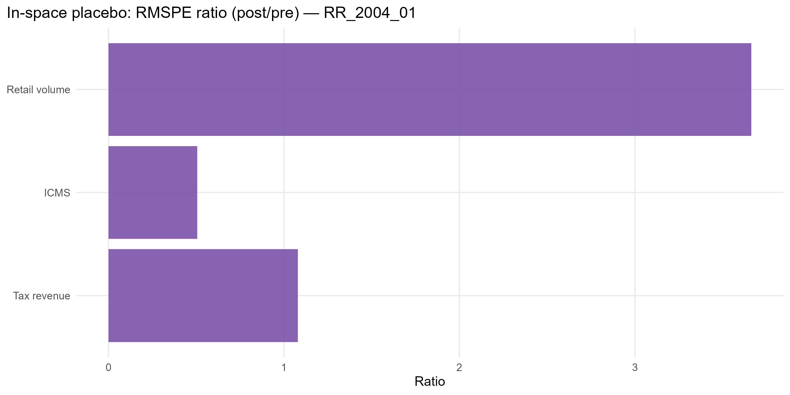

# RR_2004_01 results report (confaz regime)

Generated on 2026-06-07.

Treated state: `RR` (Roraima). Treatment (single accountability cut): effective removal `2004-11-10`.
Data regime: **confaz**. All outcomes are monthly (X-13); fiscal outcomes (ICMS, tax revenue) are from CONFAZ.

## Window design

- Monthly outcomes: target 36-month pre (floor 20), 24-month post.
- An outcome enters only if the treated unit meets its pre-window floor and a complete post-window.

Qualifying outcomes: Retail volume, ICMS, Tax revenue.

## Methodological strategy

Main donor pool excludes `PI`, `RR` (any state treated anywhere in the SCM window). Preferred specification uses 25 eligible donors. Augmented SCM is the headline estimator; weights are estimated on the pre-treatment window. Predictors: the full pre-treatment outcome path plus the regime covariates: CONFAZ ICMS sectors (secondary, tertiary, energy, fuels) plus FPE and IOF-state, real per capita.

## Preliminary plots

## Covariate and pre-treatment balance

### Pre-treatment outcome fit

| Outcome | Treated | Synthetic | RMSPE pre | Pre periods |
| --- | --- | --- | --- | --- |
| Retail volume | 26.07 | 26.05 | 2.57 | 36 |
| ICMS | 3.55 | 3.55 | 0.13 | 36 |
| Tax revenue | 3.64 | 3.63 | 0.15 | 36 |

### Covariate balance (treated vs synthetic by outcome)

| Covariate | Treated | Retail volume | ICMS | Tax revenue |
| --- | --- | --- | --- | --- |
| ICMS secondary VA pc |   2.915 |  2.356 |  2.386 |  2.381 |
| ICMS tertiary VA pc |  17.299 | 24.481 | 23.622 | 24.391 |
| ICMS energy VA pc |   1.220 |  2.131 |  2.082 |  2.057 |
| ICMS fuels VA pc |   9.265 |  7.883 |  7.862 |  7.803 |
| FPE transfer pc | 120.770 | 72.017 | 73.247 | 73.790 |
| IOF-state pc |   0.004 |  0.006 |  0.007 |  0.007 |

## Main results: Augmented SCM (SA)

| Channel | Outcome | Mean gap post | RMSPE pre | RMSPE post | Donors | Freq |
| --- | --- | --- | --- | --- | --- | --- |
| Household consumption | Retail volume index (PMC, SA level) | -8.61 | 2.57 | 9.42 | 25 | monthly |
| State public finances | ICMS value added, log real per capita (CONFAZ) |  0.04 | 0.13 | 0.07 | 25 | monthly |
| State public finances | Tax revenue value added, log real per capita (CONFAZ) |  0.15 | 0.15 | 0.17 | 25 | monthly |

## Donor weights

## In-space placebos

Each eligible donor is treated as pseudo-treated; p = share of placebos with a post/pre RMSPE ratio (or absolute post gap) at least as large as the treated unit's.

| Outcome | RMSPE ratio (post/pre) | p (ratio) | p (abs gap) | Placebos |
| --- | --- | --- | --- | --- |
| Retail volume | 3.66 | 0.320 | 0.080 | 25 |
| ICMS | 0.51 | 1.000 | 0.960 | 25 |
| Tax revenue | 1.08 | 0.720 | 0.160 | 25 |

## Leave-one-out donor placebo

| Outcome | Gap post | LOO rank | p (2-sided) |
| --- | --- | --- | --- |
| Retail volume | -8.61 | 26 / 26 | 0.038 |
| ICMS | 0.04 | 26 / 26 | 0.038 |
| Tax revenue | 0.15 | 26 / 26 | 0.038 |

## Evidence classification (5-criterion AugSCM ruler)

We do not rely on placebo p-value thresholds alone. Each outcome is graded on five criteria — (C1) pre-treatment fit (treated pre-RMSPE vs the donor median, no pre-trend), (C2) substantive magnitude (post gap >= 1 pre-period SD), (C3) persistence (share of post periods keeping the gap's sign), (C4) placebo position (discrete rank/N p <= 0.15), (C5) robustness (>= 80% of leave-one-out variants keep the sign) — into a 0-5 score. Pre-fit is a hard gate: a poor pre-fit makes the effect *non-interpretable* regardless of the rest. Tiers: **strong** (5/5), **moderate** (>=4 with placebo), **suggestive** (>=3 with magnitude or placebo), **weak**, **non-interpretable**. A *considerable* effect is strong/moderate/suggestive.

Considerable effects for this event: **0** of 3 outcomes.

| Outcome | Tier | Score | Effect | Mag (pre-SD) | Persist | Pre-fit | Placebo rank | p (rank/N) | LOO sign |
| --- | --- | --- | --- | --- | --- | --- | --- | --- | --- |
| Retail volume | non-interpretable | 3/5 | -23.7% | 3.03 | 0.92 | D | 9/26 | 0.346 | 1.00 |
| ICMS | non-interpretable | 2/5 | +4.1% | 0.52 | 0.79 | D | 26/26 | 1.000 | 0.92 |
| Tax revenue | non-interpretable | 3/5 | +15.9% | 1.22 | 0.96 | D | 19/26 | 0.731 | 0.92 |

Note: placebo-based inference in synthetic control is discrete and low-resolution with few donors (here the finest p is ~1/N). Results with p slightly above conventional thresholds but a high placebo rank, good pre-fit, substantive magnitude and persistence are read as *suggestive* evidence, not as conventional statistical significance.

