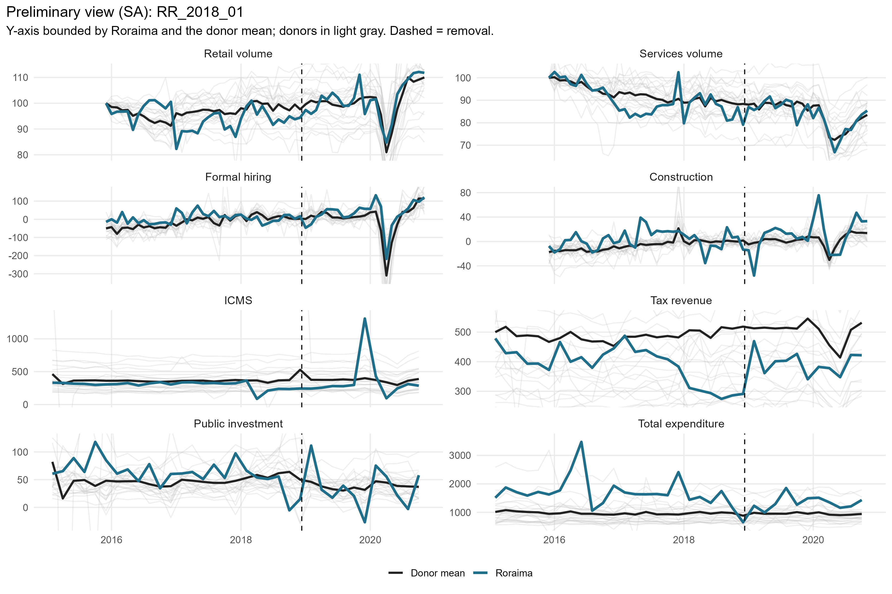
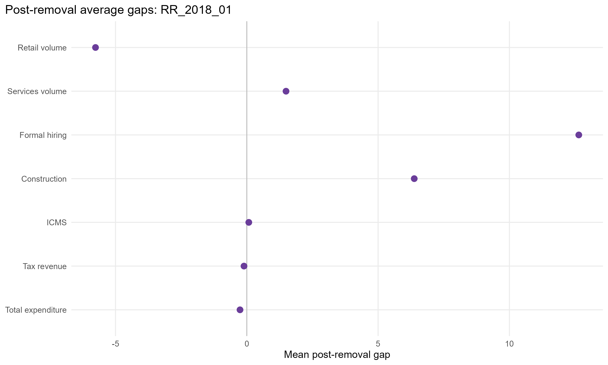
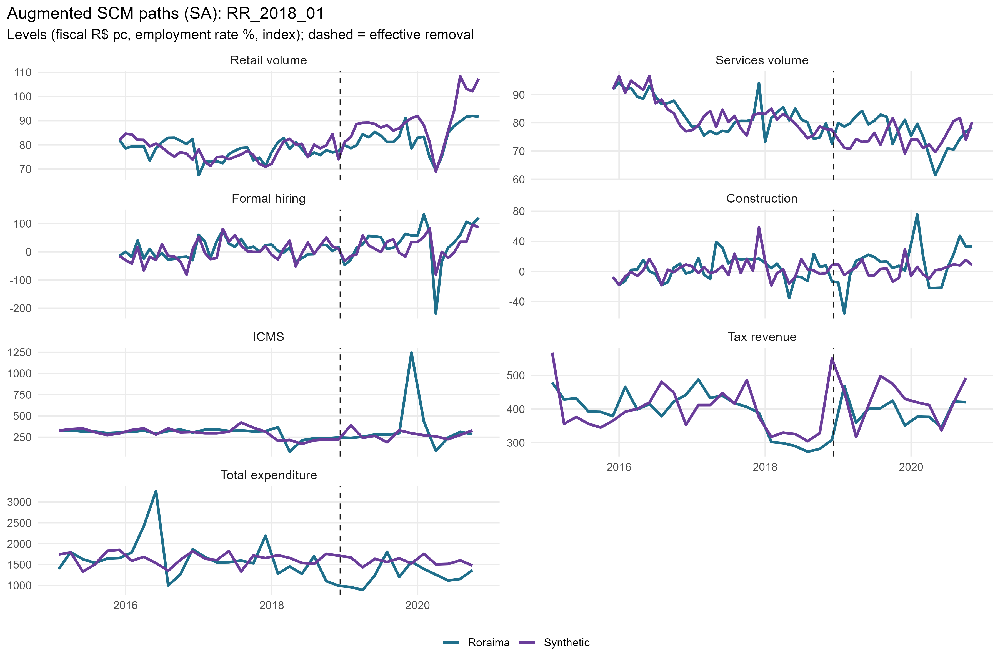
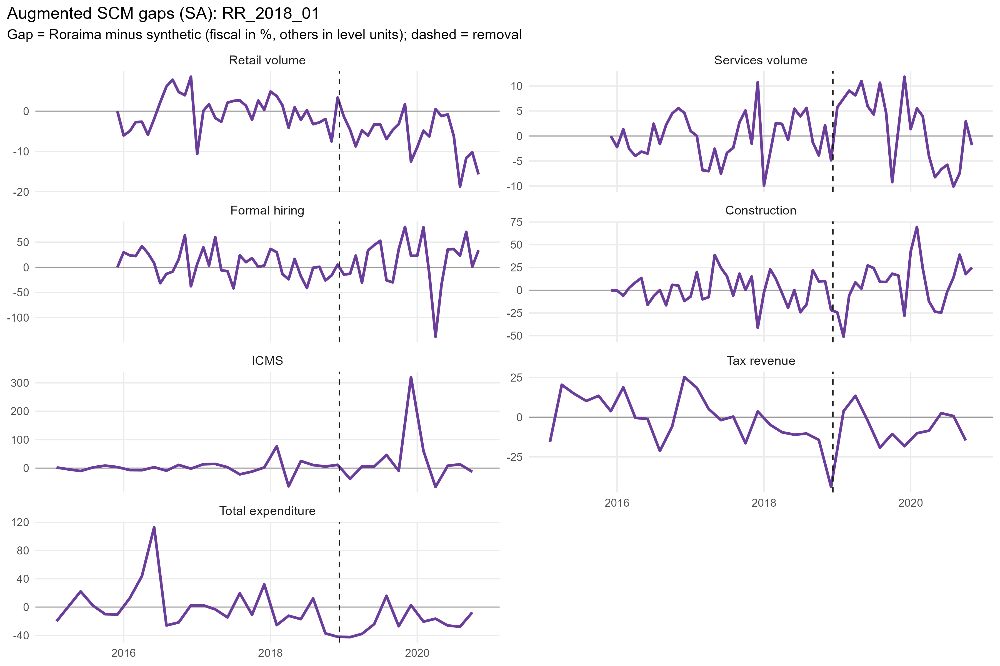
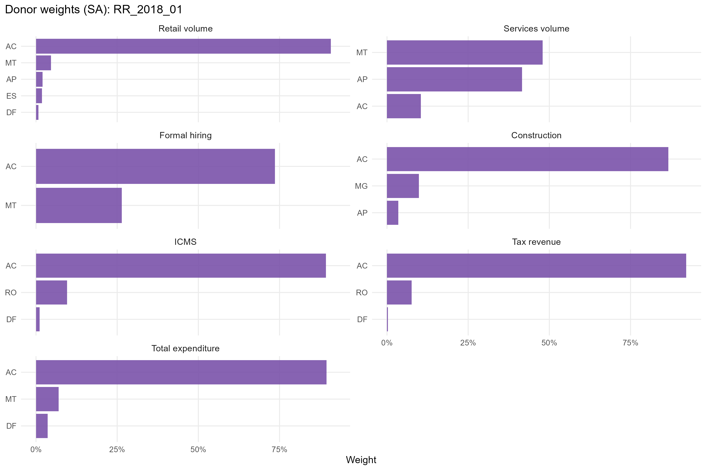
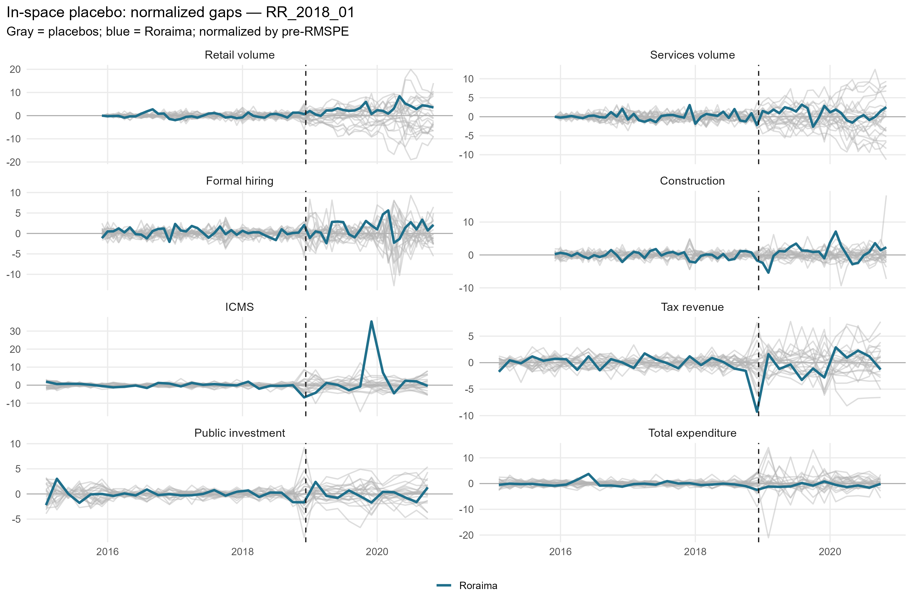
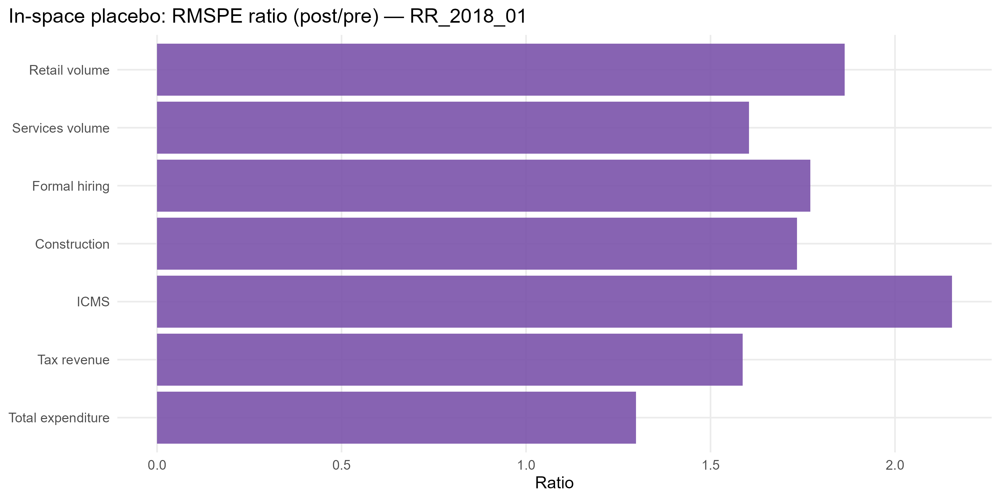

# RR_2018_01 results report (siconfi regime)

Generated on 2026-06-07.

Treated state: `RR` (Roraima). Treatment (single accountability cut): effective removal `2018-12-10`.
Data regime: **siconfi**. Fiscal outcomes (ICMS, tax revenue, public investment, total expenditure) are bimonthly from SICONFI/RREO (STL). Non-fiscal outcomes (retail, services, formal hiring, construction) are monthly (X-13).

## Window design

- Monthly outcomes: target 36-month pre (floor 20), 24-month post.
- Bimonthly (SICONFI) outcomes: target 24-bimester pre (floor 21), 12-bimester post.
- An outcome enters only if the treated unit meets its pre-window floor and a complete post-window.

Qualifying outcomes: Retail volume, Services volume, Formal hiring, Construction, ICMS, Tax revenue, Total expenditure.

## Methodological strategy

Main donor pool excludes `AM`, `RJ`, `RR`, `SC`, `TO` (any state treated anywhere in the SCM window). Preferred specification uses 22 eligible donors. Augmented SCM is the headline estimator; weights are estimated on the pre-treatment window. Predictors: the full pre-treatment outcome path plus the regime covariates: PNADc labor covariates (unemployment, formalization, labor income) plus SICONFI transfer dependency and health/education/public-security expenditure per capita.

## Preliminary plots

## Covariate and pre-treatment balance

### Pre-treatment outcome fit

| Outcome | Treated | Synthetic | RMSPE pre | Pre periods |
| --- | --- | --- | --- | --- |
| Retail volume | 77.63 | 77.76 | 4.17 | 36 |
| Services volume | 83.23 | 83.37 | 4.36 | 36 |
| Formal hiring | 5.51 | -0.02 | 26.80 | 36 |
| Construction | 3.48 | 2.05 | 15.72 | 36 |
| ICMS | 5.67 | 5.68 | 0.26 | 23 |
| Tax revenue | 5.96 | 5.96 | 0.13 | 23 |
| Total expenditure | 7.38 | 7.40 | 0.26 | 23 |

### Covariate balance (treated vs synthetic by outcome)

| Covariate | Treated | Retail volume | Services volume | Formal hiring | Construction | ICMS | Tax revenue | Total expenditure |
| --- | --- | --- | --- | --- | --- | --- | --- | --- |
| Unemployment rate |     0.089 |     0.103 |     0.103 |     0.094 |     0.104 |     0.101 |     0.101 |     0.102 |
| Formalization rate |     0.562 |     0.500 |     0.559 |     0.524 |     0.503 |     0.495 |     0.492 |     0.508 |
| Labor income (real) | 3,281.611 | 2,750.620 | 3,111.378 | 2,845.515 | 2,716.932 | 2,718.254 | 2,689.394 | 2,845.166 |
| Transfer dependency ratio |     0.128 |     0.105 |     0.078 |     0.089 |     0.101 |     0.106 |     0.107 |     0.101 |
| Health expenditure pc |   283.644 |   251.252 |   171.061 |   222.811 |   239.727 |   249.996 |   250.886 |   255.367 |
| Education expenditure pc |   314.191 |   334.802 |   247.958 |   303.285 |   322.284 |   330.687 |   333.181 |   340.407 |
| Public security expenditure pc |   175.100 |   152.725 |   146.828 |   151.262 |   157.207 |   151.256 |   152.710 |   151.065 |

## Main results: Augmented SCM (SA)

| Channel | Outcome | Mean gap post | RMSPE pre | RMSPE post | Donors | Freq |
| --- | --- | --- | --- | --- | --- | --- |
| Household consumption | Retail volume index (PMC, SA level) | -5.76 |  4.17 |  7.77 | 22 | monthly |
| Household consumption | Services volume index (PMS, SA level) |  1.49 |  4.36 |  7.00 | 22 | monthly |
| Formal labor market | Formal hiring balance per 100k pop | 12.64 | 26.80 | 47.44 | 22 | monthly |
| Formal labor market | Construction hiring balance per 100k pop |  6.38 | 15.72 | 27.27 | 22 | monthly |
| State public finances | ICMS revenue, log real per capita (SICONFI) |  0.08 |  0.26 |  0.57 | 19 | bimonthly |
| State public finances | Own tax revenue, log real per capita (SICONFI) | -0.11 |  0.13 |  0.20 | 22 | bimonthly |
| State public finances | Total liquidated expenditure, log real per capita (SICONFI) | -0.26 |  0.26 |  0.33 | 21 | bimonthly |

## Donor weights

## In-space placebos

Each eligible donor is treated as pseudo-treated; p = share of placebos with a post/pre RMSPE ratio (or absolute post gap) at least as large as the treated unit's.

| Outcome | RMSPE ratio (post/pre) | p (ratio) | p (abs gap) | Placebos |
| --- | --- | --- | --- | --- |
| Retail volume | 1.86 | 0.409 | 0.182 | 22 |
| Services volume | 1.60 | 0.455 | 1.000 | 22 |
| Formal hiring | 1.77 | 0.409 | 1.000 | 22 |
| Construction | 1.73 | 0.045 | 0.636 | 22 |
| ICMS | 2.15 | 0.429 | 0.810 | 21 |
| Tax revenue | 1.59 | 0.318 | 0.727 | 22 |
| Total expenditure | 1.30 | 0.455 | 0.091 | 22 |

## Leave-one-out donor placebo

| Outcome | Gap post | LOO rank | p (2-sided) |
| --- | --- | --- | --- |
| Retail volume | -5.76 | 22 / 23 | 0.087 |
| Services volume | 1.49 | 23 / 23 | 0.043 |
| Formal hiring | 12.64 | 1 / 23 | 0.043 |
| Construction | 6.38 | 2 / 23 | 0.087 |
| ICMS | 0.08 | 20 / 20 | 0.05 |
| Tax revenue | -0.11 | 22 / 23 | 0.087 |
| Total expenditure | -0.26 | 1 / 22 | 0.045 |

## Evidence classification

Inference follows the standard placebo approach (Abadie, Diamond & Hainmueller 2010): the tier is the treated unit's position in the placebo distribution of the post/pre RMSPE ratio (discrete p = rank/N), which already self-normalises for pre-treatment fit. To rise above *weak* an effect must also be substantively large (|post gap| >= 1 pre-period SD) and free of a pre-trend. Tiers: **strong** (placebo p <= 0.05), **moderate** (<= 0.10), **suggestive** (<= 0.15), **weak** otherwise; a *considerable* effect is strong/moderate/suggestive. Persistence and leave-one-out sign-stability are reported as supporting robustness.

**Pre-treatment fit quality is reported, not used to discard results.** The SCM literature has no fixed fit threshold (fit is judged visually and relative to the effect), so we show the treated pre-RMSPE percentile class (A-D), the treated-vs-synthetic pre correlation and R^2, and flag poor-fit cases (⚠) for the reader rather than labelling them non-interpretable.

Considerable effects for this event: **0** of 7 outcomes.

| Outcome | Tier | Effect | Placebo p | Rank | Mag (pre-SD) | Persist | LOO sign | Pre-trend p | Pre-fit | Pre corr | Pre R2 | ⚠fit |
| --- | --- | --- | --- | --- | --- | --- | --- | --- | --- | --- | --- | --- |
| Retail volume | weak | -6.5% | 0.435 | 10/23 | 1.55 | 0.88 | 1.00 | 0.81 | D | 0.37 | -0.25 | yes |
| Services volume | weak | +2.0% | 0.478 | 11/23 | 0.24 | 0.62 | 0.00 | 0.35 | D | 0.74 |  0.49 | yes |
| Formal hiring | weak | +12.6 | 0.435 | 10/23 | 0.47 | 0.67 | 1.00 | 0.05 | C | 0.67 |  0.02 |  |
| Construction | weak | +6.4 | 0.087 | 2/23 | 0.42 | 0.62 | 1.00 | 0.84 | D | 0.39 | -0.09 | yes |
| ICMS | weak | +7.8% | 0.455 | 10/22 | 0.24 | 0.67 | 0.05 | 0.93 | D | 0.53 |  0.29 | yes |
| Tax revenue | weak | -10.2% | 0.348 | 8/23 | 0.62 | 0.67 | 0.95 | 0.03 | B | 0.69 |  0.45 |  |
| Total expenditure | weak | -22.8% | 0.478 | 11/23 | 1.04 | 0.83 | 1.00 | 0.28 | D | 0.09 | -0.04 | yes |

Note: placebo inference in synthetic control is discrete and low-resolution with few donors (finest p ~ 1/N). A p slightly above the conventional threshold with a high placebo rank, good fit and a substantive, persistent gap is read as *suggestive*, not as conventional significance.

