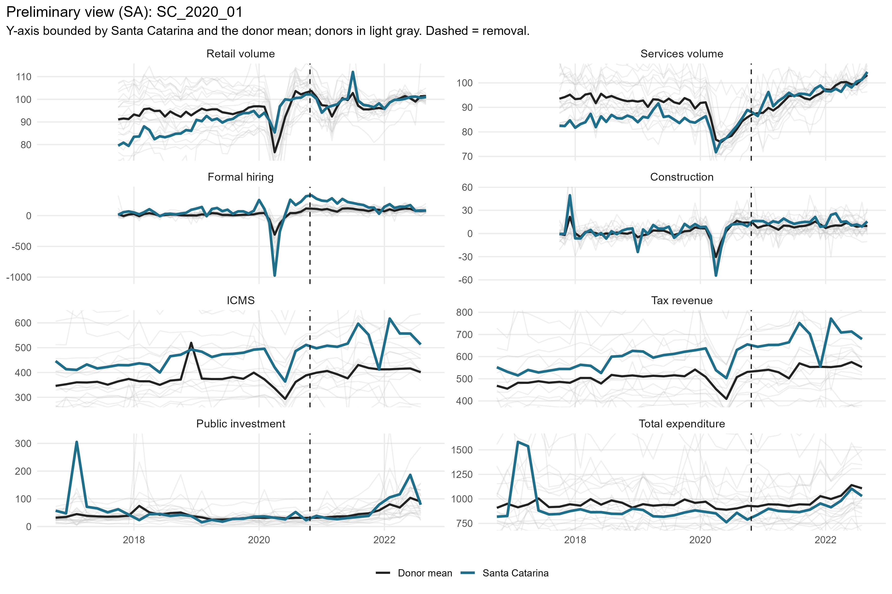
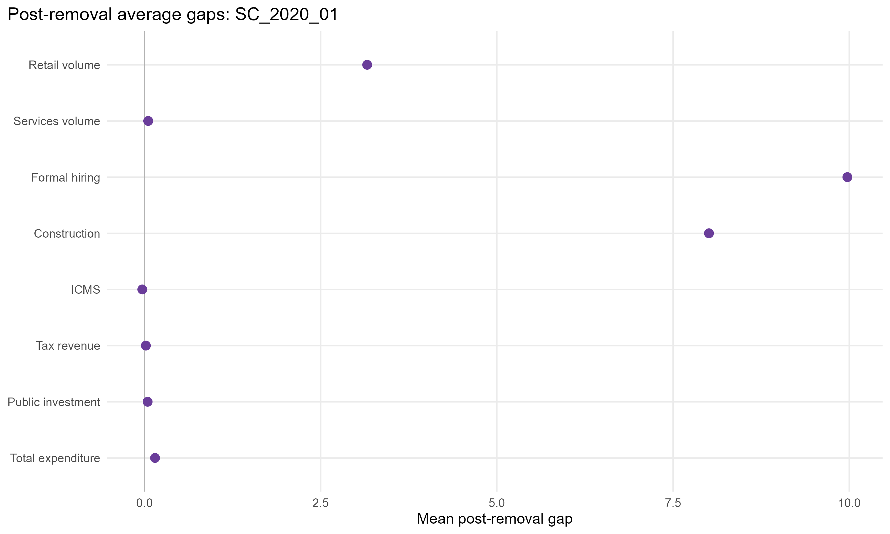
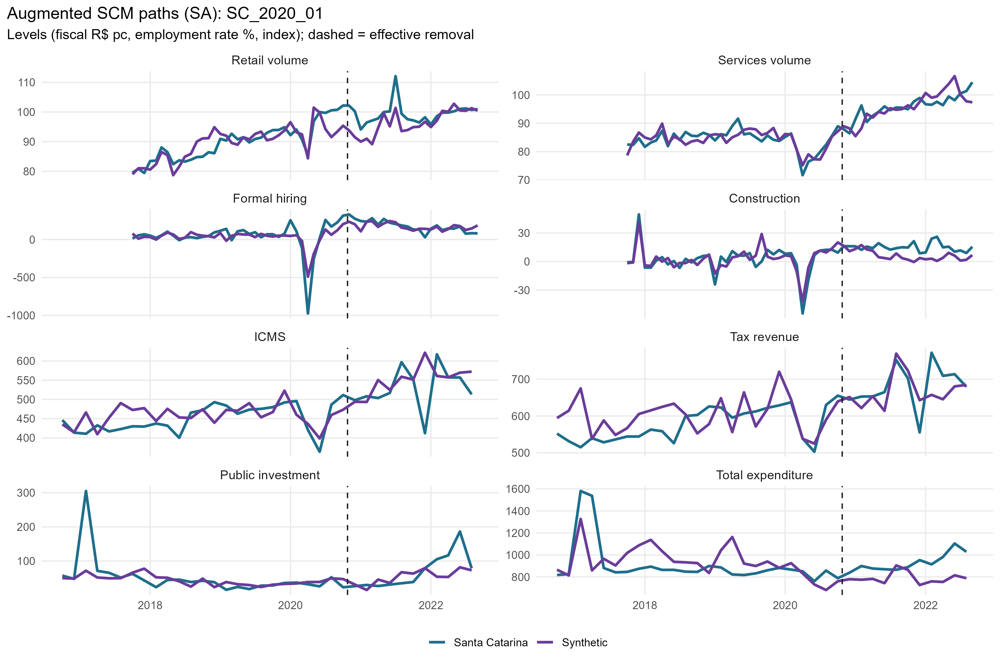
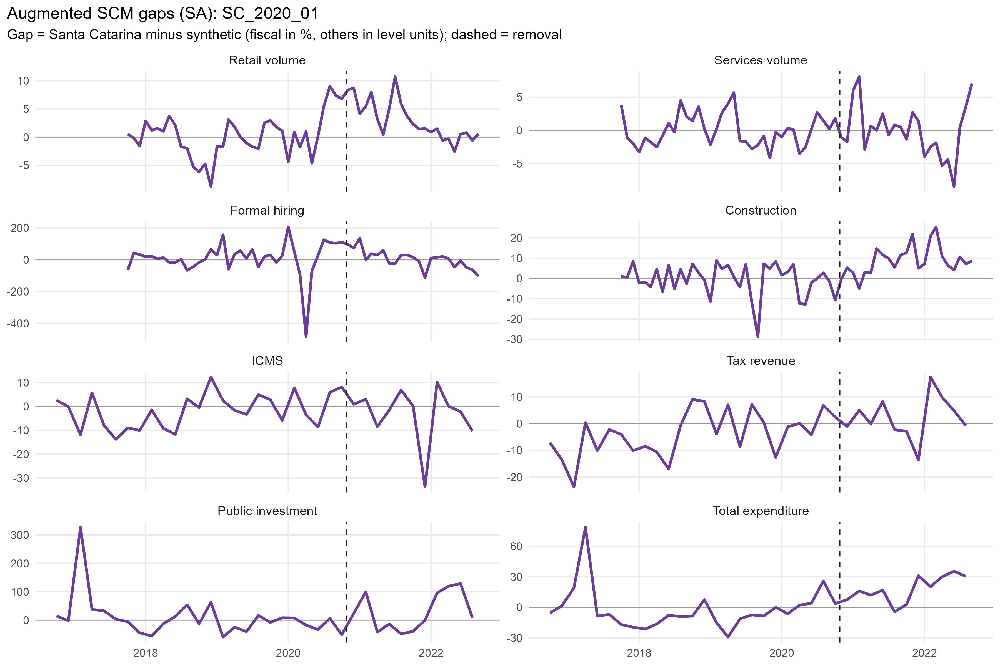
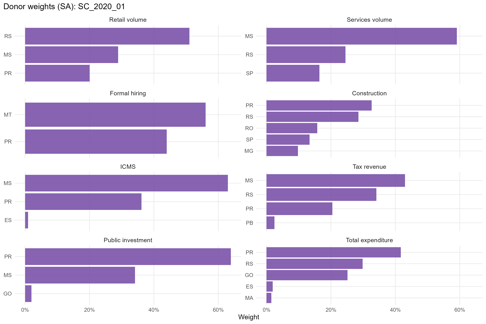
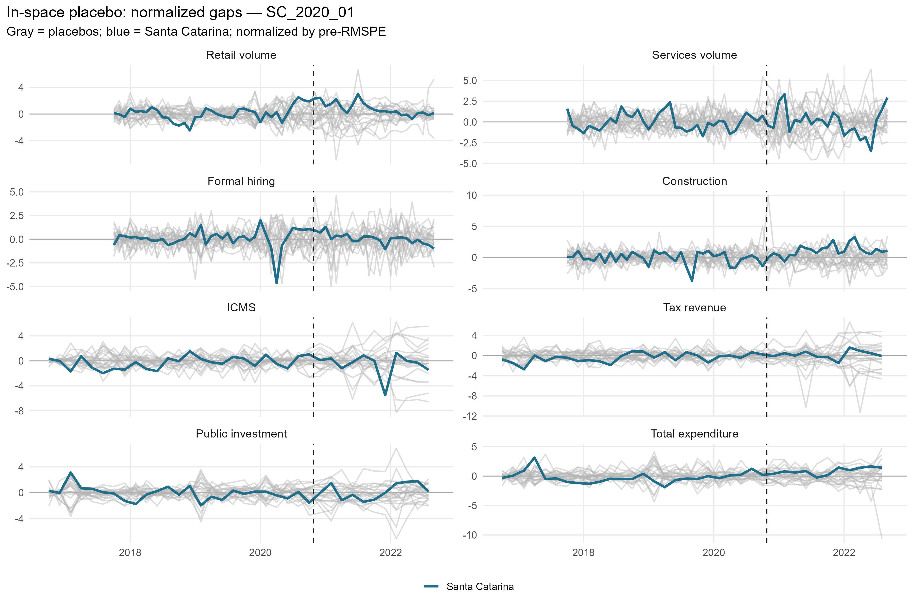
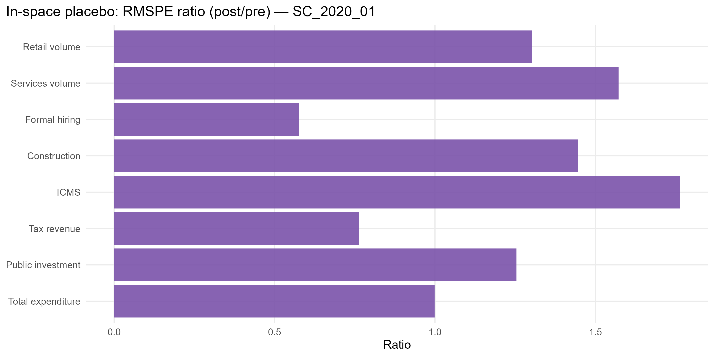

# SC_2020_01 results report (siconfi regime)

Generated on 2026-06-07.

Treated state: `SC` (Santa Catarina). Treatment (single accountability cut): effective removal `2020-10-24`.
Data regime: **siconfi**. Fiscal outcomes (ICMS, tax revenue, public investment, total expenditure) are bimonthly from SICONFI/RREO (STL). Non-fiscal outcomes (retail, services, formal hiring, construction) are monthly (X-13).

## Window design

- Monthly outcomes: target 36-month pre (floor 20), 24-month post.
- Bimonthly (SICONFI) outcomes: target 24-bimester pre (floor 21), 12-bimester post.
- An outcome enters only if the treated unit meets its pre-window floor and a complete post-window.

Qualifying outcomes: Retail volume, Services volume, Formal hiring, Construction, ICMS, Tax revenue, Public investment, Total expenditure.

## Methodological strategy

Main donor pool excludes `AM`, `RJ`, `RR`, `SC`, `TO` (any state treated anywhere in the SCM window). Preferred specification uses 22 eligible donors. Augmented SCM is the headline estimator; weights are estimated on the pre-treatment window. Predictors: the full pre-treatment outcome path plus the regime covariates: PNADc labor covariates (unemployment, formalization, labor income) plus SICONFI transfer dependency and health/education/public-security expenditure per capita.

## Preliminary plots

## Covariate and pre-treatment balance

### Pre-treatment outcome fit

| Outcome | Treated | Synthetic | RMSPE pre | Pre periods |
| --- | --- | --- | --- | --- |
| Retail volume | 89.47 | 89.44 | 3.59 | 36 |
| Services volume | 84.06 | 84.11 | 2.41 | 36 |
| Formal hiring | 35.31 | 27.88 | 104.63 | 36 |
| Construction | 2.09 | 2.36 | 7.76 | 36 |
| ICMS | 6.10 | 6.12 | 0.08 | 24 |
| Tax revenue | 6.35 | 6.40 | 0.10 | 24 |
| Public investment | 3.71 | 3.73 | 0.47 | 24 |
| Total expenditure | 6.80 | 6.84 | 0.18 | 24 |

### Covariate balance (treated vs synthetic by outcome)

| Covariate | Treated | Retail volume | Services volume | Formal hiring | Construction | ICMS | Tax revenue | Public investment | Total expenditure |
| --- | --- | --- | --- | --- | --- | --- | --- | --- | --- |
| Unemployment rate |     0.051 |     0.070 |     0.076 |     0.070 |     0.078 |     0.070 |     0.071 |     0.070 |     0.075 |
| Formalization rate |     0.731 |     0.660 |     0.655 |     0.638 |     0.643 |     0.646 |     0.650 |     0.655 |     0.647 |
| Labor income (real) | 3,573.200 | 3,497.172 | 3,535.816 | 3,425.896 | 3,473.313 | 3,391.550 | 3,423.704 | 3,466.357 | 3,422.662 |
| Transfer dependency ratio |     0.046 |     0.059 |     0.058 |     0.066 |     0.071 |     0.061 |     0.063 |     0.058 |     0.063 |
| Health expenditure pc |   111.891 |   116.345 |   114.064 |   111.800 |   118.540 |   102.244 |   111.053 |   102.062 |   118.285 |
| Education expenditure pc |   116.595 |   134.781 |   144.631 |   196.760 |   156.401 |   176.985 |   145.265 |   194.206 |   159.568 |
| Public security expenditure pc |    80.820 |    94.666 |    98.575 |   117.984 |    97.027 |   100.189 |    97.166 |    92.154 |    90.525 |

## Main results: Augmented SCM (SA)

| Channel | Outcome | Mean gap post | RMSPE pre | RMSPE post | Donors | Freq |
| --- | --- | --- | --- | --- | --- | --- |
| Household consumption | Retail volume index (PMC, SA level) |  3.16 |   3.59 |  4.67 | 22 | monthly |
| Household consumption | Services volume index (PMS, SA level) |  0.05 |   2.41 |  3.79 | 22 | monthly |
| Formal labor market | Formal hiring balance per 100k pop |  9.97 | 104.63 | 60.16 | 22 | monthly |
| Formal labor market | Construction hiring balance per 100k pop |  8.01 |   7.76 | 11.22 | 22 | monthly |
| State public finances | ICMS revenue, log real per capita (SICONFI) | -0.03 |   0.08 |  0.13 | 20 | bimonthly |
| State public finances | Own tax revenue, log real per capita (SICONFI) |  0.02 |   0.10 |  0.08 | 22 | bimonthly |
| State public finances | Public investment, log real per capita (SICONFI) |  0.04 |   0.47 |  0.58 | 22 | bimonthly |
| State public finances | Total liquidated expenditure, log real per capita (SICONFI) |  0.15 |   0.18 |  0.18 | 21 | bimonthly |

## Donor weights

## In-space placebos

Each eligible donor is treated as pseudo-treated; p = share of placebos with a post/pre RMSPE ratio (or absolute post gap) at least as large as the treated unit's.

| Outcome | RMSPE ratio (post/pre) | p (ratio) | p (abs gap) | Placebos |
| --- | --- | --- | --- | --- |
| Retail volume | 1.30 | 0.409 | 0.409 | 22 |
| Services volume | 1.57 | 0.500 | 1.000 | 22 |
| Formal hiring | 0.58 | 0.909 | 1.000 | 22 |
| Construction | 1.45 | 0.273 | 0.500 | 22 |
| ICMS | 1.76 | 0.429 | 1.000 | 21 |
| Tax revenue | 0.76 | 0.727 | 1.000 | 22 |
| Public investment | 1.25 | 0.409 | 1.000 | 22 |
| Total expenditure | 1.00 | 0.636 | 0.318 | 22 |

## Leave-one-out donor placebo

| Outcome | Gap post | LOO rank | p (2-sided) |
| --- | --- | --- | --- |
| Retail volume | 3.16 | 21 / 23 | 0.13 |
| Services volume | 0.05 | 22 / 23 | 0.087 |
| Formal hiring | 9.97 | 1 / 23 | 0.043 |
| Construction | 8.01 | 22 / 23 | 0.087 |
| ICMS | -0.03 | 2 / 21 | 0.095 |
| Tax revenue | 0.02 | 9 / 23 | 0.391 |
| Public investment | 0.04 | 5 / 23 | 0.217 |
| Total expenditure | 0.15 | 22 / 22 | 0.045 |

## Evidence classification (5-criterion AugSCM ruler)

We do not rely on placebo p-value thresholds alone. Each outcome is graded on five criteria — (C1) pre-treatment fit (treated pre-RMSPE vs the donor median, no pre-trend), (C2) substantive magnitude (post gap >= 1 pre-period SD), (C3) persistence (share of post periods keeping the gap's sign), (C4) placebo position (discrete rank/N p <= 0.15), (C5) robustness (>= 80% of leave-one-out variants keep the sign) — into a 0-5 score. Pre-fit is a hard gate: a poor pre-fit makes the effect *non-interpretable* regardless of the rest. Tiers: **strong** (5/5), **moderate** (>=4 with placebo), **suggestive** (>=3 with magnitude or placebo), **weak**, **non-interpretable**. A *considerable* effect is strong/moderate/suggestive.

Considerable effects for this event: **0** of 8 outcomes.

| Outcome | Tier | Score | Effect | Mag (pre-SD) | Persist | Pre-fit | Placebo rank | p (rank/N) | LOO sign |
| --- | --- | --- | --- | --- | --- | --- | --- | --- | --- |
| Retail volume | weak | 3/5 | +3.3% | 0.53 | 0.83 | C | 10/23 | 0.435 | 1.00 |
| Services volume | weak | 1/5 | +0.1% | 0.01 | 0.54 | B | 12/23 | 0.522 | 0.05 |
| Formal hiring | non-interpretable | 2/5 | +10.0 | 0.05 | 0.62 | D | 21/23 | 0.913 | 1.00 |
| Construction | weak | 3/5 | +8.0 | 0.54 | 0.88 | B | 7/23 | 0.304 | 1.00 |
| ICMS | weak | 2/5 | -3.0% | 0.39 | 0.50 | B | 10/22 | 0.455 | 0.85 |
| Tax revenue | non-interpretable | 1/5 | +2.0% | 0.26 | 0.50 | C | 17/23 | 0.739 | 0.95 |
| Public investment | weak | 2/5 | +4.6% | 0.08 | 0.45 | B | 10/23 | 0.435 | 0.91 |
| Total expenditure | non-interpretable | 2/5 | +16.2% | 0.86 | 0.92 | D | 15/23 | 0.652 | 0.95 |

Note: placebo-based inference in synthetic control is discrete and low-resolution with few donors (here the finest p is ~1/N). Results with p slightly above conventional thresholds but a high placebo rank, good pre-fit, substantive magnitude and persistence are read as *suggestive* evidence, not as conventional statistical significance.

