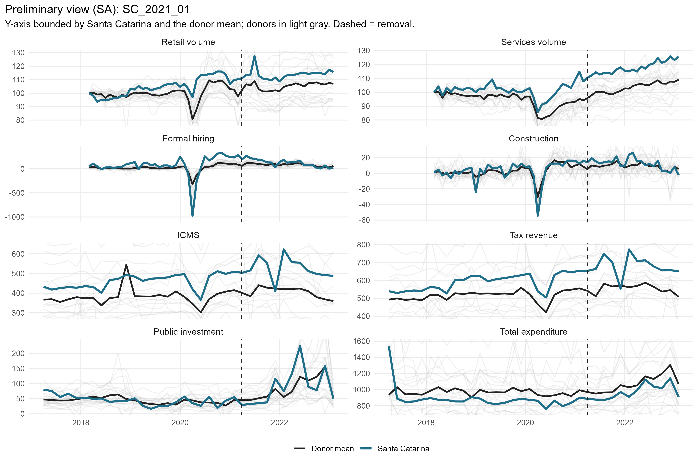
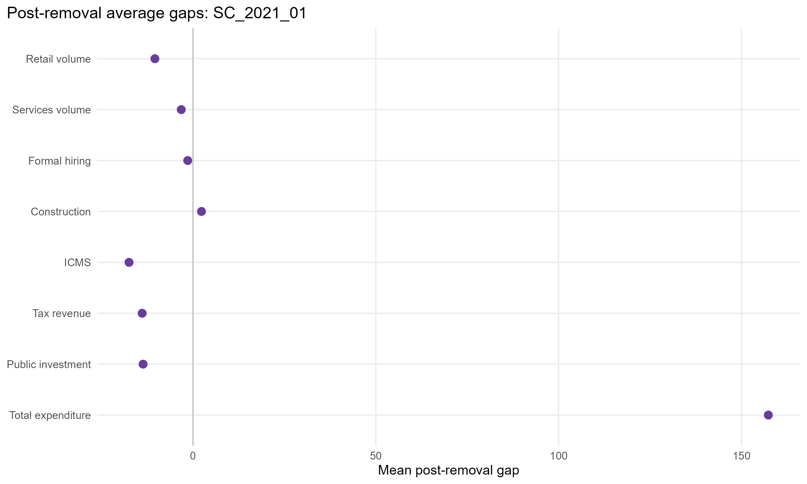
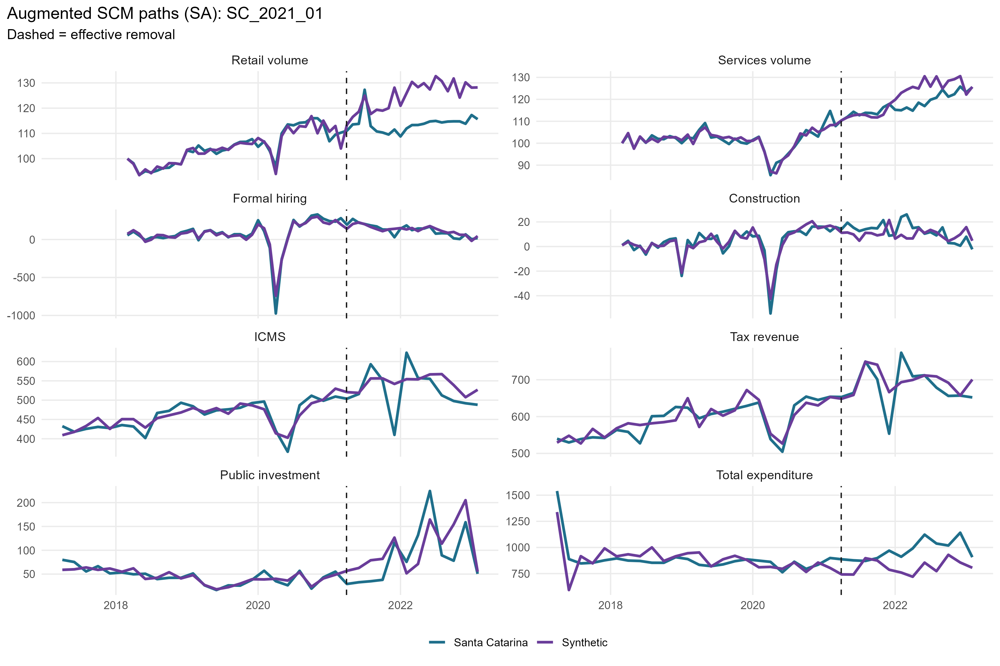
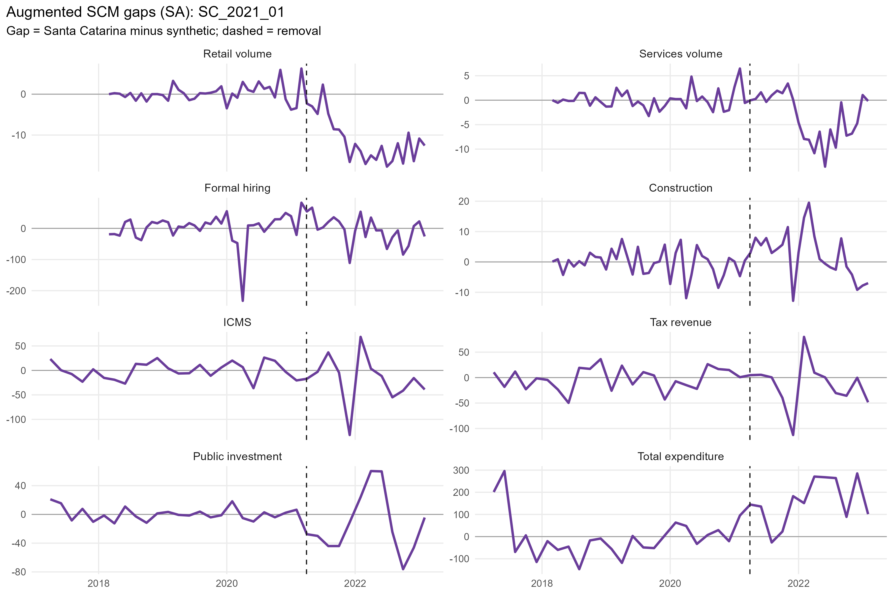
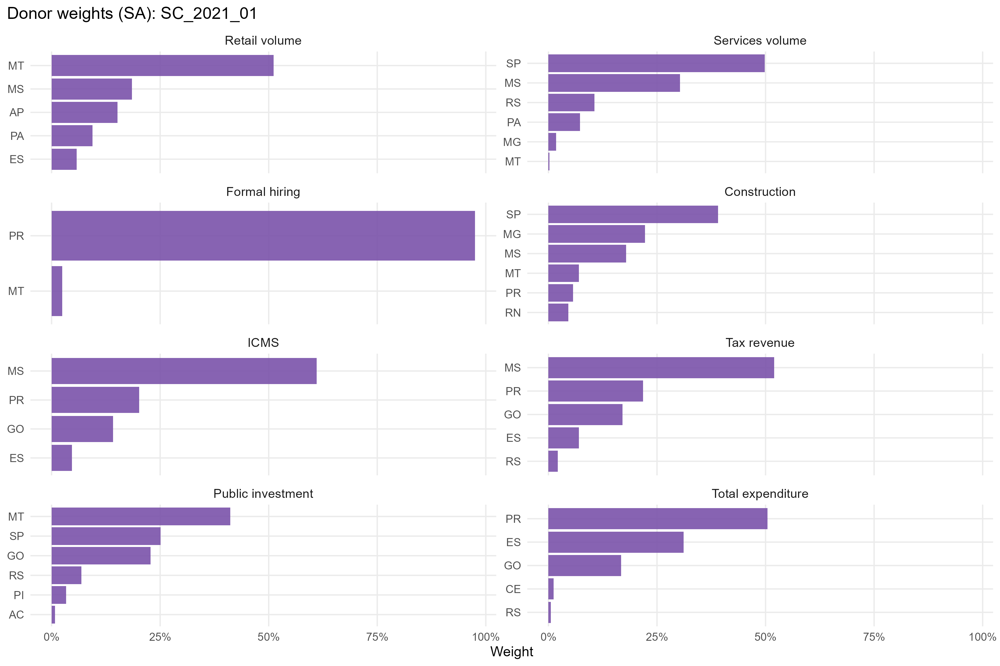
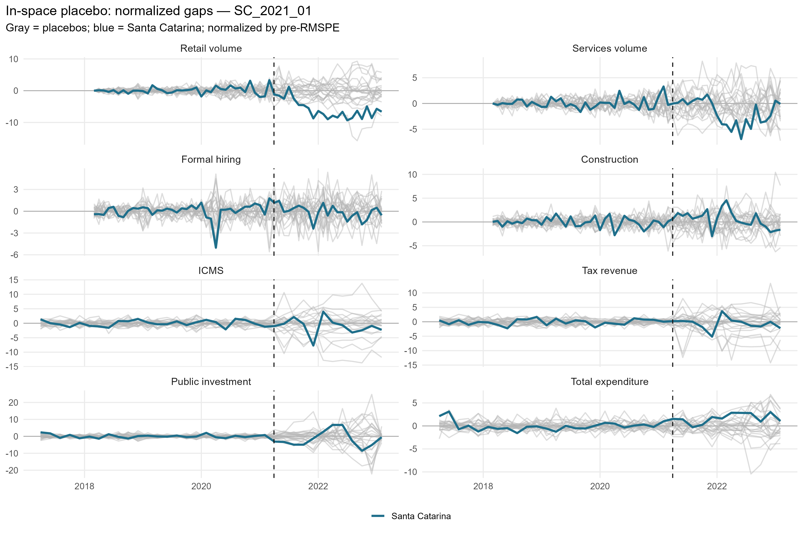
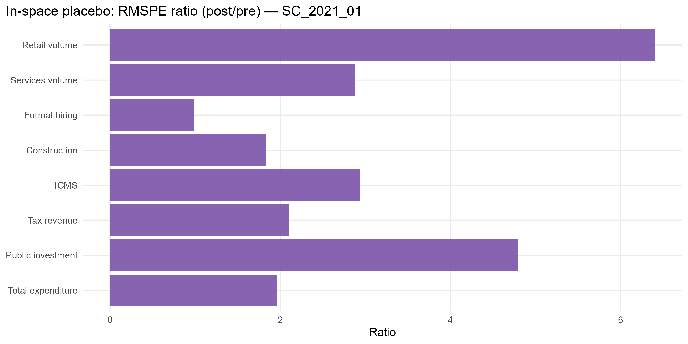

# SC_2021_01 results report (siconfi regime)

Generated on 2026-06-06.

Treated state: `SC` (Santa Catarina). Treatment (single accountability cut): effective removal `2021-03-30`.
Data regime: **siconfi**. Fiscal outcomes (ICMS, tax revenue, public investment, total expenditure) are bimonthly from SICONFI/RREO (STL). Non-fiscal outcomes (retail, services, formal hiring, construction) are monthly (X-13).

## Window design

- Monthly outcomes: target 36-month pre (floor 20), 24-month post.
- Bimonthly (SICONFI) outcomes: target 24-bimester pre (floor 21), 12-bimester post.
- An outcome enters only if the treated unit meets its pre-window floor and a complete post-window.

Qualifying outcomes: Retail volume, Services volume, Formal hiring, Construction, ICMS, Tax revenue, Public investment, Total expenditure.

## Methodological strategy

Main donor pool excludes `AL`, `AM`, `RJ`, `RR`, `SC`, `TO` (any state treated anywhere in the SCM window). Preferred specification uses 21 eligible donors. Augmented SCM is the headline estimator; weights are estimated on the pre-treatment window. Predictors: the full pre-treatment outcome path plus the regime covariates: PNADc labor covariates (unemployment, formalization, labor income) plus SICONFI transfer dependency and health/education/public-security expenditure per capita.

## Preliminary plots

## Covariate and pre-treatment balance

### Pre-treatment outcome fit

| Outcome | Treated | Synthetic | RMSPE pre | Pre periods |
| --- | --- | --- | --- | --- |
| Retail volume | 104.39 | 104.29 | 1.90 | 36 |
| Services volume | 101.36 | 101.25 | 1.96 | 36 |
| Formal hiring | 68.29 | 68.59 | 46.34 | 36 |
| Construction | 3.04 | 3.35 | 4.28 | 36 |
| ICMS | 458.10 | 458.29 | 17.14 | 24 |
| Tax revenue | 588.61 | 590.88 | 21.87 | 24 |
| Public investment | 45.24 | 44.41 | 8.94 | 24 |
| Total expenditure | 887.04 | 889.43 | 94.44 | 24 |

### Covariate balance (treated vs synthetic by outcome)

| Covariate | Treated | Retail volume | Services volume | Formal hiring | Construction | ICMS | Tax revenue | Public investment | Total expenditure |
| --- | --- | --- | --- | --- | --- | --- | --- | --- | --- |
| Unemployment rate |     0.051 |     0.088 |     0.093 |     0.071 |     0.096 |     0.075 |     0.076 |     0.087 |     0.084 |
| Formalization rate |     0.731 |     0.578 |     0.655 |     0.668 |     0.645 |     0.636 |     0.636 |     0.630 |     0.635 |
| Labor income (real) | 3,585.959 | 3,140.318 | 3,760.773 | 3,568.498 | 3,549.374 | 3,319.804 | 3,320.153 | 3,492.853 | 3,336.213 |
| Transfer dependency ratio |     0.052 |     0.123 |     0.060 |     0.064 |     0.067 |     0.074 |     0.076 |     0.076 |     0.103 |
| Health expenditure pc |   113.240 |   130.977 |   119.063 |   102.004 |   111.465 |   109.568 |   112.431 |   128.537 |   125.189 |
| Education expenditure pc |   116.976 |   181.079 |   156.717 |   211.420 |   155.682 |   163.063 |   160.933 |   167.548 |   160.231 |
| Public security expenditure pc |    80.385 |   132.159 |    84.326 |    82.033 |   103.243 |   102.671 |   101.042 |   110.732 |    85.738 |

## Main results: Augmented SCM (SA)

| Channel | Outcome | Mean gap post | RMSPE pre | RMSPE post | Donors | Freq |
| --- | --- | --- | --- | --- | --- | --- |
| Household consumption | Retail volume index (PMC) | -10.41 |  1.90 |  12.18 | 21 | monthly |
| Household consumption | Services volume index (PMS) |  -3.20 |  1.96 |   5.65 | 21 | monthly |
| Formal labor market | Formal hiring balance per 100k pop |  -1.43 | 46.34 |  45.83 | 21 | monthly |
| Formal labor market | Construction hiring balance per 100k pop |   2.33 |  4.28 |   7.85 | 21 | monthly |
| State public finances | ICMS revenue, real per capita (SICONFI) | -17.48 | 17.14 |  50.33 | 20 | bimonthly |
| State public finances | Own tax revenue, real per capita (SICONFI) | -13.89 | 21.87 |  46.01 | 21 | bimonthly |
| State public finances | Public investment, real per capita (SICONFI) | -13.64 |  8.94 |  42.82 | 21 | bimonthly |
| State public finances | Total liquidated expenditure, real per capita (SICONFI) | 157.35 | 94.44 | 185.03 | 21 | bimonthly |

## Donor weights

## In-space placebos

Each eligible donor is treated as pseudo-treated; p = share of placebos with a post/pre RMSPE ratio (or absolute post gap) at least as large as the treated unit's.

| Outcome | RMSPE ratio (post/pre) | p (ratio) | p (abs gap) | Placebos |
| --- | --- | --- | --- | --- |
| Retail volume | 6.40 | 0.048 | 0.000 | 21 |
| Services volume | 2.88 | 0.238 | 0.429 | 21 |
| Formal hiring | 0.99 | 0.857 | 1.000 | 21 |
| Construction | 1.83 | 0.381 | 1.000 | 21 |
| ICMS | 2.94 | 0.300 | 0.800 | 20 |
| Tax revenue | 2.10 | 0.524 | 1.000 | 21 |
| Public investment | 4.79 | 0.524 | 0.857 | 21 |
| Total expenditure | 1.96 | 0.524 | 0.286 | 21 |

## Leave-one-out donor placebo

| Outcome | Gap post | LOO rank | p (2-sided) |
| --- | --- | --- | --- |
| Retail volume | -10.41 | 1 / 22 | 0.045 |
| Services volume | -3.2 | 1 / 22 | 0.045 |
| Formal hiring | -1.43 | 1 / 22 | 0.045 |
| Construction | 2.33 | 12 / 22 | 0.5 |
| ICMS | -17.48 | 3 / 21 | 0.143 |
| Tax revenue | -13.89 | 1 / 22 | 0.045 |
| Public investment | -13.64 | 2 / 22 | 0.091 |
| Total expenditure | 157.35 | 22 / 22 | 0.045 |

## Evidence classification (5-criterion AugSCM ruler)

We do not rely on placebo p-value thresholds alone. Each outcome is graded on five criteria — (C1) pre-treatment fit (treated pre-RMSPE vs the donor median, no pre-trend), (C2) substantive magnitude (post gap >= 1 pre-period SD), (C3) persistence (share of post periods keeping the gap's sign), (C4) placebo position (discrete rank/N p <= 0.15), (C5) robustness (>= 80% of leave-one-out variants keep the sign) — into a 0-5 score. Pre-fit is a hard gate: a poor pre-fit makes the effect *non-interpretable* regardless of the rest. Tiers: **strong** (5/5), **moderate** (>=4 with placebo), **suggestive** (>=3 with magnitude or placebo), **weak**, **non-interpretable**. A *considerable* effect is strong/moderate/suggestive.

Considerable effects for this event: **1** of 8 outcomes.

| Outcome | Tier | Score | % effect | Mag (pre-SD) | Persist | Pre-fit | Placebo rank | p (rank/N) | LOO sign |
| --- | --- | --- | --- | --- | --- | --- | --- | --- | --- |
| Retail volume | strong | 5/5 |  -8.4 | 1.57 | 0.92 | B | 2/22 | 0.091 | 0.90 |
| Services volume | non-interpretable | 1/5 |  -2.7 | 0.62 | 0.67 | C | 6/22 | 0.273 | 0.00 |
| Formal hiring | non-interpretable | 0/5 |  -1.1 | 0.01 | 0.54 | D | 19/22 | 0.864 | 0.00 |
| Construction | weak | 3/5 |  22.9 | 0.18 | 0.62 | A | 9/22 | 0.409 | 1.00 |
| ICMS | weak | 3/5 |  -3.2 | 0.46 | 0.75 | B | 7/21 | 0.333 | 0.95 |
| Tax revenue | weak | 1/5 |  -2.0 | 0.30 | 0.50 | B | 12/22 | 0.545 | 0.10 |
| Public investment | non-interpretable | 2/5 | -13.4 | 0.82 | 0.75 | C | 12/22 | 0.545 | 0.95 |
| Total expenditure | non-interpretable | 3/5 |  19.4 | 1.10 | 0.92 | C | 12/22 | 0.545 | 1.00 |

Note: placebo-based inference in synthetic control is discrete and low-resolution with few donors (here the finest p is ~1/N). Results with p slightly above conventional thresholds but a high placebo rank, good pre-fit, substantive magnitude and persistence are read as *suggestive* evidence, not as conventional statistical significance.

