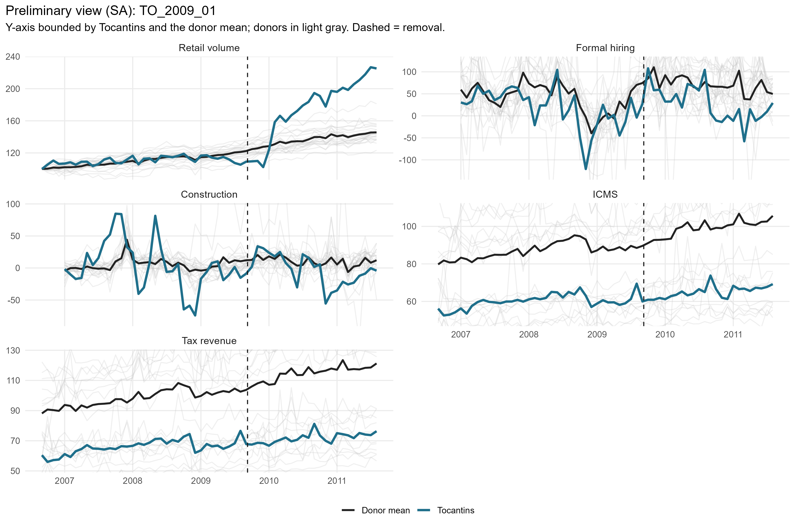
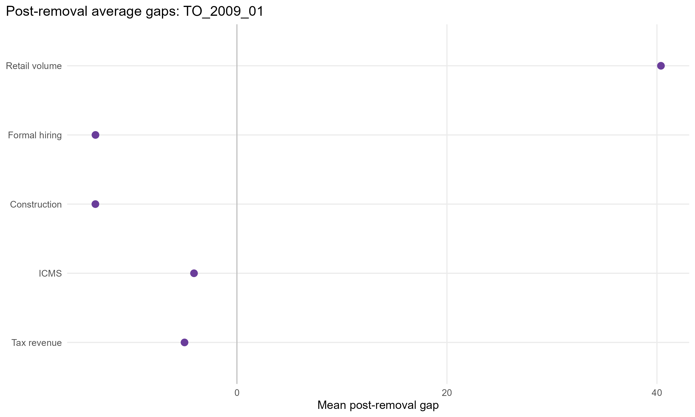
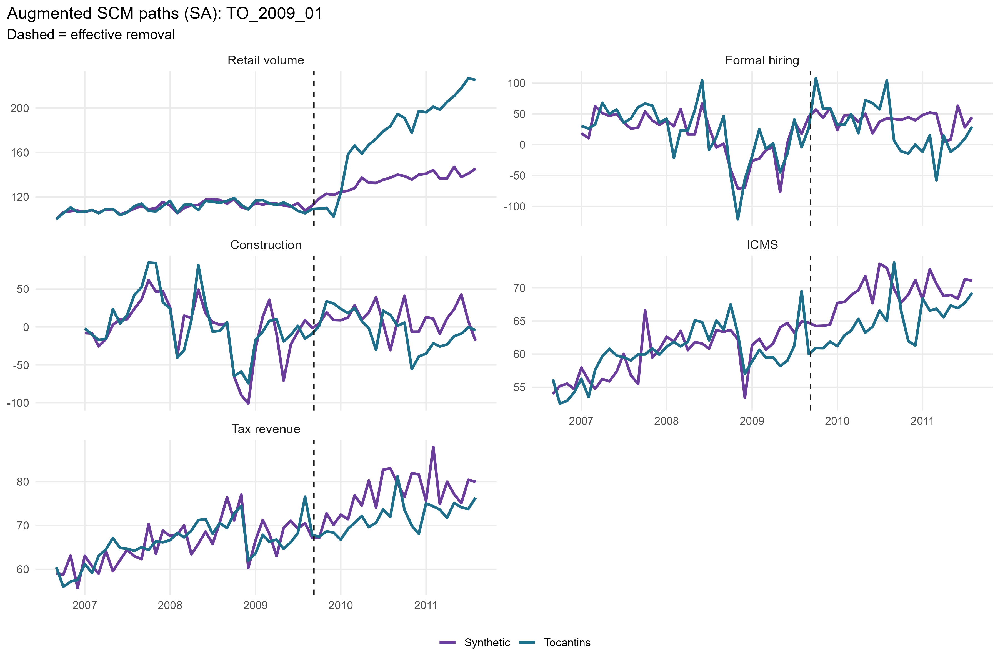
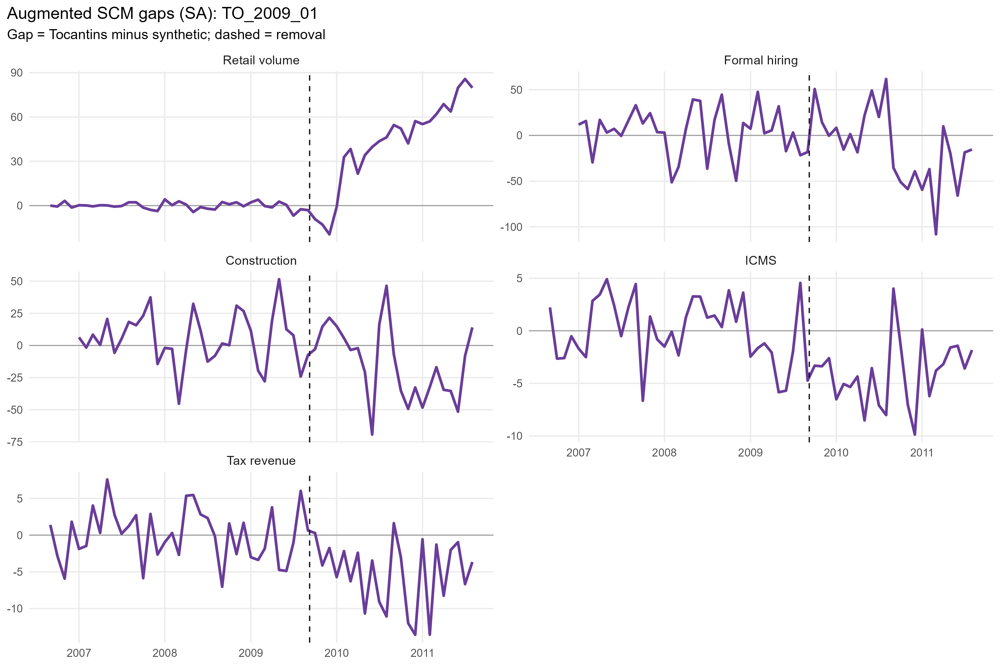
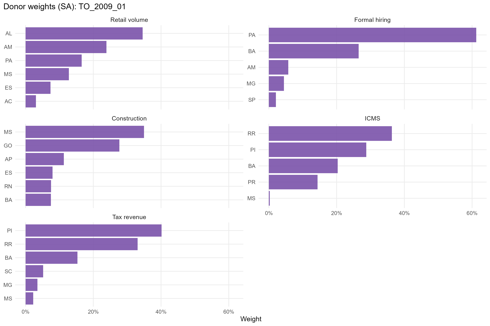
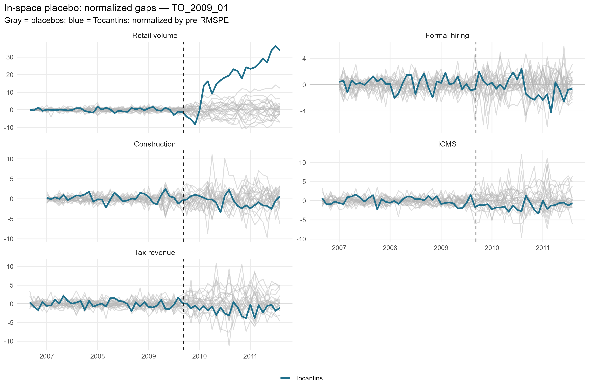
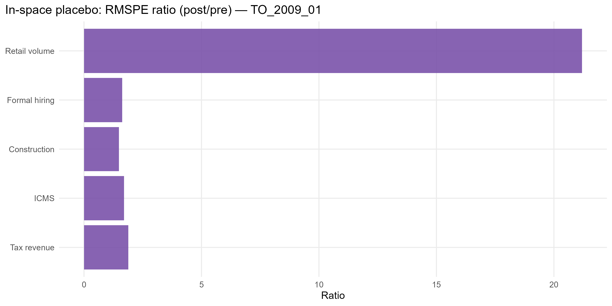

# TO_2009_01 results report (confaz regime)

Generated on 2026-06-06.

Treated state: `TO` (Tocantins). Treatment (single accountability cut): effective removal `2009-09-08`.
Data regime: **confaz**. All outcomes are monthly (X-13); fiscal outcomes (ICMS, tax revenue) are from CONFAZ.

## Window design

- Monthly outcomes: target 36-month pre (floor 20), 24-month post.
- An outcome enters only if the treated unit meets its pre-window floor and a complete post-window.

Qualifying outcomes: Retail volume, Formal hiring, Construction, ICMS, Tax revenue.

## Methodological strategy

Main donor pool excludes `DF`, `MA`, `PB`, `TO` (any state treated anywhere in the SCM window). Preferred specification uses 23 eligible donors. Augmented SCM is the headline estimator; weights are estimated on the pre-treatment window. Predictors: the full pre-treatment outcome path plus the regime covariates: CONFAZ ICMS sectors (secondary, tertiary, energy, fuels) plus FPE and IOF-state, real per capita.

## Preliminary plots

## Covariate and pre-treatment balance

### Pre-treatment outcome fit

| Outcome | Treated | Synthetic | RMSPE pre | Pre periods |
| --- | --- | --- | --- | --- |
| Retail volume | 110.68 | 110.72 | 2.36 | 36 |
| Formal hiring | 18.87 | 14.03 | 25.66 | 32 |
| Construction | 3.68 | -1.77 | 20.63 | 32 |
| ICMS | 60.09 | 59.96 | 2.97 | 36 |
| Tax revenue | 65.92 | 65.88 | 3.57 | 36 |

### Covariate balance (treated vs synthetic by outcome)

| Covariate | Treated | Retail volume | Formal hiring | Construction | ICMS | Tax revenue |
| --- | --- | --- | --- | --- | --- | --- |
| ICMS secondary VA pc |  6.188 | 13.600 | 11.102 | 11.173 |  7.041 |  6.844 |
| ICMS tertiary VA pc | 18.615 | 32.457 | 19.457 | 36.569 | 20.772 | 20.393 |
| ICMS energy VA pc |  4.610 |  3.935 |  4.214 |  5.826 |  4.350 |  3.926 |
| ICMS fuels VA pc | 13.183 | 10.104 |  9.736 | 18.400 | 11.819 | 11.125 |
| FPE transfer pc | 81.070 | 29.128 | 18.501 | 33.185 | 72.566 | 70.237 |
| IOF-state pc |  0.000 |  0.001 |  0.004 |  0.003 |  0.002 |  0.002 |

## Main results: Augmented SCM (SA)

| Channel | Outcome | Mean gap post | RMSPE pre | RMSPE post | Donors | Freq |
| --- | --- | --- | --- | --- | --- | --- |
| Household consumption | Retail volume index (PMC) |  40.38 |  2.36 | 50.08 | 23 | monthly |
| Formal labor market | Formal hiring balance per 100k pop | -13.47 | 25.66 | 41.69 | 23 | monthly |
| Formal labor market | Construction hiring balance per 100k pop | -13.48 | 20.63 | 30.61 | 23 | monthly |
| State public finances | ICMS value added, real per capita (CONFAZ) |  -4.09 |  2.97 |  5.06 | 23 | monthly |
| State public finances | Tax revenue value added, real per capita (CONFAZ) |  -4.99 |  3.57 |  6.74 | 23 | monthly |

## Donor weights

## In-space placebos

Each eligible donor is treated as pseudo-treated; p = share of placebos with a post/pre RMSPE ratio (or absolute post gap) at least as large as the treated unit's.

| Outcome | RMSPE ratio (post/pre) | p (ratio) | p (abs gap) | Placebos |
| --- | --- | --- | --- | --- |
| Retail volume | 21.20 | 0.000 | 0.000 | 23 |
| Formal hiring |  1.62 | 0.565 | 0.957 | 23 |
| Construction |  1.48 | 0.826 | 0.304 | 23 |
| ICMS |  1.70 | 0.826 | 0.826 | 23 |
| Tax revenue |  1.89 | 0.783 | 0.783 | 23 |

## Leave-one-out donor placebo

| Outcome | Gap post | LOO rank | p (2-sided) |
| --- | --- | --- | --- |
| Retail volume | 40.38 | 11 / 24 | 0.458 |
| Formal hiring | -13.47 | 24 / 24 | 0.042 |
| Construction | -13.48 | 23 / 24 | 0.083 |
| ICMS | -4.09 | 4 / 24 | 0.167 |
| Tax revenue | -4.99 | 24 / 24 | 0.042 |

## Evidence classification (5-criterion AugSCM ruler)

We do not rely on placebo p-value thresholds alone. Each outcome is graded on five criteria — (C1) pre-treatment fit (treated pre-RMSPE vs the donor median, no pre-trend), (C2) substantive magnitude (post gap >= 1 pre-period SD), (C3) persistence (share of post periods keeping the gap's sign), (C4) placebo position (discrete rank/N p <= 0.15), (C5) robustness (>= 80% of leave-one-out variants keep the sign) — into a 0-5 score. Pre-fit is a hard gate: a poor pre-fit makes the effect *non-interpretable* regardless of the rest. Tiers: **strong** (5/5), **moderate** (>=4 with placebo), **suggestive** (>=3 with magnitude or placebo), **weak**, **non-interpretable**. A *considerable* effect is strong/moderate/suggestive.

Considerable effects for this event: **2** of 5 outcomes.

| Outcome | Tier | Score | % effect | Mag (pre-SD) | Persist | Pre-fit | Placebo rank | p (rank/N) | LOO sign |
| --- | --- | --- | --- | --- | --- | --- | --- | --- | --- |
| Retail volume | non-interpretable | 4/5 |   30.2 | 8.82 | 0.79 | D | 1/24 | 0.042 | 1.00 |
| Formal hiring | non-interpretable | 2/5 |  -33.0 | 0.30 | 0.62 | C | 14/24 | 0.583 | 1.00 |
| Construction | non-interpretable | 2/5 | -132.5 | 0.35 | 0.71 | D | 20/24 | 0.833 | 1.00 |
| ICMS | suggestive | 4/5 |   -5.9 | 1.09 | 0.92 | B | 20/24 | 0.833 | 1.00 |
| Tax revenue | suggestive | 4/5 |   -6.5 | 1.08 | 0.88 | B | 19/24 | 0.792 | 1.00 |

Note: placebo-based inference in synthetic control is discrete and low-resolution with few donors (here the finest p is ~1/N). Results with p slightly above conventional thresholds but a high placebo rank, good pre-fit, substantive magnitude and persistence are read as *suggestive* evidence, not as conventional statistical significance.

