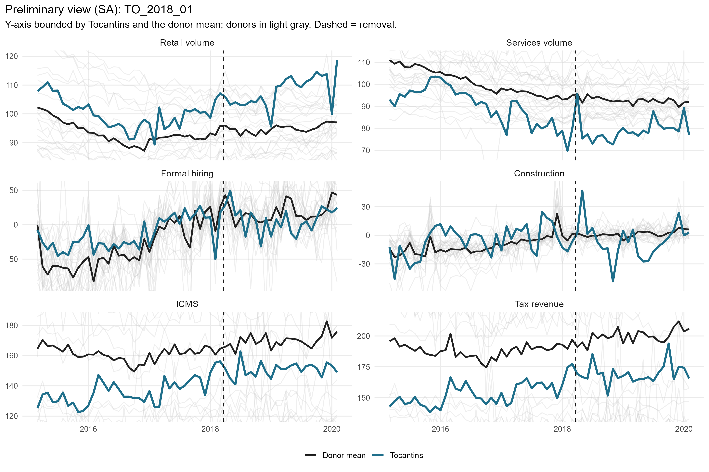
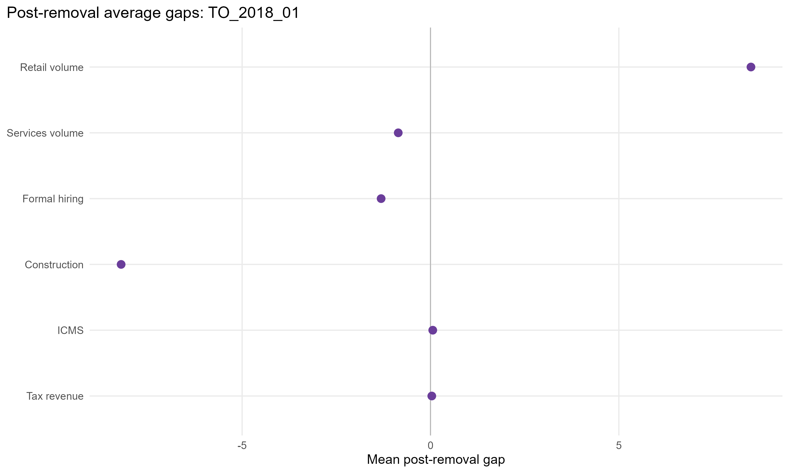
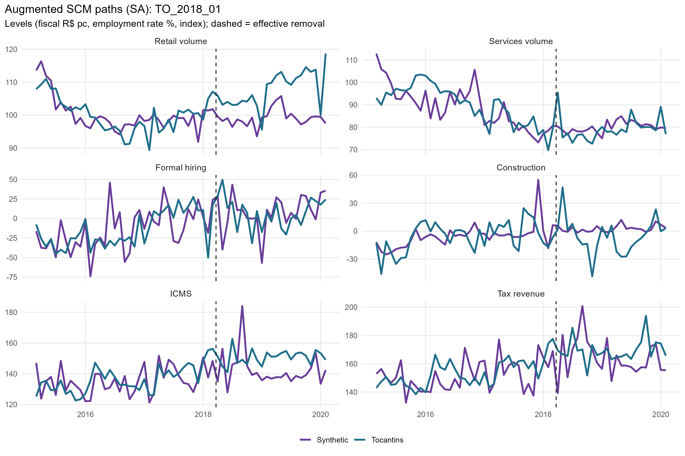
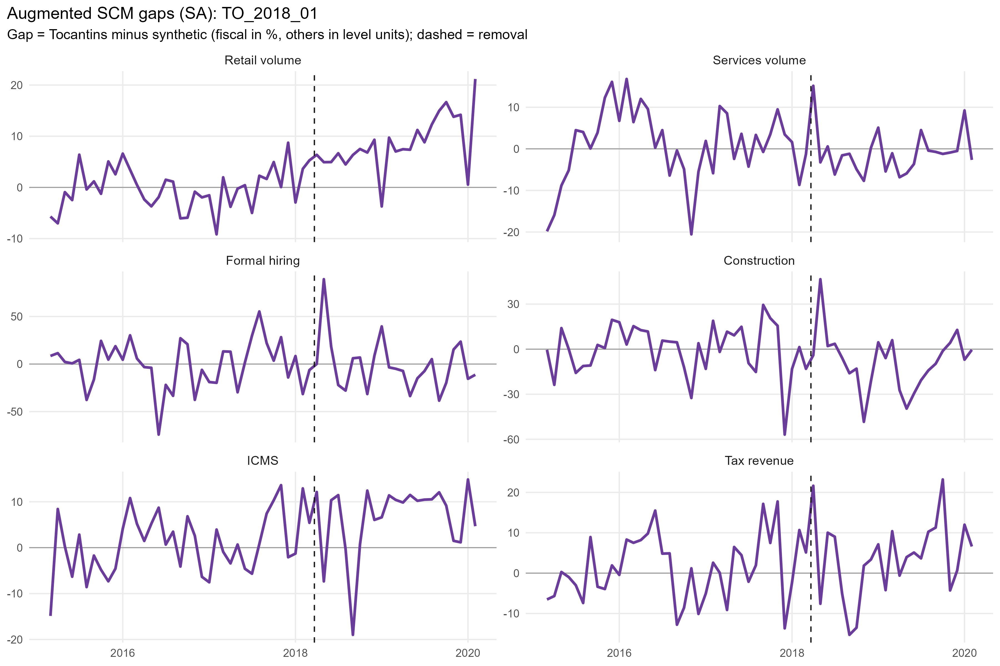
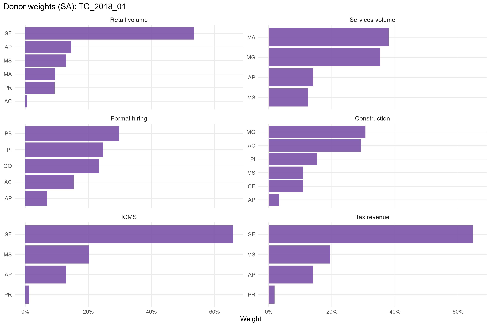
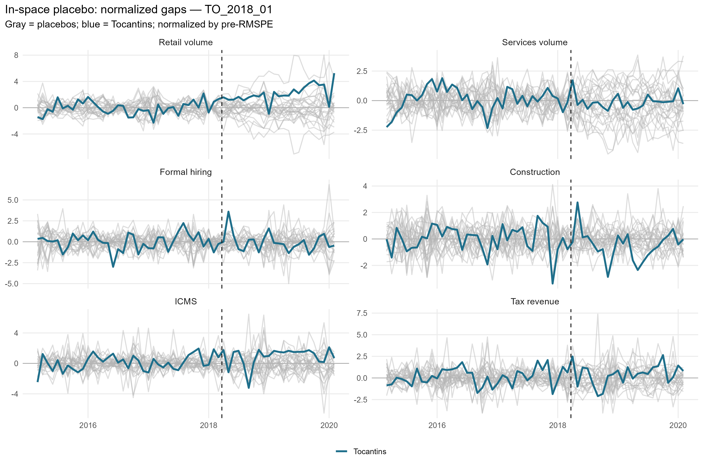
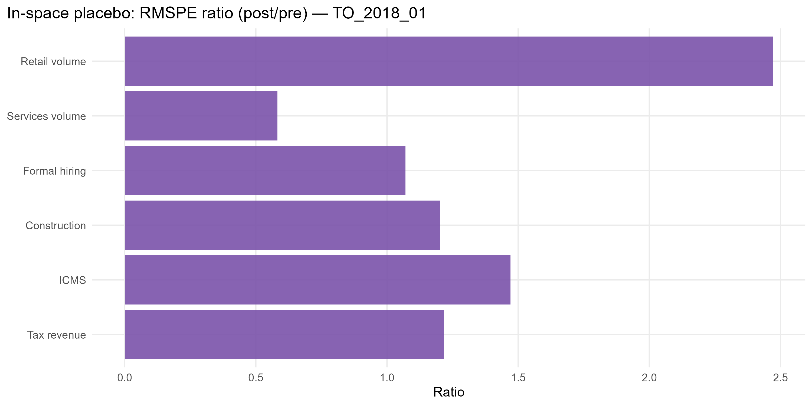

# TO_2018_01 results report (confaz regime)

Generated on 2026-06-07.

Treated state: `TO` (Tocantins). Treatment (single accountability cut): effective removal `2018-03-22`.
Data regime: **confaz**. All outcomes are monthly (X-13); fiscal outcomes (ICMS, tax revenue) are from CONFAZ.

## Window design

- Monthly outcomes: target 36-month pre (floor 20), 24-month post.
- An outcome enters only if the treated unit meets its pre-window floor and a complete post-window.

Qualifying outcomes: Retail volume, Services volume, Formal hiring, Construction, ICMS, Tax revenue.

## Methodological strategy

Main donor pool excludes `AM`, `RR`, `TO` (any state treated anywhere in the SCM window). Preferred specification uses 24 eligible donors. Augmented SCM is the headline estimator; weights are estimated on the pre-treatment window. Predictors: the full pre-treatment outcome path plus the regime covariates: CONFAZ ICMS sectors (secondary, tertiary, energy, fuels) plus FPE and IOF-state, real per capita.

## Preliminary plots

## Covariate and pre-treatment balance

### Pre-treatment outcome fit

| Outcome | Treated | Synthetic | RMSPE pre | Pre periods |
| --- | --- | --- | --- | --- |
| Retail volume | 99.86 | 100.17 | 4.03 | 36 |
| Services volume | 90.26 | 89.33 | 8.84 | 36 |
| Formal hiring | -15.54 | -15.29 | 24.78 | 36 |
| Construction | -5.59 | -5.85 | 16.86 | 36 |
| ICMS | 4.91 | 4.90 | 0.07 | 36 |
| Tax revenue | 5.03 | 5.02 | 0.08 | 36 |

### Covariate balance (treated vs synthetic by outcome)

| Covariate | Treated | Retail volume | Services volume | Formal hiring | Construction | ICMS | Tax revenue |
| --- | --- | --- | --- | --- | --- | --- | --- |
| ICMS secondary VA pc |  14.199 | 16.143 | 21.418 | 15.323 | 20.597 |  16.003 |  16.009 |
| ICMS tertiary VA pc |  37.046 | 48.409 | 40.697 | 54.519 | 71.965 |  52.664 |  52.334 |
| ICMS energy VA pc |   9.989 |  8.978 |  9.595 |  8.381 | 10.085 |   8.717 |   8.709 |
| ICMS fuels VA pc |  29.923 | 23.907 | 27.607 | 18.853 | 22.595 |  26.109 |  26.015 |
| FPE transfer pc | 149.357 | 98.314 | 62.851 | 91.642 | 95.637 | 100.505 | 102.190 |
| IOF-state pc |   0.000 |  0.005 |  0.005 |  0.002 |  0.001 |   0.005 |   0.005 |

## Main results: Augmented SCM (SA)

| Channel | Outcome | Mean gap post | RMSPE pre | RMSPE post | Donors | Freq |
| --- | --- | --- | --- | --- | --- | --- |
| Household consumption | Retail volume index (PMC, SA level) |  8.51 |  4.03 |  9.95 | 24 | monthly |
| Household consumption | Services volume index (PMS, SA level) | -0.86 |  8.84 |  5.15 | 24 | monthly |
| Formal labor market | Formal hiring balance per 100k pop | -1.31 | 24.78 | 26.52 | 24 | monthly |
| Formal labor market | Construction hiring balance per 100k pop | -8.21 | 16.86 | 20.26 | 24 | monthly |
| State public finances | ICMS value added, log real per capita (CONFAZ) |  0.06 |  0.07 |  0.10 | 24 | monthly |
| State public finances | Tax revenue value added, log real per capita (CONFAZ) |  0.03 |  0.08 |  0.10 | 24 | monthly |

## Donor weights

## In-space placebos

Each eligible donor is treated as pseudo-treated; p = share of placebos with a post/pre RMSPE ratio (or absolute post gap) at least as large as the treated unit's.

| Outcome | RMSPE ratio (post/pre) | p (ratio) | p (abs gap) | Placebos |
| --- | --- | --- | --- | --- |
| Retail volume | 2.47 | 0.083 | 0.000 | 24 |
| Services volume | 0.58 | 1.000 | 1.000 | 24 |
| Formal hiring | 1.07 | 0.417 | 1.000 | 24 |
| Construction | 1.20 | 0.000 | 0.125 | 24 |
| ICMS | 1.47 | 0.333 | 0.625 | 24 |
| Tax revenue | 1.22 | 0.583 | 0.958 | 24 |

## Leave-one-out donor placebo

| Outcome | Gap post | LOO rank | p (2-sided) |
| --- | --- | --- | --- |
| Retail volume | 8.51 | 2 / 25 | 0.08 |
| Services volume | -0.86 | 25 / 25 | 0.04 |
| Formal hiring | -1.31 | 24 / 25 | 0.08 |
| Construction | -8.21 | 4 / 25 | 0.16 |
| ICMS | 0.06 | 3 / 25 | 0.12 |
| Tax revenue | 0.03 | 2 / 25 | 0.08 |

## Evidence classification (5-criterion AugSCM ruler)

We do not rely on placebo p-value thresholds alone. Each outcome is graded on five criteria — (C1) pre-treatment fit (treated pre-RMSPE vs the donor median, no pre-trend), (C2) substantive magnitude (post gap >= 1 pre-period SD), (C3) persistence (share of post periods keeping the gap's sign), (C4) placebo position (discrete rank/N p <= 0.15), (C5) robustness (>= 80% of leave-one-out variants keep the sign) — into a 0-5 score. Pre-fit is a hard gate: a poor pre-fit makes the effect *non-interpretable* regardless of the rest. Tiers: **strong** (5/5), **moderate** (>=4 with placebo), **suggestive** (>=3 with magnitude or placebo), **weak**, **non-interpretable**. A *considerable* effect is strong/moderate/suggestive.

Considerable effects for this event: **0** of 6 outcomes.

| Outcome | Tier | Score | Effect | Mag (pre-SD) | Persist | Pre-fit | Placebo rank | p (rank/N) | LOO sign |
| --- | --- | --- | --- | --- | --- | --- | --- | --- | --- |
| Retail volume | non-interpretable | 4/5 | +8.6% | 1.65 | 0.96 | D | 3/25 | 0.120 | 1.00 |
| Services volume | non-interpretable | 2/5 | -1.1% | 0.10 | 0.75 | D | 25/25 | 1.000 | 1.00 |
| Formal hiring | weak | 2/5 | -1.3 | 0.06 | 0.58 | B | 11/25 | 0.440 | 1.00 |
| Construction | non-interpretable | 3/5 | -8.2 | 0.52 | 0.71 | D | 1/25 | 0.040 | 1.00 |
| ICMS | non-interpretable | 3/5 | +6.2% | 1.03 | 0.88 | C | 9/25 | 0.360 | 1.00 |
| Tax revenue | weak | 3/5 | +3.5% | 0.61 | 0.71 | B | 15/25 | 0.600 | 1.00 |

Note: placebo-based inference in synthetic control is discrete and low-resolution with few donors (here the finest p is ~1/N). Results with p slightly above conventional thresholds but a high placebo rank, good pre-fit, substantive magnitude and persistence are read as *suggestive* evidence, not as conventional statistical significance.

