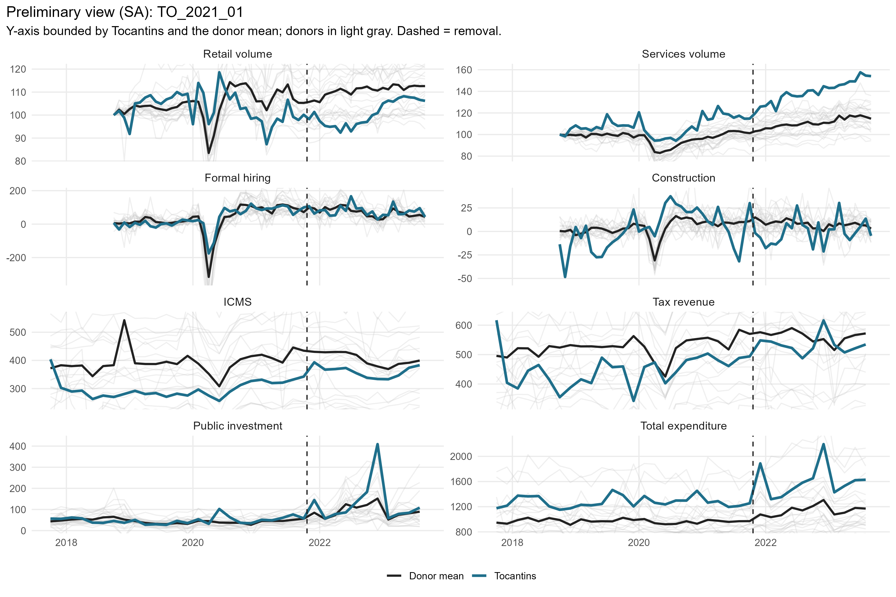
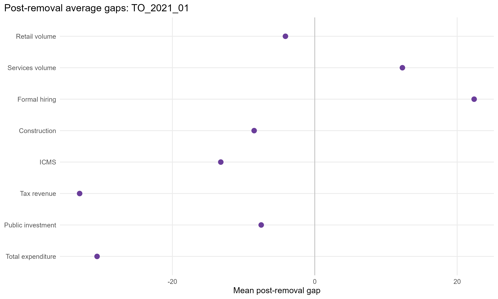
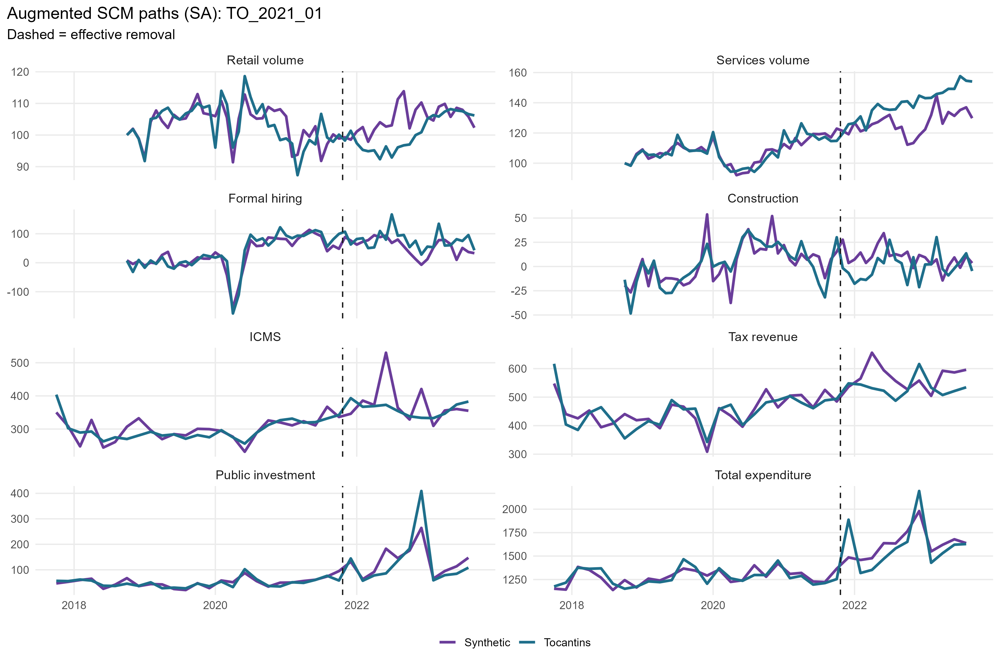
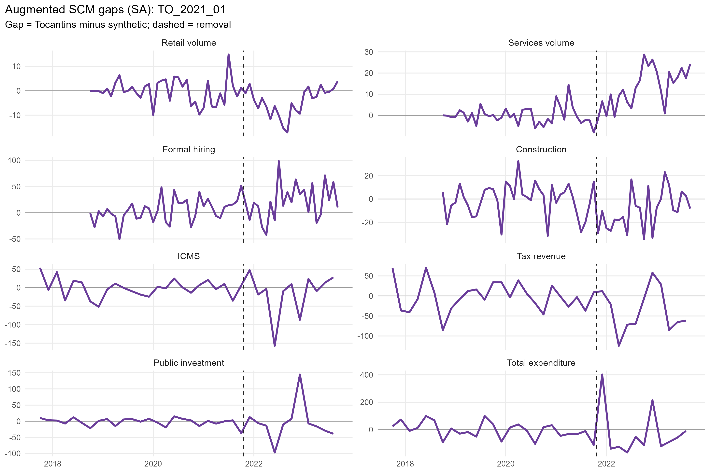
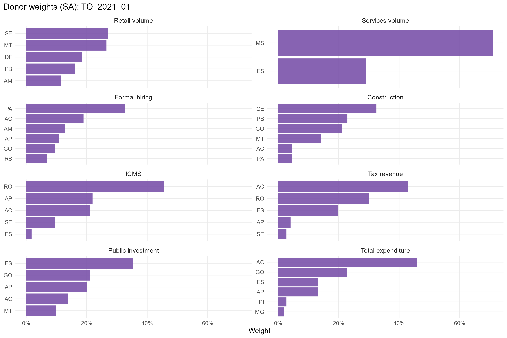
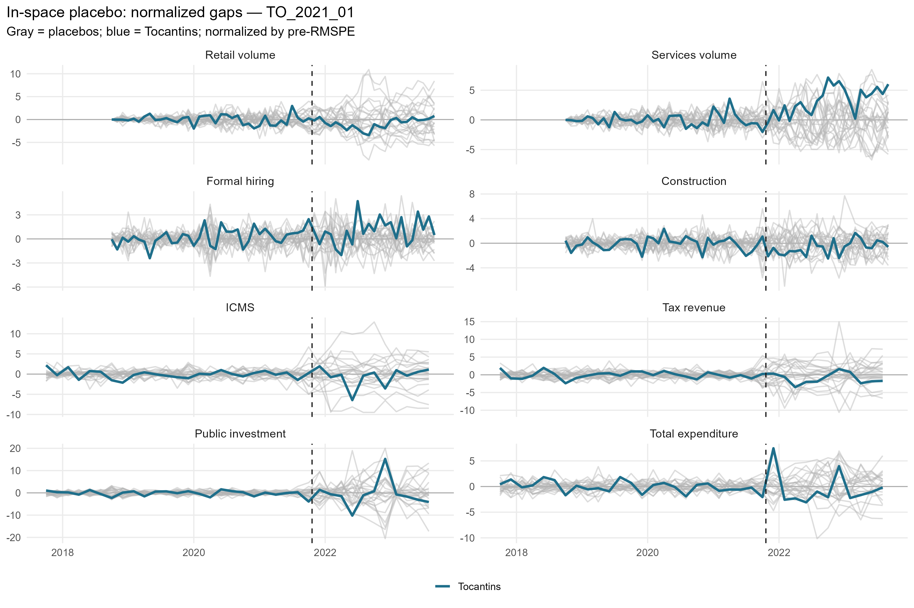
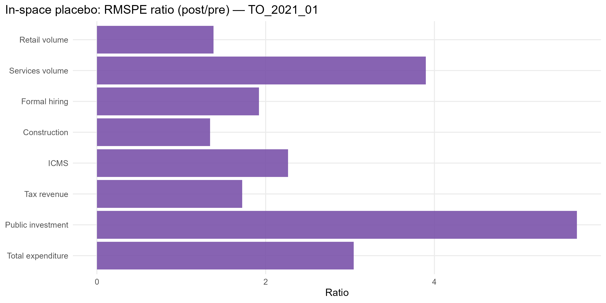

# TO_2021_01 results report (siconfi regime)

Generated on 2026-06-06.

Treated state: `TO` (Tocantins). Treatment (single accountability cut): effective removal `2021-10-20`.
Data regime: **siconfi**. Fiscal outcomes (ICMS, tax revenue, public investment, total expenditure) are bimonthly from SICONFI/RREO (STL). Non-fiscal outcomes (retail, services, formal hiring, construction) are monthly (X-13).

## Window design

- Monthly outcomes: target 36-month pre (floor 20), 24-month post.
- Bimonthly (SICONFI) outcomes: target 24-bimester pre (floor 21), 12-bimester post.
- An outcome enters only if the treated unit meets its pre-window floor and a complete post-window.

Qualifying outcomes: Retail volume, Services volume, Formal hiring, Construction, ICMS, Tax revenue, Public investment, Total expenditure.

## Methodological strategy

Main donor pool excludes `AL`, `RJ`, `RR`, `SC`, `TO` (any state treated anywhere in the SCM window). Preferred specification uses 22 eligible donors. Augmented SCM is the headline estimator; weights are estimated on the pre-treatment window. Predictors: the full pre-treatment outcome path plus the regime covariates: PNADc labor covariates (unemployment, formalization, labor income) plus SICONFI transfer dependency and health/education/public-security expenditure per capita.

## Preliminary plots

## Covariate and pre-treatment balance

### Pre-treatment outcome fit

| Outcome | Treated | Synthetic | RMSPE pre | Pre periods |
| --- | --- | --- | --- | --- |
| Retail volume | 103.29 | 103.41 | 5.01 | 36 |
| Services volume | 107.61 | 107.51 | 4.03 | 36 |
| Formal hiring | 32.17 | 28.48 | 20.89 | 36 |
| Construction | 1.88 | 2.69 | 13.81 | 36 |
| ICMS | 296.69 | 298.40 | 24.40 | 24 |
| Tax revenue | 446.72 | 448.37 | 35.78 | 24 |
| Public investment | 48.51 | 49.11 | 9.49 | 24 |
| Total expenditure | 1,277.54 | 1,277.07 | 54.02 | 24 |

### Covariate balance (treated vs synthetic by outcome)

| Covariate | Treated | Retail volume | Services volume | Formal hiring | Construction | ICMS | Tax revenue | Public investment | Total expenditure |
| --- | --- | --- | --- | --- | --- | --- | --- | --- | --- |
| Unemployment rate |     0.102 |     0.111 |     0.081 |     0.108 |     0.099 |     0.106 |     0.103 |     0.108 |     0.112 |
| Formalization rate |     0.556 |     0.553 |     0.625 |     0.483 |     0.515 |     0.503 |     0.522 |     0.568 |     0.536 |
| Labor income (real) | 2,659.377 | 3,314.464 | 3,246.674 | 2,677.851 | 2,592.656 | 2,721.351 | 2,771.551 | 3,035.630 | 2,855.385 |
| Transfer dependency ratio |     0.255 |     0.152 |     0.108 |     0.177 |     0.155 |     0.248 |     0.244 |     0.195 |     0.226 |
| Health expenditure pc |   251.799 |   166.739 |   121.421 |   155.704 |   112.135 |   184.039 |   201.140 |   176.582 |   205.688 |
| Education expenditure pc |   181.093 |   195.509 |   132.943 |   180.812 |   133.816 |   221.344 |   226.842 |   186.675 |   248.701 |
| Public security expenditure pc |   139.965 |   104.051 |   102.160 |   109.471 |    93.285 |   134.026 |   128.329 |   119.548 |   131.596 |

## Main results: Augmented SCM (SA)

| Channel | Outcome | Mean gap post | RMSPE pre | RMSPE post | Donors | Freq |
| --- | --- | --- | --- | --- | --- | --- |
| Household consumption | Retail volume index (PMC) |  -4.12 |  5.01 |   6.93 | 22 | monthly |
| Household consumption | Services volume index (PMS) |  12.31 |  4.03 |  15.73 | 22 | monthly |
| Formal labor market | Formal hiring balance per 100k pop |  22.38 | 20.89 |  40.11 | 22 | monthly |
| Formal labor market | Construction hiring balance per 100k pop |  -8.52 | 13.81 |  18.52 | 22 | monthly |
| State public finances | ICMS revenue, real per capita (SICONFI) | -13.20 | 24.40 |  55.28 | 21 | bimonthly |
| State public finances | Own tax revenue, real per capita (SICONFI) | -33.03 | 35.78 |  61.65 | 22 | bimonthly |
| State public finances | Public investment, real per capita (SICONFI) |  -7.52 |  9.49 |  54.00 | 22 | bimonthly |
| State public finances | Total liquidated expenditure, real per capita (SICONFI) | -30.58 | 54.02 | 164.43 | 22 | bimonthly |

## Donor weights

## In-space placebos

Each eligible donor is treated as pseudo-treated; p = share of placebos with a post/pre RMSPE ratio (or absolute post gap) at least as large as the treated unit's.

| Outcome | RMSPE ratio (post/pre) | p (ratio) | p (abs gap) | Placebos |
| --- | --- | --- | --- | --- |
| Retail volume | 1.38 | 0.909 | 0.636 | 22 |
| Services volume | 3.90 | 0.045 | 0.000 | 22 |
| Formal hiring | 1.92 | 0.136 | 0.591 | 22 |
| Construction | 1.34 | 0.682 | 0.364 | 22 |
| ICMS | 2.27 | 0.524 | 0.905 | 21 |
| Tax revenue | 1.72 | 0.773 | 0.727 | 22 |
| Public investment | 5.69 | 0.318 | 1.000 | 22 |
| Total expenditure | 3.04 | 0.182 | 1.000 | 22 |

## Leave-one-out donor placebo

| Outcome | Gap post | LOO rank | p (2-sided) |
| --- | --- | --- | --- |
| Retail volume | -4.12 | 23 / 23 | 0.043 |
| Services volume | 12.31 | 1 / 23 | 0.043 |
| Formal hiring | 22.38 | 23 / 23 | 0.043 |
| Construction | -8.52 | 1 / 23 | 0.043 |
| ICMS | -13.2 | 1 / 22 | 0.045 |
| Tax revenue | -33.03 | 1 / 23 | 0.043 |
| Public investment | -7.52 | 1 / 23 | 0.043 |
| Total expenditure | -30.58 | 1 / 23 | 0.043 |

## Evidence classification (5-criterion AugSCM ruler)

We do not rely on placebo p-value thresholds alone. Each outcome is graded on five criteria — (C1) pre-treatment fit (treated pre-RMSPE vs the donor median, no pre-trend), (C2) substantive magnitude (post gap >= 1 pre-period SD), (C3) persistence (share of post periods keeping the gap's sign), (C4) placebo position (discrete rank/N p <= 0.15), (C5) robustness (>= 80% of leave-one-out variants keep the sign) — into a 0-5 score. Pre-fit is a hard gate: a poor pre-fit makes the effect *non-interpretable* regardless of the rest. Tiers: **strong** (5/5), **moderate** (>=4 with placebo), **suggestive** (>=3 with magnitude or placebo), **weak**, **non-interpretable**. A *considerable* effect is strong/moderate/suggestive.

Considerable effects for this event: **0** of 8 outcomes.

| Outcome | Tier | Score | % effect | Mag (pre-SD) | Persist | Pre-fit | Placebo rank | p (rank/N) | LOO sign |
| --- | --- | --- | --- | --- | --- | --- | --- | --- | --- |
| Retail volume | non-interpretable | 2/5 |  -3.9 | 0.62 | 0.75 | D | 21/23 | 0.913 | 1.00 |
| Services volume | non-interpretable | 4/5 |   9.7 | 1.43 | 0.83 | D | 2/23 | 0.087 | 1.00 |
| Formal hiring | non-interpretable | 2/5 |  39.4 | 0.36 | 0.75 | C | 4/23 | 0.174 | 1.00 |
| Construction | non-interpretable | 2/5 | -89.7 | 0.43 | 0.67 | D | 16/23 | 0.696 | 1.00 |
| ICMS | non-interpretable | 0/5 |  -3.5 | 0.42 | 0.50 | C | 12/22 | 0.545 | 0.00 |
| Tax revenue | non-interpretable | 2/5 |  -5.9 | 0.58 | 0.67 | C | 18/23 | 0.783 | 1.00 |
| Public investment | non-interpretable | 1/5 |  -5.7 | 0.44 | 0.75 | B | 8/23 | 0.348 | 0.05 |
| Total expenditure | weak | 2/5 |  -1.9 | 0.34 | 0.83 | B | 5/23 | 0.217 | 0.77 |

Note: placebo-based inference in synthetic control is discrete and low-resolution with few donors (here the finest p is ~1/N). Results with p slightly above conventional thresholds but a high placebo rank, good pre-fit, substantive magnitude and persistence are read as *suggestive* evidence, not as conventional statistical significance.

