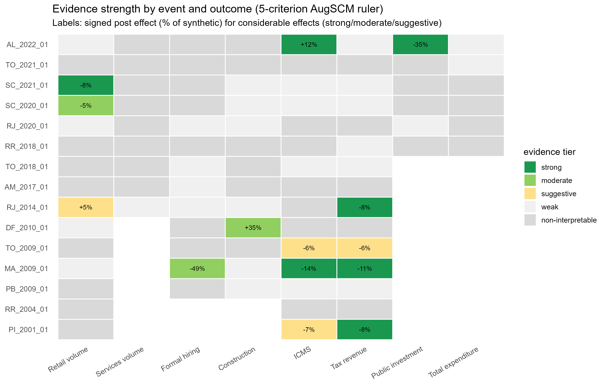
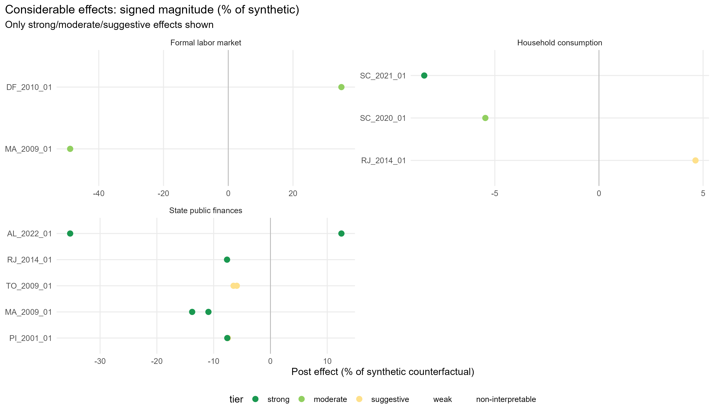

# Cross-event results summary

Generated on 2026-06-06. Events with results: 15.

## Evidence ruler

Each event-outcome is graded on five criteria (pre-treatment fit, substantive magnitude, persistence, placebo rank, leave-one-out robustness) into a 0-5 score; pre-fit is a hard gate. Tiers: **strong** (5/5), **moderate** (>=4 with placebo), **suggestive** (>=3 with magnitude or placebo), **weak**, **non-interpretable** (poor pre-fit). A *considerable* effect is strong/moderate/suggestive.

### Tier distribution

| Tier | n |
| --- | --- |
| strong |  7 |
| moderate |  3 |
| suggestive |  4 |
| weak | 28 |
| non-interpretable | 50 |

**Considerable effects: 14 of 92** event-outcomes; 11 negative / 3 positive.

## Groupings (considerable effects only)

### By timing in mandate (removal in last year vs earlier)

| Group | considerable | negative | positive |
| --- | --- | --- | --- |
| earlier | 9 | 9 | 0 |
| last-year | 5 | 2 | 3 |

### By sample (main vs extended)

| Group | considerable | negative | positive |
| --- | --- | --- | --- |
| extended | 7 | 4 | 3 |
| main | 7 | 7 | 0 |

### By channel

| Group | considerable | negative | positive |
| --- | --- | --- | --- |
| Formal labor market | 2 | 1 | 1 |
| Household consumption | 3 | 2 | 1 |
| State public finances | 9 | 8 | 1 |

## Master table (all event-outcomes)

| Event | Outcome | Tier | Score | % eff | Pre-fit | Rank | p | Dir |
| --- | --- | --- | --- | --- | --- | --- | --- | --- |
| PI_2001_01 | Retail volume | non-interpretable | 4/5 |   16 | C | 3/27 | 0.11 | positive |
| PI_2001_01 | ICMS | suggestive | 4/5 |   -7 | A | 11/27 | 0.41 | negative |
| PI_2001_01 | Tax revenue | strong | 5/5 |   -8 | A | 1/27 | 0.04 | negative |
| RR_2004_01 | Retail volume | non-interpretable | 2/5 |   -8 | D | 16/26 | 0.62 | negative |
| RR_2004_01 | ICMS | non-interpretable | 1/5 |    2 | C | 25/26 | 0.96 | positive |
| RR_2004_01 | Tax revenue | non-interpretable | 2/5 |   12 | C | 22/26 | 0.85 | positive |
| PB_2009_01 | Retail volume | non-interpretable | 2/5 |   -1 | D | 16/24 | 0.67 | negative |
| PB_2009_01 | Formal hiring | non-interpretable | 2/5 |  -35 | D | 19/24 | 0.79 | negative |
| PB_2009_01 | Construction | weak | 2/5 |  -20 | A | 12/24 | 0.50 | negative |
| PB_2009_01 | ICMS | weak | 3/5 |   -1 | A | 16/24 | 0.67 | negative |
| PB_2009_01 | Tax revenue | weak | 1/5 |    0 | A | 17/24 | 0.71 | positive |
| MA_2009_01 | Retail volume | weak | 2/5 |    2 | B | 6/24 | 0.25 | positive |
| MA_2009_01 | Formal hiring | moderate | 4/5 |  -49 | A | 2/24 | 0.08 | negative |
| MA_2009_01 | Construction | weak | 3/5 | -176 | B | 11/24 | 0.46 | negative |
| MA_2009_01 | ICMS | strong | 5/5 |  -14 | A | 1/24 | 0.04 | negative |
| MA_2009_01 | Tax revenue | strong | 5/5 |  -11 | A | 3/24 | 0.12 | negative |
| TO_2009_01 | Retail volume | non-interpretable | 4/5 |   30 | D | 1/24 | 0.04 | positive |
| TO_2009_01 | Formal hiring | non-interpretable | 2/5 |  -33 | C | 14/24 | 0.58 | negative |
| TO_2009_01 | Construction | non-interpretable | 2/5 | -132 | D | 20/24 | 0.83 | negative |
| TO_2009_01 | ICMS | suggestive | 4/5 |   -6 | B | 20/24 | 0.83 | negative |
| TO_2009_01 | Tax revenue | suggestive | 4/5 |   -6 | B | 19/24 | 0.79 | negative |
| DF_2010_01 | Retail volume | weak | 3/5 |   -3 | B | 8/24 | 0.33 | negative |
| DF_2010_01 | Formal hiring | non-interpretable | 1/5 |  -27 | D | 21/24 | 0.88 | negative |
| DF_2010_01 | Construction | moderate | 4/5 |   35 | A | 1/24 | 0.04 | positive |
| DF_2010_01 | ICMS | non-interpretable | 2/5 |   -3 | C | 15/24 | 0.62 | negative |
| DF_2010_01 | Tax revenue | non-interpretable | 2/5 |   -9 | D | 24/24 | 1.00 | negative |
| RJ_2014_01 | Retail volume | suggestive | 4/5 |    5 | A | 5/27 | 0.19 | positive |
| RJ_2014_01 | Services volume | weak | 2/5 |    0 | B | 24/27 | 0.89 | positive |
| RJ_2014_01 | Formal hiring | weak | 2/5 |    0 | B | 21/27 | 0.78 | negative |
| RJ_2014_01 | Construction | weak | 2/5 |   -9 | B | 18/27 | 0.67 | positive |
| RJ_2014_01 | ICMS | non-interpretable | 3/5 |   -9 | C | 6/27 | 0.22 | negative |
| RJ_2014_01 | Tax revenue | strong | 5/5 |   -8 | B | 3/27 | 0.11 | negative |
| AM_2017_01 | Retail volume | non-interpretable | 2/5 |    6 | C | 13/25 | 0.52 | positive |
| AM_2017_01 | Services volume | non-interpretable | 0/5 |    0 | C | 20/25 | 0.80 | positive |
| AM_2017_01 | Formal hiring | weak | 3/5 |   51 | A | 7/25 | 0.28 | positive |
| AM_2017_01 | Construction | non-interpretable | 1/5 |  -44 | C | 22/25 | 0.88 | positive |
| AM_2017_01 | ICMS | non-interpretable | 2/5 |    3 | C | 19/25 | 0.76 | positive |
| AM_2017_01 | Tax revenue | non-interpretable | 2/5 |    1 | C | 25/25 | 1.00 | positive |
| TO_2018_01 | Retail volume | non-interpretable | 3/5 |    8 | D | 8/25 | 0.32 | positive |
| TO_2018_01 | Services volume | non-interpretable | 0/5 |    1 | D | 20/25 | 0.80 | positive |
| TO_2018_01 | Formal hiring | weak | 3/5 |  -49 | A | 11/25 | 0.44 | negative |
| TO_2018_01 | Construction | non-interpretable | 3/5 | -732 | D | 1/25 | 0.04 | negative |
| TO_2018_01 | ICMS | weak | 3/5 |    4 | B | 21/25 | 0.84 | positive |
| TO_2018_01 | Tax revenue | weak | 2/5 |    1 | B | 13/25 | 0.52 | positive |
| RR_2018_01 | Retail volume | non-interpretable | 3/5 |    9 | D | 17/23 | 0.74 | positive |
| RR_2018_01 | Services volume | non-interpretable | 2/5 |    3 | D | 17/23 | 0.74 | positive |
| RR_2018_01 | Formal hiring | non-interpretable | 2/5 |  507 | C | 10/23 | 0.43 | positive |
| RR_2018_01 | Construction | non-interpretable | 3/5 |  436 | D | 3/23 | 0.13 | positive |
| RR_2018_01 | ICMS | non-interpretable | 3/5 |   24 | D | 1/22 | 0.05 | positive |
| RR_2018_01 | Tax revenue | weak | 2/5 |   -6 | B | 4/23 | 0.17 | negative |
| RR_2018_01 | Public investment | non-interpretable | 1/5 |  -11 | D | 18/23 | 0.78 | negative |
| RR_2018_01 | Total expenditure | non-interpretable | 2/5 |  -20 | D | 20/23 | 0.87 | negative |
| RJ_2020_01 | Retail volume | weak | 3/5 |   -2 | B | 13/23 | 0.57 | negative |
| RJ_2020_01 | Services volume | non-interpretable | 4/5 |   -7 | C | 3/23 | 0.13 | negative |
| RJ_2020_01 | Formal hiring | weak | 3/5 |  -21 | B | 8/23 | 0.35 | negative |
| RJ_2020_01 | Construction | weak | 2/5 |    7 | B | 21/23 | 0.91 | positive |
| RJ_2020_01 | ICMS | non-interpretable | 0/5 |    1 | C | 13/22 | 0.59 | positive |
| RJ_2020_01 | Tax revenue | non-interpretable | 1/5 |   -1 | D | 19/23 | 0.83 | negative |
| RJ_2020_01 | Public investment | weak | 3/5 |  -28 | A | 4/23 | 0.17 | negative |
| RJ_2020_01 | Total expenditure | non-interpretable | 1/5 |   10 | C | 6/23 | 0.26 | positive |
| SC_2020_01 | Retail volume | moderate | 4/5 |   -5 | B | 2/23 | 0.09 | negative |
| SC_2020_01 | Services volume | non-interpretable | 2/5 |    3 | C | 17/23 | 0.74 | positive |
| SC_2020_01 | Formal hiring | non-interpretable | 2/5 |   10 | D | 20/23 | 0.87 | positive |
| SC_2020_01 | Construction | weak | 3/5 |   26 | A | 4/23 | 0.17 | positive |
| SC_2020_01 | ICMS | weak | 1/5 |   -2 | B | 9/22 | 0.41 | negative |
| SC_2020_01 | Tax revenue | weak | 1/5 |   -1 | B | 15/23 | 0.65 | negative |
| SC_2020_01 | Public investment | non-interpretable | 0/5 |    5 | D | 23/23 | 1.00 | positive |
| SC_2020_01 | Total expenditure | non-interpretable | 2/5 |   16 | C | 11/23 | 0.48 | positive |
| SC_2021_01 | Retail volume | strong | 5/5 |   -8 | B | 2/22 | 0.09 | negative |
| SC_2021_01 | Services volume | non-interpretable | 1/5 |   -3 | C | 6/22 | 0.27 | negative |
| SC_2021_01 | Formal hiring | non-interpretable | 0/5 |   -1 | D | 19/22 | 0.86 | negative |
| SC_2021_01 | Construction | weak | 3/5 |   23 | A | 9/22 | 0.41 | positive |
| SC_2021_01 | ICMS | weak | 3/5 |   -3 | B | 7/21 | 0.33 | negative |
| SC_2021_01 | Tax revenue | weak | 1/5 |   -2 | B | 12/22 | 0.55 | negative |
| SC_2021_01 | Public investment | non-interpretable | 2/5 |  -13 | C | 12/22 | 0.55 | negative |
| SC_2021_01 | Total expenditure | non-interpretable | 3/5 |   19 | C | 12/22 | 0.55 | positive |
| TO_2021_01 | Retail volume | non-interpretable | 2/5 |   -4 | D | 21/23 | 0.91 | negative |
| TO_2021_01 | Services volume | non-interpretable | 4/5 |   10 | D | 2/23 | 0.09 | positive |
| TO_2021_01 | Formal hiring | non-interpretable | 2/5 |   39 | C | 4/23 | 0.17 | positive |
| TO_2021_01 | Construction | non-interpretable | 2/5 |  -90 | D | 16/23 | 0.70 | negative |
| TO_2021_01 | ICMS | non-interpretable | 0/5 |   -4 | C | 12/22 | 0.55 | negative |
| TO_2021_01 | Tax revenue | non-interpretable | 2/5 |   -6 | C | 18/23 | 0.78 | negative |
| TO_2021_01 | Public investment | non-interpretable | 1/5 |   -6 | B | 8/23 | 0.35 | negative |
| TO_2021_01 | Total expenditure | weak | 2/5 |   -2 | B | 5/23 | 0.22 | negative |
| AL_2022_01 | Retail volume | weak | 3/5 |    4 | A | 7/23 | 0.30 | positive |
| AL_2022_01 | Services volume | non-interpretable | 2/5 |    2 | C | 16/23 | 0.70 | positive |
| AL_2022_01 | Formal hiring | non-interpretable | 3/5 |    7 | C | 1/23 | 0.04 | positive |
| AL_2022_01 | Construction | non-interpretable | 1/5 |   -7 | C | 22/23 | 0.96 | negative |
| AL_2022_01 | ICMS | strong | 5/5 |   12 | A | 1/23 | 0.04 | positive |
| AL_2022_01 | Tax revenue | weak | 2/5 |    7 | A | 7/23 | 0.30 | positive |
| AL_2022_01 | Public investment | strong | 5/5 |  -35 | B | 2/23 | 0.09 | negative |
| AL_2022_01 | Total expenditure | weak | 1/5 |   -2 | B | 16/23 | 0.70 | negative |

## Methodological note

Placebo-based inference in synthetic control is discrete and low-resolution when the donor pool is small (the finest attainable p is ~1/N). We therefore do not rely on a single p-value threshold; we combine the placebo rank with pre-treatment fit, substantive magnitude, persistence, and leave-one-out robustness. Effects with a placebo p slightly above conventional thresholds but a high rank, good pre-fit, substantive magnitude and persistence are interpreted as suggestive evidence rather than conventional statistical significance.
