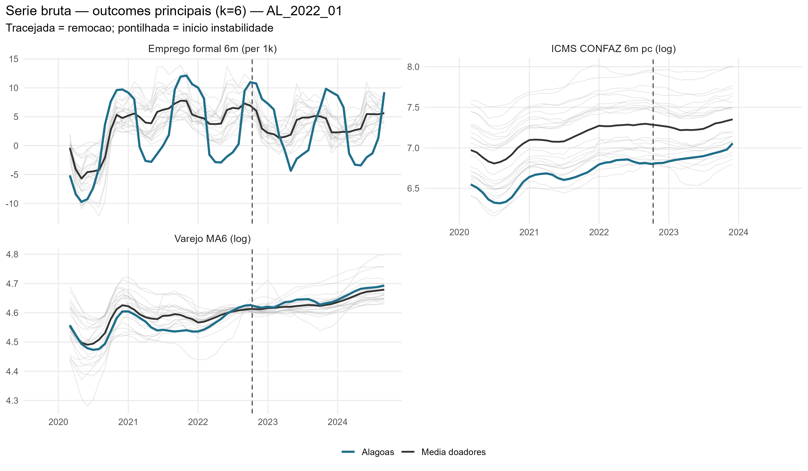
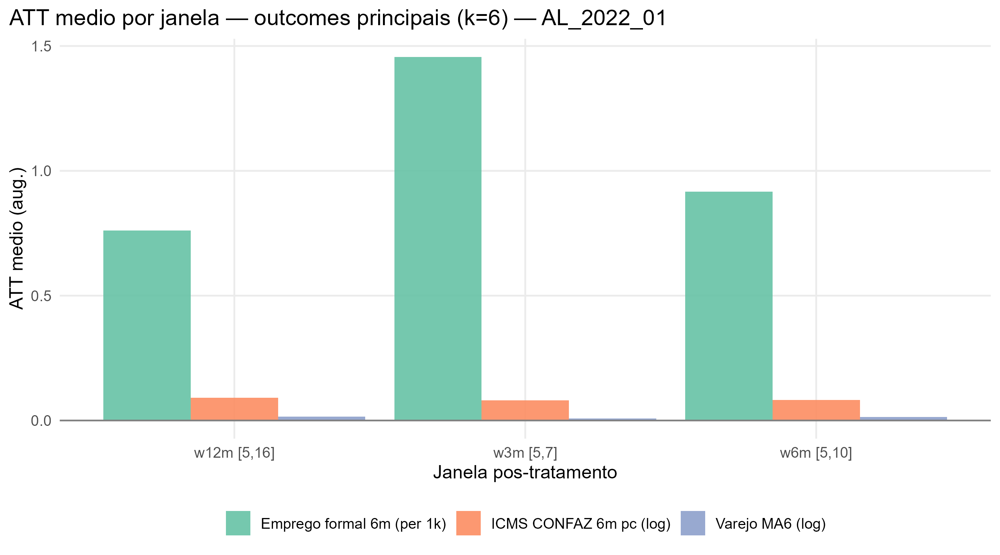
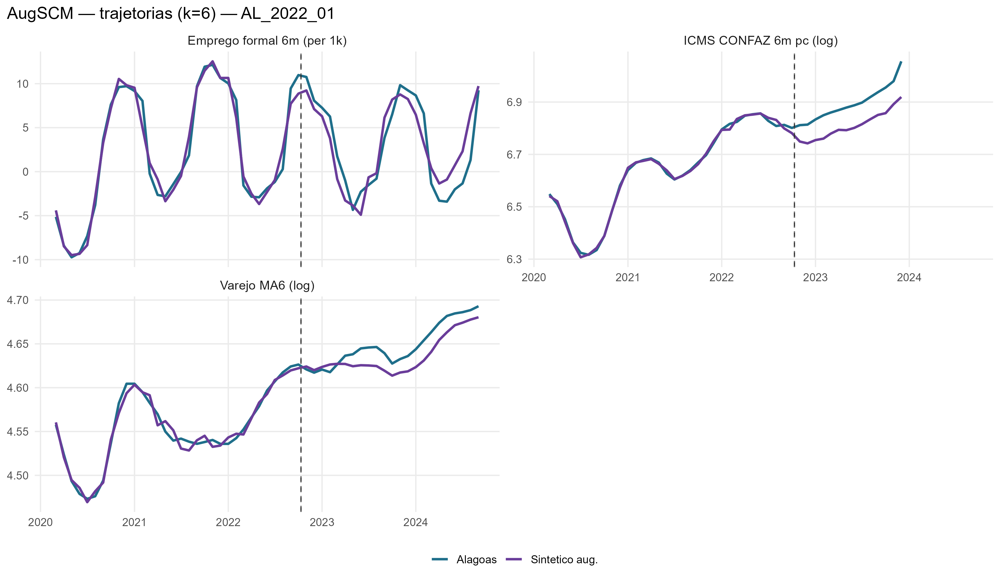
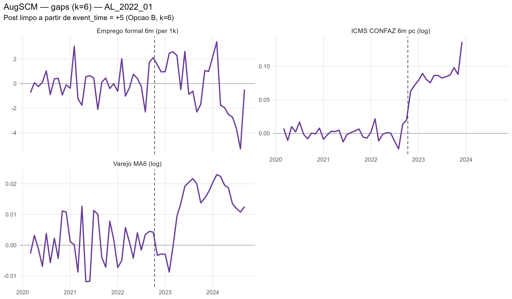
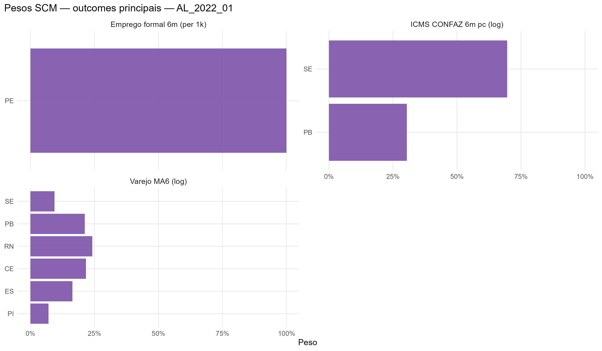

# AL_2022_01 results report (nova estrategia v2, k=6)

Generated on 2026-06-19.

Treated state: `AL`. Removal: `2022-10-11`.

## Window design

- Accumulation window: **k = 6** for all outcomes.
  - Retail: trailing 6-month mean, log (`retail_ma6_log`)
  - Formal hiring: CAGED net balance, 6m sum, per 1,000 residents (`formal_hiring_6m_per1k`)
  - ICMS: CONFAZ monthly per capita (BRL/resident), 6m sum, log (`icms_conf6m_pc_log`)
- Opcao B (k=6): first clean post-treatment reading at event_time = +5.
- Pre-treatment blocks: 5 non-overlapping semi-annual blocks [-30,-25], [-24,-19], [-18,-13], [-12,-7], [-6,-1].
  Valid pre-treatment window: event_time -31 to -1 (31 months; first 5 observations are NA due to k=6 initialization).
- ATT windows: w3m [+5,+7], w6m [+5,+10], w12m [+5,+16], w24m [+5,+28].

## Methodological strategy

Donor pool excludes `AL`, `RJ`, `RR`, `SC`, `TO` (22 eligible donors).
AugSCM with 5 non-overlapping semi-annual block-level AND block-slope predictors + 7 structural covariates (17 predictor rows total).
Slope rows force the SCM to match the within-block trend direction, not just the block-mean level.
Ridge penalty by LOO-CV (cross-validation, not the donor placebo).
Significance: in-space donor placebo (Abadie-Diamond-Hainmueller). LOO donor-exclusion placebo is a robustness check, not the significance criterion.

## Preliminary plots

## Covariate and pre-treatment balance

### Pre-treatment outcome fit

| Outcome | Treated | Synthetic | RMSPE pre | Pre periods |
| --- | --- | --- | --- | --- |
| Varejo MA6 (log) | 4.55 | 4.55 | 0.01 | 31 |
| Emprego formal 6m (per 1k) | 1.96 | 2.00 | 1.11 | 31 |
| ICMS CONFAZ 6m pc (log) | 6.64 | 6.64 | 0.01 | 31 |

### Covariate balance

| Covariate | Treated | Varejo MA6 (log) | Emprego formal 6m (per 1k) | ICMS CONFAZ 6m pc (log) |
| --- | --- | --- | --- | --- |
| Unemployment rate |     0.142 |     0.115 |     0.139 |     0.129 |
| Formalization rate |     0.535 |     0.506 |     0.508 |     0.477 |
| Labor income (real) | 2,135.720 | 2,433.350 | 2,524.684 | 2,379.739 |
| Transfer dependency ratio |     0.257 |     0.229 |     0.162 |     0.270 |
| Health expenditure pc |   102.459 |   113.439 |   144.437 |   123.686 |
| Education expenditure pc |    75.090 |   102.725 |    84.495 |   116.511 |
| Public security expenditure pc |    87.756 |    75.132 |    69.041 |    96.195 |

## Main results: Augmented SCM

| Channel | Outcome | Mean gap (w6m) | RMSPE pre | Donors |
| --- | --- | --- | --- | --- |
| Household consumption | Retail volume, MA6 trailing, log | 0.01 | 0.01 | 22 |
| Formal labor market | Net formal hiring, 6m sum, per 1,000 residents | 0.92 | 1.11 | 22 |
| State public finances | ICMS CONFAZ per capita, 6m sum, log BRL/resident | 0.08 | 0.01 | 22 |

### ATT by window

| Outcome | w3m | w6m | w12m | w24m |
| --- | --- | --- | --- | --- |
| Varejo MA6 (log) | 0.01 | 0.01 | 0.02 | 0.02 |
| Emprego formal 6m (per 1k) | 1.46 | 0.92 | 0.76 | -0.49 |
| ICMS CONFAZ 6m pc (log) | 0.08 | 0.08 | 0.09 | 0.09 |

## Donor weights

## Placebo in-space (criterio principal)

Cada doador refeito como se fosse o tratado; classic_p = ranking da razao RMSPE pos/pre do tratado real entre tratado+placebos. Com pool de doadores pequeno, o ranking e mais informativo que o p continuo (p minimo possivel ~= 1/N).

| Outcome | Rank | p (classico) |
| --- | --- | --- |
| Varejo MA6 (log) | 17 / 23 | 0.739130434782609 |
| Emprego formal 6m (per 1k) | 13 / 23 | 0.565217391304348 |
| ICMS CONFAZ 6m pc (log) | 3 / 23 | 0.130434782608696 |

## Robustez: placebo LOO por doador

Exclusao de um doador por vez, mantendo o tratado real fixo -- testa estabilidade ao doador, nao significancia (nao e usado para classificar tier).

| Outcome | Gap post | LOO rank | p (2-sided) |
| --- | --- | --- | --- |
| Varejo MA6 (log) | 0.016 | 7 / 23 | 0.304 |
| Emprego formal 6m (per 1k) | -0.487 | 23 / 23 | 0.043 |
| ICMS CONFAZ 6m pc (log) | 0.09 | 23 / 23 | 0.043 |

## Evidence classification

Tier: placebo in-space (criterio principal). Thresholds: log >= 0.05; formal_hiring_6m_per1k >= 0.5 (per 1k residents). Poor fit: pre corr < 0.70.

Considerable: **1** / 3.

| Outcome | Tier | Effect (w6m) | Inspace rank | Inspace p | Mag (pre-SD) | Persist | Pre-trend p | Pre corr | Pre R2 | afitw | LOO rank (rob.) | LOO p (rob.) | LOO sign (rob.) |
| --- | --- | --- | --- | --- | --- | --- | --- | --- | --- | --- | --- | --- | --- |
| Varejo MA6 (log) | weak | +1.4% | 17/23 | 0.739 | 0.38 | 0.95 | 0.78 | 0.99 | 0.97 |  | 7/23 | 0.304 | 0.95 |
| Emprego formal 6m (per 1k) | weak | +0.9 | 13/23 | 0.565 | 0.07 | 0.63 | 0.91 | 0.99 | 0.97 |  | 23/23 | 0.043 | 1.00 |
| ICMS CONFAZ 6m pc (log) | suggestive | +8.6% | 3/23 | 0.130 | 0.53 | 1.00 | 0.35 | 1.00 | 1.00 |  | 23/23 | 0.043 | 0.00 |

### Nova Estrategia (Alcance x Duracao)

- **Alcance**: Restrito
- **Duracao**: Persistente

| Variable | Affected |
| --- | --- |
| Retail MA6 (log) | FALSE |
| ICMS CONFAZ 6m per capita (log) | TRUE |
| Formal hiring 6m per 1k residents | FALSE |
