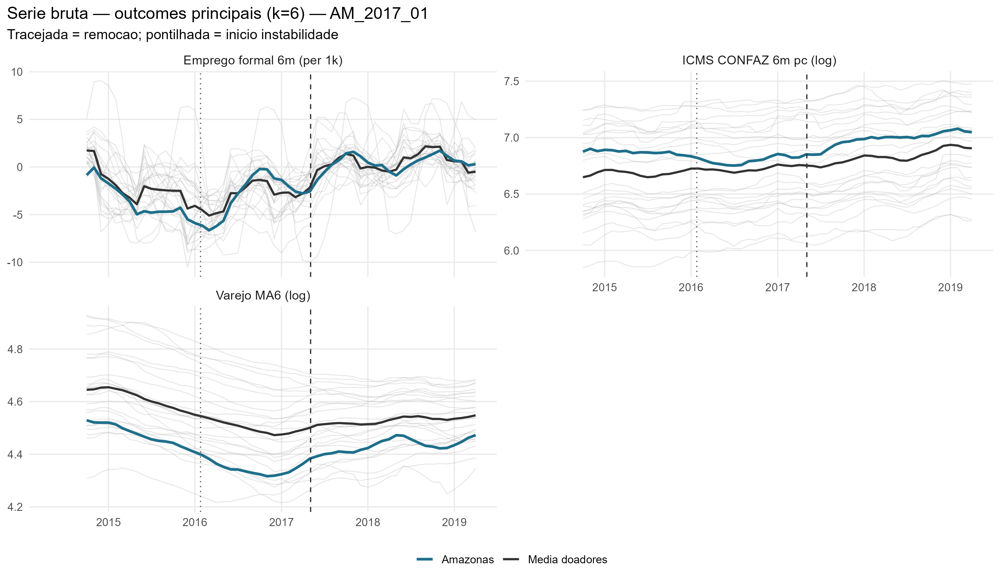
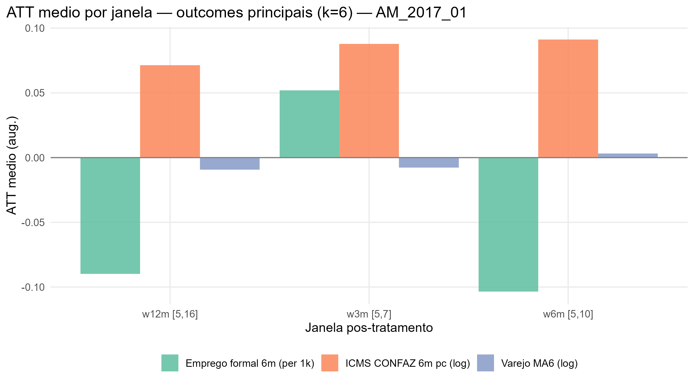
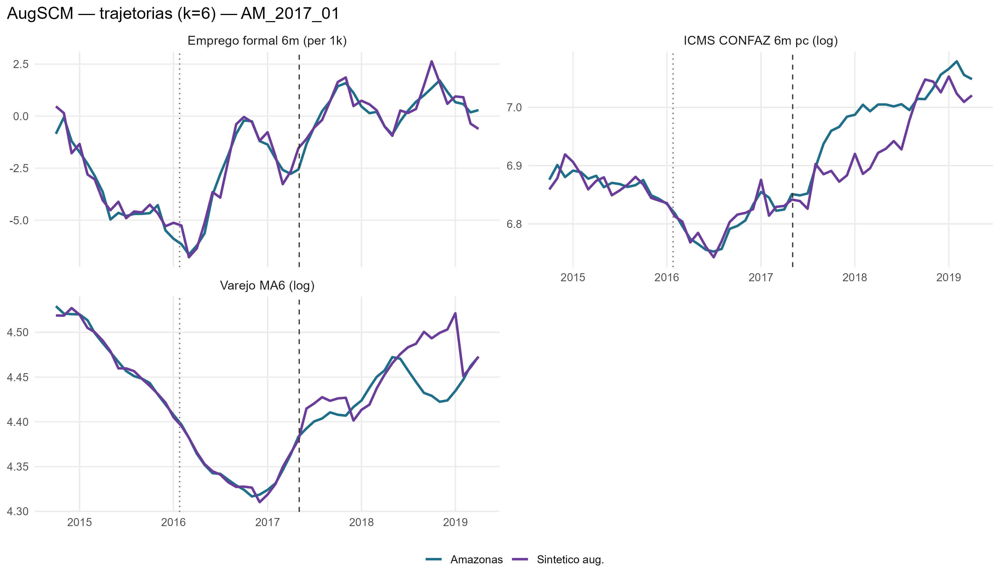
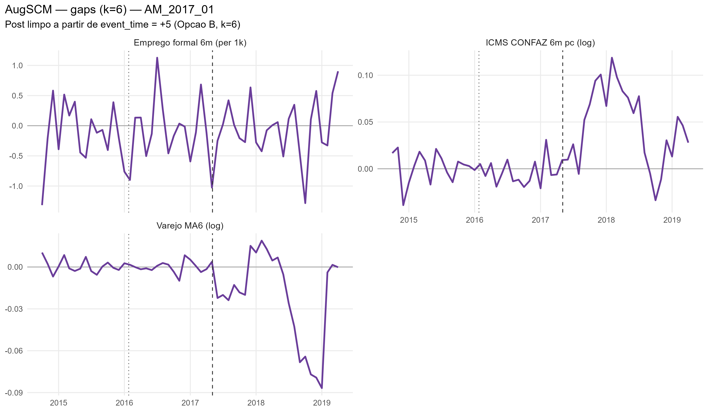
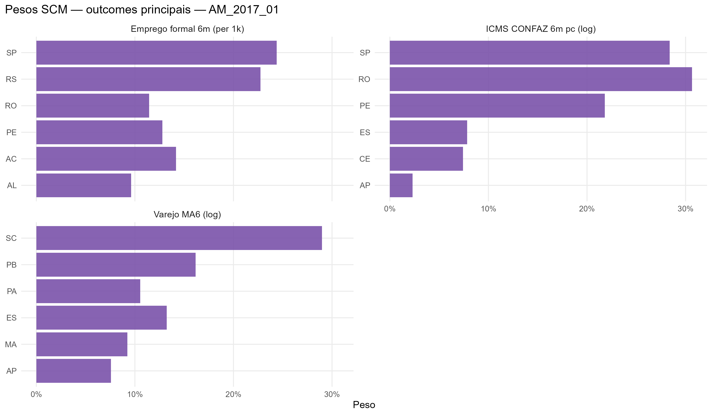

# AM_2017_01 results report (nova estrategia v2, k=6)

Generated on 2026-06-19.

Treated state: `AM`. Removal: `2017-05-04`.

## Window design

- Accumulation window: **k = 6** for all outcomes.
  - Retail: trailing 6-month mean, log (`retail_ma6_log`)
  - Formal hiring: CAGED net balance, 6m sum, per 1,000 residents (`formal_hiring_6m_per1k`)
  - ICMS: CONFAZ monthly per capita (BRL/resident), 6m sum, log (`icms_conf6m_pc_log`)
- Opcao B (k=6): first clean post-treatment reading at event_time = +5.
- Pre-treatment blocks: 5 non-overlapping semi-annual blocks [-30,-25], [-24,-19], [-18,-13], [-12,-7], [-6,-1].
  Valid pre-treatment window: event_time -31 to -1 (31 months; first 5 observations are NA due to k=6 initialization).
- ATT windows: w3m [+5,+7], w6m [+5,+10], w12m [+5,+16], w24m [+5,+28].

## Methodological strategy

Donor pool excludes `AM`, `RR`, `TO` (24 eligible donors).
AugSCM with 5 non-overlapping semi-annual block-level AND block-slope predictors + 6 structural covariates (16 predictor rows total).
Slope rows force the SCM to match the within-block trend direction, not just the block-mean level.
Ridge penalty by LOO-CV (cross-validation, not the donor placebo).
Significance: in-space donor placebo (Abadie-Diamond-Hainmueller). LOO donor-exclusion placebo is a robustness check, not the significance criterion.

## Preliminary plots

## Covariate and pre-treatment balance

### Pre-treatment outcome fit

| Outcome | Treated | Synthetic | RMSPE pre | Pre periods |
| --- | --- | --- | --- | --- |
| Varejo MA6 (log) | 4.41 | 4.41 | 0.00 | 31 |
| Emprego formal 6m (per 1k) | -3.26 | -3.17 | 0.50 | 31 |
| ICMS CONFAZ 6m pc (log) | 6.84 | 6.84 | 0.02 | 31 |

### Covariate balance

| Covariate | Treated | Varejo MA6 (log) | Emprego formal 6m (per 1k) | ICMS CONFAZ 6m pc (log) |
| --- | --- | --- | --- | --- |
| ICMS secondary VA pc | 51.463 | 30.473 | 42.193 | 38.048 |
| ICMS tertiary VA pc | 83.627 | 56.738 | 77.419 | 75.273 |
| ICMS energy VA pc |  4.517 | 11.686 | 12.581 | 11.321 |
| ICMS fuels VA pc | 20.509 | 22.938 | 23.345 | 24.745 |
| FPE transfer pc | 37.524 | 57.041 | 54.488 | 46.874 |
| IOF-state pc |  0.001 |  0.004 |  0.002 |  0.006 |

## Main results: Augmented SCM

| Channel | Outcome | Mean gap (w6m) | RMSPE pre | Donors |
| --- | --- | --- | --- | --- |
| Household consumption | Retail volume, MA6 trailing, log |  0.00 | 0.00 | 24 |
| Formal labor market | Net formal hiring, 6m sum, per 1,000 residents | -0.10 | 0.50 | 24 |
| State public finances | ICMS CONFAZ per capita, 6m sum, log BRL/resident |  0.09 | 0.02 | 24 |

### ATT by window

| Outcome | w3m | w6m | w12m | w24m |
| --- | --- | --- | --- | --- |
| Varejo MA6 (log) | -0.01 | 0.00 | -0.01 | -0.02 |
| Emprego formal 6m (per 1k) | 0.05 | -0.10 | -0.09 | -0.04 |
| ICMS CONFAZ 6m pc (log) | 0.09 | 0.09 | 0.07 | 0.05 |

## Donor weights

## Placebo in-space (criterio principal)

Cada doador refeito como se fosse o tratado; classic_p = ranking da razao RMSPE pos/pre do tratado real entre tratado+placebos. Com pool de doadores pequeno, o ranking e mais informativo que o p continuo (p minimo possivel ~= 1/N).

| Outcome | Rank | p (classico) |
| --- | --- | --- |
| Varejo MA6 (log) | 20 / 25 | 0.8 |
| Emprego formal 6m (per 1k) | 23 / 25 | 0.92 |
| ICMS CONFAZ 6m pc (log) | 12 / 25 | 0.48 |

## Robustez: placebo LOO por doador

Exclusao de um doador por vez, mantendo o tratado real fixo -- testa estabilidade ao doador, nao significancia (nao e usado para classificar tier).

| Outcome | Gap post | LOO rank | p (2-sided) |
| --- | --- | --- | --- |
| Varejo MA6 (log) | -0.022 | 2 / 25 | 0.08 |
| Emprego formal 6m (per 1k) | -0.044 | 3 / 25 | 0.12 |
| ICMS CONFAZ 6m pc (log) | 0.052 | 3 / 25 | 0.12 |

## Evidence classification

Tier: placebo in-space (criterio principal). Thresholds: log >= 0.05; formal_hiring_6m_per1k >= 0.5 (per 1k residents). Poor fit: pre corr < 0.70.

Considerable: **0** / 3.

| Outcome | Tier | Effect (w6m) | Inspace rank | Inspace p | Mag (pre-SD) | Persist | Pre-trend p | Pre corr | Pre R2 | afitw | LOO rank (rob.) | LOO p (rob.) | LOO sign (rob.) |
| --- | --- | --- | --- | --- | --- | --- | --- | --- | --- | --- | --- | --- | --- |
| Varejo MA6 (log) | weak | +0.3% | 20/25 | 0.800 | 0.30 | 0.63 | 0.42 | 1.00 | 1.00 |  | 2/25 | 0.080 | 0.75 |
| Emprego formal 6m (per 1k) | weak | -0.1 | 23/25 | 0.920 | 0.02 | 0.53 | 0.51 | 0.97 | 0.94 |  | 3/25 | 0.120 | 0.17 |
| ICMS CONFAZ 6m pc (log) | weak | +9.6% | 12/25 | 0.480 | 1.16 | 0.84 | 0.37 | 0.94 | 0.88 |  | 3/25 | 0.120 | 1.00 |

### Nova Estrategia (Alcance x Duracao)

- **Alcance**: Nulo
- **Duracao**: Transitorio

| Variable | Affected |
| --- | --- |
| Retail MA6 (log) | FALSE |
| ICMS CONFAZ 6m per capita (log) | FALSE |
| Formal hiring 6m per 1k residents | FALSE |
