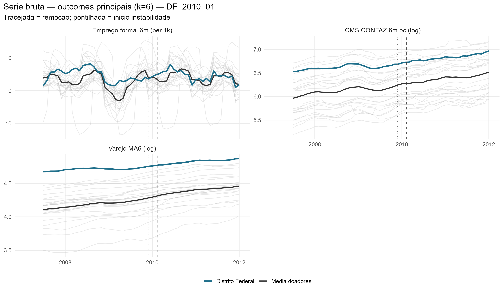
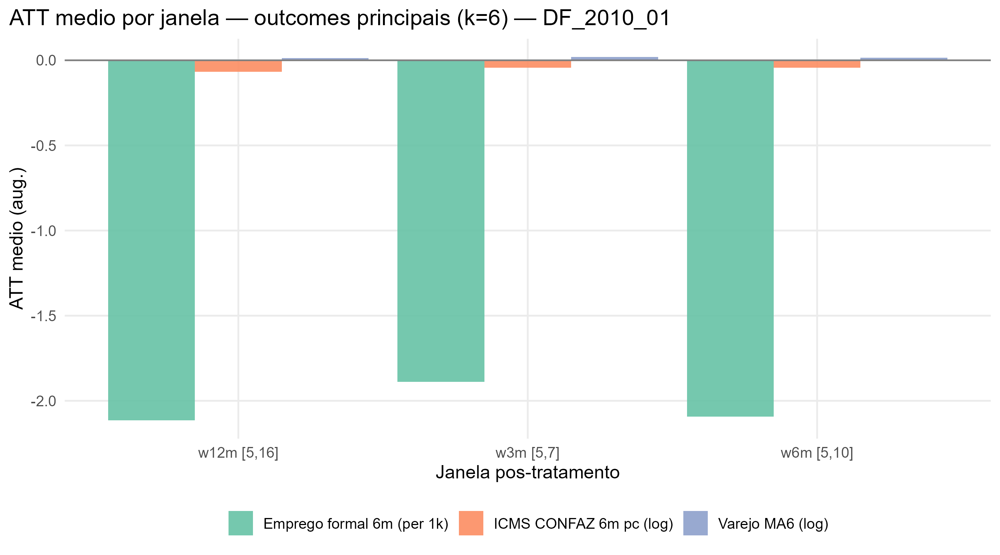
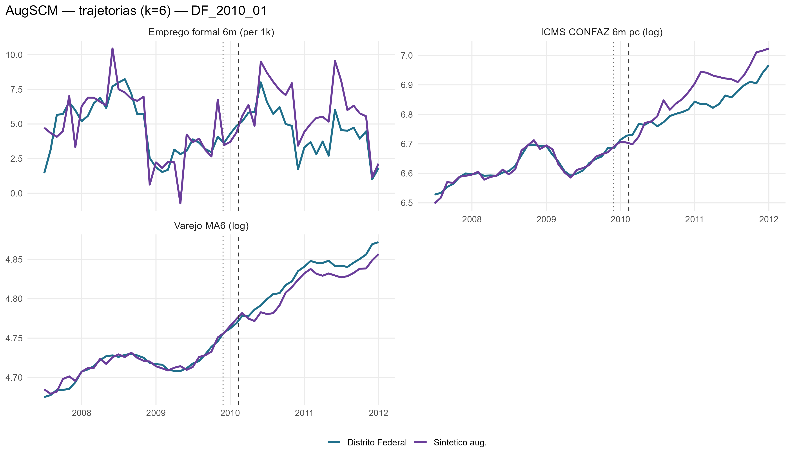
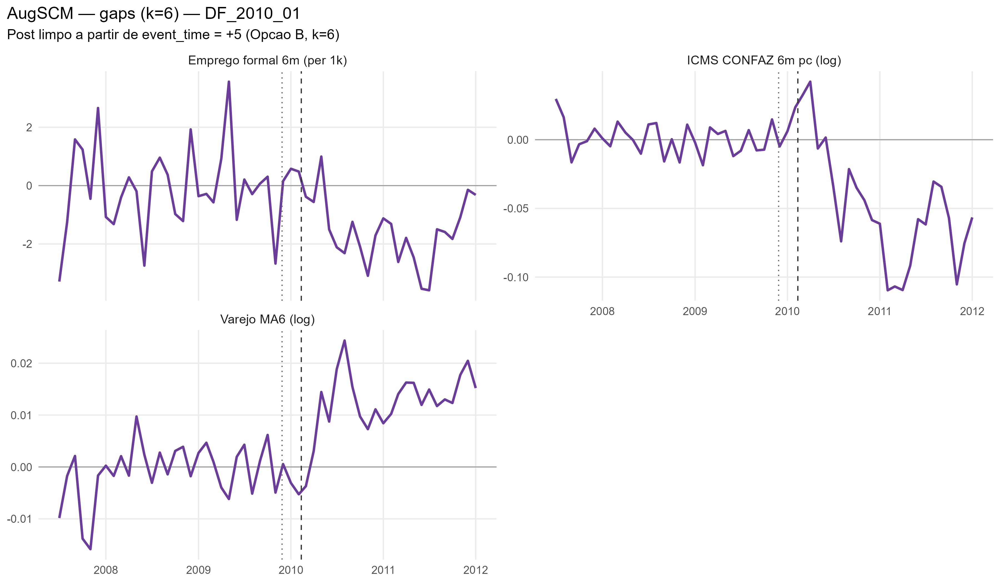
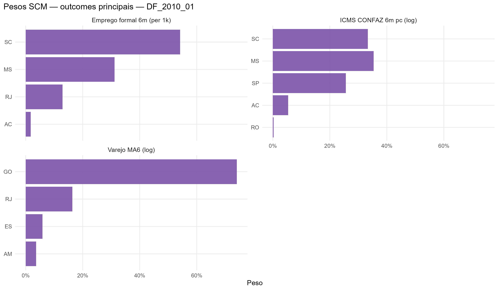

# DF_2010_01 results report (nova estrategia v2, k=6)

Generated on 2026-06-19.

Treated state: `DF`. Removal: `2010-02-11`.

## Window design

- Accumulation window: **k = 6** for all outcomes.
  - Retail: trailing 6-month mean, log (`retail_ma6_log`)
  - Formal hiring: CAGED net balance, 6m sum, per 1,000 residents (`formal_hiring_6m_per1k`)
  - ICMS: CONFAZ monthly per capita (BRL/resident), 6m sum, log (`icms_conf6m_pc_log`)
- Opcao B (k=6): first clean post-treatment reading at event_time = +5.
- Pre-treatment blocks: 5 non-overlapping semi-annual blocks [-30,-25], [-24,-19], [-18,-13], [-12,-7], [-6,-1].
  Valid pre-treatment window: event_time -31 to -1 (31 months; first 5 observations are NA due to k=6 initialization).
- ATT windows: w3m [+5,+7], w6m [+5,+10], w12m [+5,+16], w24m [+5,+28].

## Methodological strategy

Donor pool excludes `DF`, `MA`, `PB`, `TO` (23 eligible donors).
AugSCM with 5 non-overlapping semi-annual block-level AND block-slope predictors + 6 structural covariates (16 predictor rows total).
Slope rows force the SCM to match the within-block trend direction, not just the block-mean level.
Ridge penalty by LOO-CV (cross-validation, not the donor placebo).
Significance: in-space donor placebo (Abadie-Diamond-Hainmueller). LOO donor-exclusion placebo is a robustness check, not the significance criterion.

## Preliminary plots

## Covariate and pre-treatment balance

### Pre-treatment outcome fit

| Outcome | Treated | Synthetic | RMSPE pre | Pre periods |
| --- | --- | --- | --- | --- |
| Varejo MA6 (log) | 4.72 | 4.72 | 0.01 | 31 |
| Emprego formal 6m (per 1k) | 4.64 | 4.73 | 1.45 | 31 |
| ICMS CONFAZ 6m pc (log) | 6.62 | 6.62 | 0.01 | 31 |

### Covariate balance

| Covariate | Treated | Varejo MA6 (log) | Emprego formal 6m (per 1k) | ICMS CONFAZ 6m pc (log) |
| --- | --- | --- | --- | --- |
| ICMS secondary VA pc | 21.587 | 20.018 | 17.350 | 22.907 |
| ICMS tertiary VA pc | 58.378 | 31.986 | 42.709 | 47.785 |
| ICMS energy VA pc |  9.521 |  8.557 |  9.791 |  8.801 |
| ICMS fuels VA pc | 25.926 | 16.183 | 21.984 | 22.222 |
| FPE transfer pc |  7.273 | 11.128 | 10.053 | 14.321 |
| IOF-state pc |  0.000 |  0.000 |  0.000 |  0.000 |

## Main results: Augmented SCM

| Channel | Outcome | Mean gap (w6m) | RMSPE pre | Donors |
| --- | --- | --- | --- | --- |
| Household consumption | Retail volume, MA6 trailing, log |  0.01 | 0.01 | 23 |
| Formal labor market | Net formal hiring, 6m sum, per 1,000 residents | -2.09 | 1.45 | 23 |
| State public finances | ICMS CONFAZ per capita, 6m sum, log BRL/resident | -0.04 | 0.01 | 23 |

### ATT by window

| Outcome | w3m | w6m | w12m | w24m |
| --- | --- | --- | --- | --- |
| Varejo MA6 (log) | 0.02 | 0.01 | 0.01 | 0.01 |
| Emprego formal 6m (per 1k) | -1.89 | -2.09 | -2.12 | -1.86 |
| ICMS CONFAZ 6m pc (log) | -0.04 | -0.04 | -0.07 | -0.06 |

## Donor weights

## Placebo in-space (criterio principal)

Cada doador refeito como se fosse o tratado; classic_p = ranking da razao RMSPE pos/pre do tratado real entre tratado+placebos. Com pool de doadores pequeno, o ranking e mais informativo que o p continuo (p minimo possivel ~= 1/N).

| Outcome | Rank | p (classico) |
| --- | --- | --- |
| Varejo MA6 (log) | 24 / 24 | 1 |
| Emprego formal 6m (per 1k) | 17 / 24 | 0.708333333333333 |
| ICMS CONFAZ 6m pc (log) | 11 / 24 | 0.458333333333333 |

## Robustez: placebo LOO por doador

Exclusao de um doador por vez, mantendo o tratado real fixo -- testa estabilidade ao doador, nao significancia (nao e usado para classificar tier).

| Outcome | Gap post | LOO rank | p (2-sided) |
| --- | --- | --- | --- |
| Varejo MA6 (log) | 0.014 | 1 / 24 | 0.042 |
| Emprego formal 6m (per 1k) | -1.865 | 1 / 24 | 0.042 |
| ICMS CONFAZ 6m pc (log) | -0.064 | 2 / 24 | 0.083 |

## Evidence classification

Tier: placebo in-space (criterio principal). Thresholds: log >= 0.05; formal_hiring_6m_per1k >= 0.5 (per 1k residents). Poor fit: pre corr < 0.70.

Considerable: **0** / 3.

| Outcome | Tier | Effect (w6m) | Inspace rank | Inspace p | Mag (pre-SD) | Persist | Pre-trend p | Pre corr | Pre R2 | afitw | LOO rank (rob.) | LOO p (rob.) | LOO sign (rob.) |
| --- | --- | --- | --- | --- | --- | --- | --- | --- | --- | --- | --- | --- | --- |
| Varejo MA6 (log) | weak | +1.5% | 24/24 | 1.000 | 0.67 | 1.00 | 0.14 | 0.97 | 0.93 |  | 1/24 | 0.042 | 1.00 |
| Emprego formal 6m (per 1k) | weak | -2.1 | 17/24 | 0.708 | 0.93 | 1.00 | 0.62 | 0.80 | 0.48 |  | 1/24 | 0.042 | 1.00 |
| ICMS CONFAZ 6m pc (log) | weak | -4.4% | 11/24 | 0.458 | 1.28 | 1.00 | 0.30 | 0.98 | 0.95 |  | 2/24 | 0.083 | 0.91 |

### Nova Estrategia (Alcance x Duracao)

- **Alcance**: Nulo
- **Duracao**: Transitorio

| Variable | Affected |
| --- | --- |
| Retail MA6 (log) | FALSE |
| ICMS CONFAZ 6m per capita (log) | FALSE |
| Formal hiring 6m per 1k residents | FALSE |
