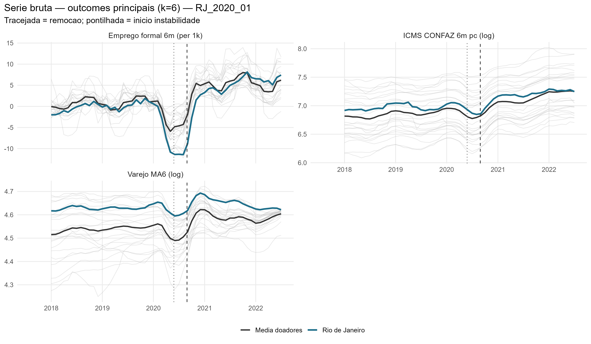
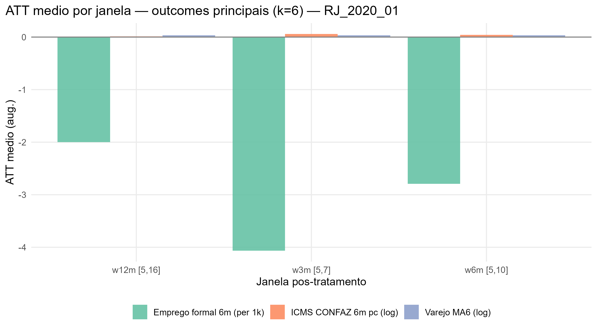
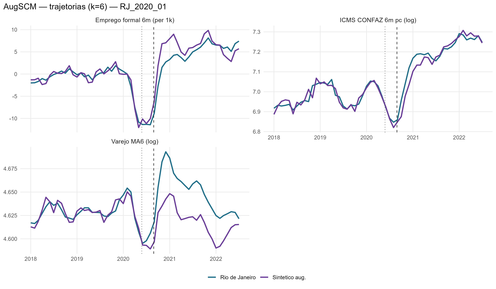
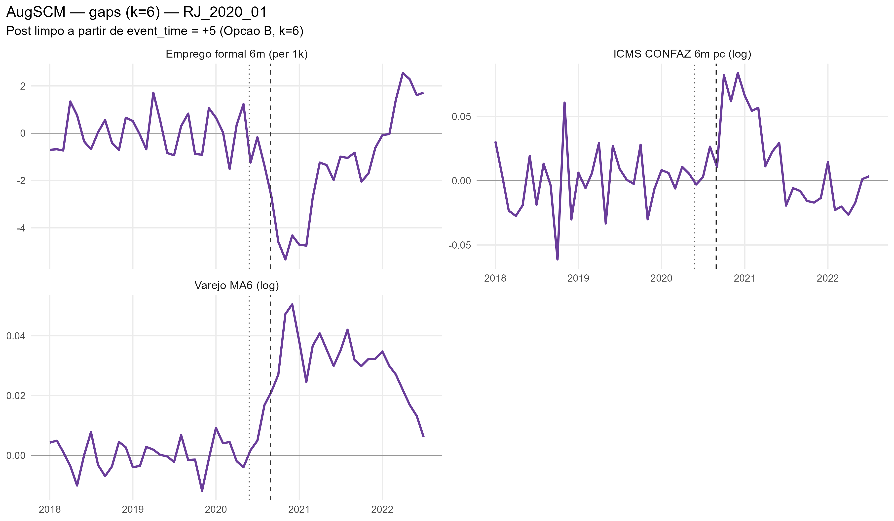
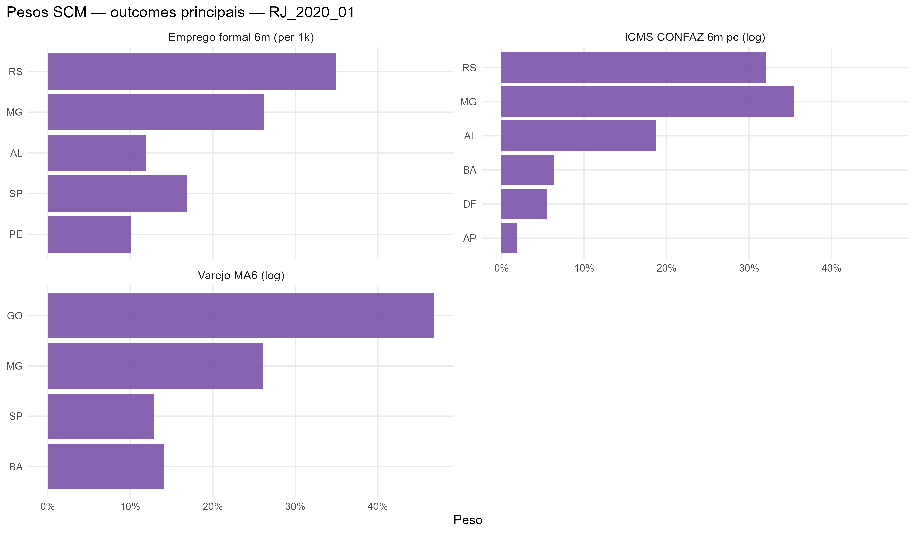

# RJ_2020_01 results report (nova estrategia v2, k=6)

Generated on 2026-06-19.

Treated state: `RJ`. Removal: `2020-08-28`.

## Window design

- Accumulation window: **k = 6** for all outcomes.
  - Retail: trailing 6-month mean, log (`retail_ma6_log`)
  - Formal hiring: CAGED net balance, 6m sum, per 1,000 residents (`formal_hiring_6m_per1k`)
  - ICMS: CONFAZ monthly per capita (BRL/resident), 6m sum, log (`icms_conf6m_pc_log`)
- Opcao B (k=6): first clean post-treatment reading at event_time = +5.
- Pre-treatment blocks: 5 non-overlapping semi-annual blocks [-30,-25], [-24,-19], [-18,-13], [-12,-7], [-6,-1].
  Valid pre-treatment window: event_time -31 to -1 (31 months; first 5 observations are NA due to k=6 initialization).
- ATT windows: w3m [+5,+7], w6m [+5,+10], w12m [+5,+16], w24m [+5,+28].

## Methodological strategy

Donor pool excludes `AM`, `RJ`, `RR`, `SC`, `TO` (22 eligible donors).
AugSCM with 5 non-overlapping semi-annual block-level AND block-slope predictors + 7 structural covariates (17 predictor rows total).
Slope rows force the SCM to match the within-block trend direction, not just the block-mean level.
Ridge penalty by LOO-CV (cross-validation, not the donor placebo).
Significance: in-space donor placebo (Abadie-Diamond-Hainmueller). LOO donor-exclusion placebo is a robustness check, not the significance criterion.

## Preliminary plots

## Covariate and pre-treatment balance

### Pre-treatment outcome fit

| Outcome | Treated | Synthetic | RMSPE pre | Pre periods |
| --- | --- | --- | --- | --- |
| Varejo MA6 (log) | 4.63 | 4.63 | 0.00 | 31 |
| Emprego formal 6m (per 1k) | -1.48 | -1.45 | 0.82 | 31 |
| ICMS CONFAZ 6m pc (log) | 6.97 | 6.97 | 0.02 | 31 |

### Covariate balance

| Covariate | Treated | Varejo MA6 (log) | Emprego formal 6m (per 1k) | ICMS CONFAZ 6m pc (log) |
| --- | --- | --- | --- | --- |
| Unemployment rate |     0.112 |     0.099 |     0.097 |     0.100 |
| Formalization rate |     0.646 |     0.598 |     0.630 |     0.612 |
| Labor income (real) | 3,655.680 | 3,085.535 | 3,262.506 | 3,103.005 |
| Transfer dependency ratio |     0.029 |     0.060 |     0.070 |     0.082 |
| Health expenditure pc |    84.448 |   115.576 |   113.322 |   118.085 |
| Education expenditure pc |    96.298 |   139.350 |   108.593 |   117.765 |
| Public security expenditure pc |   140.290 |   114.396 |   105.259 |   117.606 |

## Main results: Augmented SCM

| Channel | Outcome | Mean gap (w6m) | RMSPE pre | Donors |
| --- | --- | --- | --- | --- |
| Household consumption | Retail volume, MA6 trailing, log |  0.03 | 0.00 | 22 |
| Formal labor market | Net formal hiring, 6m sum, per 1,000 residents | -2.79 | 0.82 | 22 |
| State public finances | ICMS CONFAZ per capita, 6m sum, log BRL/resident |  0.04 | 0.02 | 22 |

### ATT by window

| Outcome | w3m | w6m | w12m | w24m |
| --- | --- | --- | --- | --- |
| Varejo MA6 (log) | 0.03 | 0.03 | 0.03 | 0.03 |
| Emprego formal 6m (per 1k) | -4.07 | -2.79 | -2.00 | -0.77 |
| ICMS CONFAZ 6m pc (log) | 0.06 | 0.04 | 0.01 | 0.00 |

## Donor weights

## Placebo in-space (criterio principal)

Cada doador refeito como se fosse o tratado; classic_p = ranking da razao RMSPE pos/pre do tratado real entre tratado+placebos. Com pool de doadores pequeno, o ranking e mais informativo que o p continuo (p minimo possivel ~= 1/N).

| Outcome | Rank | p (classico) |
| --- | --- | --- |
| Varejo MA6 (log) | 13 / 23 | 0.565217391304348 |
| Emprego formal 6m (per 1k) | 6 / 23 | 0.260869565217391 |
| ICMS CONFAZ 6m pc (log) | 23 / 23 | 1 |

## Robustez: placebo LOO por doador

Exclusao de um doador por vez, mantendo o tratado real fixo -- testa estabilidade ao doador, nao significancia (nao e usado para classificar tier).

| Outcome | Gap post | LOO rank | p (2-sided) |
| --- | --- | --- | --- |
| Varejo MA6 (log) | 0.029 | 1 / 23 | 0.043 |
| Emprego formal 6m (per 1k) | -0.766 | 19 / 23 | 0.217 |
| ICMS CONFAZ 6m pc (log) | 0.005 | 23 / 23 | 0.043 |

## Evidence classification

Tier: placebo in-space (criterio principal). Thresholds: log >= 0.05; formal_hiring_6m_per1k >= 0.5 (per 1k residents). Poor fit: pre corr < 0.70.

Considerable: **0** / 3.

| Outcome | Tier | Effect (w6m) | Inspace rank | Inspace p | Mag (pre-SD) | Persist | Pre-trend p | Pre corr | Pre R2 | afitw | LOO rank (rob.) | LOO p (rob.) | LOO sign (rob.) |
| --- | --- | --- | --- | --- | --- | --- | --- | --- | --- | --- | --- | --- | --- |
| Varejo MA6 (log) | weak | +3.5% | 13/23 | 0.565 | 2.27 | 1.00 | 0.63 | 0.93 | 0.86 |  | 1/23 | 0.043 | 1.00 |
| Emprego formal 6m (per 1k) | weak | -2.8 | 6/23 | 0.261 | 0.21 | 0.74 | 0.98 | 0.97 | 0.95 |  | 19/23 | 0.217 | 1.00 |
| ICMS CONFAZ 6m pc (log) | weak | +4.1% | 23/23 | 1.000 | 0.09 | 0.47 | 0.60 | 0.91 | 0.82 |  | 23/23 | 0.043 | 0.00 |

### Nova Estrategia (Alcance x Duracao)

- **Alcance**: Nulo
- **Duracao**: Transitorio

| Variable | Affected |
| --- | --- |
| Retail MA6 (log) | FALSE |
| ICMS CONFAZ 6m per capita (log) | FALSE |
| Formal hiring 6m per 1k residents | FALSE |
