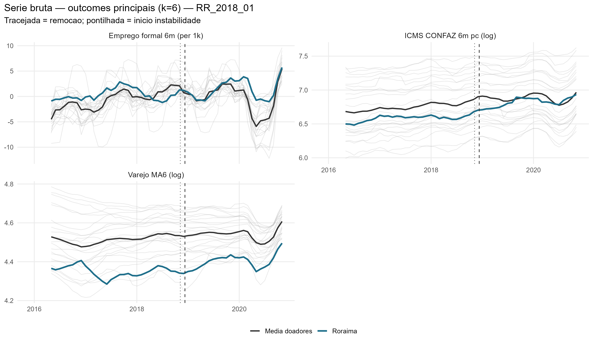
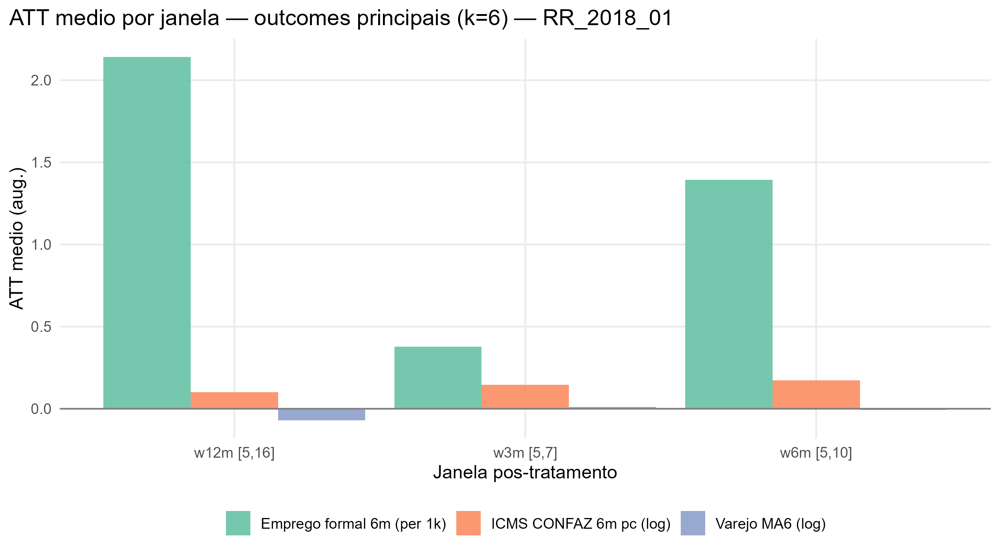
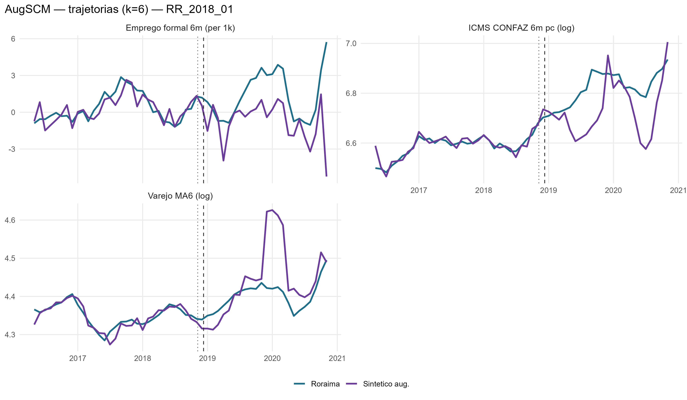
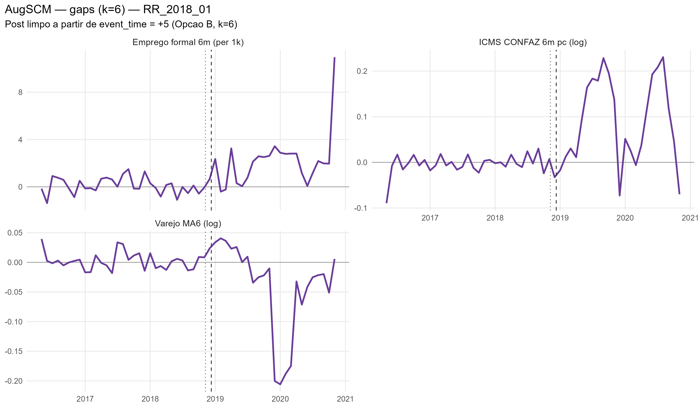
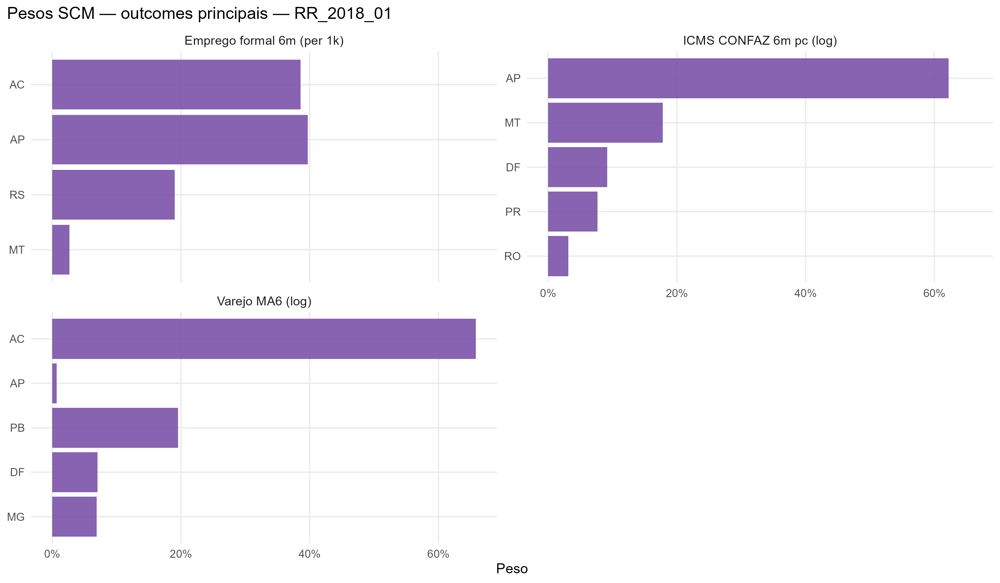

# RR_2018_01 results report (nova estrategia v2, k=6)

Generated on 2026-06-19.

Treated state: `RR`. Removal: `2018-12-10`.

## Window design

- Accumulation window: **k = 6** for all outcomes.
  - Retail: trailing 6-month mean, log (`retail_ma6_log`)
  - Formal hiring: CAGED net balance, 6m sum, per 1,000 residents (`formal_hiring_6m_per1k`)
  - ICMS: CONFAZ monthly per capita (BRL/resident), 6m sum, log (`icms_conf6m_pc_log`)
- Opcao B (k=6): first clean post-treatment reading at event_time = +5.
- Pre-treatment blocks: 5 non-overlapping semi-annual blocks [-30,-25], [-24,-19], [-18,-13], [-12,-7], [-6,-1].
  Valid pre-treatment window: event_time -31 to -1 (31 months; first 5 observations are NA due to k=6 initialization).
- ATT windows: w3m [+5,+7], w6m [+5,+10], w12m [+5,+16], w24m [+5,+28].

## Methodological strategy

Donor pool excludes `AM`, `RJ`, `RR`, `SC`, `TO` (22 eligible donors).
AugSCM with 5 non-overlapping semi-annual block-level AND block-slope predictors + 7 structural covariates (17 predictor rows total).
Slope rows force the SCM to match the within-block trend direction, not just the block-mean level.
Ridge penalty by LOO-CV (cross-validation, not the donor placebo).
Significance: in-space donor placebo (Abadie-Diamond-Hainmueller). LOO donor-exclusion placebo is a robustness check, not the significance criterion.

## Preliminary plots

## Covariate and pre-treatment balance

### Pre-treatment outcome fit

| Outcome | Treated | Synthetic | RMSPE pre | Pre periods |
| --- | --- | --- | --- | --- |
| Varejo MA6 (log) | 4.35 | 4.35 | 0.01 | 31 |
| Emprego formal 6m (per 1k) | 0.36 | 0.26 | 0.68 | 31 |
| ICMS CONFAZ 6m pc (log) | 6.59 | 6.59 | 0.02 | 31 |

### Covariate balance

| Covariate | Treated | Varejo MA6 (log) | Emprego formal 6m (per 1k) | ICMS CONFAZ 6m pc (log) |
| --- | --- | --- | --- | --- |
| Unemployment rate |     0.089 |     0.103 |     0.112 |     0.118 |
| Formalization rate |     0.562 |     0.513 |     0.534 |     0.559 |
| Labor income (real) | 3,281.611 | 2,845.431 | 2,995.606 | 3,362.831 |
| Transfer dependency ratio |     0.128 |     0.091 |     0.099 |     0.087 |
| Health expenditure pc |   283.644 |   222.837 |   209.822 |   200.498 |
| Education expenditure pc |   314.191 |   295.961 |   276.327 |   285.582 |
| Public security expenditure pc |   175.100 |   134.126 |   140.371 |   136.297 |

## Main results: Augmented SCM

| Channel | Outcome | Mean gap (w6m) | RMSPE pre | Donors |
| --- | --- | --- | --- | --- |
| Household consumption | Retail volume, MA6 trailing, log | -0.01 | 0.01 | 22 |
| Formal labor market | Net formal hiring, 6m sum, per 1,000 residents |  1.39 | 0.68 | 22 |
| State public finances | ICMS CONFAZ per capita, 6m sum, log BRL/resident |  0.17 | 0.02 | 22 |

### ATT by window

| Outcome | w3m | w6m | w12m | w24m |
| --- | --- | --- | --- | --- |
| Varejo MA6 (log) | 0.01 | -0.01 | -0.07 | -0.06 |
| Emprego formal 6m (per 1k) | 0.38 | 1.39 | 2.14 | 2.38 |
| ICMS CONFAZ 6m pc (log) | 0.15 | 0.17 | 0.10 | 0.11 |

## Donor weights

## Placebo in-space (criterio principal)

Cada doador refeito como se fosse o tratado; classic_p = ranking da razao RMSPE pos/pre do tratado real entre tratado+placebos. Com pool de doadores pequeno, o ranking e mais informativo que o p continuo (p minimo possivel ~= 1/N).

| Outcome | Rank | p (classico) |
| --- | --- | --- |
| Varejo MA6 (log) | 16 / 23 | 0.695652173913043 |
| Emprego formal 6m (per 1k) | 3 / 23 | 0.130434782608696 |
| ICMS CONFAZ 6m pc (log) | 9 / 23 | 0.391304347826087 |

## Robustez: placebo LOO por doador

Exclusao de um doador por vez, mantendo o tratado real fixo -- testa estabilidade ao doador, nao significancia (nao e usado para classificar tier).

| Outcome | Gap post | LOO rank | p (2-sided) |
| --- | --- | --- | --- |
| Varejo MA6 (log) | -0.057 | 23 / 23 | 0.043 |
| Emprego formal 6m (per 1k) | 2.378 | 23 / 23 | 0.043 |
| ICMS CONFAZ 6m pc (log) | 0.108 | 2 / 23 | 0.087 |

## Evidence classification

Tier: placebo in-space (criterio principal). Thresholds: log >= 0.05; formal_hiring_6m_per1k >= 0.5 (per 1k residents). Poor fit: pre corr < 0.70.

Considerable: **1** / 3.

| Outcome | Tier | Effect (w6m) | Inspace rank | Inspace p | Mag (pre-SD) | Persist | Pre-trend p | Pre corr | Pre R2 | afitw | LOO rank (rob.) | LOO p (rob.) | LOO sign (rob.) |
| --- | --- | --- | --- | --- | --- | --- | --- | --- | --- | --- | --- | --- | --- |
| Varejo MA6 (log) | weak | -0.8% | 16/23 | 0.696 | 2.01 | 0.79 | 0.47 | 0.90 | 0.74 |  | 23/23 | 0.043 | 1.00 |
| Emprego formal 6m (per 1k) | suggestive | +1.4 | 3/23 | 0.130 | 2.11 | 1.00 | 0.49 | 0.80 | 0.64 |  | 23/23 | 0.043 | 1.00 |
| ICMS CONFAZ 6m pc (log) | weak | +18.9% | 9/23 | 0.391 | 2.42 | 0.84 | 0.10 | 0.89 | 0.78 |  | 2/23 | 0.087 | 1.00 |

### Nova Estrategia (Alcance x Duracao)

- **Alcance**: Restrito
- **Duracao**: Persistente

| Variable | Affected |
| --- | --- |
| Retail MA6 (log) | FALSE |
| ICMS CONFAZ 6m per capita (log) | FALSE |
| Formal hiring 6m per 1k residents | TRUE |
