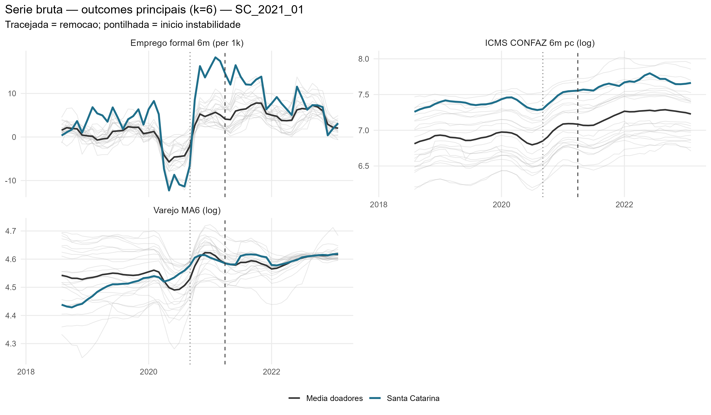
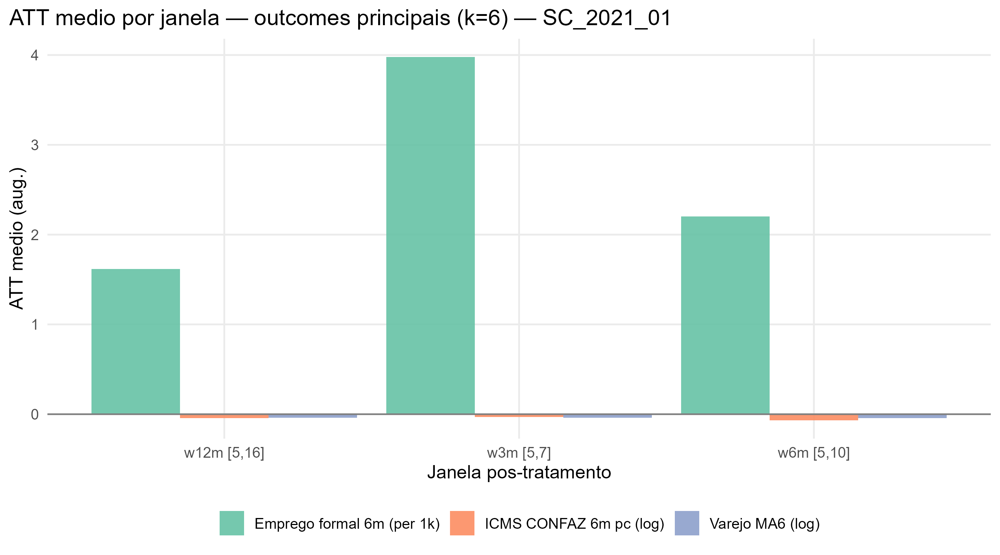
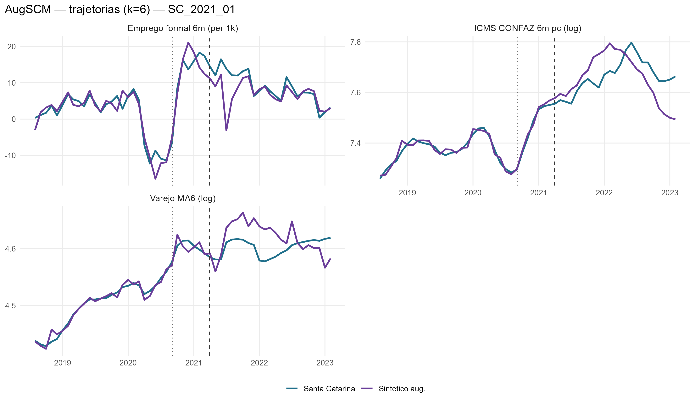
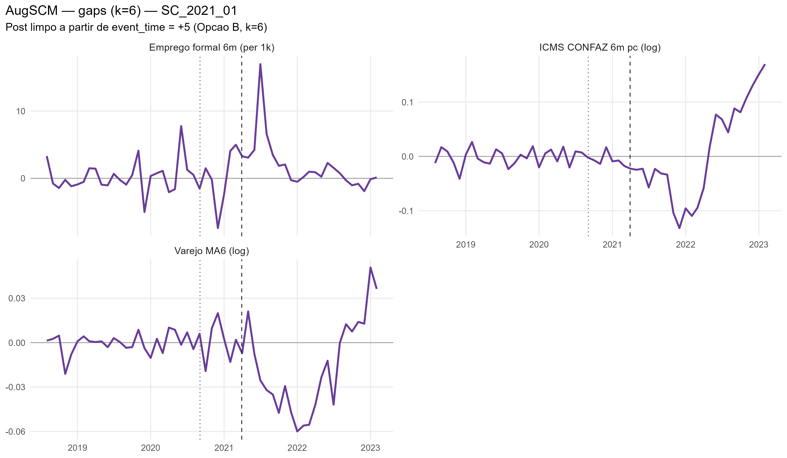
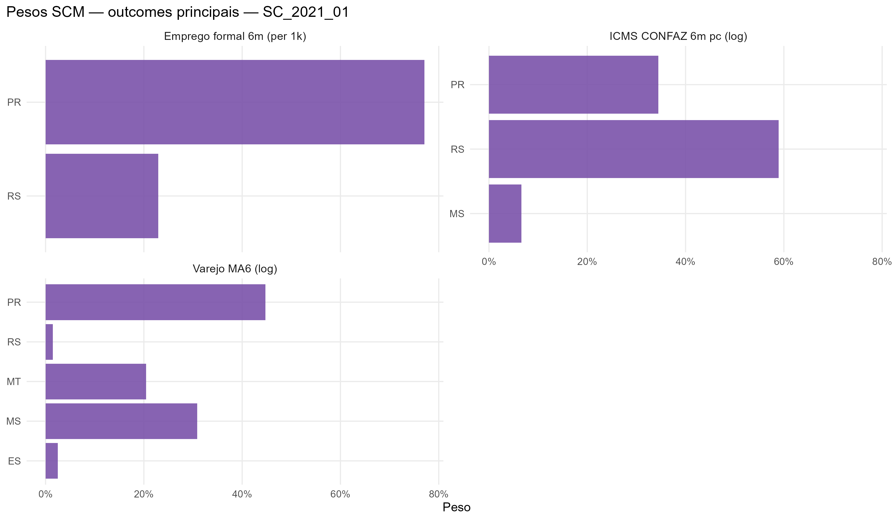

# SC_2021_01 results report (nova estrategia v2, k=6)

Generated on 2026-06-19.

Treated state: `SC`. Removal: `2021-03-30`.

## Window design

- Accumulation window: **k = 6** for all outcomes.
  - Retail: trailing 6-month mean, log (`retail_ma6_log`)
  - Formal hiring: CAGED net balance, 6m sum, per 1,000 residents (`formal_hiring_6m_per1k`)
  - ICMS: CONFAZ monthly per capita (BRL/resident), 6m sum, log (`icms_conf6m_pc_log`)
- Opcao B (k=6): first clean post-treatment reading at event_time = +5.
- Pre-treatment blocks: 5 non-overlapping semi-annual blocks [-30,-25], [-24,-19], [-18,-13], [-12,-7], [-6,-1].
  Valid pre-treatment window: event_time -31 to -1 (31 months; first 5 observations are NA due to k=6 initialization).
- ATT windows: w3m [+5,+7], w6m [+5,+10], w12m [+5,+16], w24m [+5,+28].

## Methodological strategy

Donor pool excludes `AL`, `AM`, `RJ`, `RR`, `SC`, `TO` (21 eligible donors).
AugSCM with 5 non-overlapping semi-annual block-level AND block-slope predictors + 7 structural covariates (17 predictor rows total).
Slope rows force the SCM to match the within-block trend direction, not just the block-mean level.
Ridge penalty by LOO-CV (cross-validation, not the donor placebo).
Significance: in-space donor placebo (Abadie-Diamond-Hainmueller). LOO donor-exclusion placebo is a robustness check, not the significance criterion.

## Preliminary plots

## Covariate and pre-treatment balance

### Pre-treatment outcome fit

| Outcome | Treated | Synthetic | RMSPE pre | Pre periods |
| --- | --- | --- | --- | --- |
| Varejo MA6 (log) | 4.52 | 4.52 | 0.01 | 31 |
| Emprego formal 6m (per 1k) | 3.19 | 3.18 | 2.66 | 31 |
| ICMS CONFAZ 6m pc (log) | 7.38 | 7.39 | 0.01 | 31 |

### Covariate balance

| Covariate | Treated | Varejo MA6 (log) | Emprego formal 6m (per 1k) | ICMS CONFAZ 6m pc (log) |
| --- | --- | --- | --- | --- |
| Unemployment rate |     0.051 |     0.072 |     0.071 |     0.071 |
| Formalization rate |     0.731 |     0.646 |     0.671 |     0.670 |
| Labor income (real) | 3,585.959 | 3,426.156 | 3,578.032 | 3,564.944 |
| Transfer dependency ratio |     0.052 |     0.073 |     0.063 |     0.064 |
| Health expenditure pc |   113.240 |   107.768 |   108.637 |   119.903 |
| Education expenditure pc |   116.976 |   182.885 |   184.042 |   135.946 |
| Public security expenditure pc |    80.385 |   103.704 |    82.924 |    88.935 |

## Main results: Augmented SCM

| Channel | Outcome | Mean gap (w6m) | RMSPE pre | Donors |
| --- | --- | --- | --- | --- |
| Household consumption | Retail volume, MA6 trailing, log | -0.04 | 0.01 | 21 |
| Formal labor market | Net formal hiring, 6m sum, per 1,000 residents |  2.20 | 2.66 | 21 |
| State public finances | ICMS CONFAZ per capita, 6m sum, log BRL/resident | -0.07 | 0.01 | 21 |

### ATT by window

| Outcome | w3m | w6m | w12m | w24m |
| --- | --- | --- | --- | --- |
| Varejo MA6 (log) | -0.04 | -0.04 | -0.04 | -0.02 |
| Emprego formal 6m (per 1k) | 3.98 | 2.20 | 1.62 | 0.85 |
| ICMS CONFAZ 6m pc (log) | -0.03 | -0.07 | -0.04 | 0.01 |

## Donor weights

## Placebo in-space (criterio principal)

Cada doador refeito como se fosse o tratado; classic_p = ranking da razao RMSPE pos/pre do tratado real entre tratado+placebos. Com pool de doadores pequeno, o ranking e mais informativo que o p continuo (p minimo possivel ~= 1/N).

| Outcome | Rank | p (classico) |
| --- | --- | --- |
| Varejo MA6 (log) | 7 / 22 | 0.318181818181818 |
| Emprego formal 6m (per 1k) | 20 / 22 | 0.909090909090909 |
| ICMS CONFAZ 6m pc (log) | 5 / 22 | 0.227272727272727 |

## Robustez: placebo LOO por doador

Exclusao de um doador por vez, mantendo o tratado real fixo -- testa estabilidade ao doador, nao significancia (nao e usado para classificar tier).

| Outcome | Gap post | LOO rank | p (2-sided) |
| --- | --- | --- | --- |
| Varejo MA6 (log) | -0.018 | 1 / 22 | 0.045 |
| Emprego formal 6m (per 1k) | 0.848 | 1 / 22 | 0.045 |
| ICMS CONFAZ 6m pc (log) | 0.013 | 1 / 22 | 0.045 |

## Evidence classification

Tier: placebo in-space (criterio principal). Thresholds: log >= 0.05; formal_hiring_6m_per1k >= 0.5 (per 1k residents). Poor fit: pre corr < 0.70.

Considerable: **0** / 3.

| Outcome | Tier | Effect (w6m) | Inspace rank | Inspace p | Mag (pre-SD) | Persist | Pre-trend p | Pre corr | Pre R2 | afitw | LOO rank (rob.) | LOO p (rob.) | LOO sign (rob.) |
| --- | --- | --- | --- | --- | --- | --- | --- | --- | --- | --- | --- | --- | --- |
| Varejo MA6 (log) | weak | -4.1% | 7/22 | 0.318 | 0.33 | 0.68 | 0.49 | 0.99 | 0.98 |  | 1/22 | 0.045 | 0.00 |
| Emprego formal 6m (per 1k) | weak | +2.2 | 20/22 | 0.909 | 0.11 | 0.63 | 0.88 | 0.95 | 0.88 |  | 1/22 | 0.045 | 1.00 |
| ICMS CONFAZ 6m pc (log) | weak | -6.8% | 5/22 | 0.227 | 0.19 | 0.53 | 0.84 | 0.98 | 0.95 |  | 1/22 | 0.045 | 1.00 |

### Nova Estrategia (Alcance x Duracao)

- **Alcance**: Nulo
- **Duracao**: Transitorio

| Variable | Affected |
| --- | --- |
| Retail MA6 (log) | FALSE |
| ICMS CONFAZ 6m per capita (log) | FALSE |
| Formal hiring 6m per 1k residents | FALSE |
