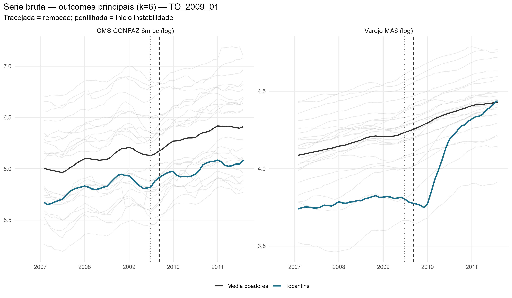
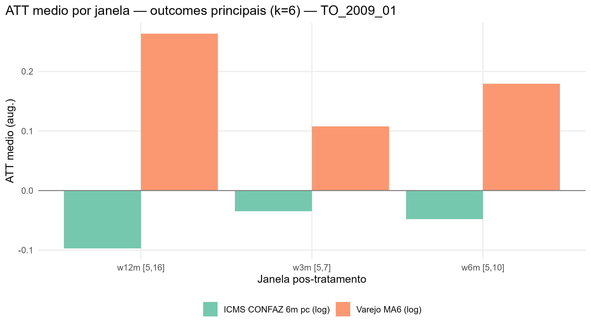
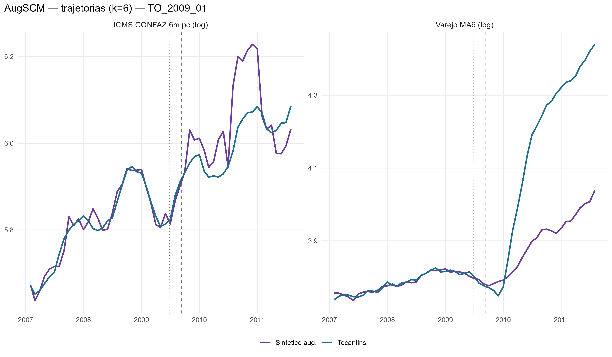
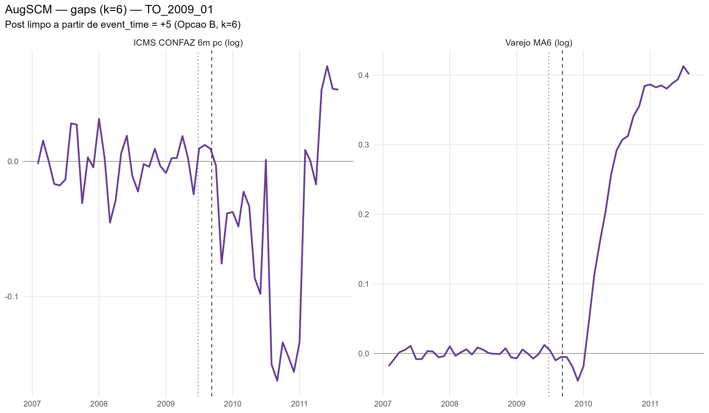
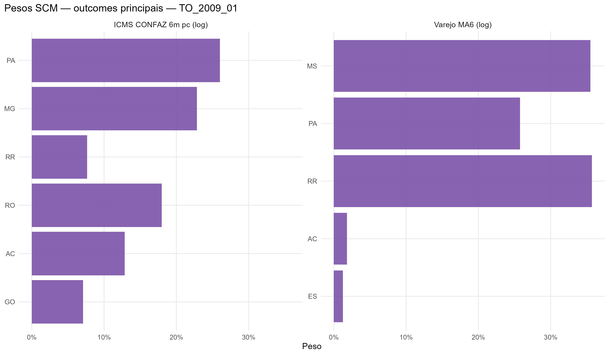

# TO_2009_01 results report (nova estrategia v2, k=6)

Generated on 2026-06-19.

Treated state: `TO`. Removal: `2009-09-08`.

**Nota**: emprego formal (CAGED) nao incluido neste evento -- a cobertura mensal do CAGED (a partir de 2007-01) nao alcanca a janela pre-tratamento exigida (5 blocos semestrais, ~35 meses). Teto de classificacao de Alcance = Ampliado.

## Window design

- Accumulation window: **k = 6** for all outcomes.
  - Retail: trailing 6-month mean, log (`retail_ma6_log`)
  - ICMS: CONFAZ monthly per capita (BRL/resident), 6m sum, log (`icms_conf6m_pc_log`)
- Opcao B (k=6): first clean post-treatment reading at event_time = +5.
- Pre-treatment blocks: 5 non-overlapping semi-annual blocks [-30,-25], [-24,-19], [-18,-13], [-12,-7], [-6,-1].
  Valid pre-treatment window: event_time -31 to -1 (31 months; first 5 observations are NA due to k=6 initialization).
- ATT windows: w3m [+5,+7], w6m [+5,+10], w12m [+5,+16], w24m [+5,+28].

## Methodological strategy

Donor pool excludes `DF`, `MA`, `PB`, `TO` (23 eligible donors).
AugSCM with 5 non-overlapping semi-annual block-level AND block-slope predictors + 6 structural covariates (16 predictor rows total).
Slope rows force the SCM to match the within-block trend direction, not just the block-mean level.
Ridge penalty by LOO-CV (cross-validation, not the donor placebo).
Significance: in-space donor placebo (Abadie-Diamond-Hainmueller). LOO donor-exclusion placebo is a robustness check, not the significance criterion.

## Preliminary plots

## Covariate and pre-treatment balance

### Pre-treatment outcome fit

| Outcome | Treated | Synthetic | RMSPE pre | Pre periods |
| --- | --- | --- | --- | --- |
| Varejo MA6 (log) | 3.78 | 3.79 | 0.01 | 31 |
| ICMS CONFAZ 6m pc (log) | 5.81 | 5.81 | 0.02 | 31 |

### Covariate balance

| Covariate | Treated | Varejo MA6 (log) | ICMS CONFAZ 6m pc (log) |
| --- | --- | --- | --- |
| ICMS secondary VA pc |  6.188 |  4.931 |  9.561 |
| ICMS tertiary VA pc | 18.615 | 32.205 | 35.068 |
| ICMS energy VA pc |  4.610 |  4.282 |  4.471 |
| ICMS fuels VA pc | 13.183 | 17.056 | 11.195 |
| FPE transfer pc | 81.070 | 70.483 | 46.347 |
| IOF-state pc |  0.000 |  0.003 |  0.004 |

## Main results: Augmented SCM

| Channel | Outcome | Mean gap (w6m) | RMSPE pre | Donors |
| --- | --- | --- | --- | --- |
| Household consumption | Retail volume, MA6 trailing, log |  0.18 | 0.01 | 23 |
| State public finances | ICMS CONFAZ per capita, 6m sum, log BRL/resident | -0.05 | 0.02 | 23 |

### ATT by window

| Outcome | w3m | w6m | w12m | w24m |
| --- | --- | --- | --- | --- |
| Varejo MA6 (log) | 0.11 | 0.18 | 0.26 | 0.31 |
| ICMS CONFAZ 6m pc (log) | -0.03 | -0.05 | -0.10 | -0.05 |

## Donor weights

## Placebo in-space (criterio principal)

Cada doador refeito como se fosse o tratado; classic_p = ranking da razao RMSPE pos/pre do tratado real entre tratado+placebos. Com pool de doadores pequeno, o ranking e mais informativo que o p continuo (p minimo possivel ~= 1/N).

| Outcome | Rank | p (classico) |
| --- | --- | --- |
| Varejo MA6 (log) | 1 / 24 | 0.0416666666666667 |
| ICMS CONFAZ 6m pc (log) | 9 / 24 | 0.375 |

## Robustez: placebo LOO por doador

Exclusao de um doador por vez, mantendo o tratado real fixo -- testa estabilidade ao doador, nao significancia (nao e usado para classificar tier).

| Outcome | Gap post | LOO rank | p (2-sided) |
| --- | --- | --- | --- |
| Varejo MA6 (log) | 0.311 | 24 / 24 | 0.042 |
| ICMS CONFAZ 6m pc (log) | -0.05 | 24 / 24 | 0.042 |

## Evidence classification

Tier: placebo in-space (criterio principal). Thresholds: log >= 0.05; formal_hiring_6m_per1k >= 0.5 (per 1k residents). Poor fit: pre corr < 0.70.

Considerable: **1** / 2.

| Outcome | Tier | Effect (w6m) | Inspace rank | Inspace p | Mag (pre-SD) | Persist | Pre-trend p | Pre corr | Pre R2 | afitw | LOO rank (rob.) | LOO p (rob.) | LOO sign (rob.) |
| --- | --- | --- | --- | --- | --- | --- | --- | --- | --- | --- | --- | --- | --- |
| Varejo MA6 (log) | strong | +19.6% | 1/24 | 0.042 | 11.43 | 1.00 | 0.38 | 0.97 | 0.93 |  | 24/24 | 0.042 | 1.00 |
| ICMS CONFAZ 6m pc (log) | weak | -4.7% | 9/24 | 0.375 |  0.60 | 0.63 | 0.80 | 0.98 | 0.95 |  | 24/24 | 0.042 | 1.00 |

### Nova Estrategia (Alcance x Duracao)

- **Alcance**: Restrito
- **Duracao**: Persistente

| Variable | Affected |
| --- | --- |
| Retail MA6 (log) | TRUE |
| ICMS CONFAZ 6m per capita (log) | FALSE |
| Formal hiring 6m per 1k residents | NA (CAGED indisponivel) |
