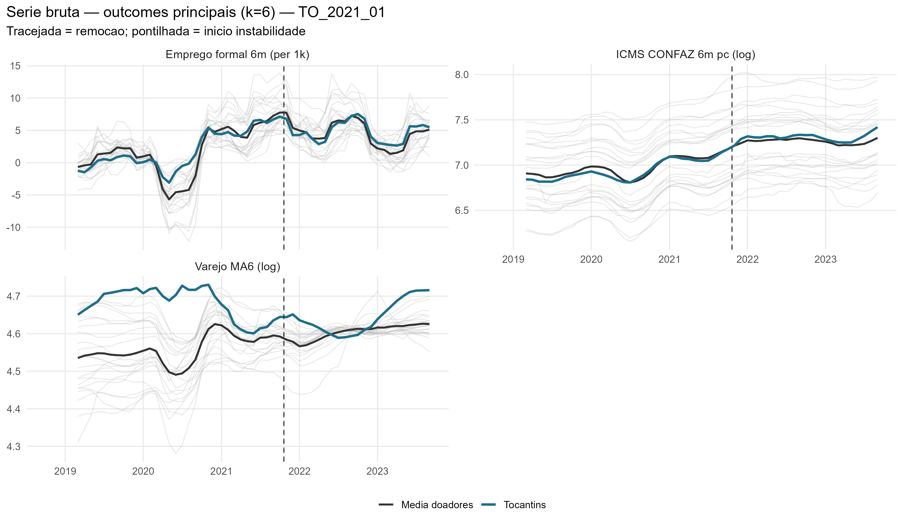
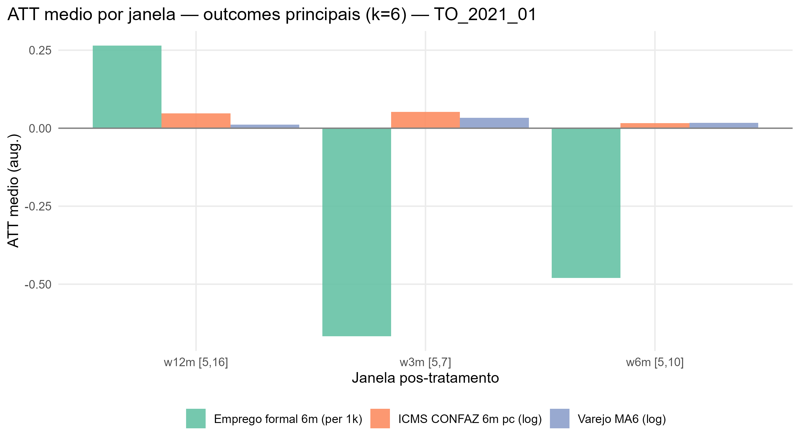
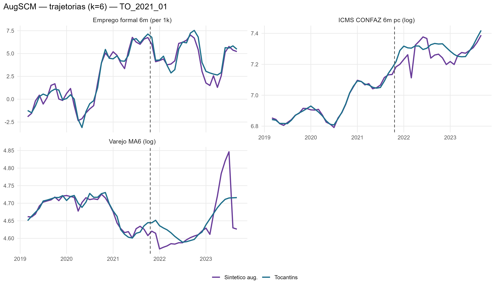
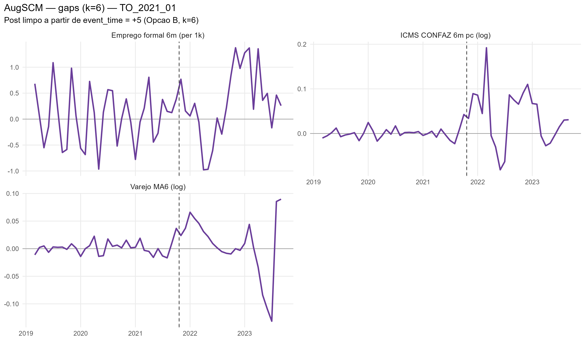
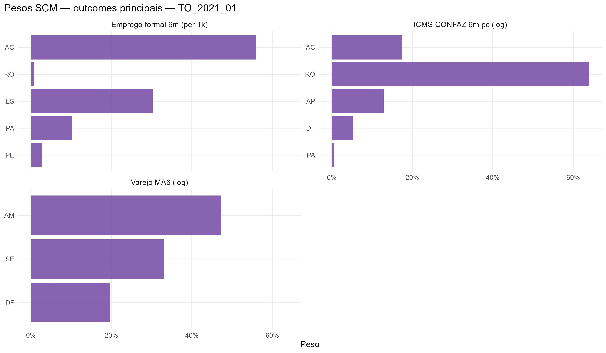

# TO_2021_01 results report (nova estrategia v2, k=6)

Generated on 2026-06-19.

Treated state: `TO`. Removal: `2021-10-20`.

## Window design

- Accumulation window: **k = 6** for all outcomes.
  - Retail: trailing 6-month mean, log (`retail_ma6_log`)
  - Formal hiring: CAGED net balance, 6m sum, per 1,000 residents (`formal_hiring_6m_per1k`)
  - ICMS: CONFAZ monthly per capita (BRL/resident), 6m sum, log (`icms_conf6m_pc_log`)
- Opcao B (k=6): first clean post-treatment reading at event_time = +5.
- Pre-treatment blocks: 5 non-overlapping semi-annual blocks [-30,-25], [-24,-19], [-18,-13], [-12,-7], [-6,-1].
  Valid pre-treatment window: event_time -31 to -1 (31 months; first 5 observations are NA due to k=6 initialization).
- ATT windows: w3m [+5,+7], w6m [+5,+10], w12m [+5,+16], w24m [+5,+28].

## Methodological strategy

Donor pool excludes `AL`, `RJ`, `RR`, `SC`, `TO` (22 eligible donors).
AugSCM with 5 non-overlapping semi-annual block-level AND block-slope predictors + 7 structural covariates (17 predictor rows total).
Slope rows force the SCM to match the within-block trend direction, not just the block-mean level.
Ridge penalty by LOO-CV (cross-validation, not the donor placebo).
Significance: in-space donor placebo (Abadie-Diamond-Hainmueller). LOO donor-exclusion placebo is a robustness check, not the significance criterion.

## Preliminary plots

## Covariate and pre-treatment balance

### Pre-treatment outcome fit

| Outcome | Treated | Synthetic | RMSPE pre | Pre periods |
| --- | --- | --- | --- | --- |
| Varejo MA6 (log) | 4.68 | 4.68 | 0.01 | 31 |
| Emprego formal 6m (per 1k) | 1.85 | 1.82 | 0.53 | 31 |
| ICMS CONFAZ 6m pc (log) | 6.94 | 6.94 | 0.01 | 31 |

### Covariate balance

| Covariate | Treated | Varejo MA6 (log) | Emprego formal 6m (per 1k) | ICMS CONFAZ 6m pc (log) |
| --- | --- | --- | --- | --- |
| Unemployment rate |     0.102 |     0.127 |     0.111 |     0.094 |
| Formalization rate |     0.556 |     0.502 |     0.519 |     0.517 |
| Labor income (real) | 2,659.377 | 3,203.393 | 2,761.458 | 2,883.979 |
| Transfer dependency ratio |     0.255 |     0.151 |     0.242 |     0.221 |
| Health expenditure pc |   251.799 |   193.360 |   209.084 |   185.024 |
| Education expenditure pc |   181.093 |   194.459 |   231.454 |   221.603 |
| Public security expenditure pc |   139.965 |    96.535 |   121.451 |   128.510 |

## Main results: Augmented SCM

| Channel | Outcome | Mean gap (w6m) | RMSPE pre | Donors |
| --- | --- | --- | --- | --- |
| Household consumption | Retail volume, MA6 trailing, log |  0.02 | 0.01 | 22 |
| Formal labor market | Net formal hiring, 6m sum, per 1,000 residents | -0.48 | 0.53 | 22 |
| State public finances | ICMS CONFAZ per capita, 6m sum, log BRL/resident |  0.02 | 0.01 | 22 |

### ATT by window

| Outcome | w3m | w6m | w12m | w24m |
| --- | --- | --- | --- | --- |
| Varejo MA6 (log) | 0.03 | 0.02 | 0.01 | 0.00 |
| Emprego formal 6m (per 1k) | -0.67 | -0.48 | 0.26 | 0.32 |
| ICMS CONFAZ 6m pc (log) | 0.05 | 0.02 | 0.05 | 0.03 |

## Donor weights

## Placebo in-space (criterio principal)

Cada doador refeito como se fosse o tratado; classic_p = ranking da razao RMSPE pos/pre do tratado real entre tratado+placebos. Com pool de doadores pequeno, o ranking e mais informativo que o p continuo (p minimo possivel ~= 1/N).

| Outcome | Rank | p (classico) |
| --- | --- | --- |
| Varejo MA6 (log) | 4 / 23 | 0.173913043478261 |
| Emprego formal 6m (per 1k) | 20 / 23 | 0.869565217391304 |
| ICMS CONFAZ 6m pc (log) | 4 / 23 | 0.173913043478261 |

## Robustez: placebo LOO por doador

Exclusao de um doador por vez, mantendo o tratado real fixo -- testa estabilidade ao doador, nao significancia (nao e usado para classificar tier).

| Outcome | Gap post | LOO rank | p (2-sided) |
| --- | --- | --- | --- |
| Varejo MA6 (log) | -0.002 | 1 / 23 | 0.043 |
| Emprego formal 6m (per 1k) | 0.323 | 3 / 23 | 0.13 |
| ICMS CONFAZ 6m pc (log) | 0.031 | 22 / 23 | 0.087 |

## Evidence classification

Tier: placebo in-space (criterio principal). Thresholds: log >= 0.05; formal_hiring_6m_per1k >= 0.5 (per 1k residents). Poor fit: pre corr < 0.70.

Considerable: **0** / 3.

| Outcome | Tier | Effect (w6m) | Inspace rank | Inspace p | Mag (pre-SD) | Persist | Pre-trend p | Pre corr | Pre R2 | afitw | LOO rank (rob.) | LOO p (rob.) | LOO sign (rob.) |
| --- | --- | --- | --- | --- | --- | --- | --- | --- | --- | --- | --- | --- | --- |
| Varejo MA6 (log) | weak | +1.8% | 4/23 | 0.174 | 0.05 | 0.47 | 0.75 | 0.97 | 0.94 |  | 1/23 | 0.043 | 0.00 |
| Emprego formal 6m (per 1k) | weak | -0.5 | 20/23 | 0.870 | 0.11 | 0.68 | 0.94 | 0.98 | 0.97 |  | 3/23 | 0.130 | 1.00 |
| ICMS CONFAZ 6m pc (log) | weak | +1.7% | 4/23 | 0.174 | 0.29 | 0.58 | 0.78 | 1.00 | 0.99 |  | 22/23 | 0.087 | 0.05 |

### Nova Estrategia (Alcance x Duracao)

- **Alcance**: Nulo
- **Duracao**: Transitorio

| Variable | Affected |
| --- | --- |
| Retail MA6 (log) | FALSE |
| ICMS CONFAZ 6m per capita (log) | FALSE |
| Formal hiring 6m per 1k residents | FALSE |
