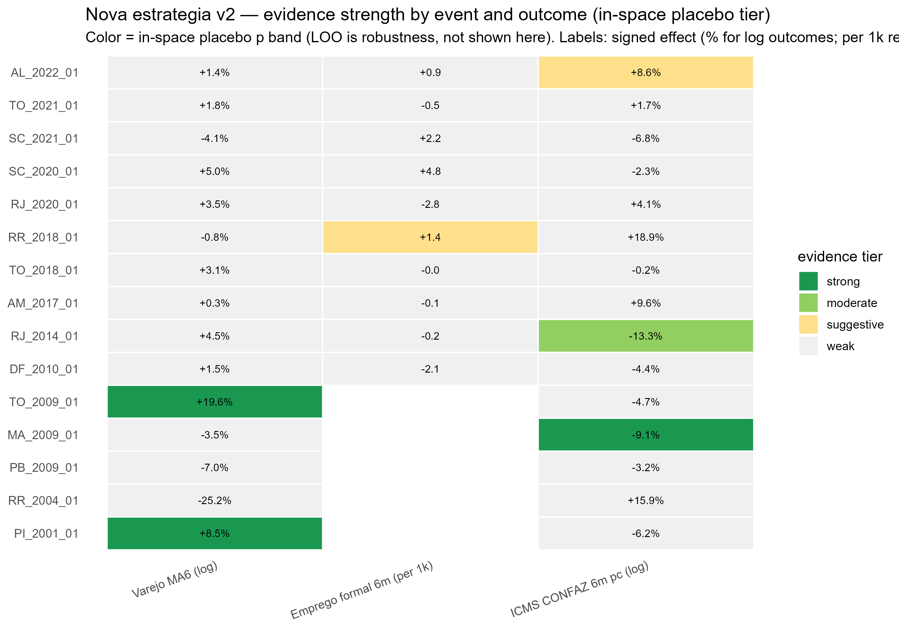
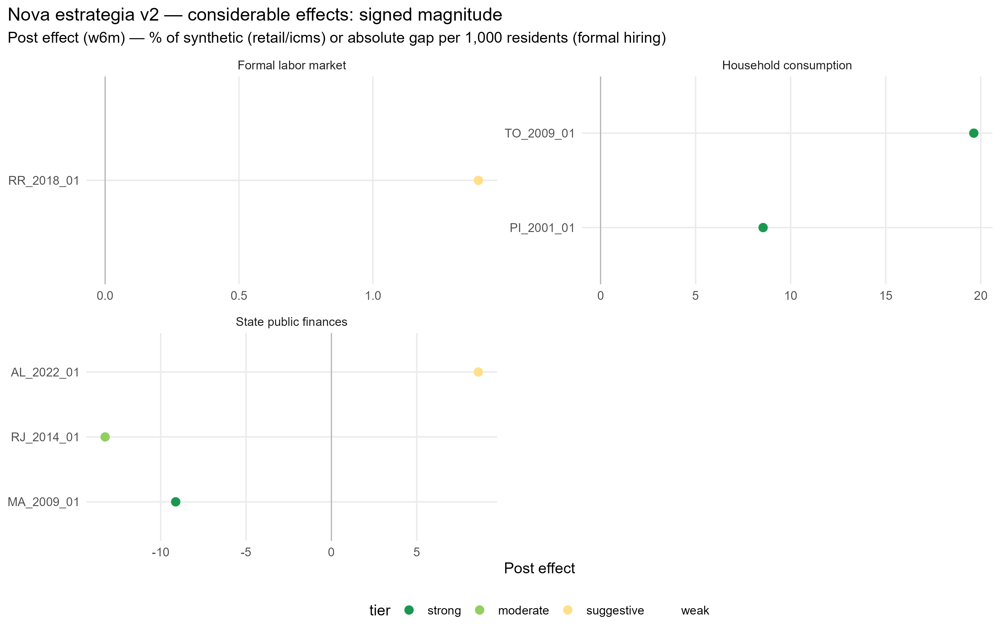
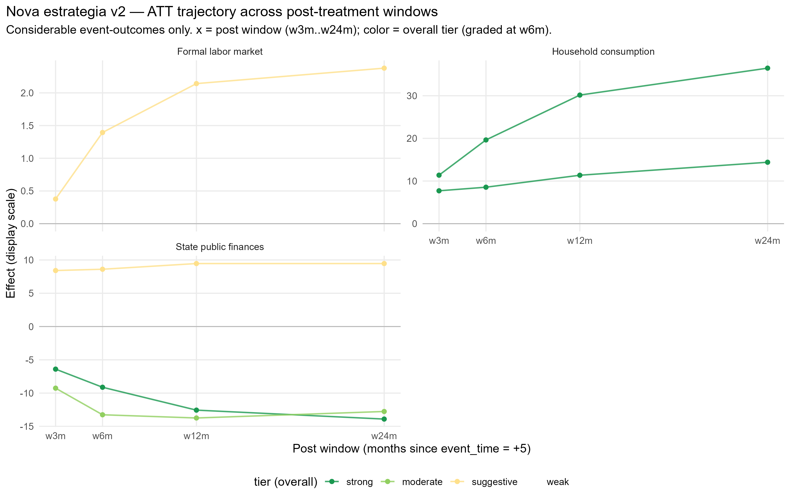

# Nova estrategia v2 — cross-event results summary

Generated on 2026-06-19. Events with results: 15 (of 15 in scope).

## Evidence ruler

Tiers follow the in-space donor placebo test (Abadie, Diamond & Hainmueller 2010): each donor is refit as if it were the treated unit (donor pool = the other donors, real treated state excluded), and the real treated unit's post/pre RMSPE ratio is ranked within the resulting placebo distribution (classic_p = rank/N, two-sided). With a small donor pool (~22-27) the smallest achievable p is ~1/N, so the rank itself -- not the continuous p -- is the informative statistic; both are reported. To rise above *weak* the effect must also clear a substantive-magnitude threshold (log outcomes: |ATT| >= 5% in w6m or w12m; formal hiring: >= 0.5 per 1,000 residents) and have post-period sign-consistency >= 50%. **strong** (p<=0.05), **moderate** (<=0.10), **suggestive** (<=0.15), **weak** otherwise; *considerable* = strong/moderate/suggestive. The leave-one-out (LOO) donor-exclusion placebo is reported separately as a robustness check (stability to which donor is in the pool) -- it is **not** used to grade tiers. Pre-treatment fit (treated-synthetic correlation/R2) is reported and poor-fit cells flagged, **not** used to discard results.

### Tier distribution

| Tier | n |
| --- | --- |
| strong |  3 |
| moderate |  1 |
| suggestive |  2 |
| weak | 34 |

**Considerable effects: 6 of 40** event-outcomes; 2 negative / 4 positive.

## Groupings (considerable effects only)

### By timing in mandate (removal in last year vs earlier)

| Group | considerable | negative | positive |
| --- | --- | --- | --- |
| earlier | 3 | 1 | 2 |
| last-year | 3 | 1 | 2 |

### By sample (main vs extended)

| Group | considerable | negative | positive |
| --- | --- | --- | --- |
| extended | 3 | 1 | 2 |
| main | 3 | 1 | 2 |

### By channel

| Group | considerable | negative | positive |
| --- | --- | --- | --- |
| Formal labor market | 1 | 0 | 1 |
| Household consumption | 2 | 0 | 2 |
| State public finances | 3 | 2 | 1 |

## Master table (all event-outcomes)

| Event | Outcome | Tier | Effect | Inspace p | Inspace rank | Persist | Pre corr | Poor fit | Dir | LOO p (rob.) | LOO rank (rob.) |
| --- | --- | --- | --- | --- | --- | --- | --- | --- | --- | --- | --- |
| PI_2001_01 | Varejo MA6 (log) | strong | +8.5% | 0.037 | 1/27 | 1.00 | 0.96 |  | positive | 0.037 | 1/27 |
| PI_2001_01 | ICMS CONFAZ 6m pc (log) | weak | -6.2% | 0.296 | 8/27 | 1.00 | 1.00 |  | negative | 0.037 | 27/27 |
| RR_2004_01 | Varejo MA6 (log) | weak | -25.2% | 0.615 | 16/26 | 1.00 | 0.98 |  | negative | 0.038 | 26/26 |
| RR_2004_01 | ICMS CONFAZ 6m pc (log) | weak | +15.9% | 0.385 | 10/26 | 1.00 | 0.80 |  | positive | 0.038 | 26/26 |
| PB_2009_01 | Varejo MA6 (log) | weak | -7.0% | 0.333 | 8/24 | 0.58 | 0.99 |  | negative | 0.042 | 24/24 |
| PB_2009_01 | ICMS CONFAZ 6m pc (log) | weak | -3.2% | 0.208 | 5/24 | 1.00 | 1.00 |  | negative | 0.042 | 24/24 |
| MA_2009_01 | Varejo MA6 (log) | weak | -3.5% | 0.625 | 15/24 | 0.58 | 1.00 |  | negative | 0.042 | 24/24 |
| MA_2009_01 | ICMS CONFAZ 6m pc (log) | strong | -9.1% | 0.042 | 1/24 | 1.00 | 0.99 |  | negative | 0.042 | 24/24 |
| TO_2009_01 | Varejo MA6 (log) | strong | +19.6% | 0.042 | 1/24 | 1.00 | 0.97 |  | positive | 0.042 | 24/24 |
| TO_2009_01 | ICMS CONFAZ 6m pc (log) | weak | -4.7% | 0.375 | 9/24 | 0.63 | 0.98 |  | negative | 0.042 | 24/24 |
| DF_2010_01 | Varejo MA6 (log) | weak | +1.5% | 1.000 | 24/24 | 1.00 | 0.97 |  | positive | 0.042 | 1/24 |
| DF_2010_01 | Emprego formal 6m (per 1k) | weak | -2.1 | 0.708 | 17/24 | 1.00 | 0.80 |  | negative | 0.042 | 1/24 |
| DF_2010_01 | ICMS CONFAZ 6m pc (log) | weak | -4.4% | 0.458 | 11/24 | 1.00 | 0.98 |  | negative | 0.083 | 2/24 |
| RJ_2014_01 | Varejo MA6 (log) | weak | +4.5% | 0.185 | 5/27 | 1.00 | 1.00 |  | positive | 0.037 | 1/27 |
| RJ_2014_01 | Emprego formal 6m (per 1k) | weak | -0.2 | 0.889 | 24/27 | 0.53 | 0.91 |  | negative | 0.074 | 26/27 |
| RJ_2014_01 | ICMS CONFAZ 6m pc (log) | moderate | -13.3% | 0.074 | 2/27 | 1.00 | 0.99 |  | negative | 0.037 | 1/27 |
| AM_2017_01 | Varejo MA6 (log) | weak | +0.3% | 0.800 | 20/25 | 0.63 | 1.00 |  | positive | 0.080 | 2/25 |
| AM_2017_01 | Emprego formal 6m (per 1k) | weak | -0.1 | 0.920 | 23/25 | 0.53 | 0.97 |  | negative | 0.120 | 3/25 |
| AM_2017_01 | ICMS CONFAZ 6m pc (log) | weak | +9.6% | 0.480 | 12/25 | 0.84 | 0.94 |  | positive | 0.120 | 3/25 |
| TO_2018_01 | Varejo MA6 (log) | weak | +3.1% | 0.200 | 5/25 | 0.95 | 0.99 |  | positive | 0.040 | 1/25 |
| TO_2018_01 | Emprego formal 6m (per 1k) | weak | -0.0 | 0.960 | 24/25 | 0.84 | 0.88 |  | negative | 0.200 | 5/25 |
| TO_2018_01 | ICMS CONFAZ 6m pc (log) | weak | -0.2% | 1.000 | 25/25 | 0.84 | 0.97 |  | negative | 0.160 | 22/25 |
| RR_2018_01 | Varejo MA6 (log) | weak | -0.8% | 0.696 | 16/23 | 0.79 | 0.90 |  | negative | 0.043 | 23/23 |
| RR_2018_01 | Emprego formal 6m (per 1k) | suggestive | +1.4 | 0.130 | 3/23 | 1.00 | 0.80 |  | positive | 0.043 | 23/23 |
| RR_2018_01 | ICMS CONFAZ 6m pc (log) | weak | +18.9% | 0.391 | 9/23 | 0.84 | 0.89 |  | positive | 0.087 | 2/23 |
| RJ_2020_01 | Varejo MA6 (log) | weak | +3.5% | 0.565 | 13/23 | 1.00 | 0.93 |  | positive | 0.043 | 1/23 |
| RJ_2020_01 | Emprego formal 6m (per 1k) | weak | -2.8 | 0.261 | 6/23 | 0.74 | 0.97 |  | negative | 0.217 | 19/23 |
| RJ_2020_01 | ICMS CONFAZ 6m pc (log) | weak | +4.1% | 1.000 | 23/23 | 0.47 | 0.91 |  | positive | 0.043 | 23/23 |
| SC_2020_01 | Varejo MA6 (log) | weak | +5.0% | 0.261 | 6/23 | 0.68 | 1.00 |  | positive | 0.043 | 1/23 |
| SC_2020_01 | Emprego formal 6m (per 1k) | weak | +4.8 | 0.391 | 9/23 | 0.95 | 0.98 |  | positive | 0.043 | 1/23 |
| SC_2020_01 | ICMS CONFAZ 6m pc (log) | weak | -2.3% | 0.261 | 6/23 | 0.74 | 0.98 |  | negative | 0.043 | 1/23 |
| SC_2021_01 | Varejo MA6 (log) | weak | -4.1% | 0.318 | 7/22 | 0.68 | 0.99 |  | negative | 0.045 | 1/22 |
| SC_2021_01 | Emprego formal 6m (per 1k) | weak | +2.2 | 0.909 | 20/22 | 0.63 | 0.95 |  | positive | 0.045 | 1/22 |
| SC_2021_01 | ICMS CONFAZ 6m pc (log) | weak | -6.8% | 0.227 | 5/22 | 0.53 | 0.98 |  | negative | 0.045 | 1/22 |
| TO_2021_01 | Varejo MA6 (log) | weak | +1.8% | 0.174 | 4/23 | 0.47 | 0.97 |  | positive | 0.043 | 1/23 |
| TO_2021_01 | Emprego formal 6m (per 1k) | weak | -0.5 | 0.870 | 20/23 | 0.68 | 0.98 |  | negative | 0.130 | 3/23 |
| TO_2021_01 | ICMS CONFAZ 6m pc (log) | weak | +1.7% | 0.174 | 4/23 | 0.58 | 1.00 |  | positive | 0.087 | 22/23 |
| AL_2022_01 | Varejo MA6 (log) | weak | +1.4% | 0.739 | 17/23 | 0.95 | 0.99 |  | positive | 0.304 | 7/23 |
| AL_2022_01 | Emprego formal 6m (per 1k) | weak | +0.9 | 0.565 | 13/23 | 0.63 | 0.99 |  | positive | 0.043 | 23/23 |
| AL_2022_01 | ICMS CONFAZ 6m pc (log) | suggestive | +8.6% | 0.130 | 3/23 | 1.00 | 1.00 |  | positive | 0.043 | 23/23 |

## ATT by post-treatment window (all event-outcomes)

Windows fixed in the rr_2018_01_v6 pilot: w3m [+5,+7], w6m [+5,+10], w12m [+5,+16], w24m [+5,+28] (event_time in months since removal; post starts at +5, Option B for k=6).

| Event | Outcome | w3m | w6m | w12m | w24m | Sign stable |
| --- | --- | --- | --- | --- | --- | --- |
| PI_2001_01 | Varejo MA6 (log) | +7.7% | +8.5% | +11.4% | +14.4% | yes |
| PI_2001_01 | ICMS CONFAZ 6m pc (log) | -5.4% | -6.2% | -7.2% | -5.9% | yes |
| RR_2004_01 | Varejo MA6 (log) | -22.1% | -25.2% | -25.9% | -25.2% | yes |
| RR_2004_01 | ICMS CONFAZ 6m pc (log) | +16.2% | +15.9% | +12.9% | +15.0% | yes |
| PB_2009_01 | Varejo MA6 (log) | -6.1% | -7.0% | -5.1% | -0.6% | yes |
| PB_2009_01 | ICMS CONFAZ 6m pc (log) | -2.6% | -3.2% | -3.3% | -3.7% | yes |
| MA_2009_01 | Varejo MA6 (log) | -3.1% | -3.5% | -2.7% | -0.9% | yes |
| MA_2009_01 | ICMS CONFAZ 6m pc (log) | -6.4% | -9.1% | -12.6% | -13.9% | yes |
| TO_2009_01 | Varejo MA6 (log) | +11.4% | +19.6% | +30.2% | +36.5% | yes |
| TO_2009_01 | ICMS CONFAZ 6m pc (log) | -3.4% | -4.7% | -9.3% | -4.9% | yes |
| DF_2010_01 | Varejo MA6 (log) | +2.0% | +1.5% | +1.4% | +1.4% | yes |
| DF_2010_01 | Emprego formal 6m (per 1k) | -1.9 | -2.1 | -2.1 | -1.9 | yes |
| DF_2010_01 | ICMS CONFAZ 6m pc (log) | -4.2% | -4.4% | -6.5% | -6.2% | yes |
| RJ_2014_01 | Varejo MA6 (log) | +4.7% | +4.5% | +3.5% | +3.9% | yes |
| RJ_2014_01 | Emprego formal 6m (per 1k) | -0.2 | -0.2 | -0.2 | +0.0 | no |
| RJ_2014_01 | ICMS CONFAZ 6m pc (log) | -9.3% | -13.3% | -13.7% | -12.8% | yes |
| AM_2017_01 | Varejo MA6 (log) | -0.8% | +0.3% | -0.9% | -2.2% | no |
| AM_2017_01 | Emprego formal 6m (per 1k) | +0.1 | -0.1 | -0.1 | -0.0 | no |
| AM_2017_01 | ICMS CONFAZ 6m pc (log) | +9.2% | +9.6% | +7.4% | +5.3% | yes |
| TO_2018_01 | Varejo MA6 (log) | +4.2% | +3.1% | +3.9% | +6.4% | yes |
| TO_2018_01 | Emprego formal 6m (per 1k) | +0.5 | -0.0 | -0.2 | -0.3 | no |
| TO_2018_01 | ICMS CONFAZ 6m pc (log) | +0.8% | -0.2% | +1.1% | +1.7% | no |
| RR_2018_01 | Varejo MA6 (log) | +1.2% | -0.8% | -6.9% | -5.5% | no |
| RR_2018_01 | Emprego formal 6m (per 1k) | +0.4 | +1.4 | +2.1 | +2.4 | yes |
| RR_2018_01 | ICMS CONFAZ 6m pc (log) | +15.7% | +18.9% | +10.6% | +11.4% | yes |
| RJ_2020_01 | Varejo MA6 (log) | +3.4% | +3.5% | +3.5% | +3.0% | yes |
| RJ_2020_01 | Emprego formal 6m (per 1k) | -4.1 | -2.8 | -2.0 | -0.8 | yes |
| RJ_2020_01 | ICMS CONFAZ 6m pc (log) | +6.1% | +4.1% | +1.4% | +0.5% | yes |
| SC_2020_01 | Varejo MA6 (log) | +4.7% | +5.0% | +2.4% | +1.4% | yes |
| SC_2020_01 | Emprego formal 6m (per 1k) | +4.1 | +4.8 | +3.1 | +2.4 | yes |
| SC_2020_01 | ICMS CONFAZ 6m pc (log) | -1.3% | -2.3% | -4.4% | -2.0% | yes |
| SC_2021_01 | Varejo MA6 (log) | -3.7% | -4.1% | -3.9% | -1.8% | yes |
| SC_2021_01 | Emprego formal 6m (per 1k) | +4.0 | +2.2 | +1.6 | +0.8 | yes |
| SC_2021_01 | ICMS CONFAZ 6m pc (log) | -2.9% | -6.8% | -4.2% | +1.3% | no |
| TO_2021_01 | Varejo MA6 (log) | +3.4% | +1.8% | +1.2% | -0.2% | no |
| TO_2021_01 | Emprego formal 6m (per 1k) | -0.7 | -0.5 | +0.3 | +0.3 | no |
| TO_2021_01 | ICMS CONFAZ 6m pc (log) | +5.4% | +1.7% | +4.9% | +3.2% | yes |
| AL_2022_01 | Varejo MA6 (log) | +0.8% | +1.4% | +1.6% | +1.6% | yes |
| AL_2022_01 | Emprego formal 6m (per 1k) | +1.5 | +0.9 | +0.8 | -0.5 | no |
| AL_2022_01 | ICMS CONFAZ 6m pc (log) | +8.4% | +8.6% | +9.5% | +9.5% | yes |

**Sign stability**: of the 6 considerable effects (graded at w6m), 6 keep the same sign across every available window; 0 reverse sign somewhere between w3m and w24m.

## Nova Estrategia classification (Alcance x Duracao)

Alcance = count of outcomes affected (0=Nulo, 1=Restrito, 2=Ampliado, 3=Propagado), no hierarchy among variables. Ceiling is Ampliado for the 5 events without formal_hiring (CAGED coverage insufficient).

| Event | Alcance | Duracao | Retail | ICMS | Hiring |
| --- | --- | --- | --- | --- | --- |
| PI_2001_01 | Restrito | Persistente | TRUE | FALSE | NA (CAGED indisponivel) |
| RR_2004_01 | Nulo | Transitorio | FALSE | FALSE | NA (CAGED indisponivel) |
| PB_2009_01 | Nulo | Transitorio | FALSE | FALSE | NA (CAGED indisponivel) |
| MA_2009_01 | Restrito | Persistente | FALSE | TRUE | NA (CAGED indisponivel) |
| TO_2009_01 | Restrito | Persistente | TRUE | FALSE | NA (CAGED indisponivel) |
| DF_2010_01 | Nulo | Transitorio | FALSE | FALSE | FALSE |
| RJ_2014_01 | Restrito | Transitorio | FALSE | TRUE | FALSE |
| AM_2017_01 | Nulo | Transitorio | FALSE | FALSE | FALSE |
| TO_2018_01 | Nulo | Transitorio | FALSE | FALSE | FALSE |
| RR_2018_01 | Restrito | Persistente | FALSE | FALSE | TRUE |
| RJ_2020_01 | Nulo | Transitorio | FALSE | FALSE | FALSE |
| SC_2020_01 | Nulo | Transitorio | FALSE | FALSE | FALSE |
| SC_2021_01 | Nulo | Transitorio | FALSE | FALSE | FALSE |
| TO_2021_01 | Nulo | Transitorio | FALSE | FALSE | FALSE |
| AL_2022_01 | Restrito | Persistente | FALSE | TRUE | FALSE |

## Methodological note

In-space placebo inference is discrete and low-resolution when the donor pool is small (finest p ~ 1/N), so a p slightly above a conventional threshold but with a high placebo rank and a substantive, persistent gap is read as suggestive, not conventional significance -- this is why rank is reported alongside p throughout. Pre-treatment fit is reported and poor-fit cases flagged for the reader rather than discarded. LOO donor-exclusion robustness (does the conclusion hinge on one donor) is reported per event but does not feed the tier.
