# AM 2017-01 V2: results report (X-13 seasonal adjustment)

Generated on 2026-06-05.

This version replaces moving-average smoothing with model-based seasonal adjustment for all sub-annual variables and covariates: X-13ARIMA-SEATS for monthly and quarterly series, and STL for bimonthly fiscal series (X-13 supports only quarterly and monthly frequencies). Because seasonality is removed at source, the analysis uses calendar time on the x-axis (not event-centered time). The three-segment logic — pre-treatment, crisis window, post-removal — is preserved.

## Event design

- Treated state: `AM` (Amazonas).
- Instability start: `2016-01-25` (first TRE/TSE cassation decision).
- Effective removal: `2017-05-04` (TSE final cassation decision).
- Crisis window: `2016-01-25` to `2017-05-04` (465 days).

## Window design

- Monthly: `2013-01-01` to `2018-04-01`. Pre-treatment = 36 months; crisis window; post-removal = 12 months.
- Bimonthly fiscal: `2015-01-01` to `2018-10-01`. Pre-treatment limited to 6 bimesters by Siconfi start (2015); crisis window; post-removal = 9 bimesters.
- The post-removal window is the sum of the crisis interval plus 12 months (monthly) or 9 bimesters (bimonthly).

- Monthly outcomes and quarterly covariates are seasonally adjusted with X-13ARIMA-SEATS (`seasonal::seas`, x11 mode, no transformation).
- Bimonthly fiscal series use STL (`stats::stl`, periodic seasonal window, robust), because X-13 supports only quarterly (4) and monthly (12) frequencies, not bimonthly (6). The seasonally adjusted series is the observed series minus the STL seasonal component.
- Adjustment is applied to each state's full available series before subsetting to the pilot window, so seasonal factors use maximum information (e.g. ~11 years of bimonthly fiscal data).
- Series with too few seasonal cycles fall back to the raw series; this is logged at build time.
- Activity indices (PMC retail, PMS services) are seasonally adjusted, then reindexed to 100 at the first valid observation in the pilot window.
- No moving averages are computed in this version.
- Robustness alternatives noted for the article: bimester fixed effects and MA(6) for the bimonthly block.

## Methodological strategy

The main donor pool excludes `AM`, `RJ`, `TO`. The preferred specification uses 24 eligible donors. Augmented Synthetic Control is the headline estimator; SCM weights are estimated on the pre-treatment (pre-instability) window only. Predictors are the full pre-treatment outcome path plus six structural covariates (all seasonally adjusted): unemployment rate, formalization rate, transfer dependency ratio, and health, education, and public security expenditure per capita.

## Preliminary plots

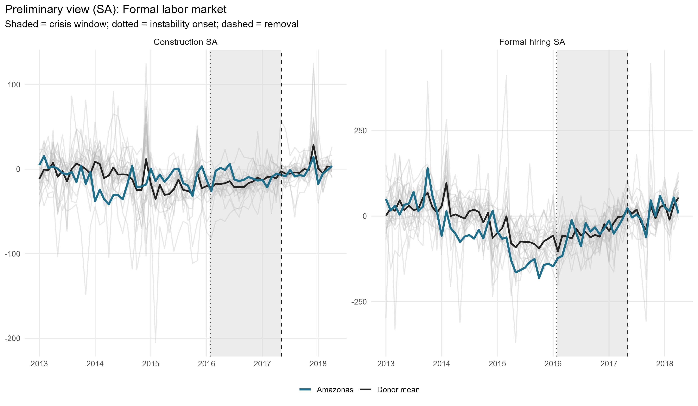

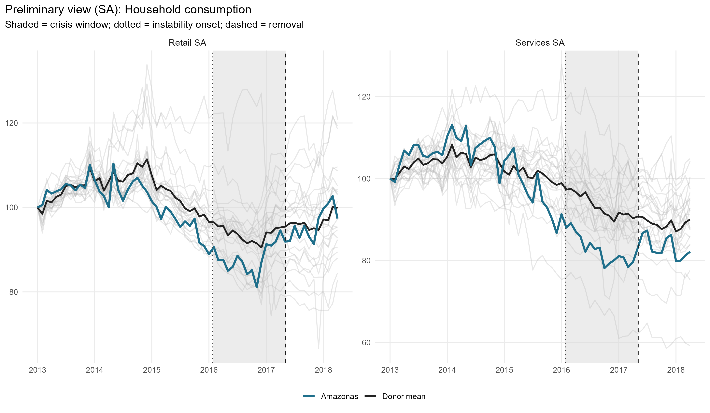

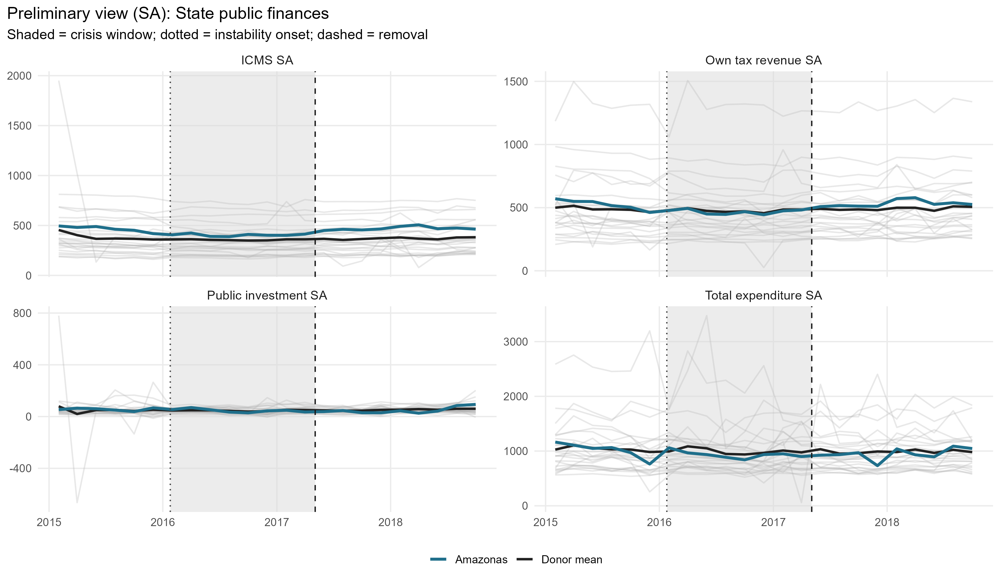

## Covariate and pre-treatment outcome balance

### Pre-treatment outcome fit

| Outcome | Treated | Synthetic | RMSPE pre |
| --- | --- | --- | --- |
| Formal hiring SA | -41.52 | -38.85 | 35.57 |
| Construction SA | -12.36 | -12.14 | 13.56 |
| Retail SA | 101.92 | 101.93 | 1.35 |
| Services SA | 103.72 | 103.74 | 1.68 |
| Own tax revenue SA | 524.75 | 524.75 | 0.02 |
| ICMS SA | 466.14 | 466.14 | 0.04 |
| Public investment SA | 55.81 | 55.81 | 0.00 |
| Total expenditure SA | 1,019.72 | 1,019.72 | 0.03 |

### Covariate balance: formal labor market

| Covariate | Treated | Formal hiring SA | Construction SA |
| --- | --- | --- | --- |
| Unemployment rate (SA) |     0.091 |     0.079 |     0.092 |
| Formalization rate (SA) |     0.461 |     0.607 |     0.510 |
| Labor income (SA, R$) | 2,770.049 | 3,152.212 | 2,636.124 |
| Transfer dependency ratio (SA) |     0.000 |     0.000 |     0.000 |
| Health expenditure pc (SA, R$) |   185.049 |   125.025 |   144.600 |
| Education expenditure pc (SA, R$) |   165.177 |   139.303 |   147.756 |
| Public security expenditure pc (SA, R$) |   100.635 |   107.569 |    77.050 |

### Covariate balance: household consumption

| Covariate | Treated | Retail SA | Services SA |
| --- | --- | --- | --- |
| Unemployment rate (SA) |     0.091 |     0.080 |     0.094 |
| Formalization rate (SA) |     0.461 |     0.552 |     0.508 |
| Labor income (SA, R$) | 2,770.049 | 2,798.492 | 2,469.258 |
| Transfer dependency ratio (SA) |     0.000 |     0.000 |     0.000 |
| Health expenditure pc (SA, R$) |   185.049 |   149.390 |   128.627 |
| Education expenditure pc (SA, R$) |   165.177 |   144.151 |   166.262 |
| Public security expenditure pc (SA, R$) |   100.635 |    82.369 |    89.149 |

### Covariate balance: state public finances

| Covariate | Treated | Own tax revenue SA | ICMS SA | Public investment SA | Total expenditure SA |
| --- | --- | --- | --- | --- | --- |
| Unemployment rate (SA) |     0.091 |     0.088 |     0.085 |     0.088 |     0.091 |
| Formalization rate (SA) |     0.461 |     0.498 |     0.534 |     0.488 |     0.480 |
| Labor income (SA, R$) | 2,770.049 | 2,841.206 | 2,964.301 | 2,627.145 | 2,693.662 |
| Transfer dependency ratio (SA) |     0.000 |     0.000 |     0.000 |     0.000 |     0.000 |
| Health expenditure pc (SA, R$) |   185.049 |   160.672 |   140.826 |   168.065 |   156.675 |
| Education expenditure pc (SA, R$) |   165.177 |   201.851 |   187.229 |   184.980 |   190.065 |
| Public security expenditure pc (SA, R$) |   100.635 |    95.105 |    97.098 |    97.225 |   100.175 |

## Main results: Augmented SCM (SA)

| Channel | Outcome | Mean gap crisis | Mean gap post | RMSPE pre | RMSPE post | Donors |
| --- | --- | --- | --- | --- | --- | --- |
| Formal labor market | Formal hiring balance per 100k WAP (SA) |  20.76 |  2.38 | 35.57 | 24.63 | 24 |
| Formal labor market | Construction hiring per 100k WAP (SA) |   1.45 | -4.97 | 13.56 | 12.98 | 24 |
| Household consumption | Retail volume index (SA) |   0.89 | 11.98 |  1.35 | 12.59 | 24 |
| Household consumption | Services volume index (SA) |  -2.34 |  3.21 |  1.68 |  4.01 | 24 |
| State public finances | Own tax revenue, real per capita (SA) |   4.03 | 51.47 |  0.02 | 55.69 | 24 |
| State public finances | ICMS revenue, real per capita (SA) |  27.97 | 86.45 |  0.04 | 88.00 | 24 |
| State public finances | Public investment, real per capita (SA) |   4.12 | -1.29 |  0.00 | 24.58 | 24 |
| State public finances | Total liquidated expenditure, real pc (SA) | -20.95 | 13.06 |  0.03 | 85.93 | 24 |

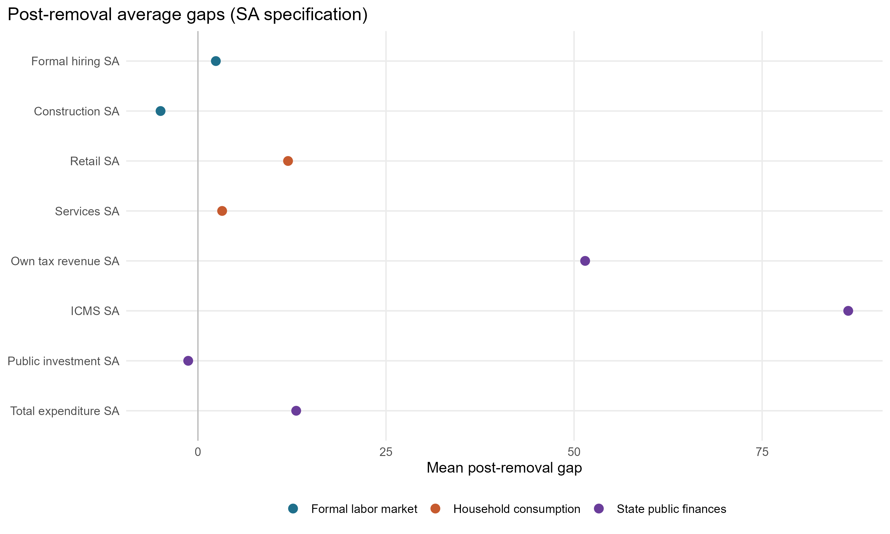

### Formal labor market

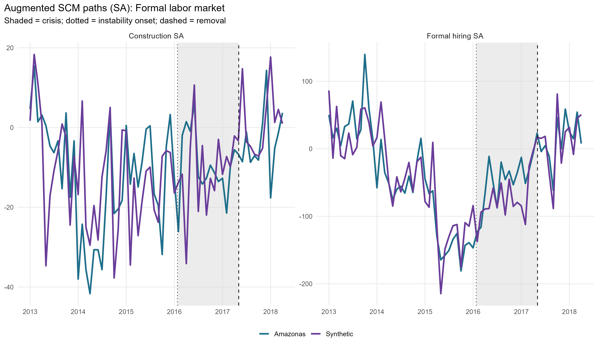

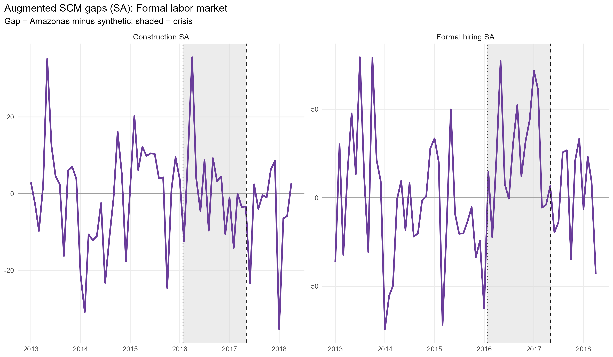

### Household consumption

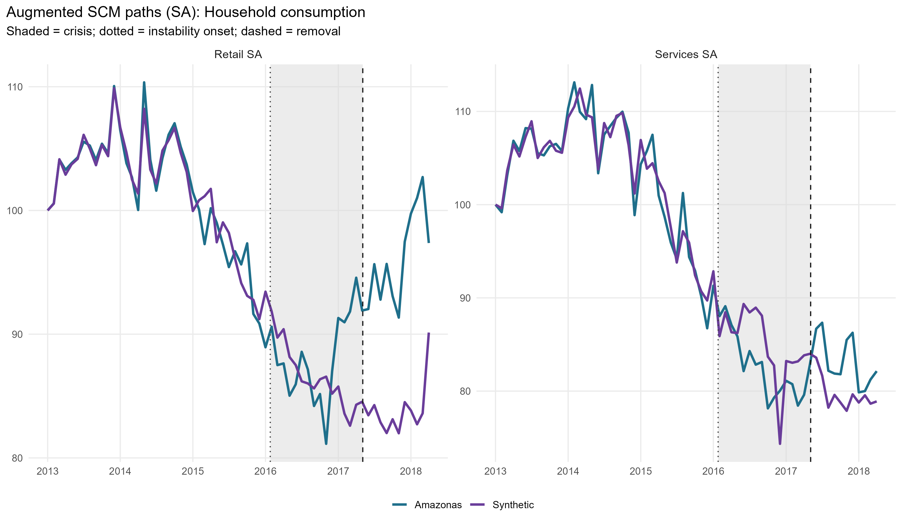

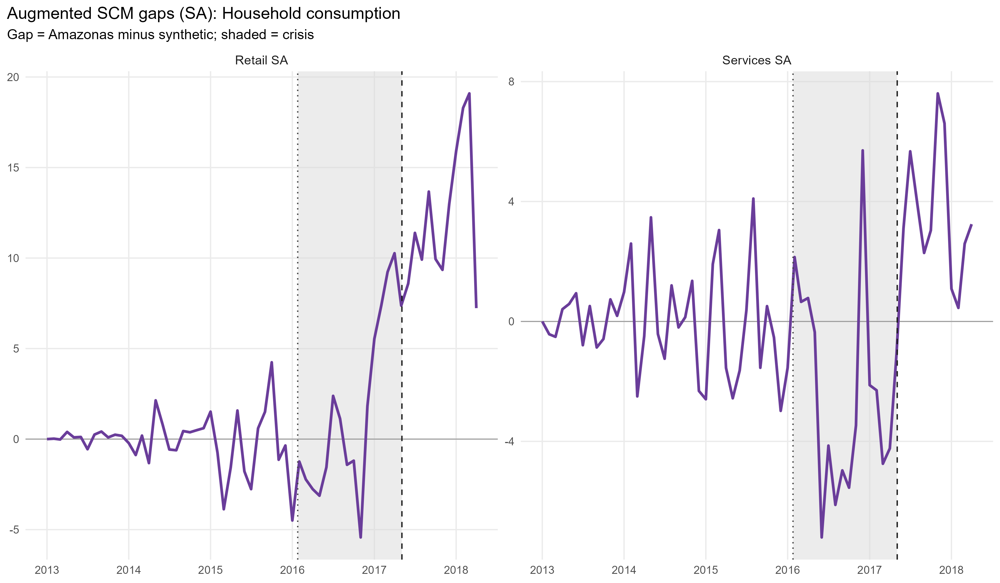

### State public finances

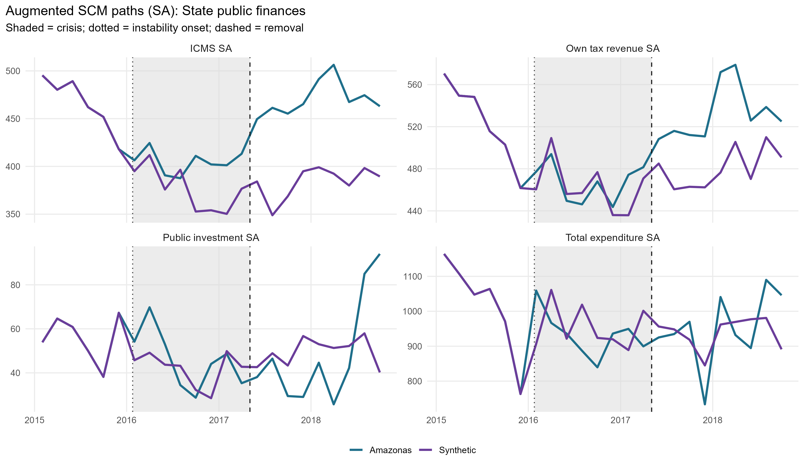

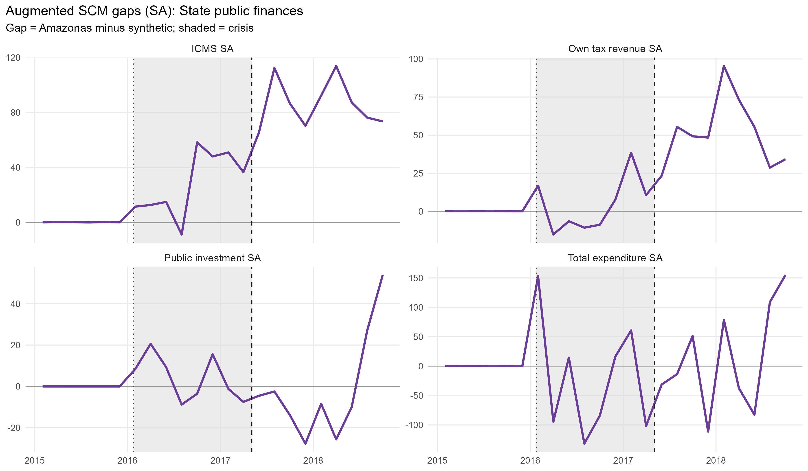

## Donor weights

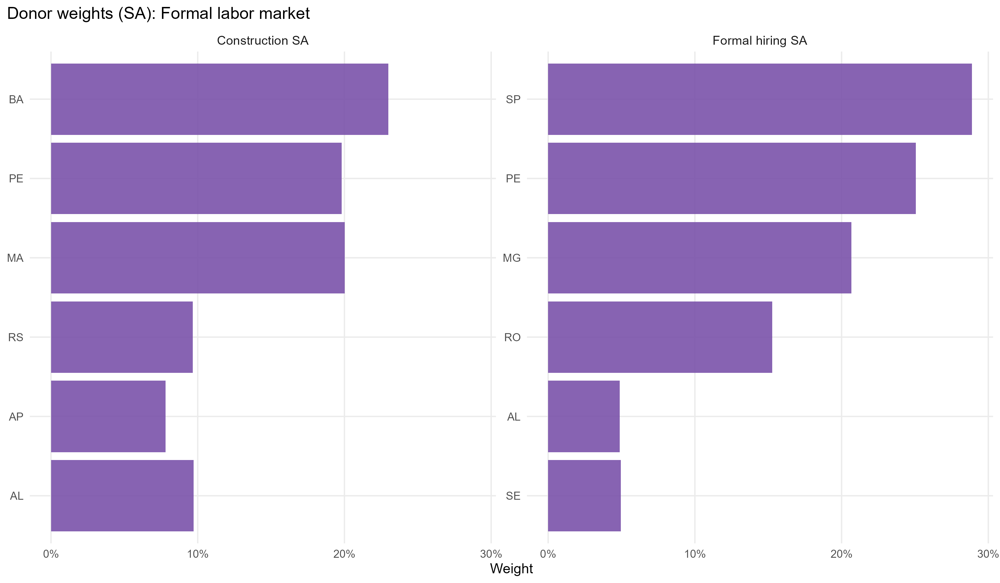

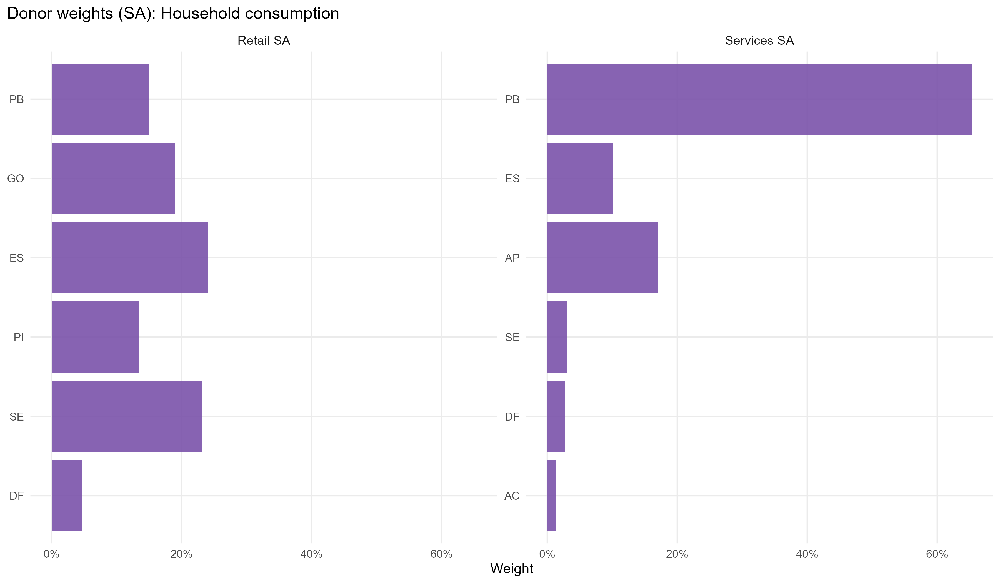

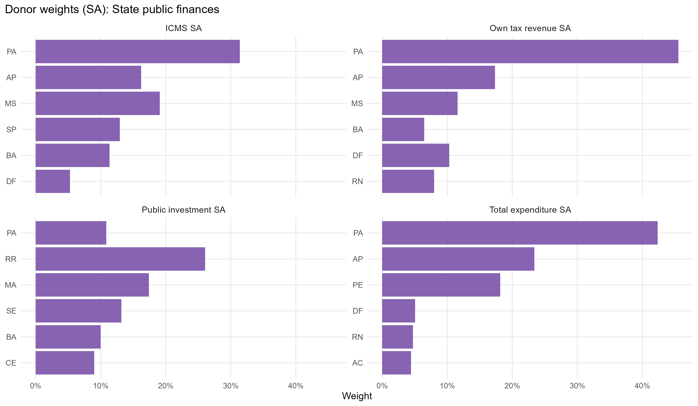

## In-space placebos

Each eligible donor is treated as pseudo-treated at the same dates; gaps are normalized by each unit's pre-treatment RMSPE.

| Outcome | RMSPE ratio (post/pre) | p-value (ratio) | p-value (abs gap) | Placebos |
| --- | --- | --- | --- | --- |
| Formal hiring SA |      0.69 | 0.958 | 1.000 | 24 |
| Construction SA |      0.96 | 0.583 | 0.958 | 24 |
| Retail SA |      9.30 | 0.125 | 0.125 | 24 |
| Services SA |      2.39 | 0.708 | 0.750 | 24 |
| Own tax revenue SA |  2,631.62 | 0.333 | 0.417 | 24 |
| ICMS SA |  2,116.31 | 0.208 | 0.208 | 24 |
| Public investment SA | 19,845.74 | 0.083 | 1.000 | 24 |
| Total expenditure SA |  3,199.43 | 0.625 | 1.000 | 24 |

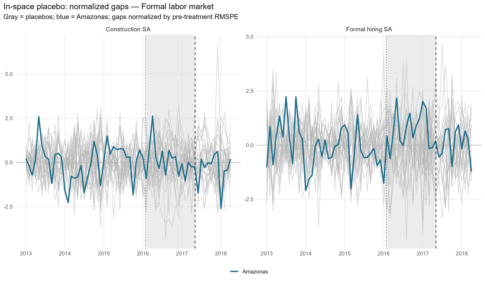

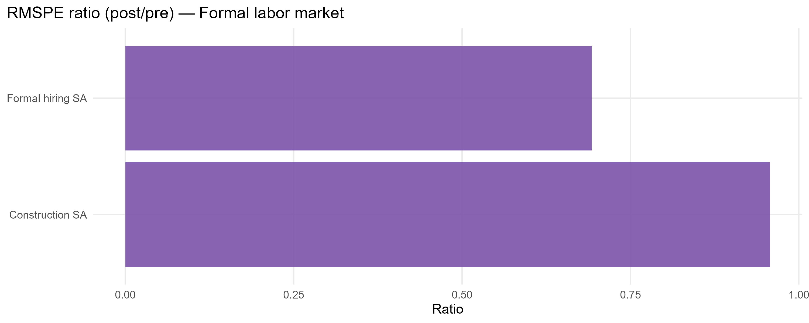

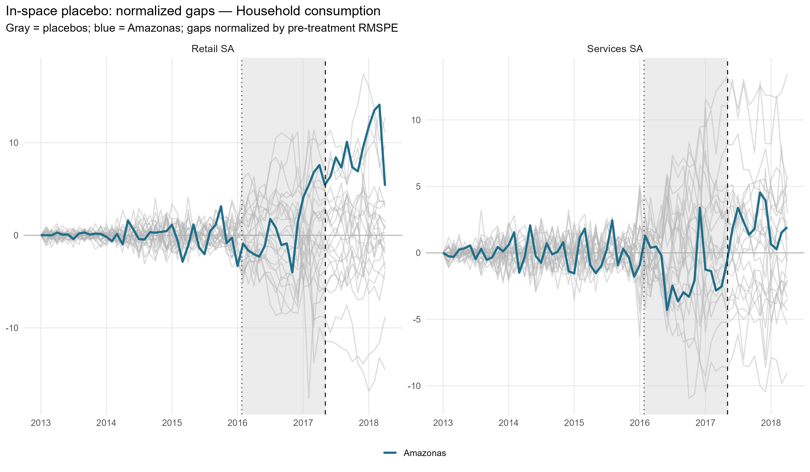

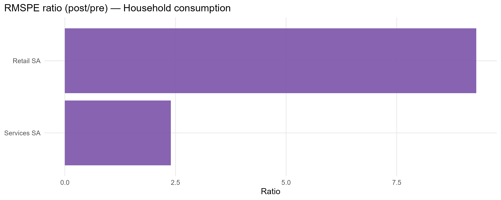

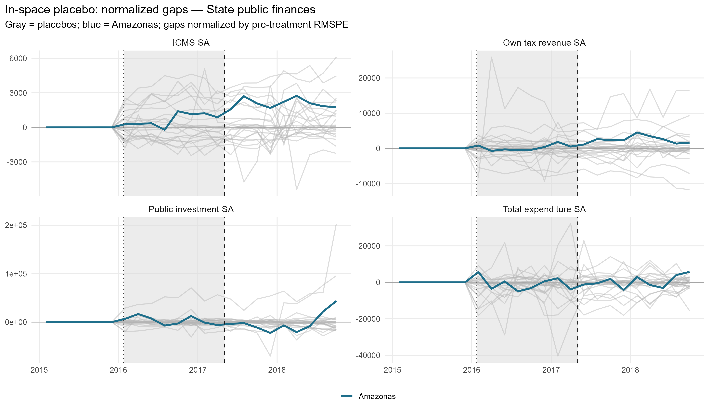

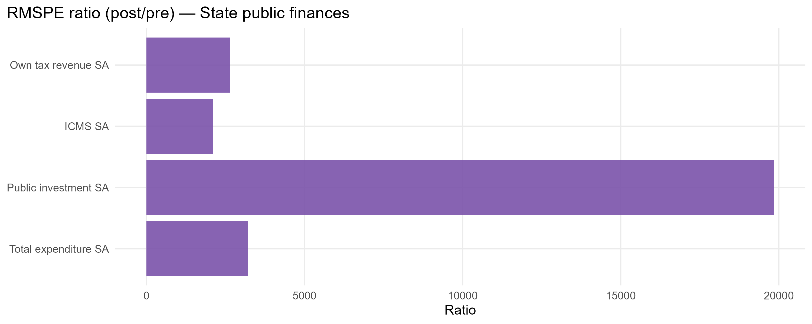

## Leave-one-out donor placebo

| Outcome | Gap post | LOO rank | p-value (2-sided) | Note |
| --- | --- | --- | --- | --- |
| Formal hiring SA | 2.38 | 24 / 25 | 0.08 | Unusually large positive gap |
| Retail SA | 11.98 | 25 / 25 | 0.04 | Unusually large positive gap |
| Services SA | 3.21 | 25 / 25 | 0.04 | Unusually large positive gap |
| ICMS SA | 86.45 | 23 / 25 | 0.12 | Not extreme vs LOO distribution |
| Public investment SA | -1.29 | 21 / 25 | 0.2 | Not extreme vs LOO distribution |
| Total expenditure SA | 13.06 | 23 / 25 | 0.12 | Not extreme vs LOO distribution |

## Current limitations

- Bimonthly fiscal pre-treatment is only 6 bimesters (Siconfi starts 2015), short of the 24-bimester target. Fiscal estimates rely on a short pre-window.
- Bimonthly fiscal seasonal adjustment uses STL, not X-13 (X-13 supports only freq 4 and 12). Bimester fixed effects and MA(6) are reasonable robustness alternatives.
- Seasonal adjustment falls back to the raw series for states/variables with too few seasonal cycles; check build log.
- ICMS from Annex 06 is derived by within-year differencing; RS 2018 B1-B5 imputed with 2017 seasonal shares.
- The post-removal window ends 12 months (monthly) / 9 bimesters (bimonthly) after removal, by design.

## Generated files

- `report/tables/augmented_effects_by_outcome.csv`
- `report/tables/pretx_outcome_balance.csv`
- `report/tables/covariate_balance_*.csv`
- `report/tables/top_donor_weights_by_outcome.csv`
- `report/tables/am_2017_01_v2_loo_placebo_summary.csv`
- `report/tables/placebo_rank_actual_rr.csv`
- `report/figures/` (preliminary, paths, gaps, weights, placebo)
- `output/placebo_inspace/`, `output/placebo_loo/`
