# AM 2017-01 V4: results report (all bimonthly + STL)

Generated on 2026-06-05.

V4 standardizes the whole pilot to a single frequency. Starting from V2 (accountability frame), the four monthly outcomes are aggregated to bimonthly and seasonally adjusted with STL, exactly like the fiscal block. All eight outcomes now share one frequency, one SA method (STL), one window, and one estimation family. The electoral cassation is read as a corrective accountability act; the single treatment date is the effective removal, and the cassation-process months count as ordinary pre-treatment. Calendar time on the x-axis; no moving averages.

## Event design

- Treated state: `AM` (Amazonas).
- Treatment (single cut): effective removal `2017-05-04` (TSE final cassation decision for vote-buying).
- The cassation process began `2016-01-25` (first TRE/TSE decision), but this is treated as pre-treatment, not a separate crisis window.

## Window design

- All outcomes bimonthly: `2015-01-01` to `2018-10-01`. Pre-treatment = 14 bimesters (2015B1-2017B2, limited at the start by Siconfi 2015); post-removal = 9 bimesters.
- The labor and consumption outcomes, which had 36-52 monthly pre-periods in V2/V3, now share the fiscal 14-bimester pre-window. This standardizes the design but shortens their pre-window; the tight pre-fit (low RMSPE_pre) should be read with the placebo inference, not on its own.

## Bimonthly aggregation and seasonal adjustment

- **Formal hiring and construction hiring** are flows (net balances), so the two monthly balances are SUMMED to the bimester.
- **Retail and services volume indices** are index levels, so the two monthly indices are AVERAGED (the bimonthly index relative to the same monthly base is the mean of the two; summing would double the level).
- A bimester is kept only when both constituent months are present and finite.
- All eight bimonthly outcomes are then seasonally adjusted with STL (`stats::stl`, periodic, robust): SA series = observed minus STL seasonal component. Applied to each state's full series before windowing.
- Quarterly PNADc covariates remain X-13 seasonally adjusted.
- Volume indices are reindexed to 100 at the first valid observation in the pilot window after SA.
- No moving averages are computed.
- Robustness alternatives noted for the article: bimester fixed effects and MA(6).

## Methodological strategy

The main donor pool excludes `AM`, `RJ`, `TO`. The preferred specification uses 24 eligible donors. Augmented Synthetic Control is the headline estimator; SCM weights are estimated on the pre-treatment window (everything before the removal date). Predictors are the full pre-treatment outcome path plus six structural covariates (all seasonally adjusted): unemployment rate, formalization rate, transfer dependency ratio, and health, education, and public security expenditure per capita.

## Preliminary plots

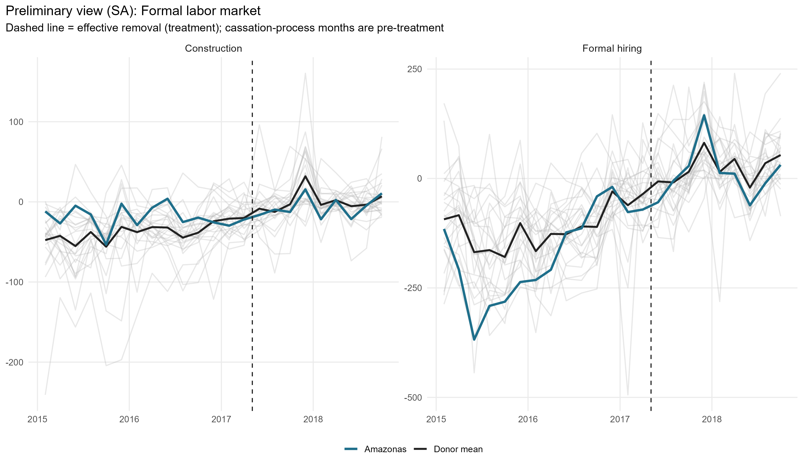

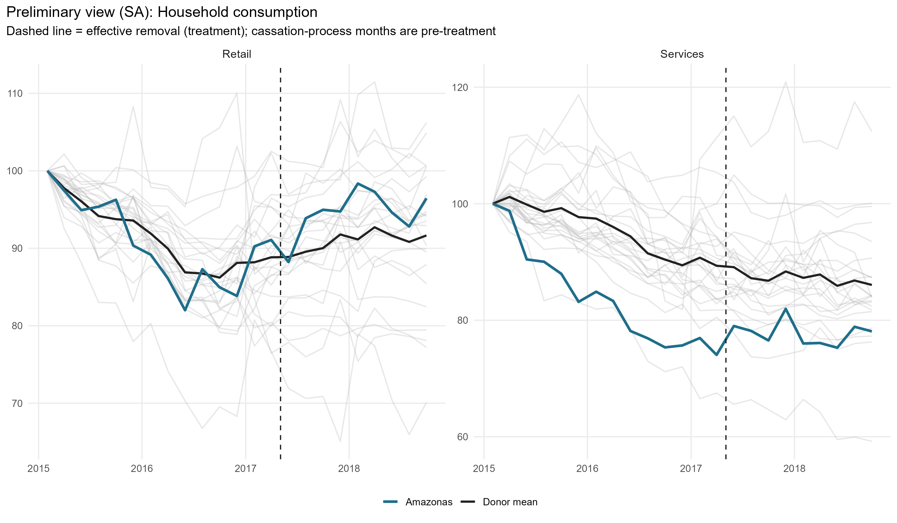

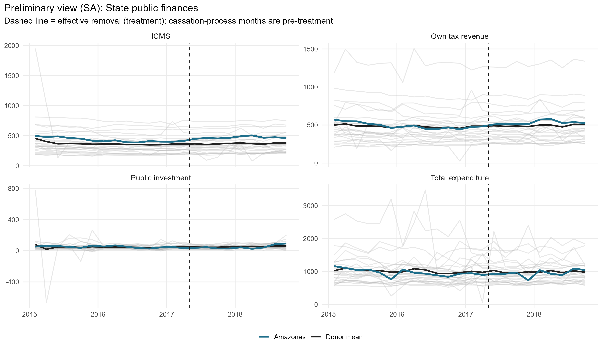

## Covariate and pre-treatment outcome balance

### Pre-treatment outcome fit

| Outcome | Treated | Synthetic | RMSPE pre |
| --- | --- | --- | --- |
| Formal hiring | -170.35 | -170.36 | 0.02 |
| Construction | -19.26 | -19.26 | 0.01 |
| Retail | 90.65 | 90.65 | 0.00 |
| Services | 83.97 | 83.97 | 0.01 |
| Own tax revenue | 491.63 | 491.63 | 0.08 |
| ICMS | 430.97 | 430.90 | 0.55 |
| Public investment | 50.22 | 50.22 | 0.01 |
| Total expenditure | 970.87 | 970.88 | 0.11 |

### Covariate balance: formal labor market

| Covariate | Treated | Formal hiring | Construction |
| --- | --- | --- | --- |
| Unemployment rate (SA) |     0.104 |     0.085 |     0.087 |
| Formalization rate (SA) |     0.434 |     0.563 |     0.510 |
| Labor income (SA, R$) | 2,711.134 | 2,735.977 | 2,630.347 |
| Transfer dependency ratio (SA) |    -0.002 |    -0.001 |    -0.002 |
| Health expenditure pc (SA, R$) |   175.427 |   131.080 |   137.257 |
| Education expenditure pc (SA, R$) |   153.268 |   113.266 |   159.566 |
| Public security expenditure pc (SA, R$) |    96.182 |   103.311 |    98.439 |

### Covariate balance: household consumption

| Covariate | Treated | Retail | Services |
| --- | --- | --- | --- |
| Unemployment rate (SA) |     0.104 |     0.101 |     0.109 |
| Formalization rate (SA) |     0.434 |     0.467 |     0.445 |
| Labor income (SA, R$) | 2,711.134 | 2,515.367 | 2,374.091 |
| Transfer dependency ratio (SA) |    -0.002 |    -0.002 |    -0.002 |
| Health expenditure pc (SA, R$) |   175.427 |   143.085 |   142.469 |
| Education expenditure pc (SA, R$) |   153.268 |   179.639 |   195.353 |
| Public security expenditure pc (SA, R$) |    96.182 |    96.731 |   105.281 |

### Covariate balance: state public finances

| Covariate | Treated | Own tax revenue | ICMS | Public investment | Total expenditure |
| --- | --- | --- | --- | --- | --- |
| Unemployment rate (SA) |     0.104 |     0.099 |     0.097 |     0.098 |     0.098 |
| Formalization rate (SA) |     0.434 |     0.482 |     0.521 |     0.476 |     0.463 |
| Labor income (SA, R$) | 2,711.134 | 2,704.581 | 2,866.460 | 2,622.891 | 2,525.141 |
| Transfer dependency ratio (SA) |    -0.002 |    -0.002 |    -0.001 |    -0.002 |    -0.002 |
| Health expenditure pc (SA, R$) |   175.427 |   161.985 |   143.592 |   154.001 |   138.867 |
| Education expenditure pc (SA, R$) |   153.268 |   183.201 |   179.931 |   169.246 |   173.171 |
| Public security expenditure pc (SA, R$) |    96.182 |    87.344 |    90.546 |    90.453 |    94.832 |

## Main results: Augmented SCM (SA)

| Channel | Outcome | Mean gap post | RMSPE pre | RMSPE post | Donors |
| --- | --- | --- | --- | --- | --- |
| Formal labor market | Formal hiring balance per 100k WAP |   7.34 | 0.02 | 47.79 | 24 |
| Formal labor market | Construction hiring per 100k WAP | -10.63 | 0.01 | 19.10 | 24 |
| Household consumption | Retail volume index |   4.74 | 0.00 |  4.89 | 24 |
| Household consumption | Services volume index |   7.47 | 0.01 |  7.97 | 24 |
| State public finances | Own tax revenue, real per capita |  46.95 | 0.08 | 50.43 | 24 |
| State public finances | ICMS revenue, real per capita |  47.98 | 0.55 | 52.16 | 24 |
| State public finances | Public investment, real per capita |  -4.83 | 0.01 | 18.27 | 24 |
| State public finances | Total liquidated expenditure, real pc | -22.08 | 0.11 | 85.47 | 24 |

### Formal labor market

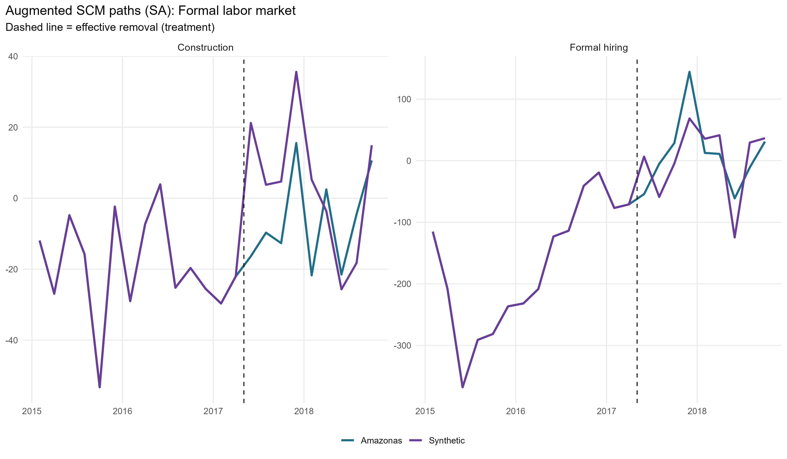

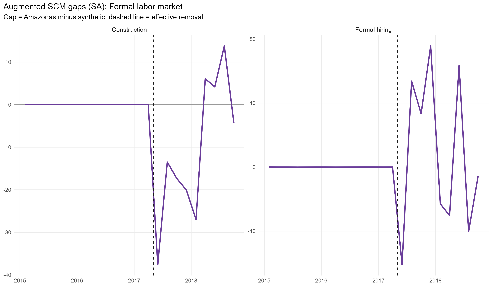

### Household consumption

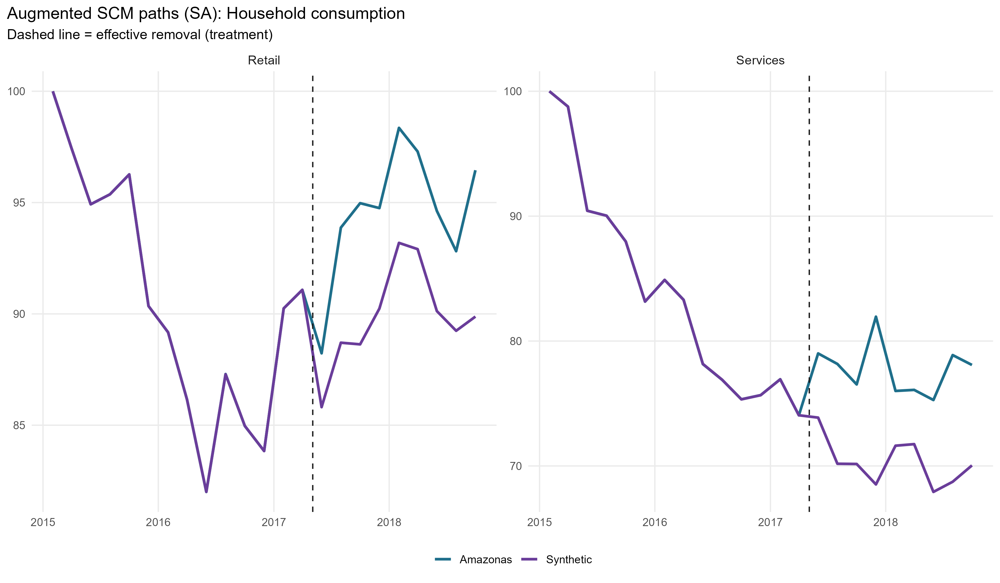

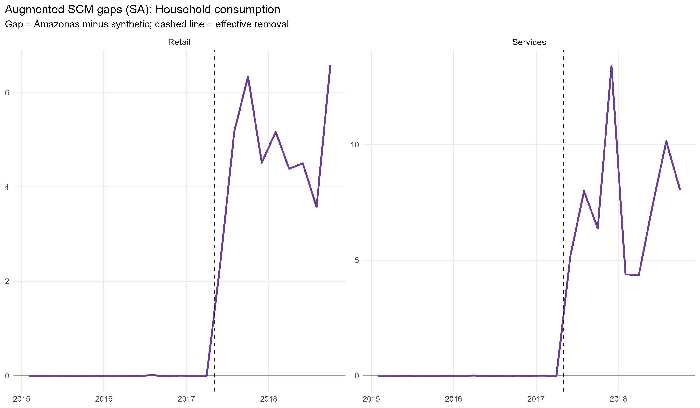

### State public finances

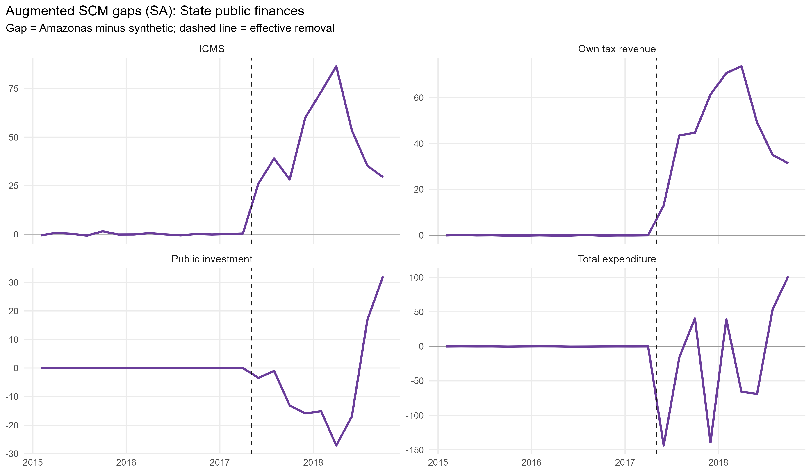

## Donor weights

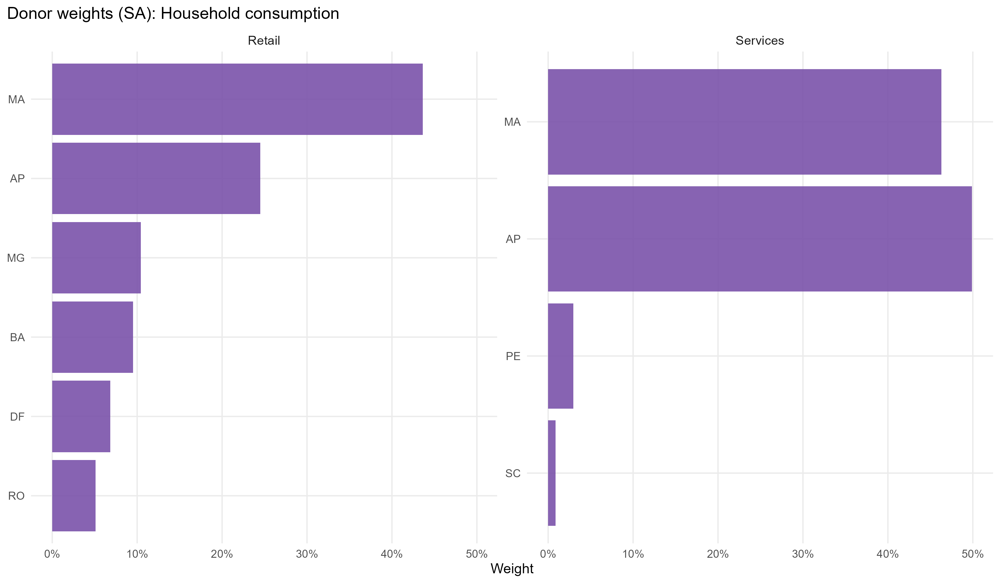

## In-space placebos

Each eligible donor is treated as pseudo-treated at the same dates; gaps are normalized by each unit's pre-treatment RMSPE.

| Outcome | RMSPE ratio (post/pre) | p-value (ratio) | p-value (abs gap) | Placebos |
| --- | --- | --- | --- | --- |
| Formal hiring | 2,134.35 | 0.458 | 1.000 | 24 |
| Construction | 3,120.72 | 0.250 | 0.750 | 24 |
| Retail | 1,135.54 | 0.750 | 0.542 | 24 |
| Services | 1,155.96 | 0.667 | 0.167 | 24 |
| Own tax revenue |   603.26 | 0.125 | 0.458 | 24 |
| ICMS |    94.27 | 0.000 | 0.333 | 24 |
| Public investment | 1,300.69 | 0.250 | 1.000 | 24 |
| Total expenditure |   760.80 | 0.042 | 0.958 | 24 |

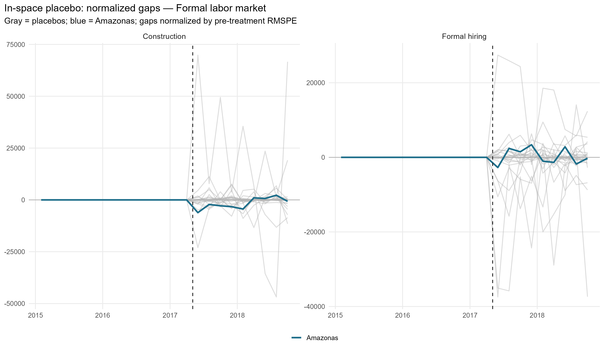

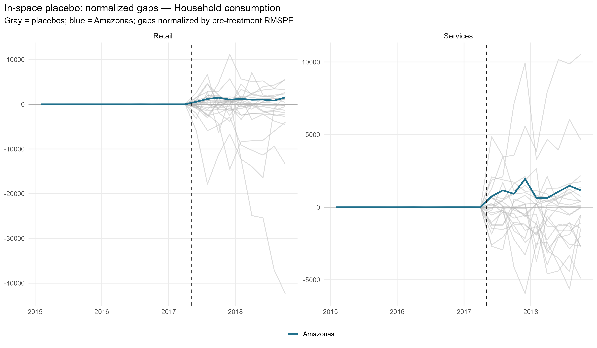

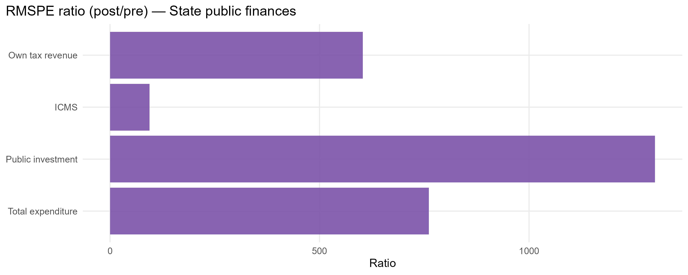

## Leave-one-out donor placebo

| Outcome | Gap post | LOO rank | p-value (2-sided) | Note |
| --- | --- | --- | --- | --- |
| Formal hiring | 7.34 | 25 / 25 | 0.04 | Unusually large positive gap |
| Retail | 4.74 | 4 / 25 | 0.16 | Not extreme vs LOO distribution |
| Services | 7.47 | 3 / 25 | 0.12 | Not extreme vs LOO distribution |
| ICMS | 47.98 | 2 / 25 | 0.08 | Unusually small positive gap |
| Public investment | -4.83 | 20 / 25 | 0.24 | Not extreme vs LOO distribution |
| Total expenditure | -22.08 | 23 / 25 | 0.12 | Not extreme vs LOO distribution |

## Current limitations

- All outcomes now share the 14-bimester pre-window (2015B1-2017B2), bounded at the start by Siconfi 2015. For labor/consumption this is shorter than the 36-52 monthly pre-periods used in V2/V3, so their pre-fit is tighter (lower RMSPE_pre) and more prone to overfitting; rely on the placebo inference, not the raw gap.
- All seasonal adjustment is STL (freq 6). X-13 cannot process bimonthly (freq 6). Bimester fixed effects and MA(6) are reasonable robustness alternatives.
- Seasonal adjustment falls back to the raw series for states/variables with too few cycles; check build log.
- ICMS from Annex 06 is derived by within-year differencing; RS 2018 B1-B5 imputed with 2017 seasonal shares.
- The post-removal window ends 9 bimesters after removal, by design.

## Generated files

- `report/tables/augmented_effects_by_outcome.csv`
- `report/tables/pretx_outcome_balance.csv`
- `report/tables/covariate_balance_*.csv`
- `report/tables/top_donor_weights_by_outcome.csv`
- `report/tables/am_2017_01_v4_loo_placebo_summary.csv`
- `report/tables/placebo_rank_actual_rr.csv`
- `report/figures/` (preliminary, paths, gaps, weights, placebo)
- `output/placebo_inspace/`, `output/placebo_loo/`
